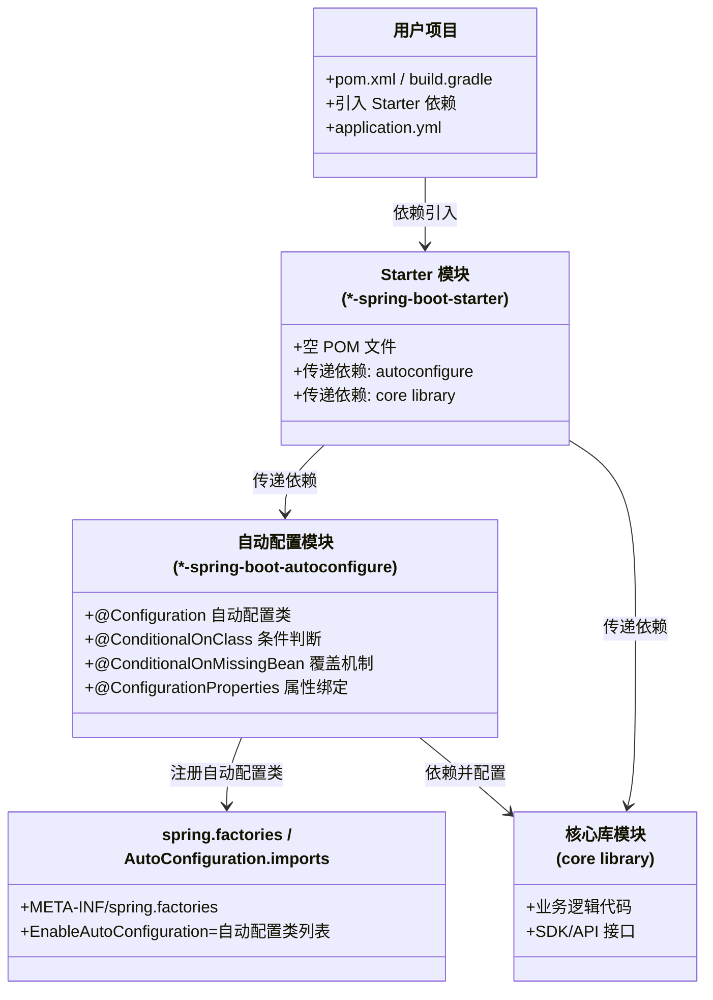
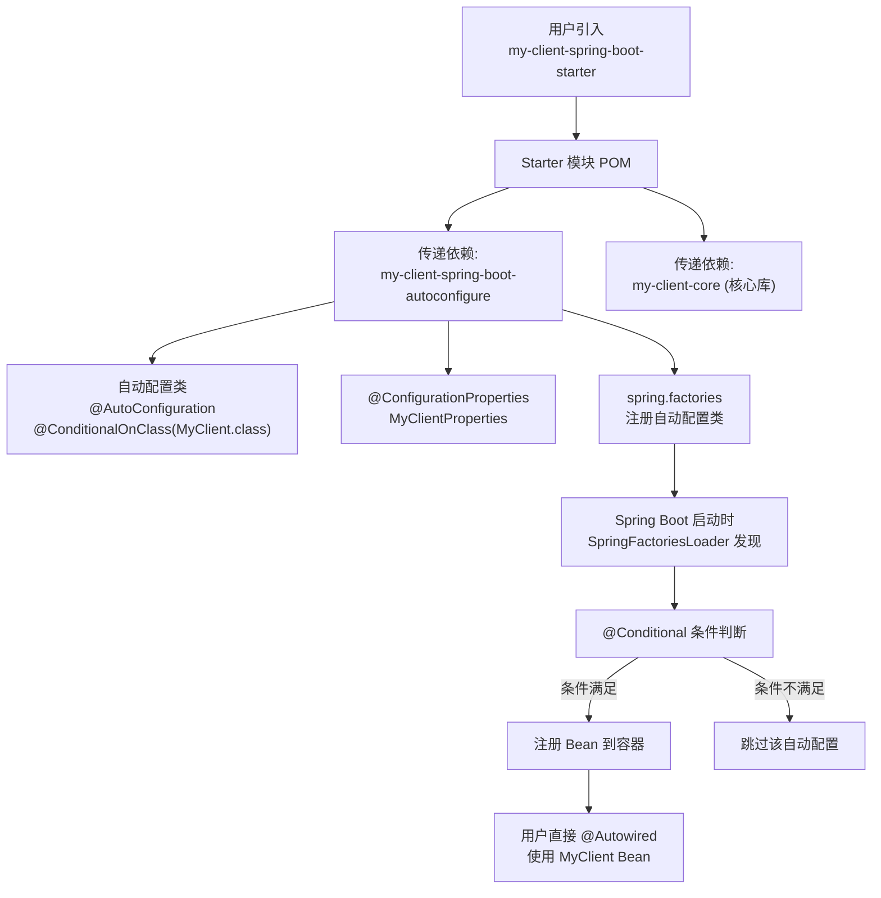

## 引言

一个 `@SpringBootApplication` 注解，为什么能自动配置几百个组件？

你只需要引入一个 `spring-boot-starter-web` 依赖，加上一个 `@SpringBootApplication` 注解，Spring Boot 就自动帮你配置好了 DispatcherServlet、内嵌 Tomcat、Jackson JSON 序列化、错误处理器……几十个组件一个都不用你手写配置。这不是魔法，而是一套精密的**自动配置 + Starter 依赖聚合**机制在幕后工作。

读完本文，你将获得：
1. **Starter 架构全景**：Spring Boot Starter 是如何设计、命名和组织的
2. **自动配置加载链路**：从 `@EnableAutoConfiguration` 到 `@Conditional` 条件判断的完整流程
3. **手写自定义 Starter 实战**：从零创建一个可发布的 Spring Boot Starter
4. **生产避坑指南**：自定义 Starter 开发中 6 个最常见的错误

> 如果你正在面试中被问到"Spring Boot 自动配置原理"，或者需要为公司内部库创建 Starter 集成，这篇文章就是你的路线图。

### Spring Boot Starter 是什么？

一个 Spring Boot Starter 本质上是一个带有特殊命名规则的 Maven 或 Gradle **依赖**（POM 文件）。它本身通常不包含任何业务代码，其主要作用是通过**依赖传递**引入一系列开箱即用的依赖。



> **💡 核心提示**：Starter 本身不包含任何业务逻辑代码，它只是一个"依赖聚合器"。真正的自动配置逻辑在 `*-spring-boot-autoconfigure` 模块中，通过 `spring.factories` 文件告诉 Spring Boot 有哪些自动配置类需要加载。

#### Starter 的命名规范

遵循 Spring Boot 官方的 Starter 命名规范非常重要：

* **官方 Starter：** `spring-boot-starter-*`（例如 `spring-boot-starter-web`），由 Spring Boot 团队维护。
* **自定义 Starter：** `*-spring-boot-starter`（例如 `mybatis-spring-boot-starter`）。请注意，自定义 Starter 的名称前缀是你自己的模块名，后缀是 `-spring-boot-starter`。



#### Starter 与自动配置的分工

| 角色 | Starter 负责 | 自动配置负责 |
|:---|:---|:---|
| **职责** | 将特定场景所需的 **JAR 包** 引入 Classpath | 扫描 Classpath，检测特定库的存在 |
| **本质** | **依赖管理工具**（聚合 POM） | **配置工具**（`@Configuration` + `@Conditional`） |
| **内容** | 通常只包含 `pom.xml`，无 Java 代码 | 包含自动配置类、属性类、`spring.factories` |
| **触发方式** | Maven/Gradle 引入依赖 | Spring Boot 启动时自动发现并加载 |

Starter 引入了原材料，自动配置则利用这些原材料为你做好菜。自定义 Starter 就是将你的原材料和做菜的食谱（自动配置类）一起打包，方便别人取用。

### 为什么创建自定义 Starter？

* **简化依赖管理：** 将使用你的库所需的所有第三方依赖聚合到一个 Starter 中，用户只需引入一个依赖。
* **提供默认配置：** 将你的库在 Spring Boot 环境下最常用的配置通过自动配置类打包，用户无需手动编写样板配置。
* **标准化集成方式：** 确保用户使用正确的依赖组合和默认配置。
* **隐藏实现细节：** 用户无需关心你的库内部依赖了哪些第三方库，以及如何在 Spring Boot 中进行繁琐的初始化。

### 自定义 Starter 的架构与组成

一个典型的自定义 Starter 通常由**两个模块**组成（推荐使用 Maven 或 Gradle 的多模块项目来组织）：

1. **Starter 模块 (`*-spring-boot-starter`)：** 用户项目直接引入的依赖。通常是一个非常简单的 POM 文件，只包含对核心库和**自动配置模块**的依赖。
2. **自动配置模块 (`*-spring-boot-autoconfigure`)：** Starter 的"大脑"，包含：
    * **自动配置类：** 用 `@Configuration`（Spring Boot 2.7+ 推荐 `@AutoConfiguration`）标注的类，内部定义 `@Bean` 方法，使用 `@Conditional` 注解控制生效条件。
    * **`META-INF/spring.factories` 文件（Spring Boot 3.2+ 为 `META-INF/spring/org.springframework.boot.autoconfigure.AutoConfiguration.imports`）：** 连接 Starter 和自动配置的关键，告诉 Spring Boot 哪些类是自动配置类。
    * 用于绑定配置文件的属性类（用 `@ConfigurationProperties` 标注）。

### 手把手创建自定义 Starter

以一个简单的场景为例：创建一个 Starter 来集成一个虚构的第三方 Java 库 `MyClient`。

**Step 1: 创建多模块 Maven 项目结构**

```
my-client-spring-boot
├── pom.xml                             (Parent POM)
├── my-client-spring-boot-autoconfigure
│   ├── pom.xml                         (Auto-configure Module POM)
│   └── src/main/resources/META-INF/spring.factories
└── my-client-spring-boot-starter
    └── pom.xml                         (Starter Module POM)
```

Parent POM (`my-client-spring-boot/pom.xml`):

```xml
<?xml version="1.0" encoding="UTF-8"?>
<project xmlns="http://maven.apache.org/POM/4.0.0"
         xmlns:xsi="http://www.w3.org/2001/XMLSchema-instance"
         xsi:schemaLocation="http://maven.apache.org/POM/4.0.0 http://maven.apache.org/xsd/maven-4.0.0.xsd">
    <modelVersion>4.0.0</modelVersion>
    <groupId>com.example</groupId>
    <artifactId>my-client-spring-boot</artifactId>
    <version>1.0.0-SNAPSHOT</version>
    <packaging>pom</packaging>

    <modules>
        <module>my-client-spring-boot-autoconfigure</module>
        <module>my-client-spring-boot-starter</module>
    </modules>

    <properties>
        <maven.compiler.source>17</maven.compiler.source>
        <maven.compiler.target>17</maven.compiler.target>
        <project.build.sourceEncoding>UTF-8</project.build.sourceEncoding>
        <spring-boot.version>3.2.0</spring-boot.version>
    </properties>

    <dependencyManagement>
        <dependencies>
            <dependency>
                <groupId>org.springframework.boot</groupId>
                <artifactId>spring-boot-dependencies</artifactId>
                <version>${spring-boot.version}</version>
                <type>pom</type>
                <scope>import</scope>
            </dependency>
        </dependencies>
    </dependencyManagement>
</project>
```

**Step 2: 创建自动配置模块 (`my-client-spring-boot-autoconfigure`)**

Auto-configure Module POM:

```xml
<?xml version="1.0" encoding="UTF-8"?>
<project xmlns="http://maven.apache.org/POM/4.0.0"
         xmlns:xsi="http://www.w3.org/2001/XMLSchema-instance"
         xsi:schemaLocation="http://maven.apache.org/POM/4.0.0 http://maven.apache.org/xsd/maven-4.0.0.xsd">
    <modelVersion>4.0.0</modelVersion>
    <parent>
        <groupId>com.example</groupId>
        <artifactId>my-client-spring-boot</artifactId>
        <version>1.0.0-SNAPSHOT</version>
    </parent>

    <artifactId>my-client-spring-boot-autoconfigure</artifactId>

    <dependencies>
        <dependency>
            <groupId>org.springframework.boot</groupId>
            <artifactId>spring-boot-autoconfigure</artifactId>
        </dependency>

        <dependency>
            <groupId>org.springframework.boot</groupId>
            <artifactId>spring-boot-configuration-processor</artifactId>
            <optional>true</optional>
        </dependency>

        <dependency>
             <groupId>com.example</groupId>
             <artifactId>my-client-core</artifactId>
             <version>1.0.0</version>
        </dependency>
    </dependencies>
</project>
```

配置属性类 (`MyClientProperties`):

```java
package com.example.myclient.autoconfigure;

import org.springframework.boot.context.properties.ConfigurationProperties;

@ConfigurationProperties(prefix = "myclient")
public class MyClientProperties {
    private String serverUrl = "http://localhost:8080";
    private int timeout = 5000;

    public String getServerUrl() { return serverUrl; }
    public void setServerUrl(String serverUrl) { this.serverUrl = serverUrl; }
    public int getTimeout() { return timeout; }
    public void setTimeout(int timeout) { this.timeout = timeout; }
}
```

自动配置类 (`MyClientAutoConfiguration`):

```java
package com.example.myclient.autoconfigure;

import com.example.myclient.core.MyClient;
import org.springframework.boot.autoconfigure.AutoConfiguration;
import org.springframework.boot.autoconfigure.condition.ConditionalOnMissingBean;
import org.springframework.boot.context.properties.EnableConfigurationProperties;
import org.springframework.context.annotation.Bean;

@AutoConfiguration
@EnableConfigurationProperties(MyClientProperties.class)
public class MyClientAutoConfiguration {

    @Bean
    @ConditionalOnMissingBean(MyClient.class)
    public MyClient myClient(MyClientProperties properties) {
        return new MyClient(properties.getServerUrl(), properties.getTimeout());
    }
}
```

> **💡 核心提示**：`@ConditionalOnMissingBean` 是允许用户自定义覆盖的关键。如果用户自己定义了一个 `MyClient` Bean，自动配置的这个 `@Bean` 方法就不会执行，用户的配置优先生效。这就是"约定优于配置"的精髓——提供合理的默认值，但允许轻松覆盖。

`spring.factories` 文件 (`src/main/resources/META-INF/spring.factories`):

```properties
# Auto Configure
org.springframework.boot.autoconfigure.EnableAutoConfiguration=\
com.example.myclient.autoconfigure.MyClientAutoConfiguration
```

> **💡 核心提示**：`spring.factories` 是通过 `SpringFactoriesLoader` 从 ClassLoader 资源中加载的。它扫描所有 JAR 包中指定路径的文件并合并内容。Spring Boot 3.2+ 迁移到了新的格式：将自动配置类全限定名逐行写入 `META-INF/spring/org.springframework.boot.autoconfigure.AutoConfiguration.imports` 文件。

**Step 3: 创建 Starter 模块 (`my-client-spring-boot-starter`)**

Starter Module POM:

```xml
<?xml version="1.0" encoding="UTF-8"?>
<project xmlns="http://maven.apache.org/POM/4.0.0"
         xmlns:xsi="http://www.w3.org/2001/XMLSchema-instance"
         xsi:schemaLocation="http://maven.apache.org/POM/4.0.0 http://maven.apache.org/xsd/maven-4.0.0.xsd">
    <modelVersion>4.0.0</modelVersion>
    <parent>
        <groupId>com.example</groupId>
        <artifactId>my-client-spring-boot</artifactId>
        <version>1.0.0-SNAPSHOT</version>
    </parent>

    <artifactId>my-client-spring-boot-starter</artifactId>

    <dependencies>
        <dependency>
            <groupId>com.example</groupId>
            <artifactId>my-client-spring-boot-autoconfigure</artifactId>
            <version>${project.version}</version>
        </dependency>
    </dependencies>
</project>
```

**Step 4: 构建项目**

在项目根目录执行 `mvn clean install`。

### 使用自定义 Starter

其他 Spring Boot 项目只需在 `pom.xml` 中引入你的自定义 Starter：

```xml
<dependency>
    <groupId>com.example</groupId>
    <artifactId>my-client-spring-boot-starter</artifactId>
    <version>1.0.0-SNAPSHOT</version>
</dependency>
```

在 `application.properties` 中配置：

```properties
myclient.server-url=http://my.custom.server:9090
myclient.timeout=10000
```

当用户项目启动时：
1. `my-client-spring-boot-starter` 被添加到 Classpath。
2. 通过依赖传递，`my-client-spring-boot-autoconfigure` 和 `my-client-core` 也被添加。
3. Spring Boot 启动，`SpringFactoriesLoader` 扫描并发现自动配置类。
4. 根据 `@Conditional` 条件判断，自动配置生效，创建 `MyClient` Bean。
5. 用户直接 `@Autowired` 注入使用。

### `@Conditional` 注解家族详解

`@Conditional` 是自动配置的"判断大脑"，决定了配置类或 Bean 是否生效：

| 注解 | 判断条件 | 典型使用场景 |
|:---|:---|:---|
| `@ConditionalOnClass` | Classpath 中存在指定类 | 检测是否引入了某个库（如 DataSource） |
| `@ConditionalOnMissingClass` | Classpath 中不存在指定类 | 排除某些库时的降级方案 |
| `@ConditionalOnBean` | 容器中存在指定 Bean | 依赖某个 Bean 存在时才配置 |
| `@ConditionalOnMissingBean` | 容器中不存在指定 Bean | **提供默认配置，允许用户覆盖** |
| `@ConditionalOnProperty` | 指定属性存在且满足条件 | 通过配置文件开关功能（如 `my.feature.enabled=true`） |
| `@ConditionalOnResource` | 指定资源文件存在 | 检测配置文件是否存在 |
| `@ConditionalOnWebApplication` | 当前是 Web 应用 | 仅在 Web 环境下生效的配置 |
| `@ConditionalOnExpression` | SpEL 表达式结果为 true | 复杂的多条件组合判断 |

### `@Value` vs `@ConfigurationProperties`

| 特性 | `@Value` | `@ConfigurationProperties` |
|:---|:---|:---|
| **绑定方式** | 逐个属性注入 | 批量绑定到 JavaBean |
| **类型安全** | 弱类型（字符串 + 自动转换） | 强类型（IDE 提示 + 编译期检查） |
| **松散绑定** | 不支持 | 支持（`my-client.server-url` -> `serverUrl`） |
| **校验支持** | 不支持 | 支持 JSR-303 `@Validated` 校验 |
| **SpEL 表达式** | 支持 | 不支持 |
| **适用场景** | 少量、分散的配置值 | 结构化、成组的配置 |
| **元数据生成** | 无 | 配合 `spring-boot-configuration-processor` 生成 IDE 提示 |

### 生产环境避坑指南

以下是 Spring Boot Starter 开发中最常见的 8 个陷阱：

| # | 陷阱 | 后果 | 解决方案 |
|---|------|------|----------|
| 1 | **自定义 Starter 与官方 Starter 命名冲突** | 用户混淆，依赖管理混乱 | 严格遵循命名规范：自定义用 `*-spring-boot-starter`，官方用 `spring-boot-starter-*` |
| 2 | **`@ConditionalOnClass` 使用不当导致 Classpath 扫描性能问题** | 大量自动配置类拖慢启动速度 | 只在自动配置类级别使用 `@ConditionalOnClass`；避免在 `@Bean` 方法级别大量使用 |
| 3 | **`@ConfigurationProperties` 类未用 `@EnableConfigurationProperties` 激活** | 属性绑定不生效 | 在自动配置类上添加 `@EnableConfigurationProperties(XxxProperties.class)`，或确保属性类有 `@Component` |
| 4 | **Starter 依赖 scope 错误** | 用户项目引入后出现意外的传递依赖或编译失败 | 将 `spring-boot-configuration-processor` 设为 `<optional>true</optional>`；避免将测试依赖泄漏到传递依赖中 |
| 5 | **忘记添加 `@ConditionalOnMissingBean`** | 用户无法自定义覆盖，自动配置变成"强制配置" | 所有 `@Bean` 方法都应考虑添加 `@ConditionalOnMissingBean`，给用户留下自定义空间 |
| 6 | **自动配置类缺少排序注解** | 多个自动配置类之间的依赖顺序不确定 | 使用 `@AutoConfiguration(before = ..., after = ...)` 控制加载顺序 |
| 7 | **`spring.factories` 文件路径或格式错误** | 自动配置类不被发现 | Spring Boot 3.2- 用 `META-INF/spring.factories`，3.2+ 用 `META-INF/spring/org.springframework.boot.autoconfigure.AutoConfiguration.imports` |
| 8 | **自动配置类引用了不存在的路径/类** | 运行时 `ClassNotFoundException` | 使用 `@ConditionalOnClass` 确保引用的类在 Classpath 中存在；用 `name` 属性代替 `value` 避免编译期硬依赖 |

### 行动清单

1. **查看自动配置报告**：运行 `java -jar your-app.jar --debug`，查看哪些自动配置生效了、哪些被跳过了。
2. **检查你的 Starter 依赖树**：运行 `mvn dependency:tree`，确认 Starter 没有引入不必要的传递依赖。
3. **为你的自定义 Starter 添加 `@ConditionalOnMissingBean`**：确保用户可以轻松覆盖你的默认配置。
4. **添加配置元数据处理器**：引入 `spring-boot-configuration-processor`（optional），为你的 `@ConfigurationProperties` 类生成 IDE 自动补全支持。
5. **使用 `@AutoConfiguration` 替代 `@Configuration`**：Spring Boot 2.7+ 推荐使用 `@AutoConfiguration`，它提供了更好的排序控制（`before`/`after` 属性）。
6. **编写 Starter 文档**：为用户准备清晰的文档，说明可用的配置属性、默认值、以及需要手动配置的场景。

### 面试问题示例与深度解析

1. **Spring Boot Starter 是什么？它的作用是什么？**
    * **要点：** 定义 Starter 为依赖聚合器。作用：简化依赖管理，减少版本冲突，提供一站式集成，通常包含自动配置模块。
2. **官方 Starter 和自定义 Starter 的命名规范有什么区别？**
    * **要点：** 官方：`spring-boot-starter-*`；自定义：`*-spring-boot-starter`。
3. **如何创建一个自定义 Starter？**
    * **要点：** 多模块结构（父 -> auto-configure + starter）。auto-configure 模块包含自动配置类（`@Configuration`, `@Conditional`, `@Bean`）和 `spring.factories` 文件。Starter 模块主要依赖 auto-configure 模块。
4. **`spring.factories` 文件有什么作用？它应该放在哪里？**
    * **要点：** 通过 `SpringFactoriesLoader` 告诉 Spring Boot 哪些类是自动配置类。位置：自动配置模块的 `src/main/resources/META-INF/` 目录下。Spring Boot 3.2+ 使用新的 `AutoConfiguration.imports` 格式。
5. **`@Value` 和 `@ConfigurationProperties` 有什么区别？**
    * **要点：** `@Value` 逐个注入、支持 SpEL、弱类型；`@ConfigurationProperties` 批量绑定、强类型、支持松散绑定和校验、IDE 友好。
6. **`@ConditionalOnMissingBean` 的作用是什么？**
    * **要点：** 允许用户自定义 Bean 覆盖自动配置的默认 Bean。如果用户已经定义了同类型 Bean，自动配置的 `@Bean` 方法就不会执行。这是"约定优于配置"的核心机制。

### 总结

Spring Boot Starter 是简化依赖管理和实现功能模块化的强大工具。通过遵循命名规范和利用 `spring.factories`（或 `AutoConfiguration.imports`）文件，Starter 能够与 Spring Boot 的自动配置机制紧密协作，为用户提供"一站式"的集成体验。

创建自定义 Starter 是将你的库或模块与 Spring Boot 生态无缝融合的关键步骤。它不仅能提高你库的易用性，也能加深你对 Spring Boot 自动配置原理的理解，是从"会用 Spring Boot"到"精通 Spring Boot"的重要标志。
