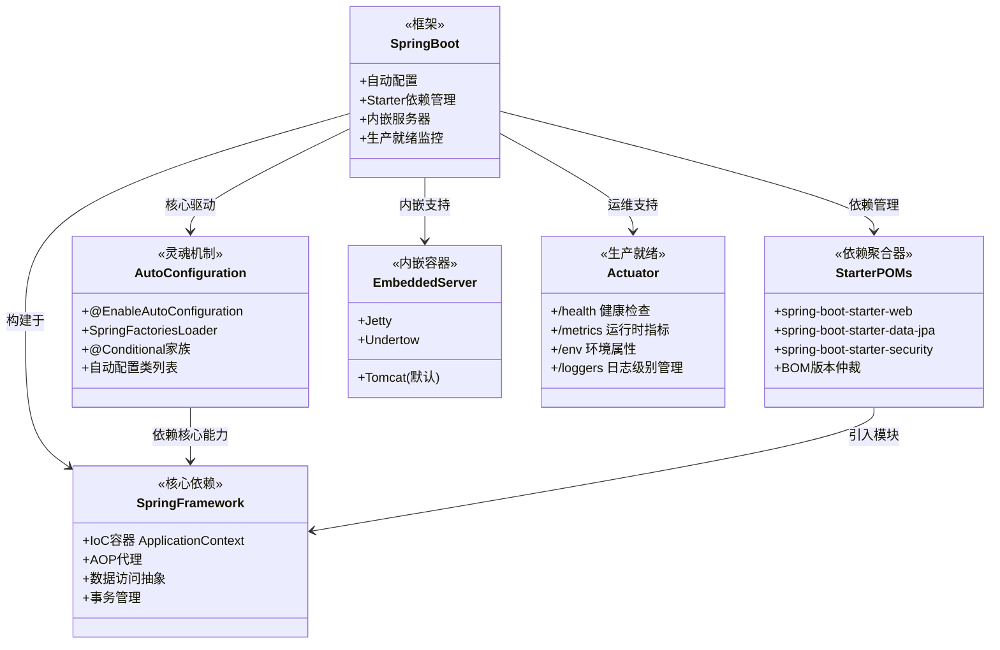

## 引言

Spring Boot 到底是什么？为什么所有 Java 项目都在用它？

很多初学者的第一反应是："不就是 Spring 的简化版吗？"——但如果你只把它当成一个"少写配置"的工具，就错过了它真正的价值。Spring Boot 本质上是一次**架构范式的升级**：它将"约定优于配置"（Convention over Configuration）从理念变成了可执行的框架，让开发者从繁琐的 XML 和 Java Config 中解放出来，专注于业务逻辑本身。

读完本文，你将获得：
1. **精准定位**：Spring Boot 解决了传统 Spring 开发的哪些具体痛点（配置地狱、依赖冲突、外部部署）
2. **架构全景**：自动配置、Starter POMs、内嵌服务器、Actuator 如何协同工作
3. **避坑指南**：生产环境中 6 个最常见的 Spring Boot 使用陷阱及解决方案

> 如果你正在准备 Java 后端面试，或者需要从"会用 Spring Boot"进阶到"理解 Spring Boot"，这篇文章就是你的起点。

### Spring Boot 是什么？定位与目标

Spring Boot 可以被定义为一个用于构建**独立 (standalone)、可运行 (executable)、生产级别 (production-ready)** 的 Spring 应用的框架。

它的核心定位在于**简化**。它基于并充分利用了 Spring Framework 以及整个 Spring 生态系统（如 Spring Data 用于数据访问，Spring Security 用于安全等），但通过提供一套**精心的默认配置**和**自动化机制**，让你能够以最少的配置和最短的时间搭建起一个功能完整的 Spring 应用，并能够直接运行和部署。

简单来说，Spring Boot 的目标就是让你的 Spring 应用**"Just Run"**。

### Spring Boot 解决了传统 Spring 开发的哪些痛点？

Spring Boot 的流行源于它切实地解决了传统 Spring 开发中的诸多不便：

1. **配置繁琐**：传统 Spring 需要大量 XML 或 Java Config 来定义 Bean、装配依赖、配置各种组件（如 DataSource、EntityManagerFactory、TransactionManager、DispatcherServlet 等）。Spring Boot 通过**自动配置**，根据项目依赖和环境智能地完成大部分常用配置。
2. **依赖管理复杂**：不同 Spring 项目和第三方库版本兼容性问题曾是噩梦。Spring Boot 提供了 **Starter POMs**，将常见场景所需的所有依赖聚合在一起，并管理它们的兼容版本，大大简化了依赖声明。
3. **部署复杂**：传统 Web 应用通常需要打成 WAR 包，部署到预先安装好的 Tomcat、Jetty 等应用服务器中。Spring Boot 内嵌了多种 Web 服务器，可以直接将应用打包成**可执行的 JAR 包**，通过 `java -jar` 命令即可运行。
4. **生产就绪特性缺失**：传统应用需要额外集成监控、健康检查等功能。Spring Boot 提供了 **Actuator** 模块，自动提供了一系列生产环境所需的监控和管理端点。
5. **开发效率低下**：从零开始搭建一个 Spring 项目并集成各种功能（Web、数据库、安全等）需要花费大量时间和精力进行配置和依赖管理。Spring Boot 的"约定优于配置"和 Starter POMs 使得开发者可以**快速启动**一个项目并专注于业务代码。

### Spring Boot 核心设计与架构解析

Spring Boot 的强大并非魔法，而是其背后精心设计的架构和实现机制。以下是其最核心的设计理念和技术实现：



> **💡 核心提示**：Spring Boot **不是** Spring Framework 的替代品，而是在其之上提供了"约定优于配置"的更高层抽象。所有 Spring Boot 应用本质上都是 Spring Framework 应用。

#### 自动配置 (Auto-configuration) - Spring Boot 的灵魂

自动配置是 Spring Boot 最具革命性的特性，它让 Spring 应用开发变得如此简单。

* **核心思想：** 在应用启动时，Spring Boot 根据你添加到项目中的 JAR 包（即 classpath 中的类）、已经注册到容器中的 Bean、以及各种环境属性（如配置文件中的值）等条件，**智能地判断**你可能需要哪些配置，并**自动为你配置好相应的 Bean**。
* **启用自动配置：** 自动配置的入口点通常是 `@EnableAutoConfiguration` 注解。这个注解通常被包含在 `@SpringBootApplication` 复合注解中，所以大多数 Spring Boot 应用的启动类只需要一个 `@SpringBootApplication` 注解即可启用自动配置。
    ```java
    @SpringBootApplication // 集成了 @EnableAutoConfiguration
    public class MyApplication {
        public static void main(String[] args) {
            SpringApplication.run(MyApplication.class, args);
        }
    }
    ```
* **发现自动配置类：** `@EnableAutoConfiguration` 如何知道有哪些自动配置需要加载呢？这依赖于 Spring Boot 特有的 **`SpringFactoriesLoader`** 机制。Spring Boot 会扫描所有 JAR 包中的 `META-INF/spring.factories`（Spring Boot 3.2+ 迁移到了 `META-INF/spring/org.springframework.boot.autoconfigure.AutoConfiguration.imports`）文件，加载并合并所有自动配置类的全限定名列表，得到所有**潜在的自动配置类**。
* **自动配置类的实现：** 这些潜在的自动配置类本身也是标准的 Spring `@Configuration` 类。它们内部定义了各种 `@Bean` 方法，用于创建像 `DataSource`、`EntityManagerFactory`、`RestTemplate` 等常用 Bean。
* **条件化配置 (`@Conditional`) - 自动配置的判断大脑：** 自动配置类的强大在于它们是"智能的"。它们的生效与否，以及内部的 `@Bean` 方法是否会创建 Bean，取决于各种 `@Conditional` 注解的判断结果。
    * `@ConditionalOnClass` / `@ConditionalOnMissingClass`：**最重要的条件之一。** 例如，`DataSourceAutoConfiguration` 上可能有 `@ConditionalOnClass({DataSource.class, EmbeddedDatabaseType.class})`，表示只有在 classpath 中存在 `DataSource` 和 `EmbeddedDatabaseType` 类时，这个自动配置类才可能生效。
    * `@ConditionalOnBean` / `@ConditionalOnMissingBean`：判断容器中是否存在或缺失某个类型的 Bean。例如，`DataSourceAutoConfiguration` 中可能会有一个 `@ConditionalOnMissingBean(DataSource.class)` 的 `@Bean` 方法来创建默认 DataSource。如果用户已经手动配置了一个 DataSource Bean，这个默认的自动配置就不会生效。
    * `@ConditionalOnProperty`：根据某个配置文件属性是否存在或值是否符合预期来决定是否生效。
    * `@ConditionalOnResource`：判断某个资源（如文件）是否存在。
    * `@ConditionalOnWebApplication` / `@ConditionalOnNotWebApplication`：判断当前应用是否是传统的 Servlet Web 应用或响应式 Web 应用。
    * `@ConditionalOnExpression`：支持复杂的 SpEL 表达式判断。
* **工作流程概览：** Spring Boot 应用启动 -> 处理 `@EnableAutoConfiguration` -> 读取所有 `spring.factories` 文件，找到所有自动配置类候选 -> 遍历这些候选类，**依次判断**其类级别和方法级别的 `@Conditional` 注解 -> 如果条件满足，则该 `@Configuration` 类或 `@Bean` 方法生效，Spring 容器创建并注册相应的 Bean -> 最终得到一个根据项目情况自动配置好的 Spring 容器。

> **💡 核心提示**：自动配置不是"无脑全加载"。Spring Boot 3.x 中内置了 150+ 个自动配置类，但一个典型的 Web 应用启动时只会激活其中 20-40 个，其余的因为 `@Conditional` 条件不满足被跳过。你可以通过 `--debug` 启动参数查看哪些自动配置生效了、哪些被跳过了及原因。

#### Starter POMs - 依赖管理的利器

Starter 是 Spring Boot 在依赖管理上的创新，它与自动配置紧密协作。

* **功能与目的：** Starter POM（本质上是 Maven 或 Gradle 的依赖声明文件）是一组预先定义的、用于特定场景的依赖集合。例如，引入 `spring-boot-starter-web` 就意味着你想要开发一个 Web 应用，它会一次性帮你引入 Spring MVC、内嵌的 Tomcat、Jackson（用于 JSON 处理）等所有常用依赖，并且版本都是相互兼容的。
* **背后原理：** Starters 本身不包含业务代码，它们是**聚合器**。通过 Maven/Gradle 的依赖传递特性，一个 Starter 会引入多个其他库。而 Spring Boot 的父级 POM (`spring-boot-starter-parent`) 或依赖管理 BOM (`spring-boot-dependencies`) 则扮演着**版本仲裁者**的角色。
* **与自动配置的关系：** Starter 负责将特定场景所需的库带入到项目的 classpath 中。自动配置则通过 `@ConditionalOnClass` 等注解检测这些库的存在，进而触发相应的自动配置。

#### 嵌入式服务器 (Embedded Servers) - 独立运行的基础

* **功能与目的：** Spring Boot 可以将常见的 Web 服务器（如 Tomcat、Jetty、Undertow）直接内嵌到生成的 JAR 文件中。这意味着你的应用不再需要依赖外部安装的 Web 服务器，自身就包含了运行环境。
* **背后原理：** Web 相关的 Starter（如 `spring-boot-starter-web` 默认引入 Tomcat）会引入内嵌服务器的依赖。Spring Boot 的自动配置（如 `ServletWebServerFactoryAutoConfiguration`）会检测到这些内嵌服务器的类，并自动配置并启动相应的 `WebServer` 实例。
* **为何这样设计：** 简化了应用的打包和部署流程，降低了运维复杂度，提高了应用的可移植性。在微服务架构下尤其方便，每个服务都是独立的进程。

#### 外部化配置 (Externalized Configuration) - 灵活适配环境

* **功能与目的：** 提供一套标准且灵活的机制，将应用配置从代码中分离出来，根据不同的环境（开发、测试、生产）加载不同的配置。
* **主要方式：** Spring Boot 支持多种外部配置源，并有明确的加载优先级顺序（高优先级覆盖低优先级）：
    * 命令行参数
    * Java 系统属性 (`System.getProperties()`)
    * 操作系统环境变量
    * `application.properties` 或 `application.yml` 文件
    * `@PropertySource` 注解加载的属性文件
* **多环境配置：** 通过 `application-{profile}.properties/yml` 文件实现环境切换，结合 `spring.profiles.active` 激活指定配置。

#### 生产就绪特性 (Actuator) - 拥抱运维

* **功能与目的：** 通过引入 `spring-boot-starter-actuator` 依赖，Spring Boot 为应用自动提供了一系列用于监控、管理和度量应用在生产环境中运行状态的功能。
* **主要端点：**
    * `/health`：检查应用健康状态（数据库连接、磁盘空间等）
    * `/metrics`：提供各种运行时指标（内存使用、线程数、HTTP 请求量等）
    * `/info`：显示自定义的应用信息
    * `/beans`：列出容器中的所有 Bean
    * `/env`：显示当前环境属性
    * `/loggers`：查看和修改运行时日志级别
* **背后原理：** Actuator Starter 会引入必要的依赖，Spring Boot 的自动配置会检测到 Actuator 的存在，并自动注册提供这些端点的 Bean。

> **💡 核心提示**：Spring Boot 内嵌的服务器**不只是 Tomcat**。虽然 `spring-boot-starter-web` 默认使用 Tomcat，但你可以通过排除 `spring-boot-starter-tomcat` 并引入 `spring-boot-starter-jetty` 或 `spring-boot-starter-undertow` 来切换。Undertow 在高并发场景下通常表现更好，因为它使用了非阻塞 I/O 模型。

### Spring Boot 的设计哲学

贯穿 Spring Boot 所有特性的是其核心设计哲学：

* **约定优于配置 (Convention over Configuration)：** Spring Boot 为许多常见场景提供了合理的默认约定（如默认的端口 8080，默认的内嵌 Tomcat，默认的日志级别等）。开发者只需要遵循这些约定，就可以省去大量的配置工作。
* **开箱即用 (Opinionated Defaults)：** Spring Boot 对很多第三方库提供了"主观的"默认配置，这意味着你只需要引入 Starter，通常就可以直接使用该库的最常用功能。
* **轻松定制 (Easy Customization)：** 通过 `application.properties/yml` 文件、Profile、条件注解的排除、以及传统的 Java Config，开发者可以轻松地覆盖默认配置。
* **专注于开发者体验 (Developer Experience)：** 所有设计都围绕着如何让开发者更快速、更愉快地构建 Spring 应用。
* **与 Spring 生态系统紧密集成：** 并非另起炉灶，而是站在 Spring Framework 和其庞大生态系统的肩膀上。

### Spring Boot 与 Spring Framework 的关系

**Spring Boot 不是 Spring Framework 的替代品。**

它们之间的关系是**层叠关系**：

* **Spring Framework** 提供了核心的编程模型（IoC 容器、AOP、事件机制、资源管理、数据访问抽象等），是构建 Java 应用的基础。
* **Spring Boot** 是构建在 **Spring Framework** 之上的。它利用 Spring Framework 提供的核心能力，并通过自动配置、Starter、内嵌服务器等功能，提供了一种**更便捷、更快速的方式**来开发和部署基于 Spring Framework 的应用。

你可以认为 Spring Boot 是 Spring Framework 的**"增强版"**或**"简化配置和部署的工具集"**。所有的 Spring Boot 应用本质上都是 Spring Framework 应用。

### Spring Boot 不是什么？常见误解澄清

1. **Spring Boot 不是新的 IoC 容器**：它完全复用 Spring Framework 的 `ApplicationContext`，没有替换任何核心容器实现。
2. **Spring Boot 不是 Spring Framework 的替代品**：它构建在 Spring Framework 之上，是"增强层"而非"替代层"。
3. **Spring Boot 不是微服务框架**：虽然它是微服务的事实标准起步方案，但微服务架构还需要服务发现、熔断、网关等组件（这些属于 Spring Cloud 的范畴）。
4. **Spring Boot 不是"零配置"**：它提供的是"少配置"，通过约定优于配置减少样板代码，但关键配置（数据库连接、安全策略等）仍然需要开发者显式定义。
5. **Spring Boot 不会降低运行时性能**：内嵌服务器和自动配置对运行时性能几乎没有影响，启动时因自动配置条件判断会消耗少量时间，但通常可忽略。

### 生产环境避坑指南

以下是 Spring Boot 生产环境中最常见的 8 个陷阱：

| # | 陷阱 | 后果 | 解决方案 |
|---|------|------|----------|
| 1 | **Fat JAR 体积爆炸** | 部署包动辄 50-100MB，CI/CD 传输慢 | 使用 `spring-boot-thin-launcher` 或分层构建 (`spring-boot-maven-plugin` 的 `layers` 配置) 减少镜像体积 |
| 2 | **盲目覆盖自动配置** | 手动配置了 DataSource 但未排除 `DataSourceAutoConfiguration`，导致 Bean 冲突 | 用 `@SpringBootApplication(exclude = {...})` 或在 `@Bean` 方法上用 `@ConditionalOnMissingBean` |
| 3 | **Actuator 端点未设安全保护** | `/env` 泄露数据库密码、`/beans` 暴露内部结构 | 引入 `spring-boot-starter-security`，配置 `management.endpoints.web.exposure.include` 只暴露必要端点 |
| 4 | **不知道自动配置做了什么** | 出问题后无法排查，盲目加配置 | 使用 `--debug` 启动参数查看 AUTO-CONFIGURATION REPORT；用 `spring-boot-starter-actuator` 的 `/conditions` 端点 |
| 5 | **`application.yml` 缩进错误** | 配置不生效且无报错（YAML 静默忽略无效键） | 使用 IDE 的 YAML 插件校验；关键配置启动后用 `@Value` 或 `Environment` 打印验证 |
| 6 | **生产环境未关闭 DevTools** | `spring-boot-devtools` 导致热重启、额外内存开销 | 确保 `spring-boot-devtools` 的 `<scope>runtime</scope>` 且 `<optional>true</optional>` |
| 7 | **忽略内嵌服务器的线程池配置** | 默认 Tomcat 最大 200 线程，高并发下请求排队超时 | 通过 `server.tomcat.threads.max` 等参数根据实际负载调整 |
| 8 | **多环境配置混淆** | `application-prod.yml` 中误用了 dev 的数据库配置 | 启动时显式指定 `--spring.profiles.active=prod`；在 CI/CD 流水线中注入环境变量而非依赖默认 profile |

### 核心对比表

| 特性 | Spring Framework | Spring Boot | Spring Cloud |
|:---|:---|:---|:---|
| **定位** | 核心 IoC/AOP 框架 | 快速构建 Spring 应用的脚手架 | 微服务架构解决方案 |
| **配置方式** | 大量 XML/Java Config | 约定优于配置，自动配置 | 在 Boot 基础上增加分布式配置 |
| **依赖管理** | 手动管理各模块版本 | Starter POMs + BOM 版本仲裁 | 基于 Spring Boot 的 BOM |
| **部署方式** | WAR 包 + 外部服务器 | 可执行 JAR（内嵌服务器） | 可执行 JAR + 服务注册发现 |
| **生产监控** | 需自行集成 | Actuator 开箱即用 | Actuator + 分布式追踪 |
| **适用场景** | 需要精细控制的传统企业应用 | 快速启动的微服务、REST API | 分布式系统、服务治理 |
| **学习曲线** | 陡峭 | 平缓 | 中等（需先掌握 Boot） |

### 行动清单

1. **初始化项目**：访问 [start.spring.io](https://start.spring.io) 生成项目骨架，选择 Java 版本、构建工具和需要的 Starter。
2. **理解自动配置**：在 `application.properties` 中添加 `debug=true`，启动应用查看 AUTO-CONFIGURATION REPORT，了解哪些自动配置生效了。
3. **检查 Starter 依赖**：运行 `mvn dependency:tree` 或 `gradle dependencies`，确认引入的 Starter 没有冗余或版本冲突。
4. **配置 Actuator 安全**：引入 `spring-boot-starter-actuator` 和 `spring-boot-starter-security`，只暴露 `/health` 和 `/info` 端点，其余端点需要认证访问。
5. **规范多环境配置**：为每个环境创建独立的 `application-{profile}.yml`，通过环境变量 `SPRING_PROFILES_ACTIVE` 控制激活的 profile。
6. **优化 Fat JAR**：使用 Docker 分层构建（`spring-boot:build-image` 或 `spring-boot-maven-plugin` 的 `layers` 配置），减少每次部署的传输量。

### 面试问题示例与深度解析

1. **Spring Boot 是什么？它和 Spring Framework 的关系是什么？**
    * **要点：** Spring Boot 定位（独立、可运行、生产级 Spring 应用框架）。关系（基于 Spring Framework 之上，是其增强/简化工具集，非替代）。
2. **请解释 Spring Boot 的自动配置原理。**
    * **要点：** 回答是 Spring Boot 的核心，实现"开箱即用"。解释 `@EnableAutoConfiguration` 作用。**重点讲解** `META-INF/spring.factories` 如何发现自动配置类列表。**详细讲解**自动配置类上的 `@Conditional` 注解（举例 `@ConditionalOnClass`, `@ConditionalOnMissingBean` 等）如何根据条件决定是否加载 Bean。
3. **Starter POMs 的作用是什么？它解决了什么问题？**
    * **要点：** 依赖聚合器，简化依赖管理。解决依赖繁多、版本冲突问题。说明其本身不含代码，是依赖声明文件，Spring Boot 父 POM/BOM 管理版本。
4. **Spring Boot 为何能直接打成可执行 JAR 包运行？**
    * **要点：** 内嵌了 Web 服务器（Tomcat, Jetty, Undertow）。`spring-boot-maven-plugin`/Gradle 插件负责将应用和内嵌服务器一起打包到 JAR 中，并生成特殊的启动类。
5. **Actuator 是什么？有哪些常用功能？**
    * **要点：** 生产就绪特性，用于监控和管理应用。列举 `/health`, `/metrics`, `/info`, `/beans` 等常用端点。作用：提高应用的可观测性和可管理性。
6. **如何关闭或替换 Spring Boot 的某个自动配置？**
    * **要点：** 在 `@SpringBootApplication` 或 `@EnableAutoConfiguration` 的 `exclude` 或 `excludeName` 属性中指定要排除的自动配置类。或者利用 `@ConditionalOnMissingBean` 原理，手动配置一个同类型的 Bean，使自动配置因条件不满足而失效。

### 总结

Spring Boot 凭借其"约定优于配置"的设计理念和强大的核心特性——特别是**自动配置**、**Starter POMs**和**嵌入式服务器**——彻底改变了 Spring 应用的开发和部署体验，使其成为构建独立、可运行、生产级别应用的利器。

深入理解 Spring Boot 的架构设计，尤其是自动配置的原理（`@EnableAutoConfiguration` -> `spring.factories` -> `@Conditional`），是超越简单使用、进行高级定制、高效排查问题以及从容应对面试的关键。
