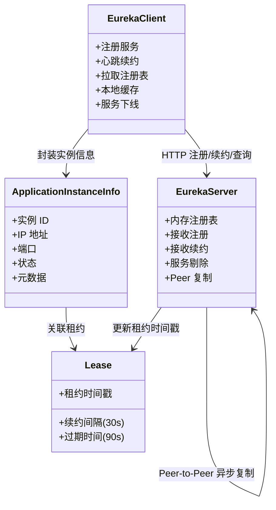
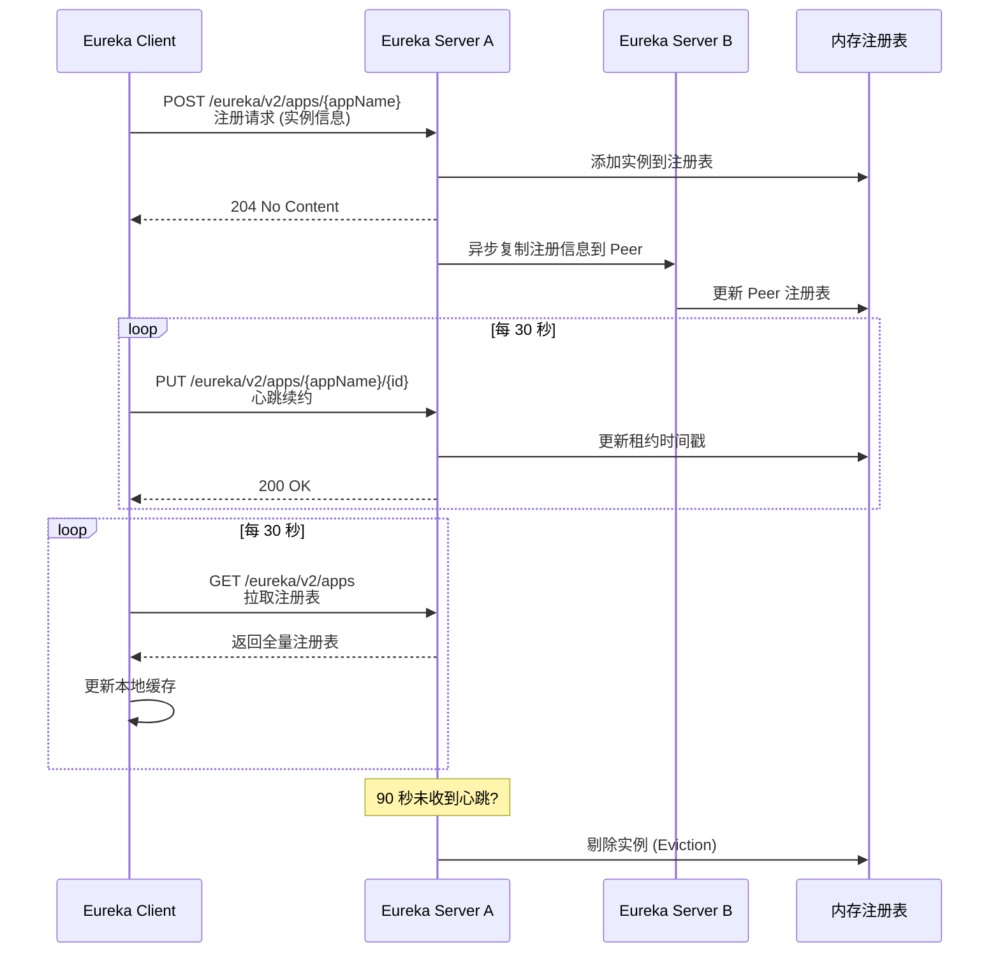

## 引言

微服务实例今天 3 个明天 5 个，服务地址怎么动态发现？

在微服务架构中，服务实例是动态变化的——扩缩容、部署升级、故障恢复都会导致实例地址频繁变化。硬编码的服务地址在微服务场景下完全不可行。Netflix Eureka 作为 Spring Cloud 生态中经典的服务发现组件，提供了一套去中心化、可用性优先的服务注册与发现方案。

读完本文，你将掌握：
1. Eureka Server 与 Client 的完整交互流程——注册、续约、发现、剔除
2. Eureka 为什么选择 AP 而非 CP？自我保护模式的底层逻辑是什么？
3. Peer-to-Peer 复制如何实现高可用？客户端缓存如何提升弹性？

无论你是搭建 Eureka 集群、排查服务注册问题，还是应对面试中的 CAP 理论考察，这篇文章都能帮你建立清晰的理解。

---

## Eureka 架构深度解析

### Eureka 组件关系图



### Eureka Server 与 Client 核心职责

#### Eureka Server：服务注册中心

* **接收服务注册 (Registration)**：接收 Client 的 HTTP POST 请求，将实例信息存入内存注册表。
* **心跳续约 (Renewal)**：接收 Client 的 HTTP PUT 请求，更新租约时间戳。
* **服务下线 (De-registration)**：接收 Client 的 HTTP DELETE 请求，立即移除实例。
* **服务剔除 (Eviction)**：超过 90 秒未收到心跳的实例，Server 将其从注册表中剔除。

#### Eureka Client：集成在微服务中

* **服务注册**：启动时向 Server 发送注册请求。
* **心跳续约**：默认每 30 秒发送一次心跳。
* **获取注册表**：默认每 30 秒从 Server 拉取全量注册表并更新到本地缓存。
* **客户端缓存**：本地维护服务注册信息副本，所有服务发现请求优先查缓存。
* **服务下线**：正常关闭时发送下线请求。

### Eureka 注册流程图



## Eureka 核心机制详解

### Peer-to-Peer 复制（高可用）

Eureka Server 集群中的节点是平等的，采用 Peer-to-Peer 方式同步数据：

1. 每个 Eureka Server 既作为 Server 提供服务，也作为 Client 向其他 Peer 注册自己。
2. 当 Server A 收到注册请求后，立即更新自己的注册表，然后**异步复制**给所有 Peer。
3. 如果复制失败，Server A 会定期重试。同时，每个 Peer 也会定期从其他 Peer 拉取注册表进行同步。
4. **即使部分 Server 宕机，只要有一个存活，服务实例就能注册和续约。**

> **💡 核心提示**：Eureka 的 Peer-to-Peer 复制是**异步的**，这意味着 Server 之间的注册表可能存在短暂不一致。这是 Eureka 选择 AP（可用性优先）的体现——网络分区时，宁可返回旧数据，也不停止服务。

### Eureka 为什么选择 AP 而非 CP？

CAP 定理：在分布式系统中，Consistency（一致性）、Availability（可用性）、Partition tolerance（分区容错性）三者不可兼得。

* **Eureka 选择 AP**：网络分区时，优先保证可用性，即使返回旧数据也不停止服务。
* **对比 CP 系统（如 ZooKeeper）**：网络分区时，为保证一致性可能停止服务直到分区恢复。

### 自我保护模式

当 Eureka Server 在短时间内丢失大量心跳时（可能是网络故障而非实例真的宕机），Server 进入**自我保护模式**：
* 不剔除任何实例，保留注册表不变。
* 避免因网络故障导致大量服务被误删。
* 进一步体现了 Eureka "可用性优先"的设计哲学。

> **💡 核心提示**：自我保护模式下，注册表中可能包含已下线的实例。客户端缓存 + 自我保护是 Eureka AP 特性的双重保障。

### 客户端缓存的重要性

* **提升性能**：减少对 Server 的频繁请求。
* **提高弹性**：即使 Server 全部宕机，客户端仍可使用本地缓存的旧数据发现服务（虽然可能调用到已下线实例，但总比完全无法发现强）。

## Spring Cloud 集成 Eureka 的使用方式

### 构建 Eureka Server

```xml
<dependency>
    <groupId>org.springframework.cloud</groupId>
    <artifactId>spring-cloud-starter-netflix-eureka-server</artifactId>
</dependency>
```

```java
@SpringBootApplication
@EnableEurekaServer
public class EurekaServerApplication {
    public static void main(String[] args) {
        SpringApplication.run(EurekaServerApplication.class, args);
    }
}
```

```yaml
server:
  port: 8761

eureka:
  instance:
    hostname: localhost
  client:
    register-with-eureka: false
    fetch-registry: false
    serviceUrl:
      defaultZone: http://${eureka.instance.hostname}:${server.port}/eureka/
```

> **💡 核心提示**：Spring Cloud 2020+ 已标记 Eureka 为维护模式。新项目建议优先考虑 Nacos 或 Consul。

### 构建 Eureka Client

```xml
<dependency>
    <groupId>org.springframework.cloud</groupId>
    <artifactId>spring-cloud-starter-netflix-eureka-client</artifactId>
</dependency>
```

```yaml
spring:
  application:
    name: my-service

eureka:
  client:
    serviceUrl:
      defaultZone: http://localhost:8761/eureka/
  instance:
    prefer-ip-address: true
    lease-renewal-interval-in-seconds: 30
    lease-expiration-duration-in-seconds: 90
```

## Eureka vs Consul vs ZooKeeper vs Nacos 对比

| 特性 | Eureka | Consul | ZooKeeper | Nacos |
| :--- | :--- | :--- | :--- | :--- |
| **CAP** | AP (可用性优先) | CP (可配置 AP) | CP (一致性优先) | AP(服务发现) / CP(配置) |
| **一致性协议** | Peer-to-Peer 异步复制 | Raft | ZAB | Distro(AP) / Raft(CP) |
| **健康检查** | 心跳 | TCP/HTTP/Script | Session | TCP/HTTP/MySQL |
| **元数据** | 支持 | 支持 (K/V) | 有限 | 支持 |
| **多数据中心** | 不支持 | 原生支持 | 不支持 | 支持 (命名空间/分组) |
| **配置管理** | 不支持 | 支持 (K/V) | 支持 | 支持 (核心功能) |
| **维护状态** | 维护模式 | 活跃 | 活跃 | 活跃 |
| **Spring Cloud 集成** | spring-cloud-starter-netflix-eureka-client | spring-cloud-starter-consul-discovery | spring-cloud-starter-zookeeper-discovery | spring-cloud-starter-alibaba-nacos-discovery |
| **适用场景** | 可用性优先，容忍短暂不一致 | 需要 K/V 存储、多 DC | 已有 ZK 基础设施 | 一站式服务发现+配置中心 |

## 生产环境避坑指南

1. **自我保护模式掩盖真实故障**：Eureka 进入自我保护后，注册表中的死实例不会被剔除。客户端可能持续调用已下线的服务。解决：缩短 `lease-expiration-duration-in-seconds`，或关闭自我保护（`eureka.server.enable-self-preservation=false`，但不推荐）。
2. **客户端缓存导致调用死实例**：Eureka Client 默认 30 秒刷新一次注册表。实例下线后，客户端缓存可能仍保留旧地址。解决：结合 Ribbon/LoadBalancer 的健康检查和重试机制。
3. **默认 90 秒租约过期时间过长**：实例宕机后，需要 90 秒才会被剔除。这段时间内的请求可能路由到死实例。解决：生产环境可适当缩短至 30-60 秒，但需权衡心跳频率。
4. **Eureka Server Peer 同步延迟**：Server 之间的异步复制可能导致短暂不一致。客户端可能从不同 Server 获取到不同的注册表。解决：确保 Peer 之间网络稳定，必要时定期拉取同步。
5. **Zone 配置错误导致跨区域调用**：如果 `eureka.instance.metadata-map.zone` 配置不当，可能导致跨区域的流量调度，增加延迟。解决：明确配置 Zone，使用 `ZoneAwareLoadBalancer`。
6. **Eureka Server 单机部署单点故障**：生产环境只部署一个 Eureka Server 是高风险操作。解决：至少部署 2-3 个 Server 节点组成集群。
7. **实例 ID 冲突**：多个实例使用相同 `instance-id` 会导致注册表覆盖。解决：使用 `${spring.cloud.client.ip-address}:${server.port}` 或确保唯一性。

## 总结

### 核心对比

| 特性 | 说明 |
| :--- | :--- |
| **CAP 选择** | AP（可用性 + 分区容错性） |
| **复制方式** | Peer-to-Peer 异步复制 |
| **心跳间隔** | 默认 30 秒 |
| **租约过期** | 默认 90 秒 |
| **注册表刷新** | 默认 30 秒 |
| **客户端缓存** | 是（关键弹性保障） |
| **自我保护** | 是（防止误剔除） |

### 行动清单

1. **生产环境部署 Eureka Server 集群**：至少 2-3 个节点，互相注册，确保高可用。
2. **理解自我保护模式的行为**：不要盲目关闭，而是理解它在网络故障时的保护价值。
3. **根据业务容忍度调整心跳和租约参数**：如果对实例下线敏感，可适当缩短 `lease-expiration-duration-in-seconds`。
4. **开启 IP 地址注册**：`eureka.instance.prefer-ip-address=true` 避免主机名解析问题。
5. **结合断路器使用**：Eureka 可能返回已下线实例，需配合 Hystrix/Resilience4j 做容错。
6. **新项目评估 Nacos 或 Consul**：Eureka 已进入维护模式，新项目优先考虑活跃维护的替代方案。
7. **监控注册表健康**：通过 Eureka Dashboard 或 Actuator 端点监控注册表状态和 Server 集群同步情况。
