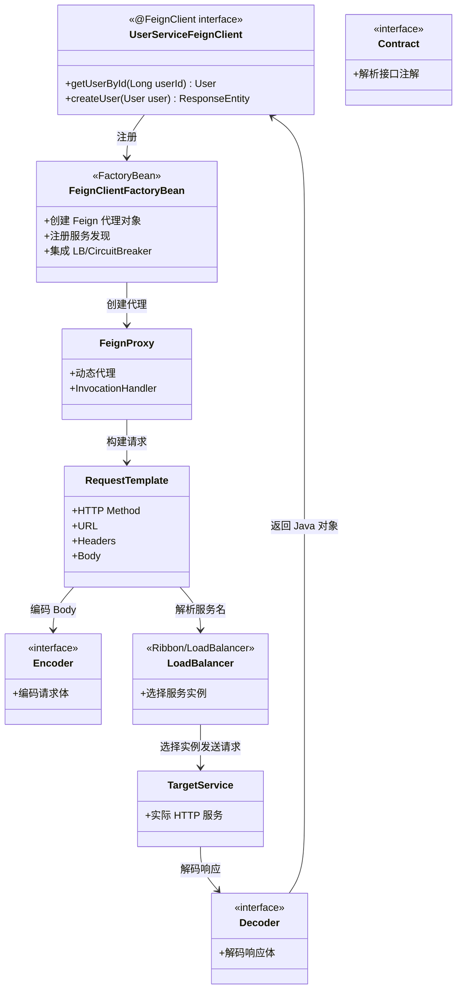
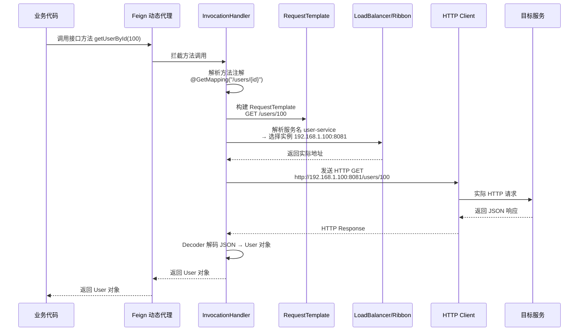

## 引言

RestTemplate 写 HTTP 调用写到崩溃？Feign 让你一行代码搞定。

在微服务架构中，服务间的 HTTP 调用是日常操作。手动用 `RestTemplate` 拼接 URL、设置请求头、解析响应、集成负载均衡和断路器……随着服务数量增长，这些样板代码会淹没你的业务逻辑。OpenFeign 通过**声明式接口**，让远程调用像本地方法一样简洁。

读完本文，你将掌握：
1. Feign 的核心原理——动态代理如何将接口方法调用转化为 HTTP 请求
2. Feign 与 Eureka、Ribbon/LoadBalancer、Hystrix/Resilience4j 的无缝集成机制
3. 常见踩坑点——超时不匹配、GET 传 Body、Fallback 吞异常

无论你是设计微服务客户端、排查远程调用问题，还是应对面试中的声明式编程原理考察，这篇文章都能帮你快速上手并深入理解。

---

## OpenFeign 架构设计与工作原理

### Feign 组件关系图



### Feign 调用时序图



### Feign 核心机制详解

#### 1. 动态代理 (Dynamic Proxy)

OpenFeign 的核心是使用 Java **动态代理**。你定义的 Feign Client 接口，Feign 不会生成硬编码的实现类，而是在应用启动时，利用动态代理技术为接口创建代理对象。注入接口后调用方法时，实际执行的是代理对象的逻辑。

> **💡 核心提示**：`@FeignClient` 的 `name` 属性必须与服务注册中心（如 Eureka）的服务名称一致。Feign 通过这个名称结合 LoadBalancer/DiscoveryClient 查找服务实例。

#### 2. 请求构建：方法调用 → RequestTemplate

当调用 Feign Client 接口方法时，动态代理的 `InvocationHandler` 会：
1. 解析方法上的注解（如 `@GetMapping("/users/{id}")`、`@PathVariable("id")`）。
2. 结合方法参数值，构建 `RequestTemplate`——包含 HTTP 方法、URL、Header、Body 等信息。

#### 3. 客户端执行：集成 Spring Cloud 生态

* **服务发现**：通过 `DiscoveryClient` 从 Eureka/Consul 获取实例列表。
* **负载均衡**：通过 Ribbon 或 Spring Cloud LoadBalancer 选择具体实例。
* **断路器**：通过 Hystrix 或 Resilience4j 包装调用，失败时触发 Fallback。
* **底层 HTTP 客户端**：默认使用 `java.net.HttpURLConnection`，可配置为 Apache HttpClient 或 OK HTTP。

#### 4. 响应处理：编码与解码

* **Encoder**：将 `@RequestBody` 参数的 Java 对象编码为请求体字节流。Spring Cloud 使用 `HttpMessageConverterEncoder`。
* **Decoder**：将响应体字节流解码为方法返回值类型的 Java 对象。Spring Cloud 使用 `HttpMessageConverterDecoder`。
* **ErrorDecoder**：处理 4xx/5xx 错误响应，可自定义转换远程错误为业务异常。

## Spring Cloud 集成 OpenFeign 的使用方式

### 启用与依赖

```xml
<dependency>
    <groupId>org.springframework.cloud</groupId>
    <artifactId>spring-cloud-starter-openfeign</artifactId>
</dependency>
<dependency>
    <groupId>org.springframework.cloud</groupId>
    <artifactId>spring-cloud-starter-loadbalancer</artifactId>
</dependency>
<dependency>
    <groupId>org.springframework.cloud</groupId>
    <artifactId>spring-cloud-starter-circuitbreaker-resilience4j</artifactId>
</dependency>
```

```java
@SpringBootApplication
@EnableFeignClients
public class MyMicroserviceApplication {
    public static void main(String[] args) {
        SpringApplication.run(MyMicroserviceApplication.class, args);
    }
}
```

### 定义 Feign Client

```java
@FeignClient(name = "user-service", fallback = UserServiceFallback.class)
public interface UserServiceFeignClient {

    @GetMapping("/users/{userId}")
    User getUserById(@PathVariable("userId") Long userId);

    @PostMapping("/users")
    ResponseEntity<Void> createUser(@RequestBody User user);
}
```

> **💡 核心提示**：Feign 的 fallback 机制需要在配置中启用 `feign.circuitbreaker.enabled=true`。Fallback Factory（`fallbackFactory`）可以获取到异常详情，比简单 fallback 更适合调试和生产环境。

### Fallback 实现

```java
@Component
public class UserServiceFallback implements UserServiceFeignClient {
    @Override
    public User getUserById(Long userId) {
        System.out.println("Fallback triggered for getUserById. User ID: " + userId);
        return new User(userId, "Fallback User");
    }

    @Override
    public ResponseEntity<Void> createUser(User user) {
        return ResponseEntity.status(503).build();
    }
}
```

### 自定义配置

```yaml
logging:
  level:
    com.example.consumer.feign.UserServiceFeignClient: DEBUG
```

```java
@Configuration
public class FeignClientConfiguration {
    @Bean
    public feign.Logger.Level feignLoggerLevel() {
        return feign.Logger.Level.FULL;
    }
}
```

## RestTemplate vs OpenFeign vs WebClient 对比

| 维度 | RestTemplate | OpenFeign | WebClient |
| :--- | :--- | :--- | :--- |
| **编程模型** | 编程式（命令式） | 声明式（接口定义） | 编程式（响应式） |
| **阻塞/非阻塞** | 同步阻塞 | 同步阻塞 | 异步非阻塞 |
| **服务发现集成** | 需 @LoadBalanced | 自动集成 | 需 @LoadBalanced |
| **断路器集成** | 需手动包装 | @FeignClient fallback | 需手动包装 |
| **代码简洁度** | 样板代码多 | 接口一行搞定 | 中等 |
| **维护状态** | 维护模式 | 活跃开发 | 活跃开发 |
| **适用场景** | 遗留系统、非 Spring Cloud | 微服务同步调用首选 | 响应式服务、精细控制 |

> **💡 核心提示**：在 Spring Cloud 环境下，微服务间同步 HTTP 调用**强烈推荐 OpenFeign**——代码最简洁，与生态集成最紧密。异步/响应式场景则选择 WebClient。

## 生产环境避坑指南

1. **Feign 超时与断路器超时不匹配**：Feign 的 `ReadTimeout` 必须小于或等于 Hystrix/Resilience4j 的超时时间，否则断路器会在 Feign 超时前就触发 Fallback，导致问题难以排查。解决：统一配置超时参数，确保断路器超时 > Feign 超时。
2. **遗漏 @EnableFeignClients 注解**：Feign Client 接口定义后，必须在启动类或配置类上添加 `@EnableFeignClients`，否则接口不会被扫描和代理。这是最常见的初学者错误。
3. **Fallback 吞掉真实异常**：简单的 `fallback` 实现只返回默认值，无法获取失败原因。解决：使用 `fallbackFactory` 替代 `fallback`，可以拿到异常详情用于日志记录和监控。
4. **请求拦截器未传播认证头**：自定义 `RequestInterceptor` 如果遗漏了传播认证头（如 Authorization），下游服务将无法识别用户身份。解决：在拦截器中显式拷贝认证相关的请求头。
5. **GET 请求使用 @RequestBody**：Feign 的 GET 请求不支持 `@RequestBody`（HTTP 规范不推荐 GET 带 Body）。解决：GET 使用 `@RequestParam` 或 `@PathVariable`，需要复杂对象时用 POST。
6. **Feign 日志级别生产环境误配**：`Logger.Level.FULL` 会记录请求和响应的完整内容（含 Body），高流量下产生大量日志。解决：开发环境用 FULL，生产环境用 BASIC 或 NONE。

## 总结

### 核心对比

| 特性 | OpenFeign | RestTemplate | WebClient |
| :--- | :--- | :--- | :--- |
| 声明式接口 | ✅ | ❌ | ❌ |
| 自动 LB | ✅ | 需 @LoadBalanced | 需 @LoadBalanced |
| 自动断路器 | ✅ (fallback) | ❌ | ❌ |
| 响应式 | ❌ | ❌ | ✅ |
| 学习曲线 | 低 | 低 | 中 |
| 推荐场景 | 微服务同步调用 | 遗留系统 | 响应式服务 |

### 行动清单

1. **新项目使用 OpenFeign 作为微服务调用首选**：声明式接口大幅简化代码，与 Spring Cloud 生态无缝集成。
2. **启用 Feign 日志调试**：开发阶段设置 `Logger.Level.FULL` 查看完整请求/响应信息。
3. **配置 Fallback Factory 获取异常详情**：用于日志记录和监控报警。
4. **统一超时配置**：确保 Feign 超时 < 断路器超时，避免断路器异常触发。
5. **使用 RequestInterceptor 传播认证头**：确保下游服务能识别用户身份。
6. **避免 GET 使用 @RequestBody**：GET 用 `@RequestParam`，复杂参数用 POST。
7. **生产环境降低日志级别**：避免 FULL 级别日志影响性能。
8. **评估迁移到 Spring Cloud LoadBalancer**：Ribbon 已维护模式，确保 Feign 使用 LoadBalancer 而非 Ribbon。
