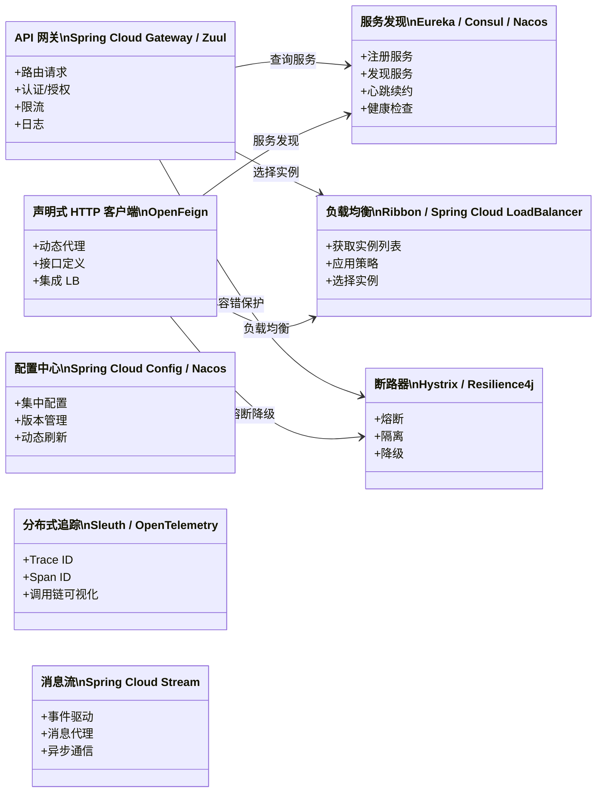
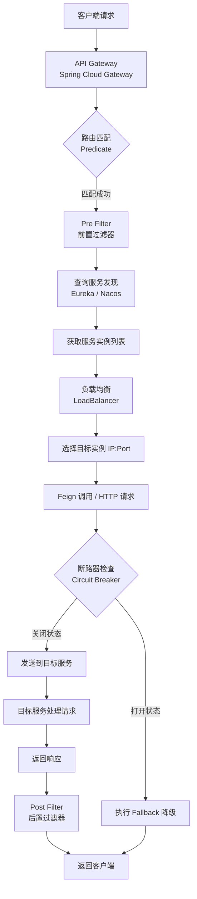

## 引言

微服务不是银弹，Spring Cloud 也不是——但它是 Java 生态的最佳选择。

Spring Cloud 不是一个单一的框架，而是一系列项目的**集合**，为分布式系统中的服务发现、负载均衡、网关、容错等常见模式提供了 Spring Boot 风格的实现。面对 Netflix 组件进入维护模式、Spring Cloud Alibaba 崛起、响应式编程普及的格局，开发者需要理解：Spring Cloud 各组件如何协作？为什么某些组件被替换？如何在众多选型中做出正确决策？

读完本文，你将掌握：
1. Spring Cloud 整体架构与核心设计哲学——"模式集合体"而非"单体产品"
2. 各组件在微服务请求链路中的位置与协作关系
3. Spring Cloud 与 Spring Boot 的层叠关系及集成机制

无论你是准备构建微服务系统、进行技术选型，还是应对架构师面试中的分布式系统问题，这篇文章都能给你提供清晰的认知框架。

---

## Spring Cloud 是什么？定位与目标

Spring Cloud 不是一个包罗万象的独立框架，而是一个**项目集合** (A Set of Projects)。每个项目都针对分布式系统中的一个特定问题或架构模式，提供 Spring Boot 风格的实现。

> **💡 核心提示**：Spring Cloud 是"解决方案的集合"，不是"一个产品"。它为 JVM 生态中的微服务架构提供了一套经过实践检验的开源解决方案，目标是简化分布式系统的开发，让开发者能够快速构建、部署和管理弹性、可靠、可伸缩的微服务。

### 为什么需要 Spring Cloud？

* **标准化解决方案**：为分布式系统中的常见问题提供标准化的、基于行业成熟模式的解决方案，避免重复造轮子。
* **拥抱 Spring 生态**：与 Spring Framework 和 Spring Boot 无缝集成，保持一致的编程模型和开发体验。
* **开箱即用**：借助 Spring Boot 的自动配置和 Starter，许多分布式组件的集成和使用变得非常简单。
* **可插拔性**：对于某些模式（如服务发现、分布式配置），Spring Cloud 提供了多种实现选项（Eureka、Consul、Zookeeper、Nacos 等），开发者可以根据需求选择。

## Spring Cloud 核心架构模式与组件解析

Spring Cloud 的架构体现在它对分布式系统中各种**核心架构模式**的实现。以下是其中最重要的模式及其对应的 Spring Cloud 项目：

### Spring Cloud 组件架构图

### 服务发现 (Service Discovery)

* **模式**：解决服务消费者如何动态找到服务提供者实例的网络位置。
* **组件**：Eureka（维护模式）、Consul、Zookeeper、Nacos、Kubernetes Native。

> **💡 核心提示**：Spring Cloud Netflix Eureka 已进入维护模式。新项目优先考虑 Consul 或 Nacos，它们功能更全面，社区活跃。Spring Cloud 2020+ 对其支持也在逐渐减少。

### 客户端负载均衡 (Client-Side Load Balancing)

* **模式**：服务消费者从注册中心获取实例列表后，根据策略选择一个实例发送请求。
* **组件**：Ribbon（维护模式）、Spring Cloud LoadBalancer（官方推荐替代品）。

> **💡 核心提示**：Spring Cloud 2020+ 已移除 Ribbon，改用 Spring Cloud LoadBalancer。新项目应直接使用 LoadBalancer。

### API 网关 (API Gateway)

* **模式**：为所有服务提供统一入口，处理认证、限流、路由等横切关注点。
* **组件**：Zuul 1.x（维护模式）、Spring Cloud Gateway（官方推荐）。

### 断路器 (Circuit Breaker)

* **模式**：防止依赖服务故障导致雪崩效应，快速失败并隔离故障。
* **组件**：Hystrix（维护模式）、Resilience4j（官方推荐）。

### 分布式配置管理

* **模式**：统一管理大量服务的配置信息，支持动态更新。
* **组件**：Spring Cloud Config、Consul、Nacos。

### 分布式追踪

* **模式**：通过 Trace ID 和 Span ID 追踪请求在多个服务间的调用链。
* **组件**：Spring Cloud Sleuth + Zipkin/OpenTelemetry。

### 消息总线与流

* **模式**：服务间异步通信和事件驱动。
* **组件**：Spring Cloud Bus、Spring Cloud Stream。

## 微服务完整请求流程图

## Spring Cloud 与 Spring Boot 的关系

Spring Cloud 构建在 Spring Boot 之上，是**层叠关系**：

* **Auto-configuration**：Spring Cloud 的许多功能通过引入对应的 Starter，由 Spring Boot 的自动配置激活和配置。例如，引入 `spring-cloud-starter-netflix-eureka-client` 后，Spring Boot 根据 Classpath 和 `eureka.*` 属性自动配置 Eureka Client Bean。
* **生命周期管理**：Spring Cloud 组件作为 Spring Bean，其生命周期由 Spring Boot 的 ApplicationContext 管理。

可以说，Spring Boot 提供构建独立 Spring 应用的基础，Spring Cloud 则在此基础之上为构建**分布式** Spring 应用提供强大支持。

## Spring Cloud vs Spring Cloud Alibaba vs 服务网格

| 维度 | Spring Cloud Netflix | Spring Cloud Alibaba | Service Mesh (Istio) |
| :--- | :--- | :--- | :--- |
| **服务发现** | Eureka (AP, 维护模式) | Nacos (AP/CP) | Sidecar 代理 |
| **负载均衡** | Ribbon (维护模式) | Nacos + 内置 LB | Envoy 代理 |
| **网关** | Zuul 1.x (维护模式) | 无独立网关 (可配合 Gateway) | Ingress Gateway |
| **断路器** | Hystrix (维护模式) | Sentinel | Envoy Circuit Breaker |
| **配置中心** | Spring Cloud Config | Nacos | Istio 配置 |
| **编程模型** | 阻塞式 (Servlet) | 阻塞式/响应式 | 语言无关 |
| **部署复杂度** | 低 | 低 | 高 |
| **适合场景** | 传统微服务 | 中国生态、一站式方案 | 多语言、大规模集群 |
| **社区活跃度** | 维护模式 | 活跃 | 活跃 |

## 生产环境避坑指南

1. **Spring Boot 与 Spring Cloud 版本不兼容**：Spring Cloud 版本必须与 Spring Boot 版本对应。使用 Spring Cloud BOM 管理版本，避免手动指定各组件版本号导致冲突。
2. **Netflix Eureka 自我保护模式掩盖真实故障**：Eureka 在大量心跳丢失时进入自我保护模式，不再剔除实例。生产环境需理解其行为，避免依赖注册表判断服务真实状态。
3. **断路器未正确配置导致雪崩**：Hystrix/Resilience4j 默认配置可能不适合你的场景。超时时间、线程池大小、错误阈值必须根据实际负载调优。
4. **配置中心单点故障**：Spring Cloud Config Server 如果宕机，客户端将无法启动（除非缓存了配置）。生产环境需高可用部署，或搭配本地缓存。
5. **Ribbon/LoadBalancer 缓存未刷新**：实例扩缩容后，客户端缓存的服务列表可能未更新，导致请求发送到已下线的实例。需关注 `ServerListRefreshInterval` 配置。
6. **Spring Cloud Sleuth 采样率配置不当**：默认采样率可能导致高流量下大量追踪数据丢失，或低流量下产生过多开销。需根据实际 QPS 调整。

## 总结

### 核心对比

| 组件领域 | 经典方案 (维护模式) | 推荐方案 | 关键差异 |
| :--- | :--- | :--- | :--- |
| 服务发现 | Eureka | Nacos / Consul | 功能丰富度、社区活跃度 |
| 负载均衡 | Ribbon | Spring Cloud LoadBalancer | 响应式支持、官方维护 |
| 网关 | Zuul 1.x | Spring Cloud Gateway | 阻塞 vs 响应式、性能 |
| 断路器 | Hystrix | Resilience4j | 线程池 vs 信号量、轻量级 |
| 配置中心 | Config Server | Nacos | 是否集成服务发现 |

### 行动清单

1. **使用 BOM 管理版本**：在 `pom.xml` 中引入 `spring-cloud-dependencies` BOM，统一所有 Spring Cloud 组件版本。
2. **新项目优先选用维护中的替代方案**：LoadBalancer 替代 Ribbon，Gateway 替代 Zuul，Resilience4j 替代 Hystrix。
3. **理解 CAP 取舍**：根据业务容忍度选择 AP（Eureka/Nacos AP）或 CP（Consul/Nacos CP）组件。
4. **配置中心做高可用**：至少部署 2-3 个 Config Server 或 Nacos 节点。
5. **为断路器配置 Fallback**：每个远程调用都应有降级逻辑，避免级联失败。
6. **监控与可观测性**：集成 Prometheus + Grafana 或 Zipkin，确保分布式系统可观测。
7. **渐进式引入组件**：从核心组件（服务发现、网关、负载均衡）开始，逐步引入断路器、配置中心等。
8. **关注 Spring Cloud Alibaba**：如果团队熟悉中文文档且需要一站式解决方案，Nacos + Sentinel + Seata 组合值得重点评估。
