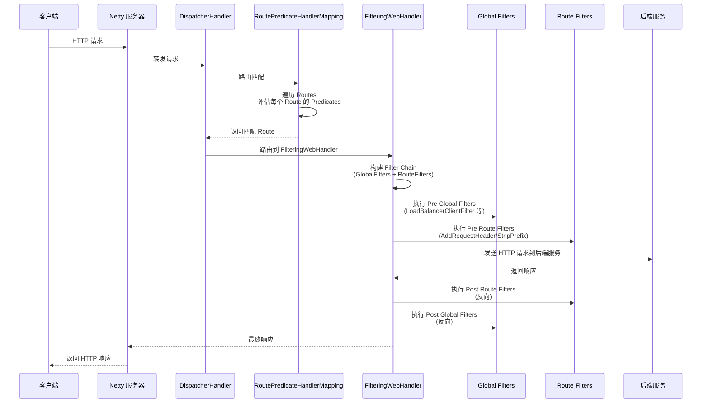
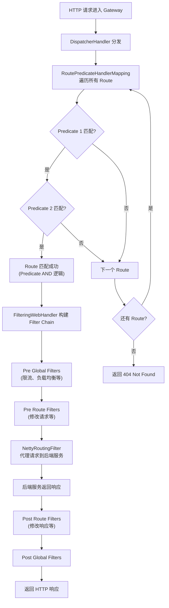

## 引言

Zuul 1.x 扛不住高并发？Spring Cloud Gateway 用响应式来救场。

Zuul 1.x 的 Thread-per-Request 模型在高并发下迅速耗尽 Servlet 线程池，导致网关成为系统瓶颈。Spring Cloud Gateway 基于 Spring WebFlux 和 Project Reactor 构建，采用响应式非阻塞模型，用事件循环替代线程池，在高并发场景下显著降低延迟、提升吞吐量。

读完本文，你将掌握：
1. Gateway 的核心三件套——Route + Predicate + Filter 如何定义网关行为
2. 响应式请求处理流程：从 DispatcherHandler 到 FilteringWebHandler 的完整链路
3. Predicate 的 AND 逻辑、GlobalFilter 与 RouteFilter 的区别

无论你是构建高性能 API 网关、配置路由和过滤器，还是应对面试中的响应式编程考察，这篇文章都能提供系统化的理解。

---

## Spring Cloud Gateway 架构设计

### Gateway 组件关系图

```mermaid
classDiagram
    class Gateway {
        +WebFlux DispatcherHandler
        +Netty 服务器
    }
    class RouteLocator {
        <<interface>>
        +getRoutes() Flux~Route~
    }
    class Route {
        +id 路由唯一标识
        +uri 目标地址
        +predicates List~Predicate~
        +filters List~GatewayFilter~
    }
    class HandlerMapping {
        <<RoutePredicateHandlerMapping>>
        +匹配 Predicate
        +返回 Route
    }
    class FilteringWebHandler {
        +构建 Filter Chain
        +执行过滤器链
    }
    class GlobalFilter {
        <<接口>>
        +全局过滤器
        +所有请求生效
    }
    class GatewayFilter {
        <<接口>>
        +路由过滤器
        +仅匹配路由生效
    }

    Gateway --> RouteLocator : 加载路由
    RouteLocator --> Route : 返回路由列表
    Route --> HandlerMapping : 断言匹配
    HandlerMapping --> FilteringWebHandler : 转发处理器
    FilteringWebHandler --> GlobalFilter : 全局过滤器
    FilteringWebHandler --> GatewayFilter : 路由过滤器
    Gateway -.实现.-|> GatewayFilter
    LoadBalancerClientFilter -.实现.-|> GlobalFilter
    NettyRoutingFilter -.实现.-|> GlobalFilter
```

### Gateway 请求处理时序图



### Gateway 谓词匹配与过滤器链流程



## 核心概念详解

### 1. 响应式编程基石 (Reactive Programming)

Gateway 基于 Spring WebFlux 和 Project Reactor：
* 不使用传统 Servlet API，而是使用非阻塞 API。
* 底层默认使用 Netty 作为服务器（事件循环模型）。
* 所有数据流以 `Mono`（0-1 个元素）和 `Flux`（0-N 个元素）表示。

> **💡 核心提示**：响应式模型非常适合网关这种 I/O 密集型场景。不需要为每个连接分配独立线程，线程数量固定（通常 = CPU 核数），大幅减少线程切换开销和内存消耗。但这也意味着：**在 Gateway 中不能使用任何阻塞调用**（如 JDBC、同步 HTTP 客户端），否则会导致整个事件循环阻塞。

### 2. Route（路由）

路由是 Gateway 的基本工作单元，包含：
* **ID**：唯一标识。
* **URI**：目标地址。可以是具体 URL 或 `lb://service-name`（结合负载均衡）。
* **Predicates**：一组断言，**所有 Predicate 都必须为 true**（AND 逻辑），路由才匹配。
* **Filters**：一组过滤器，修改请求或响应。

### 3. Predicate（断言）

`java.util.function.Predicate<ServerWebExchange>` 的实现，根据请求属性判断是否匹配路由。

| Predicate | 匹配条件 | 示例 |
| :--- | :--- | :--- |
| **Path** | 请求路径 | `Path=/foo/**` |
| **Method** | HTTP 方法 | `Method=GET` |
| **Header** | 请求头 | `Header=X-Request-Id, \d+` |
| **Query** | 查询参数 | `Query=name` |
| **Host** | Host 头 | `Host=**.example.com` |
| **Between** | 时间区间 | `Between=2024-01-01,2024-12-31` |
| **RemoteAddr** | 客户端 IP | `RemoteAddr=192.168.1.0/24` |

> **💡 核心提示**：Route 的 Predicates 是 **AND 逻辑**——一个路由的所有 Predicate 都必须为 true 才匹配。但 Route 之间是 OR 逻辑——任何一个 Route 匹配即可。如果多个 Route 都匹配，通常选择路径更精确的那个。

### 4. Filter（过滤器）

* **Global Filters**：应用到**所有**路由的请求。如 `LoadBalancerClientFilter`（处理 `lb://` URI）、`NettyRoutingFilter`（实际路由到下游）。
* **Gateway Filters**：仅应用到**匹配的路由**。如 `StripPrefix`（剥离前缀）、`AddRequestHeader`（添加请求头）、`RequestRateLimiter`（限流）。
* 过滤器链在请求阶段正向执行，在响应阶段反向执行。

## Spring Cloud Gateway 配置示例

### YAML 配置

```yaml
server:
  port: 8080

spring:
  cloud:
    gateway:
      routes:
        - id: user_service_route
          uri: lb://user-service
          predicates:
            - Path=/user/**
            - Method=GET
          filters:
            - AddRequestHeader=X-Request-Color, blue
            - StripPrefix=1
            # /user/1 → user-service 的 /1

        - id: product_service_route
          uri: lb://product-service
          predicates:
            - Path=/product/**
          filters:
            - StripPrefix=1
            - RequestRateLimiter
```

### Java Config

```java
@Configuration
public class GatewayConfig {
    @Bean
    public RouteLocator customRouteLocator(RouteLocatorBuilder builder) {
        return builder.routes()
            .route("user_service_route", r -> r.path("/user/**")
                .and().method("GET")
                .filters(f -> f.addRequestHeader("X-Request-Color", "blue")
                                 .stripPrefix(1))
                .uri("lb://user-service"))
            .route("product_service_route", r -> r.path("/product/**")
                .filters(f -> f.stripPrefix(1))
                .uri("lb://product-service"))
            .build();
    }
}
```

> **💡 核心提示**：Route 的**顺序很重要**。Gateway 按定义顺序依次匹配 Route，如果多个 Route 都能匹配，第一个匹配的会被选中。因此，更精确的 Route 应该放在前面。

## Spring Cloud Gateway vs Zuul 1.x vs Kong vs Nginx 对比

| 维度 | Spring Cloud Gateway | Zuul 1.x | Kong | Nginx |
| :--- | :--- | :--- | :--- | :--- |
| **架构模型** | 响应式非阻塞 (WebFlux) | 阻塞 (Servlet) | 异步非阻塞 (OpenResty) | 异步非阻塞 |
| **编程语言** | Java | Java | Lua (Nginx + LuaJIT) | C |
| **Spring 生态集成** | 原生 | 原生 | 无 | 无 |
| **配置方式** | YAML/Java/动态 API | YAML/Groovy | Declarative YAML/JSON/Admin API | nginx.conf |
| **服务发现** | 原生支持 (Eureka/Nacos) | 原生支持 (Eureka) | 需插件 | 需模块 |
| **性能** | 高 (响应式) | 中 (阻塞) | 高 | 极高 |
| **插件生态** | 丰富 (Spring Cloud 组件) | 一般 | 丰富 (Kong Hub) | 有限 |
| **学习曲线** | 中 (需了解响应式) | 低 | 中 | 低 |
| **适合场景** | Spring Cloud 微服务网关 | 遗留系统 | 多语言微服务网关 | 静态资源/反向代理 |

## 生产环境避坑指南

1. **在 Gateway 中使用阻塞代码**：JDBC 调用、同步 HTTP 客户端、`Thread.sleep()` 等阻塞操作会卡住事件循环线程，影响所有请求。解决：使用 WebFlux 的非阻塞 API（如 R2DBC、WebClient）。
2. **Predicate 的 AND 逻辑误解**：一个 Route 的多个 Predicate 是 AND 关系，必须全部匹配。如果需要 OR 逻辑，需定义多个 Route。
3. **Route 顺序导致匹配错误**：Gateway 按顺序匹配 Route，第一个匹配的即被选中。如果 `/api/**` 放在 `/api/user/**` 前面，后者的 Route 永远不会被匹配到。解决：更精确的 Route 放前面。
4. **Global Filter 缺少错误处理**：全局过滤器中的异常如果不捕获，会导致整个请求失败并返回 500。解决：在 Global Filter 中使用 `onErrorResume` 或 `doOnError` 处理异常。
5. **限流器 Redis Key 配置不当**：`RequestRateLimiter` 默认使用 Principal 名称作为 Key，未认证用户共享同一个 Key 导致误限流。解决：自定义 `KeyResolver`，按 IP 或其他维度限流。
6. **断路器配置未生效**：CircuitBreaker Filter 需要在 `pom.xml` 中引入 `spring-cloud-starter-circuitbreaker-reactor-resilience4j`，并且配置 `spring.cloud.gateway.default-filters` 才能生效。解决：确认依赖和配置完整。

## 总结

### 核心对比

| 组件 | 作用 | 范围 | 执行时机 |
| :--- | :--- | :--- | :--- |
| **Predicate** | 判断请求是否匹配路由 | 路由级 | 路由匹配阶段 |
| **GlobalFilter** | 全局横切处理 | 所有请求 | Pre/Post 阶段 |
| **GatewayFilter** | 路由专属处理 | 匹配的路由 | Pre/Post 阶段 |

### 行动清单

1. **新项目首选 Spring Cloud Gateway**：响应式非阻塞模型，性能远超 Zuul 1.x。
2. **避免在 Gateway 中使用任何阻塞调用**：使用 R2DBC 替代 JDBC，WebClient 替代 RestTemplate。
3. **Route 按精确度排序**：更具体的 Route 放前面，避免被宽泛的 Route 抢先匹配。
4. **Predicate 使用 AND 逻辑**：一个 Route 的所有 Predicate 必须全部匹配。
5. **为 Global Filter 添加错误处理**：使用响应式异常处理机制，避免全局过滤器异常影响所有请求。
6. **合理配置限流器 KeyResolver**：按 IP 或用户 ID 限流，避免未认证用户共享限流桶。
7. **集成断路器保护下游**：使用 CircuitBreaker Filter 包装下游调用，防止雪崩效应。
8. **监控 Gateway 性能指标**：通过 Actuator 端点监控路由匹配率、延迟、错误率等指标。
