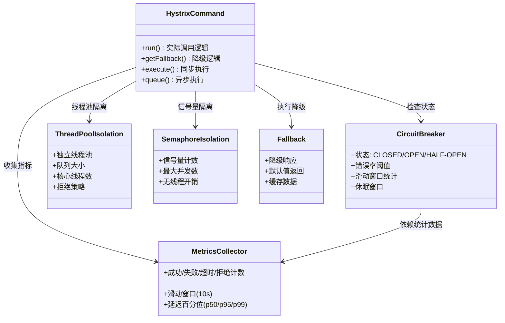
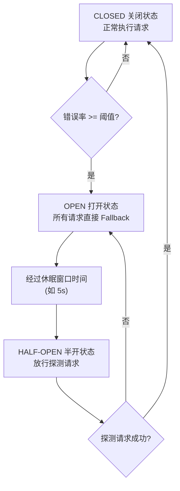
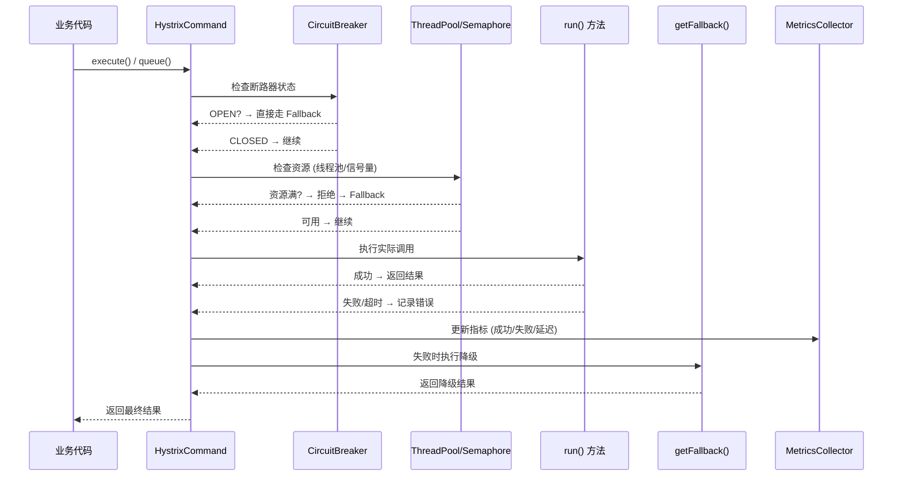

## 引言

一个下游服务超时，拖垮整个系统？熔断器来救场。

在分布式系统中，服务间的依赖链就像多米诺骨牌——一个服务响应变慢或宕机，调用方的线程被阻塞，资源耗尽，进而影响调用方的调用方，最终整个系统雪崩。Hystrix 通过断路器模式、隔离策略和降级机制，为微服务构建了弹性防护层。

读完本文，你将掌握：
1. 断路器的三种状态转换——CLOSED → OPEN → HALF-OPEN 的完整生命周期
2. 线程池隔离 vs 信号量隔离的本质区别与选型依据
3. Hystrix 的 fallback 机制、指标收集与监控

> **💡 核心提示**：Netflix 官方已将 Hystrix 置于维护模式，Spring Cloud 官方推荐使用 Resilience4j 作为替代方案。但 Hystrix 作为断路器模式的经典实现，其核心思想和原理仍然非常重要，是面试中考察分布式容错的经典案例。

---

## Hystrix 核心概念与架构

### Hystrix 组件关系图



### 断路器状态机



### Hystrix 执行时序图



## 核心机制详解

### 1. 断路器模式 (Circuit Breaker Pattern)

断路器模拟电路中的断路器，防止故障蔓延：

* **CLOSED（关闭）**：正常状态。所有请求通过，Hystrix 持续统计错误率。当滑动时间窗口内错误率达到阈值（默认 50%），断路器打开。
* **OPEN（打开）**：所有请求立即失败，直接走 Fallback。不再真正调用下游依赖。经过休眠窗口（默认 5s）后进入 HALF-OPEN。
* **HALF-OPEN（半开）**：允许少量请求（默认 1 个）通过进行探测。成功则回到 CLOSED，失败则重新 OPEN。

> **💡 核心提示**：断路器不是简单的"失败就打开"，而是基于滑动窗口的统计。默认滑动窗口为 10 秒，需要至少 20 个请求（`requestVolumeThreshold`）才会计算错误率。这避免了少量请求的偶然失败导致误触发。

### 2. 隔离策略 (Isolation Strategies)

#### 线程池隔离 (Thread Pool Isolation)

* **原理**：为每个依赖维护独立线程池，调用在专门线程池中执行。
* **优点**：彻底隔离，一个依赖的延迟或死锁不影响其他依赖；支持异步调用。
* **缺点**：线程创建和切换开销；需要合理配置线程池大小。
* **适用场景**：大部分远程调用，特别是网络调用。

#### 信号量隔离 (Semaphore Isolation)

* **原理**：限制对某个依赖的并发请求数。调用线程直接执行，尝试获取信号量许可。
* **优点**：开销小（无线程创建和切换）。
* **缺点**：隔离不彻底；不支持超时；如果依赖阻塞，会阻塞调用线程。
* **适用场景**：非网络调用（如访问本地缓存），开销非常小的场景。

> **💡 核心提示**：**线程池隔离是 Hystrix 的默认和推荐策略**。虽然开销大，但提供了彻底的故障隔离。信号量隔离仅适用于延迟极低、不需要超时的场景。面试中，线程池 vs 信号量是 Hystrix 的核心考点。

### 3. 降级处理 (Fallback)

在依赖调用失败、断路器打开、资源不足、超时时，执行备用逻辑：

* 实现 `HystrixCommand` 的 `getFallback()` 方法。
* 或使用 `@HystrixCommand(fallbackMethod = "...")` 指定降级方法。
* **Fallback 必须轻量**——如果 Fallback 也失败，Hystrix 不会再次 Fallback（没有 "fallback for fallback"）。

## Spring Cloud 集成 Hystrix 的使用方式

### 添加依赖与启用

```xml
<dependency>
    <groupId>org.springframework.cloud</groupId>
    <artifactId>spring-cloud-starter-netflix-hystrix</artifactId>
</dependency>
```

```java
@SpringBootApplication
@EnableCircuitBreaker
public class MyMicroserviceApplication {
    public static void main(String[] args) {
        SpringApplication.run(MyMicroserviceApplication.class, args);
    }
}
```

### 使用 @HystrixCommand

```java
@Service
public class ConsumerService {

    public String callRemoteServiceFallback() {
        return "Fallback: Remote service is unavailable.";
    }

    @HystrixCommand(
        fallbackMethod = "callRemoteServiceFallback",
        commandKey = "remoteServiceCall",
        commandProperties = {
            @HystrixProperty(name = "execution.isolation.thread.timeoutInMilliseconds", value = "2000"),
            @HystrixProperty(name = "circuitBreaker.requestVolumeThreshold", value = "10"),
            @HystrixProperty(name = "circuitBreaker.errorThresholdPercentage", value = "50"),
            @HystrixProperty(name = "circuitBreaker.sleepWindowInMilliseconds", value = "5000")
        },
        threadPoolProperties = {
            @HystrixProperty(name = "coreSize", value = "10")
        }
    )
    public String callRemoteService() {
        // 调用远程服务
        return restTemplate.getForObject("http://remote-service/api", String.class);
    }
}
```

### 集成 Feign Client

```java
@FeignClient(name = "user-service", fallback = UserServiceFallback.class)
public interface UserServiceFeignClient {
    @GetMapping("/users/{userId}")
    User getUserById(@PathVariable("userId") Long userId);
}

@Component
public class UserServiceFallback implements UserServiceFeignClient {
    @Override
    public User getUserById(Long userId) {
        return new User(userId, "Fallback User");
    }
}
```

## Hystrix vs Resilience4j vs Sentinel 对比

| 维度 | Hystrix | Resilience4j | Sentinel |
| :--- | :--- | :--- | :--- |
| **维护状态** | 维护模式 (2018) | 活跃开发 | 活跃开发 |
| **隔离方式** | 线程池 (默认) / 信号量 | 信号量 (默认) | 信号量 |
| **模块设计** | 单体 | 模块化 (独立依赖) | 单体 |
| **响应式支持** | 差 | 好 (基于 CompletableFuture) | 好 |
| **监控面板** | Hystrix Dashboard | 需额外集成 (Micrometer) | Sentinel Dashboard |
| **限流** | 不支持 | 独立模块 | 核心功能 |
| **动态配置** | 不支持 | 不支持 | 支持 (实时生效) |
| **适用场景** | 遗留系统迁移 | Spring Cloud 新项目首选 | 阿里巴巴生态、高流量场景 |

## 生产环境避坑指南

1. **线程池过小导致请求拒绝**：默认线程池大小为 10。如果下游服务响应慢，线程池很快被占满，新请求直接触发 Fallback。解决：根据 QPS 和平均响应时间计算 `coreSize`（Little's Law: `coreSize = QPS * p99 Latency`）。
2. **Fallback 方法也抛出异常**：Hystrix 没有 "fallback for fallback" 机制。如果 Fallback 方法自身抛出异常，调用方会收到原始异常。解决：确保 Fallback 逻辑绝对可靠，避免依赖其他远程服务。
3. **Hystrix 超时短于服务实际响应时间**：如果 Hystrix timeout 设为 2s 但下游服务实际需要 3s，所有请求都会被 Hystrix 超时打断。解决：Hystrix timeout 应略大于下游服务的 p99 响应时间。
4. **未监控断路器状态**：断路器打开后所有请求都走 Fallback，如果不监控，可能长时间处于降级状态而不自知。解决：集成 Hystrix Dashboard 或 Prometheus + Grafana。
5. **Command Key 冲突**：不同方法使用相同 `commandKey` 会导致指标统计和配置互相干扰。解决：为每个远程调用设置唯一的 `commandKey`。
6. **Hystrix Dashboard 单点故障**：Hystrix Dashboard 通常是独立部署的，如果宕机则无法监控。解决：使用 Turbine 聚合多实例指标，或迁移到 Prometheus。

## 总结

### 核心对比

| 策略 | 线程池隔离 | 信号量隔离 |
| :--- | :--- | :--- |
| **隔离级别** | 进程级（独立线程） | 线程级（同一线程） |
| **开销** | 高（线程创建/切换） | 低（仅计数） |
| **超时支持** | 支持 | 不支持 |
| **异步支持** | 支持 | 不支持 |
| **推荐场景** | 远程调用、网络请求 | 本地缓存、低延迟操作 |
| **推荐指数** | ⭐⭐⭐⭐⭐ | ⭐⭐ |

### 行动清单

1. **新项目考虑 Resilience4j 替代 Hystrix**：Hystrix 已进入维护模式，Resilience4j 是官方推荐的轻量级替代品。
2. **合理设置线程池大小**：根据 QPS 和 p99 延迟使用 Little's Law 计算，避免过小导致拒绝、过大导致资源浪费。
3. **确保 Fallback 轻量可靠**：Fallback 方法不应依赖其他远程服务，避免级联失败。
4. **Hystrix 超时 > 下游服务 p99 响应时间**：避免正常请求被误超时。
5. **部署监控面板**：集成 Hystrix Dashboard 或 Prometheus，实时监控断路器状态和指标。
6. **为每个远程调用设置唯一 Command Key**：避免配置和指标统计互相干扰。
7. **理解断路器参数含义**：`requestVolumeThreshold`（最小请求数）、`errorThresholdPercentage`（错误率阈值）、`sleepWindowInMilliseconds`（休眠窗口）都需要根据实际场景调优。
