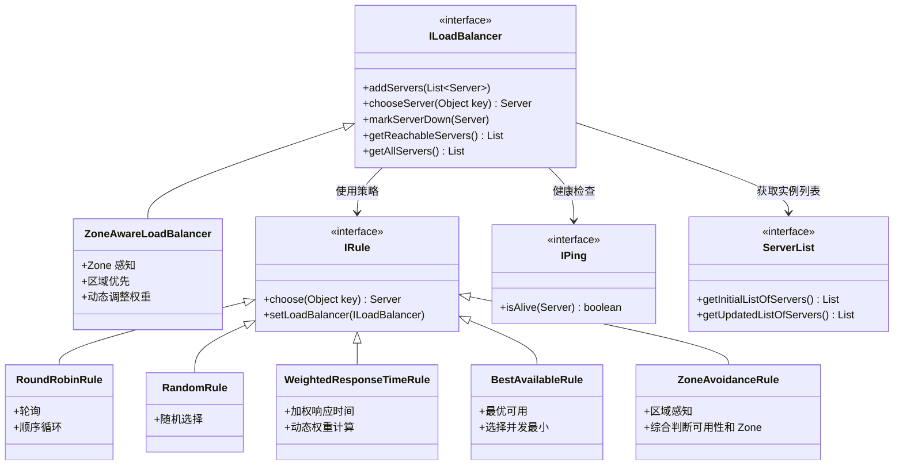
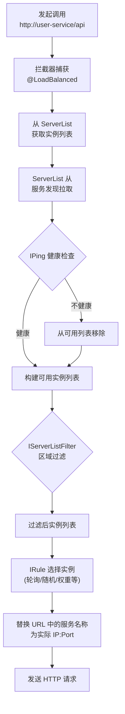

## 引言

同一个服务有 5 个实例，请求到底发到哪个？

微服务通过服务发现拿到实例列表后，如何在多个实例之间合理分配请求？客户端负载均衡（Client-Side Load Balancing）是微服务架构中不可或缺的机制。Netflix Ribbon 是 Spring Cloud 生态中早期最广泛使用的客户端负载均衡器——虽然它已进入维护模式，但其核心设计思想和负载均衡策略仍然是理解微服务通信的基础。

读完本文，你将掌握：
1. Ribbon 的核心架构——`ILoadBalancer`、`IRule`、`IPing`、`ServerList` 各司其职
2. 六种负载均衡策略的适用场景与取舍
3. 客户端负载均衡与服务端负载均衡（Nginx）的本质区别

无论你是配置负载均衡策略、排查实例选择问题，还是应对面试中的负载均衡原理考察，这篇文章都能提供清晰的指引。

---

## Ribbon 核心概念与架构

### Ribbon 组件类图



### 核心接口解析

#### ILoadBalancer（负载均衡器）

`ILoadBalancer` 是 Ribbon 的核心接口，定义了负载均衡器的基本功能：

* `addServers()`：添加服务实例。
* `chooseServer()`：根据策略选择一个服务实例。
* `markServerDown()`：标记实例为不可用。
* `getReachableServers()` / `getAllServers()`：获取可用/全部实例列表。

`ZoneAwareLoadBalancer` 是最常用的实现，它综合了区域感知和负载均衡策略。

#### IRule（负载均衡规则）

Ribbon 内置六种开箱即用的策略：

| 规则 | 策略 | 适用场景 | 注意事项 |
| :--- | :--- | :--- | :--- |
| **RoundRobinRule** | 轮询 | 实例性能相近，均匀分配 | 默认规则，简单可靠 |
| **RandomRule** | 随机 | 实例性能相近，简单分配 | 不考虑权重，可能导致不均 |
| **WeightedResponseTimeRule** | 加权响应时间 | 实例性能差异大 | 响应越短权重越高，需积累数据 |
| **BestAvailableRule** | 最优可用 | 连接数敏感场景 | 选择并发请求数最小的实例 |
| **ZoneAvoidanceRule** | 区域感知 | 多 Zone 部署 | 默认使用，综合可用性和 Zone |
| **RetryRule** | 重试 | 高可用要求场景 | 先按规则选，失败则重试 |

> **💡 核心提示**：`ZoneAvoidanceRule` 是 `ZoneAwareLoadBalancer` 的默认规则。它综合判断实例的可用性和所属区域，优先选择同区域内可用性高的实例，在多 Zone 部署场景下最为实用。

#### IPing（健康检查）

`IPing` 用于周期性检查实例是否存活：

* `PingUrl`：通过访问某个 URL 判断健康状态。
* `NoOpPing`：不做检查，假设所有实例都健康。
* 负载均衡器使用 Ping 结果维护"可用服务器列表"，只有健康实例才参与负载均衡。

#### ServerList（服务列表）

在 Spring Cloud 环境下，`ServerList` 通常由 `DiscoveryClient`（如 Eureka Client）提供，负责从服务注册中心获取实例列表并定期刷新。

## Ribbon 负载均衡决策流程



## Ribbon 工作流程

1. **获取服务列表**：`ServerList` 从服务发现组件拉取实例列表，并定期刷新。
2. **过滤服务列表**：`IServerListFilter` 过滤不符合条件的实例（如不同 Zone）。
3. **健康检查**：`IPing` 周期性检查实例健康状态，维护可用列表。
4. **选择实例**：`ILoadBalancer` 调用 `IRule` 从可用列表中选择一个实例。
5. **发送请求**：将 URL 中的服务名称替换为实际 IP:Port，发送 HTTP 请求。

### Ribbon 如何集成 HTTP 客户端

* **@LoadBalanced RestTemplate/WebClient**：Spring Cloud 为这些客户端添加拦截器。以服务名称作为 Host 调用时，拦截器利用 Ribbon 选择实例并替换 URL。
* **Feign Client**：当 Feign Client 使用服务名称调用时，自动委托 Ribbon 进行负载均衡。

> **💡 核心提示**：Ribbon 是**客户端负载均衡**，与 Nginx 等服务端负载均衡的本质区别在于：客户端 LB 知道所有实例，可以做更智能的路由（如基于 Zone、响应时间）；服务端 LB 对客户端透明，但需要额外部署和维护。

## Spring Cloud 集成 Ribbon 的使用方式

```xml
<dependency>
    <groupId>org.springframework.cloud</groupId>
    <artifactId>spring-cloud-starter-netflix-ribbon</artifactId>
</dependency>
```

使用 `@LoadBalanced` RestTemplate：

```java
@Configuration
public class RestClientConfig {
    @Bean
    @LoadBalanced
    public RestTemplate restTemplate() {
        return new RestTemplate();
    }
}

@Service
public class ConsumerService {
    @Autowired
    private RestTemplate restTemplate;

    public String callUserService() {
        // Ribbon 自动选择 user-service 的实例
        return restTemplate.getForObject("http://user-service/api/users", String.class);
    }
}
```

通过配置文件定制负载均衡策略：

```yaml
user-service:
  ribbon:
    NFLoadBalancerRuleClassName: com.netflix.loadbalancer.WeightedResponseTimeRule
    ConnectTimeout: 5000
    ReadTimeout: 10000
    OkToRetryOnAllOperations: true
    MaxAutoRetriesNextServer: 2
    MaxAutoRetries: 1
```

> **💡 核心提示**：Spring Cloud 2020+ 已移除 Ribbon，改用 Spring Cloud LoadBalancer。新项目应直接使用 LoadBalancer。Ribbon 仅用于维护现有系统。

## 客户端 vs 服务端负载均衡对比

| 维度 | 客户端负载均衡 (Ribbon) | 服务端负载均衡 (Nginx) |
| :--- | :--- | :--- |
| **部署** | 嵌入客户端，无需额外组件 | 需要独立部署 Nginx 服务器 |
| **智能程度** | 知道所有实例，可做智能路由 | 对客户端透明 |
| **服务发现集成** | 天然集成 Eureka/Consul | 需额外配置或第三方模块 |
| **升级维护** | 分散在每个客户端 | 集中管理 |
| **性能开销** | 客户端承担 LB 逻辑 | Nginx 承担，客户端无开销 |
| **监控** | 分散 | 集中 |
| **适用场景** | 微服务内部调用 | 外部流量入口 |

## 生产环境避坑指南

1. **扩缩容后实例列表未刷新**：Ribbon 定期从服务发现拉取列表。新实例上线后，客户端可能需要等待刷新周期才能发现。解决：关注 `ServerListRefreshInterval`，生产环境建议设为 10-15 秒。
2. **Zone 亲和导致分配不均**：`ZonePreferenceServerListFilter` 优先选择同 Zone 实例，可能导致某些 Zone 负载过重。解决：确认 Zone 配置正确，必要时使用跨 Zone 策略。
3. **RandomRule 不尊重权重**：`RandomRule` 随机选择，不考虑实例性能差异或权重配置。解决：使用 `WeightedResponseTimeRule` 或 `ZoneAvoidanceRule`。
4. **健康检查间隔过长**：默认的 `IPing` 间隔可能导致已宕机的实例仍被选中。解决：根据业务容忍度调整 Ping 间隔，或依赖服务发现的健康检查。
5. **Ribbon 缓存未刷新**：客户端可能缓存了旧的实例列表。解决：结合 `@LoadBalanced` 的服务端刷新机制，或在扩容/缩容后手动触发刷新。
6. **超时配置不匹配**：Ribbon 的 `ReadTimeout` 需要与下游服务的实际响应时间匹配。设置过短导致大量超时，设置过长影响故障响应速度。

## 总结

### 核心对比

| 策略 | 算法 | 适合场景 | 推荐度 |
| :--- | :--- | :--- | :--- |
| RoundRobinRule | 顺序轮询 | 实例性能相近 | ⭐⭐⭐⭐ |
| RandomRule | 随机 | 简单分配，不要求均匀 | ⭐⭐ |
| WeightedResponseTimeRule | 按响应时间加权 | 实例性能差异大 | ⭐⭐⭐⭐⭐ |
| BestAvailableRule | 选并发最小 | 连接数敏感 | ⭐⭐⭐ |
| ZoneAvoidanceRule | 区域感知 + 可用性 | 多 Zone 部署 | ⭐⭐⭐⭐⭐ |
| RetryRule | 失败重试 | 高可用要求 | ⭐⭐⭐ |

### 行动清单

1. **新项目使用 Spring Cloud LoadBalancer**：Ribbon 已进入维护模式，官方推荐 LoadBalancer 作为替代品。
2. **选择合适的 IRule 策略**：多 Zone 部署优先选 `ZoneAvoidanceRule`，实例性能差异大选 `WeightedResponseTimeRule`。
3. **合理配置超时参数**：`ConnectTimeout` 和 `ReadTimeout` 需根据下游服务实际响应时间调整。
4. **关注实例列表刷新频率**：确保扩缩容后客户端能及时感知变化。
5. **结合健康检查机制**：确保不健康的实例及时从可用列表中移除。
6. **理解客户端 vs 服务端 LB 的适用场景**：微服务内部用客户端 LB（Ribbon/LoadBalancer），外部流量入口用服务端 LB（Nginx/Gateway）。
7. **监控负载均衡效果**：通过 Actuator 或自定义指标监控各实例的请求分布，确保负载均衡策略生效。
