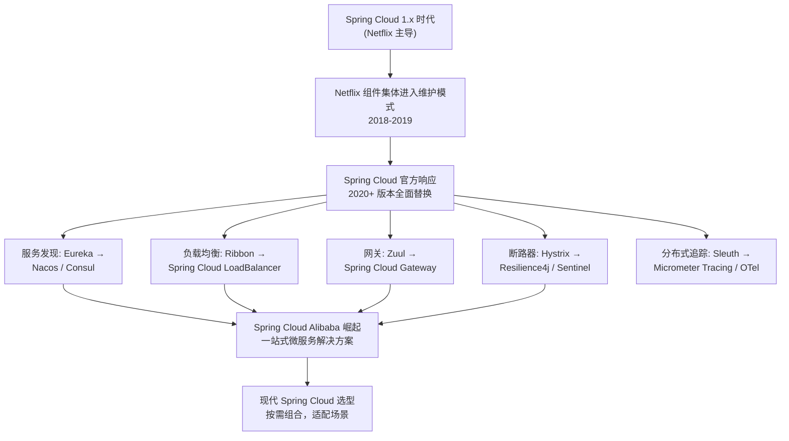
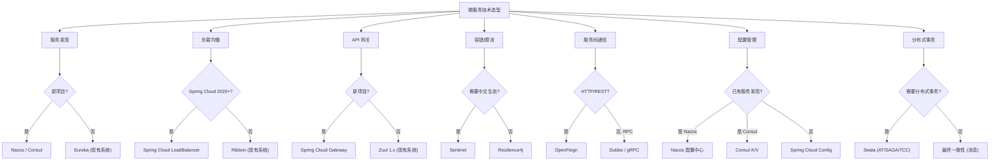

## 引言

Spring Cloud 组件大换血：Netflix 退役，Alibaba 崛起，你选对了吗？

从 Eureka 到 Nacos，从 Hystrix 到 Resilience4j，从 Ribbon 到 Spring Cloud LoadBalancer，从 Zuul 到 Gateway——Spring Cloud 生态在过去几年经历了组件级别的全面更替。Netflix 组件集体进入维护模式，Spring Cloud Alibaba 凭借一站式解决方案快速崛起。面对如此多的技术选型，如何在特定场景下做出最合适的选择？

读完本文，你将掌握：
1. Spring Cloud 技术演进的全景图——从 Netflix 时代到现代微服务架构
2. 核心领域的组件对比与选型决策树（服务发现/负载均衡/网关/容错/通信/配置）
3. Spring Cloud Alibaba 的完整组件体系及其与原生 Spring Cloud 的对比

无论你是为新项目选型、规划迁移路线，还是应对面试中的架构选型考察，这篇文章都能帮你做出明智决策。

---

## Spring Cloud 技术演进全景

### 技术演进流程图



### Spring Cloud 生态演进架构图

```mermaid
classDiagram
    class NetflixEra["Netflix 时代 (2015-2018)\n维护模式"] {
        Eureka (服务发现)
        Ribbon (负载均衡)
        Hystrix (断路器)
        Zuul (网关)
        Feign (HTTP 客户端)
    }
    class ModernSpringCloud["现代 Spring Cloud (2020+)\n积极开发"] {
        Spring Cloud LoadBalancer
        Spring Cloud Gateway
        Resilience4j
        OpenFeign
        Micrometer Tracing
    }
    class SpringCloudAlibaba["Spring Cloud Alibaba\n积极开发"] {
        Nacos (服务发现+配置)
        Sentinel (容错+限流)
        Seata (分布式事务)
        RocketMQ (消息)
    }

    NetflixEra -.替代.-> ModernSpringCloud
    ModernSpringCloud --> OpenFeign : 保留增强
    SpringCloudAlibaba -.竞争/互补.-> ModernSpringCloud
```

## 核心技术领域选型决策树

### 技术选型决策树



## 核心领域选型深度解析

### 1. 服务注册与发现选型

| 组件 | CAP | 健康检查 | 元数据 | 多数据中心 | 维护状态 |
| :--- | :--- | :--- | :--- | :--- | :--- |
| **Eureka** | AP | 心跳 | 支持 | 不支持 | 维护模式 |
| **Consul** | CP (可配 AP) | TCP/HTTP/Script | 支持 (K/V) | 原生支持 | 活跃 |
| **Nacos** | AP(发现)/CP(配置) | TCP/HTTP/MySQL | 支持 | 支持 (命名空间) | 活跃 |
| **Zookeeper** | CP | Session | 有限 | 不支持 | 活跃 |
| **K8s Native** | - | Readiness/Liveness | Annotations | - | 活跃 |

**选型建议**：
* 新项目：优先考虑 **Nacos**（功能丰富、中文友好、一站式服务发现+配置）或 **Consul**（多 DC、K/V 存储）。
* 完全基于 K8s：考虑 **Kubernetes Native**（利用 Service + DNS）。
* 现有系统：如果 Eureka 运行稳定，可继续维护。

### 2. 客户端负载均衡选型

| 组件 | 编程模型 | 响应式支持 | 内置策略 | 维护状态 |
| :--- | :--- | :--- | :--- | :--- |
| **Ribbon** | 阻塞式 | 无 | 轮询/随机/权重等 | 维护模式 |
| **Spring Cloud LoadBalancer** | 阻塞+响应式 | 支持 | 轮询/随机/同区域优先 | 活跃 |

**选型建议**：
* 新项目：**强烈推荐使用 Spring Cloud LoadBalancer**。
* 现有系统：Ribbon 运行稳定可维护，迁移时 LoadBalancer 是首选。

### 3. API 网关选型

| 组件 | 架构模型 | 性能 | Spring 集成 | 维护状态 |
| :--- | :--- | :--- | :--- | :--- |
| **Zuul 1.x** | Servlet 阻塞式 | 中 (线程受限) | 原生 (Ribbon/Hystrix) | 维护模式 |
| **Spring Cloud Gateway** | WebFlux 响应式 | 高 (非阻塞) | 原生 (LoadBalancer/Resilience4j) | 活跃 |
| **Kong** | OpenResty 异步 | 极高 | 无 (需插件) | 活跃 |

**选型建议**：
* 新项目：**强烈推荐使用 Spring Cloud Gateway**。
* Spring Cloud 生态内：Gateway 是官方推荐的未来方向。
* 多语言场景：考虑 Kong 或 Envoy-based 方案。

### 4. 容错与限流选型

| 组件 | 隔离方式 | 响应式 | 限流 | 动态配置 | 监控面板 |
| :--- | :--- | :--- | :--- | :--- | :--- |
| **Hystrix** | 线程池(默认) | 差 | 不支持 | 不支持 | Hystrix Dashboard |
| **Resilience4j** | 信号量(默认) | 好 | 独立模块 | 不支持 | 需额外集成 |
| **Sentinel** | 信号量 | 好 | 核心功能 | 支持(实时) | Sentinel Dashboard |

**选型建议**：
* Spring Cloud 新项目：优先 **Resilience4j**（轻量、模块化、响应式友好）。
* 需要中文生态/高流量场景：**Sentinel**（实时动态配置、强大的限流能力、Dashboard 开箱即用）。
* 遗留系统：Hystrix 运行稳定可维护，迁移时 Resilience4j 是首选。

### 5. 服务间通信选型

| 组件 | 模型 | 阻塞 | Spring 集成 | 适用场景 |
| :--- | :--- | :--- | :--- | :--- |
| **OpenFeign** | 声明式 | 同步阻塞 | 原生 (LB/CB) | 微服务同步 HTTP 调用 |
| **WebClient** | 编程式 | 异步非阻塞 | 需 LoadBalancer | 响应式服务调用 |
| **RestTemplate** | 编程式 | 同步阻塞 | @LoadBalanced | 遗留系统 (维护模式) |
| **Dubbo** | RPC | 同步/异步 | 需 Dubbo Spring Cloud | 高性能内部调用 |

**选型建议**：
* 微服务同步 HTTP 调用：**OpenFeign**（声明式、与 Spring Cloud 集成最紧密）。
* 响应式场景：**WebClient**。
* 高性能内部调用且不强求 REST：**Dubbo** 或 gRPC（需权衡引入另一套服务治理体系的复杂度）。

### 6. 配置管理选型

| 组件 | 存储后端 | 热更新 | 与发现集成 | 适合场景 |
| :--- | :--- | :--- | :--- | :--- |
| **Spring Cloud Config** | Git/DB/文件系统 | 需 Bus 触发 | 独立 | 已有 Git 基础设施 |
| **Nacos** | 内置存储 | 原生支持 | 与发现集成 | 一站式方案 |
| **Consul** | K/V Store | Watch 机制 | 与发现集成 | Consul 生态 |

## Spring Cloud Netflix vs Spring Cloud Alibaba vs 原生 Spring Cloud 对比

| 维度 | Spring Cloud Netflix | Spring Cloud Alibaba | 原生 Spring Cloud |
| :--- | :--- | :--- | :--- |
| **服务发现** | Eureka (维护) | Nacos | 无独立组件 (依赖第三方) |
| **负载均衡** | Ribbon (维护) | Nacos 内置 | Spring Cloud LoadBalancer |
| **网关** | Zuul 1.x (维护) | 无独立 (配合 Gateway) | Spring Cloud Gateway |
| **断路器** | Hystrix (维护) | Sentinel | Resilience4j |
| **配置中心** | Config Server | Nacos | Spring Cloud Config |
| **分布式事务** | 无 | Seata | 无独立组件 |
| **限流** | 无 | Sentinel (核心功能) | Resilience4j (独立模块) |
| **消息** | Spring Cloud Stream | RocketMQ | Spring Cloud Stream |
| **中文文档** | 英文为主 | 中文友好 | 英文为主 |
| **社区活跃度** | 维护模式 | 活跃 | 活跃 |
| **适合场景** | 遗留系统维护 | 中国生态、一站式 | 国际化项目、灵活组合 |

> **💡 核心提示**：Spring Cloud Alibaba 不是 Spring Cloud 的"替代品"，而是"增强版"。它提供了 Spring Cloud 原生方案中没有的组件（如 Sentinel 限流、Seata 分布式事务），同时与原生组件（如 Gateway、OpenFeign）可以无缝共存。选型时应按需组合，不必非此即彼。

## 生产环境避坑指南

1. **Spring Cloud 与 Spring Boot 版本不兼容**：Spring Cloud 版本必须与 Spring Boot 版本严格对应。使用 `spring-cloud-dependencies` BOM 管理版本，切勿手动指定各组件版本号。参考 Spring Cloud 官方 Release Train 版本对应表。
2. **混用不兼容的组件版本**：同时引入 Spring Cloud Netflix（维护模式）和 Spring Cloud Alibaba 组件时，版本冲突很常见。解决：使用统一的 BOM，或确认各组件之间的兼容性。
3. **Eureka 自我保护模式未理解**：生产环境中 Eureka 进入自我保护后，注册表中可能包含已下线的实例。解决：理解其 AP 特性，配合 Ribbon/LoadBalancer 的健康检查和断路器使用。
4. **Sentinel Dashboard 单点故障**：Sentinel 的规则推送到 Dashboard 后，如果 Dashboard 宕机，新启动的应用实例将无法获取规则。解决：配置规则持久化到 Nacos 或文件系统。
5. **Seata AT 模式性能开销**：Seata AT 模式需要全局锁和 undo_log 表，高并发场景下性能开销显著。解决：根据业务场景选择合适模式（AT 适合大多数场景，TCC 适合高性能要求）。
6. **Nacos 配置未热生效**：Nacos 配置更新后，客户端需要配置 `@RefreshScope` 或使用 `spring.cloud.nacos.config.refresh.enabled=true` 才能热更新。解决：确认配置刷新机制是否正确启用。

## 总结

### 核心对比

| 领域 | 经典方案 (维护中) | 推荐方案 | 关键差异 |
| :--- | :--- | :--- | :--- |
| 服务发现 | Eureka | Nacos / Consul | 功能丰富度、社区活跃度 |
| 负载均衡 | Ribbon | Spring Cloud LoadBalancer | 响应式支持、官方维护 |
| 网关 | Zuul 1.x | Spring Cloud Gateway | 阻塞 vs 响应式、性能 |
| 断路器 | Hystrix | Resilience4j / Sentinel | 线程池 vs 信号量、限流能力 |
| 配置中心 | Config Server | Nacos | 是否集成服务发现 |
| 分布式事务 | 无 | Seata | AT/TCC/SAGA 多种模式 |

### 行动清单

1. **使用 BOM 管理版本**：在 `pom.xml` 中引入 `spring-cloud-dependencies` BOM，确保所有 Spring Cloud 组件版本兼容。
2. **新项目优先选用积极维护的组件**：Gateway 替代 Zuul，LoadBalancer 替代 Ribbon，Resilience4j 替代 Hystrix。
3. **理解 CAP 取舍**：根据业务容忍度选择 AP（Eureka/Nacos AP）或 CP（Consul/Nacos CP）的服务发现方案。
4. **评估 Spring Cloud Alibaba**：如果团队需要中文文档、一站式解决方案或强大的限流/事务能力，Nacos + Sentinel + Seata 组合值得重点评估。
5. **渐进式引入组件**：从核心组件（服务发现、网关、负载均衡）开始，逐步引入断路器、配置中心、分布式追踪等。
6. **为配置中心做持久化**：Sentinel 规则、Nacos 配置等需持久化到外部存储，避免 Dashboard 单点故障。
7. **不要非此即彼**：Spring Cloud Alibaba 和原生 Spring Cloud 可以共存。例如 Gateway + Nacos + Resilience4j 是完全合理的组合。
8. **建立版本升级计划**：关注 Spring Cloud 官方 Release Train 时间表，定期评估维护模式组件的迁移计划。
