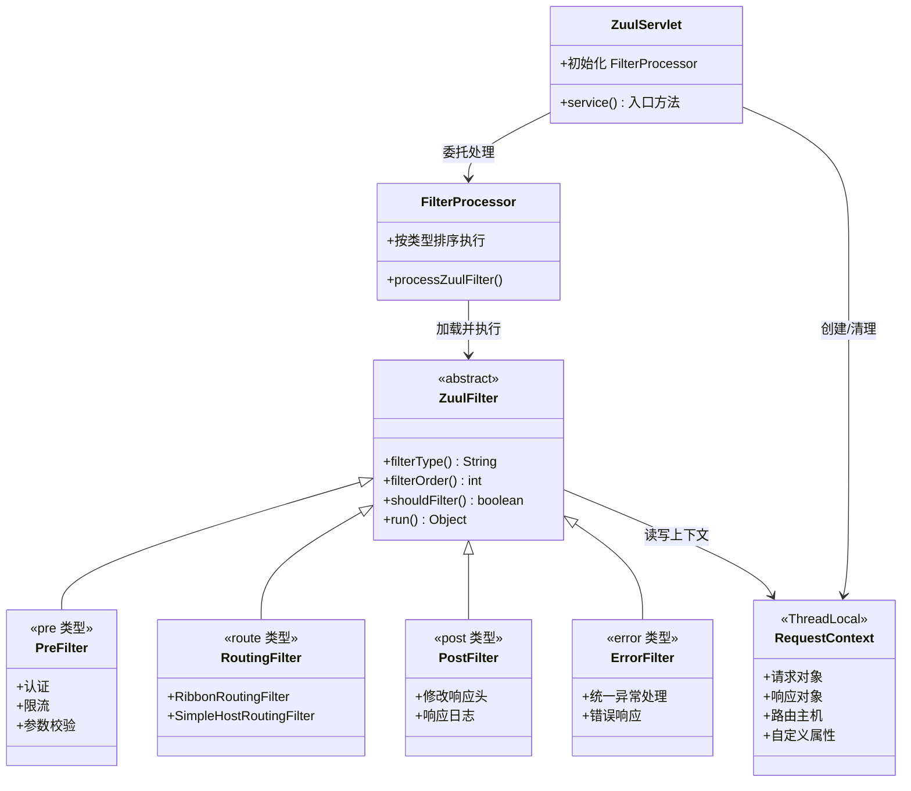

## 引言

微服务越来越多，网关选型 Zuul 还是 Gateway？

当微服务数量从 5 个增长到 50 个，统一入口、路由分发、认证授权、限流日志——这些横切关注点该在哪里处理？Netflix Zuul 1.x 是 Spring Cloud 生态中最早的 API 网关方案，基于 Servlet 的过滤器链实现了灵活的路由和处理逻辑。虽然它已进入维护模式，但其过滤器生命周期设计思想是理解所有 API 网关的基础。

读完本文，你将掌握：
1. Zuul 的核心——四种过滤器类型（pre/route/post/error）及其执行顺序
2. Zuul 1.x 阻塞式架构的本质：Thread-per-Request 模型为什么在高并发下有瓶颈
3. RequestContext 的 ThreadLocal 机制及内存泄漏风险

无论你是维护现有 Zuul 系统、理解网关设计模式，还是为 Gateway 迁移做准备，这篇文章都能帮你建立清晰认知。

---

## Zuul 架构设计与核心概念

### Zuul 组件关系图



### Zuul 请求处理流程图

```mermaid
flowchart TD
    A["客户端 HTTP 请求"] --> B["ZuulServlet 入口\nServlet 容器分配线程"]
    B --> C["创建 RequestContext\nThreadLocal"]
    C --> D["FilterProcessor 执行 Pre 过滤器"]
    D --> E{"Pre 过滤器全部通过?"}
    E -->|是| F["FilterProcessor 执行 Route 过滤器"]
    E -->|否 (异常/中断)| J["Error 过滤器"]
    F --> G{"Route 成功\n到达后端服务?"}
    G -->|是| H["FilterProcessor 执行 Post 过滤器"]
    G -->|否 (超时/失败)| J
    H --> I["返回响应给客户端"]
    J --> K["生成错误响应"]
    K --> I
    I --> L["清理 RequestContext"]
```

### 过滤器生命周期详解

Zuul 的核心在于**过滤器引擎**。一个请求在 Zuul 中顺序经过四个阶段的过滤器链：

#### 1. Pre 过滤器（路由前）

* **执行时机**：请求进入 Zuul 后，最先执行。
* **典型场景**：认证、授权、参数校验、日志记录、流量控制、添加请求头。
* **中断机制**：`RequestContext.setSendZuulResponse(false)` 可中断后续所有阶段，直接返回响应（常用于认证失败）。

#### 2. Route 过滤器（路由）

* **执行时机**：Pre 过滤器执行完毕后。
* **典型场景**：`RibbonRoutingFilter`（默认）结合 Ribbon 和服务发现将请求转发到服务实例；`SimpleHostRoutingFilter` 转发到固定 URL。
* **阻塞特性**：Route 过滤器会**阻塞等待**后端服务响应，这是 Zuul 1.x 性能瓶颈的根源。

#### 3. Post 过滤器（路由后）

* **执行时机**：Route 过滤器成功获取后端响应后。
* **典型场景**：修改响应头、处理响应体、记录响应日志、性能度量。

#### 4. Error 过滤器（异常处理）

* **执行时机**：Pre/Route/Post 任何阶段抛出异常时。
* **典型场景**：统一异常处理、返回错误响应、记录错误信息。

> **💡 核心提示**：`RequestContext` 是基于 ThreadLocal 的，在整个请求处理过程中跨过滤器共享数据。Pre 过滤器放入的认证信息，Route 和 Post 过滤器都能读取。但必须在请求结束时清理 RequestContext，否则可能导致 ThreadLocal 内存泄漏。

## Zuul 1.x 阻塞式架构的本质

Zuul 1.x 构建在传统 Servlet 之上，采用 **Thread-per-Request** 模型：

1. Servlet 容器（如 Tomcat）为每个请求分配一个线程。
2. 该线程执行 Pre → Route → Post 过滤器的全部逻辑。
3. **Route 过滤器调用后端服务时，线程被阻塞等待响应。**

**高并发问题**：大量请求导致 Servlet 容器线程池迅速耗尽，新请求无法被处理。这是 Zuul 1.x 被 Spring Cloud Gateway（响应式非阻塞）取代的根本原因。

> **💡 核心提示**：Zuul 2.x 基于 Netty 的异步模型解决了这个问题，但 Zuul 2.x 并未被 Spring Cloud 集成。Spring Cloud 选择了自研的 Spring Cloud Gateway 作为网关方案。

## Spring Cloud 集成 Zuul 的使用方式

### 添加依赖与启用

```xml
<dependency>
    <groupId>org.springframework.cloud</groupId>
    <artifactId>spring-cloud-starter-netflix-zuul</artifactId>
</dependency>
```

```java
@SpringBootApplication
@EnableZuulProxy
public class ZuulGatewayApplication {
    public static void main(String[] args) {
        SpringApplication.run(ZuulGatewayApplication.class, args);
    }
}
```

`@EnableZuulProxy` 会自动配置：
* 与 Ribbon 集成的路由（基于服务发现）。
* 与 Hystrix 集成的断路器（包装 Route 过滤器）。

### 路由配置

```yaml
server:
  port: 8080

zuul:
  routes:
    user-service:
      path: /user/**
      # /user/** → user-service 实例
    product-service:
      path: /product/**
  ignored-services: payment-service
  sensitive-headers: Cookie,Set-Cookie
```

### 自定义过滤器

```java
@Component
public class AuthPreFilter extends ZuulFilter {

    @Override
    public String filterType() {
        return "pre";
    }

    @Override
    public int filterOrder() {
        return 1;
    }

    @Override
    public boolean shouldFilter() {
        return true;
    }

    @Override
    public Object run() throws ZuulException {
        RequestContext context = RequestContext.getCurrentContext();
        HttpServletRequest request = context.getRequest();

        String token = request.getHeader("Authorization");
        if (token == null) {
            context.setSendZuulResponse(false);
            context.setResponseStatusCode(401);
            context.setResponseBody("Unauthorized");
            return null;
        }
        return null;
    }
}
```

## Zuul 1.x vs Zuul 2.x vs Spring Cloud Gateway 对比

| 维度 | Zuul 1.x | Zuul 2.x | Spring Cloud Gateway |
| :--- | :--- | :--- | :--- |
| **架构模型** | Servlet 阻塞式 | Netty 异步非阻塞 | WebFlux 响应式非阻塞 |
| **线程模型** | Thread-per-Request | 事件循环 | 事件循环 (Reactor) |
| **高并发性能** | 差（线程耗尽） | 好 | 好 |
| **过滤器类型** | pre/route/post/error | inbound/outbound/endpoint | GlobalFilter/GatewayFilter |
| **Spring 生态集成** | 紧密 (Ribbon/Hystrix/Eureka) | 无 (非 Spring Cloud 项目) | 紧密 (LoadBalancer/Resilience4j) |
| **维护状态** | 维护模式 | 维护模式 | 积极开发 |
| **WebSocket 支持** | 不支持 | 支持 | 支持 |
| **推荐场景** | 遗留系统维护 | 不推荐 | 新项目首选 |

## 生产环境避坑指南

1. **Zuul 1.x 线程池耗尽导致雪崩**：高并发下 Servlet 容器线程池被占满，网关完全不可用。解决：生产环境必须调整 `server.tomcat.max-threads`，或迁移到 Spring Cloud Gateway。
2. **RequestContext 未清理导致内存泄漏**：`RequestContext` 是 ThreadLocal，如果请求异常导致清理逻辑未执行，ThreadLocal 变量会持续占用内存。解决：确保 ZuulServlet 的 finally 块正确清理。
3. **遗漏 ZuulFilter 的 filterType/filterOrder**：未正确实现 `filterType()` 或 `filterOrder()` 会导致过滤器不执行或执行顺序混乱。解决：仔细定义每个过滤器的类型和顺序。
4. **大响应体缓冲导致 OOM**：Zuul 会缓冲整个响应体到内存。如果下游服务返回大文件，可能触发 OOM。解决：对大文件下载场景绕过 Zuul，直接路由到静态资源服务。
5. **超时配置不匹配**：Zuul 的 `host.connect-timeout` 和 `host.socket-timeout` 需要与 Ribbon/Hystrix 的超时参数协调。如果 Zuul 超时 > Hystrix 超时，Hystrix 先触发 Fallback 但 Zuul 线程仍在等待。解决：确保 Zuul 超时 >= Hystrix 超时。
6. **敏感头泄露**：`sensitive-headers` 默认包含 `Cookie`、`Set-Cookie`、`Authorization`。如果清空了敏感头列表，认证头可能被传递给下游服务，导致安全风险。解决：明确配置需要传递的头，而非清空敏感头列表。

## 总结

### 核心对比

| 过滤器类型 | 执行时机 | 典型用途 | 能否中断 |
| :--- | :--- | :--- | :--- |
| **Pre** | 路由前 | 认证、限流、参数校验 | ✅ (`setSendZuulResponse(false)`) |
| **Route** | Pre 之后 | 转发到后端服务 | ❌ (请求已发出) |
| **Post** | Route 成功后 | 修改响应头、日志 | ❌ |
| **Error** | 任何阶段异常 | 统一异常处理 | ❌ |

### 行动清单

1. **评估迁移到 Spring Cloud Gateway**：Zuul 1.x 已进入维护模式，新项目应直接使用 Gateway。
2. **为遗留 Zuul 系统调优线程池**：调整 `server.tomcat.max-threads`，设置合理的超时参数。
3. **正确实现 filterType 和 filterOrder**：确保过滤器按预期顺序执行。
4. **避免在 Zuul 中缓冲大响应体**：大文件场景考虑直接路由。
5. **协调超时参数**：确保 Zuul 超时 >= Ribbon 超时 >= Hystrix 超时。
6. **监控 Zuul 线程池和延迟**：通过 Actuator 端点监控网关性能指标。
7. **配置敏感头列表**：避免认证信息泄露给下游服务。
