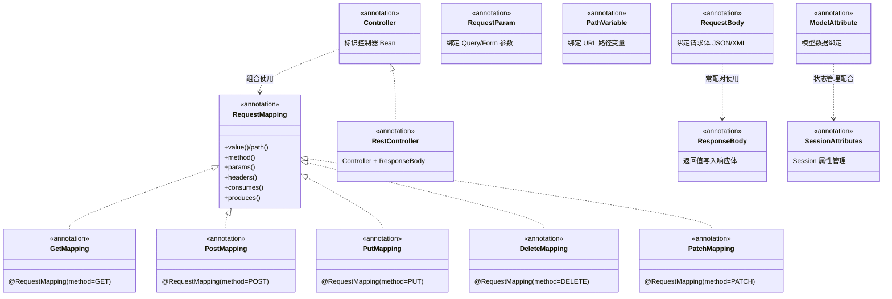

## 引言

@RequestMapping 的 7 种用法，你用错过几种？

你以为只是给方法加个注解就能处理请求？Spring MVC 的注解体系远比表面看起来的深——`@RequestBody` 背后是 `HttpMessageConverter` 链在工作，`@ModelAttribute` 的执行时机比你想象的早，`@SessionAttributes` 稍不注意就会引发 `HttpSessionRequiredException`。

读完本文你将掌握：
- **注解层次体系**：从 `@RequestMapping` 到参数绑定，再到响应处理，完整的注解图谱
- **底层处理机制**：HandlerMethodArgumentResolver 如何解析参数，HttpMessageConverter 如何序列化/反序列化
- **高频陷阱**：@RequestParam 的 required 陷阱、@RequestBody 与表单数据的冲突、@ModelAttribute 的"大规模赋值"安全风险
- **面试加分项**：能说清每个注解背后是哪个组件在干活

这是从"会用注解"到"理解注解原理"的关键一步。

## Spring MVC 注解体系全景图



Spring MVC 的注解可以分为五大类：

| 类别 | 核心注解 | 职责 |
| :--- | :--- | :--- |
| 控制器标识 | `@Controller`、`@RestController` | 声明 Bean 的角色 |
| 请求映射 | `@RequestMapping` 及其派生注解 | 定义 URL 到方法的映射 |
| 参数绑定 | `@RequestParam`、`@PathVariable`、`@RequestBody`、`@ModelAttribute` | 从请求中提取数据绑定到方法参数 |
| 响应处理 | `@ResponseBody`、`@ResponseStatus` | 控制返回值如何转化为响应 |
| 模型与会话 | `@ModelAttribute`（方法级）、`@SessionAttributes` | 管理模型数据和会话状态 |

## 请求参数绑定流程

```mermaid
flowchart TD
    Req[HTTP Request 到达] --> DS[DispatcherServlet]
    DS --> HM[HandlerMapping 查找 HandlerMethod]
    HM --> HA[HandlerAdapter 获取方法信息]
    HA --> Resolve{遍历 ArgumentResolver 链}

    Resolve -->|匹配 @RequestParam| RP[RequestParamMethodArgumentResolver]
    Resolve -->|匹配 @PathVariable| PV[PathVariableMethodArgumentResolver]
    Resolve -->|匹配 @RequestBody| RB[RequestResponseBodyMethodProcessor]
    Resolve -->|匹配 @ModelAttribute| MA[ModelAttributeMethodProcessor]
    Resolve -->|匹配 @RequestHeader| RH[RequestHeaderMethodArgumentResolver]
    Resolve -->|匹配 其他| Other[对应 Resolver]

    RP --> QP[从 Query/Form 参数取值并类型转换]
    PV --> UP[从 URL 路径变量取值并类型转换]
    RB --> JSON[HttpMessageConverter 反序列化 JSON/XML]
    MA --> WB[WebDataBinder 表单参数绑定到 POJO]
    RH --> HT[从 HTTP Header 取值]
    Other --> GP[通用解析]

    QP --> Invoke[反射调用 Controller 方法]
    UP --> Invoke
    JSON --> Invoke
    WB --> Invoke
    HT --> Invoke
    GP --> Invoke

    Invoke --> Ret[方法执行完毕]
    Ret --> CheckRet{返回值注解?}
    CheckRet -->|@ResponseBody| WR[RequestResponseBodyMethodProcessor 序列化写入响应]
    CheckRet -->|ModelAndView| VR[ViewResolver 解析 + View 渲染]
    CheckRet -->|String 视图名| VR
    CheckRet -->|ResponseEntity| HR[设置状态码+Header, 序列化 Body]
    CheckRet -->|void| NO[无操作, 方法已直接写响应]
```

## 控制器标识注解

### @Controller

**功能：** 标识一个类为 Spring MVC 控制器，Spring 容器将其注册为 Bean，`RequestMappingHandlerMapping` 会扫描其中的 `@RequestMapping` 注解。

```java
@Controller
@RequestMapping("/users")
public class UserController {
    @GetMapping("/list")
    public String listUsers(Model model) {
        return "userList"; // 返回逻辑视图名
    }
}
```

> **💡 核心提示**：`@Controller` 是一个 Spring Stereotype 注解（类似 `@Service`、`@Repository`）。它本身不处理请求，而是告诉 Spring "这个 Bean 里有需要被注册为 Handler 的方法"。

### @RestController

**功能：** 复合注解 = `@Controller` + `@ResponseBody`。所有方法的返回值直接作为响应体，不走视图解析。

```java
@RestController
@RequestMapping("/api/users")
public class UserRestController {
    @GetMapping("/{id}")
    public User getUser(@PathVariable Long id) {
        return new User(id, "Test"); // 自动序列化为 JSON
    }
}
```

> **💡 核心提示**：`@RestController` 的方法返回值由 `RequestResponseBodyMethodProcessor` 处理，通过 `HttpMessageConverter` 序列化后直接写入响应体，**跳过 ViewResolver**。

## 请求映射注解

### @RequestMapping

**功能：** 建立 Web 请求到处理器方法的映射。是 Spring MVC 最核心的请求映射注解。

**7 种常用用法：**

| 用法 | 示例 | 说明 |
| :--- | :--- | :--- |
| 基础路径 | `@RequestMapping("/users")` | 类级别，所有方法基于此路径 |
| HTTP 方法 | `@RequestMapping(value="/users", method=GET)` | 指定请求方法 |
| 路径变量 | `@RequestMapping("/users/{id}")` | URL 中嵌入参数 |
| 请求参数匹配 | `@RequestMapping(value="/users", params="action=list")` | 必须有指定参数 |
| Header 匹配 | `@RequestMapping(value="/users", headers="X-Custom=value")` | 必须有指定 Header |
| 消费类型 | `@RequestMapping(value="/users", consumes="application/json")` | 只接受 JSON 请求体 |
| 生产类型 | `@RequestMapping(value="/users", produces="application/json")` | 只返回 JSON 响应 |

```java
@Controller
@RequestMapping("/products")
public class ProductController {
    @RequestMapping(value = "/{id}", method = RequestMethod.GET, produces = "application/json")
    @ResponseBody
    public Product getProduct(@PathVariable Long id) { ... }

    @RequestMapping(value = "", method = RequestMethod.POST, consumes = "application/json")
    public ResponseEntity<Void> addProduct(@RequestBody Product product) { ... }
}
```

**背后原理：** `@RequestMapping` 由 `RequestMappingHandlerMapping` 在应用启动时扫描解析，构建 URL 到 `HandlerMethod` 的映射表。请求到达时，DispatcherServlet 通过这张表快速定位目标方法。

### @GetMapping / @PostMapping / @PutMapping / @DeleteMapping / @PatchMapping

这些是 `@RequestMapping(method = RequestMethod.XXX)` 的便捷缩写：

```java
@GetMapping("/{id}")    // = @RequestMapping(value="/{id}", method=GET)
@PostMapping("")        // = @RequestMapping(value="", method=POST)
@PutMapping("/{id}")    // = @RequestMapping(value="/{id}", method=PUT)
@DeleteMapping("/{id}") // = @RequestMapping(value="/{id}", method=DELETE)
@PatchMapping("/{id}")  // = @RequestMapping(value="/{id}", method=PATCH)
```

> **💡 核心提示**：这些派生注解本身也是通过元注解 `@RequestMapping` 标注的 HTTP 方法，`HandlerMapping` 识别它们的方式与识别 `@RequestMapping` 完全一致。**优先使用派生注解**，代码意图更清晰。

## 参数绑定注解

### @RequestParam

**功能：** 绑定 Query Parameter 或表单参数到方法参数。

```java
@GetMapping("/search")
public String search(
    @RequestParam("keyword") String keyword,
    @RequestParam(value = "page", defaultValue = "1") int page,
    @RequestParam(value = "size", required = false) Integer size
) { ... }
```

| 属性 | 默认值 | 说明 |
| :--- | :--- | :--- |
| `value` / `name` | 空（同参数名） | 请求参数名 |
| `required` | `true` | 是否必须提供 |
| `defaultValue` | 无 | 参数缺失时的默认值 |

> **💡 核心提示**：`@RequestParam` 的 `required` 默认为 `true`。如果参数是基本类型（如 `int`）且请求中未提供，会抛出 400 错误。**可选参数应使用包装类型（Integer）或设置 `defaultValue`**。

### @PathVariable

**功能：** 绑定 URI 模板变量（URL 路径中 `{}` 包围的部分）。

```java
@GetMapping("/users/{id}/orders/{orderId}")
public Order getOrder(@PathVariable Long id, @PathVariable String orderId) { ... }
```

> **💡 核心提示**：`@PathVariable` 支持正则约束，如 `@GetMapping("/users/{id:\\d+}")` 限制 id 必须是数字。但**注意路由冲突**——`/users/{id}` 和 `/users/profile` 可能产生歧义，需要更具体的路径优先。

### @RequestBody

**功能：** 将 HTTP 请求体内容绑定到方法参数，通常用于接收 JSON/XML 数据。

```java
@PostMapping("/users")
public ResponseEntity<Void> createUser(@RequestBody User user) {
    // RequestBody → HttpMessageConverter(Jackson) → User 对象
    return ResponseEntity.created(...).build();
}
```

**背后原理（深入）：**

1. `RequestResponseBodyMethodProcessor` 查找合适的 `HttpMessageConverter`
2. 根据 `Content-Type` Header 选择 Converter（如 `application/json` → `MappingJackson2HttpMessageConverter`）
3. Converter 调用 Jackson 将 JSON 反序列化为 Java 对象

> **💡 核心提示**：`@RequestBody` **每个方法只能有一个**，因为 HTTP 请求体只能被读取一次。如果需要同时接收请求体和 Query 参数，将请求体用 `@RequestBody`，Query 参数用 `@RequestParam`。

> **💡 核心提示**：`@RequestBody` **不能处理表单数据（application/x-www-form-urlencoded）**。表单数据应使用 `@RequestParam` 或 `@ModelAttribute`。如果前端用 FormData 提交，用 `@RequestBody` 会报错。

### @ModelAttribute（参数级别）

**功能：** 绑定请求参数到 POJO（命令对象）。Spring MVC 先创建对象，再将请求参数绑定到其属性。

```java
@PostMapping("/saveUser")
public String saveUser(@ModelAttribute User user) {
    // 表单参数: name=张三&age=25 → User 对象
    return "success";
}
```

**背后原理：** `ModelAttributeMethodProcessor` 先尝试从 Model 中获取同名对象，不存在则创建新对象，然后通过 `WebDataBinder` 将请求参数绑定到对象属性。

### @Valid / @Validated

**功能：** 触发对被标注参数的 Bean Validation 校验。

```java
@PostMapping("/users")
public ResponseEntity<Void> createUser(@Valid @RequestBody User user) { ... }
```

| 注解 | 来源 | 分组校验 |
| :--- | :--- | :--- |
| `@Valid` | JSR 303/380 标准 | 不支持 |
| `@Validated` | Spring 扩展 | 支持分组校验 |

> **💡 核心提示**：`@ModelAttribute` 绑定存在**大规模赋值（Mass Assignment）安全风险**。如果攻击者通过表单提交 `isAdmin=true`，而 User 对象有 `isAdmin` 属性，该值会被直接绑定。解决：使用 `@InitBinder` 限制允许绑定的字段。

### 其他参数注解

| 注解 | 数据来源 | 解析器 |
| :--- | :--- | :--- |
| `@RequestHeader` | HTTP 请求头 | `RequestHeaderMethodArgumentResolver` |
| `@CookieValue` | Cookie | `CookieValueMethodArgumentResolver` |
| `@SessionAttribute` | Session 属性 | `SessionAttributeMethodArgumentResolver` |
| `@RequestAttribute` | Request 属性 | `RequestAttributeMethodArgumentResolver` |

## 响应处理注解

### @ResponseBody

**功能：** 方法返回值直接写入 HTTP 响应体，不走视图解析。

```java
@GetMapping("/data")
@ResponseBody
public Map<String, Object> getData() {
    return Map.of("message", "Hello"); // 自动转为 JSON
}
```

**背后原理（深入）：** `RequestResponseBodyMethodProcessor` 处理 `@ResponseBody` 时：
1. 根据请求的 `Accept` Header 和方法的 `produces` 选择 `HttpMessageConverter`
2. Converter 将返回值序列化（如 Jackson 序列化为 JSON）
3. 序列化结果写入 `HttpServletResponse` 输出流
4. **跳过 ViewResolver 和 View 渲染**

> **💡 核心提示**：`HttpMessageConverter` 的**顺序很重要**。Spring 按注册顺序遍历 Converter 列表，找到第一个 `canWrite()` 返回 true 的 Converter 执行序列化。如果需要自定义 Converter 优先级，通过 `WebMvcConfigurer.configureMessageConverters()` 配置。

### @ResponseStatus

**功能：** 指定响应的 HTTP 状态码。可标注在方法上或异常类上。

```java
// 方法级别
@PostMapping("/items")
@ResponseStatus(HttpStatus.CREATED)
public Item createItem(@RequestBody Item item) { ... }

// 异常类级别
@ResponseStatus(value = HttpStatus.NOT_FOUND, reason = "User Not Found")
public class UserNotFoundException extends RuntimeException { ... }
```

## 模型与会话管理注解

### @ModelAttribute（方法级别）

**功能：** 方法在每个 `@RequestMapping` 方法执行之前执行，返回值自动添加到 Model。

```java
@Controller
@RequestMapping("/users")
public class UserController {
    @ModelAttribute("roles")
    public List<String> getRoles() {
        return List.of("ADMIN", "USER"); // 每个 /users/* 请求都会执行
    }

    @GetMapping("/new")
    public String showForm(Model model) {
        // Model 中已有 "roles" 属性
        return "userForm";
    }
}
```

> **💡 核心提示**：`@ModelAttribute` 方法**在每个 Handler 方法之前执行**，包括 `preHandle` 之后、Handler 方法之前。如果方法中有耗时操作（如查数据库），会影响所有请求的响应时间。

### @SessionAttributes

**功能：** 将 Model 中的指定属性存储到 HttpSession，跨请求共享。

```java
@Controller
@RequestMapping("/booking")
@SessionAttributes({"bookingForm", "step"})
public class BookingController {
    @GetMapping("/step1")
    public String setupStep1(Model model) {
        model.addAttribute("bookingForm", new BookingForm());
        model.addAttribute("step", 1);
        return "bookingStep1";
    }
}
```

> **💡 核心提示**：`@SessionAttributes` 在分布式环境下可能导致问题——Session 不共享时用户在不同节点看到不同数据。分布式场景优先考虑 Redis 缓存或 JWT 等方案。

## 生产环境避坑指南

| # | 陷阱 | 症状 | 解决方案 |
| :--- | :--- | :--- | :--- |
| 1 | `@RequestParam` 未设 `required=false` | 可选参数缺失时返回 400 | 明确标注 `required=false` 或使用包装类型 + `defaultValue` |
| 2 | `@PathVariable` 正则导致路由冲突 | `/users/profile` 被 `{id}` 匹配 | 使用 `@GetMapping("/users/{id:\\d+}")` 限制类型，或更具体的路径先声明 |
| 3 | `@RequestBody` 与表单数据混用 | `415 Unsupported Media Type` | 表单数据用 `@RequestParam` 或 `@ModelAttribute`，`@RequestBody` 仅用于 JSON/XML |
| 4 | `@ModelAttribute` 大规模赋值安全风险 | 攻击者通过表单提交篡改敏感字段 | 使用 `@InitBinder` 配置 `WebDataBinder.setAllowedFields()` 白名单 |
| 5 | `@SessionAttributes` 引发 `ConcurrentModificationException` | 并发请求修改同一 Session 属性 | 谨慎使用 Session 状态管理，分布式环境用 Redis 替代 |
| 6 | `@RequestBody` 方法中出现第二个 `@RequestBody` | 编译通过但运行时只能读取一次请求体 | 每个方法最多一个 `@RequestBody`，其他参数用 `@RequestParam` |
| 7 | `@ModelAttribute` 方法执行耗时操作 | 所有请求响应变慢 | `@ModelAttribute` 方法在每个 Handler 前执行，避免 DB 查询等耗时操作 |
| 8 | `HttpMessageConverter` 顺序不当 | JSON 转换器未生效，返回格式错误 | 通过 `WebMvcConfigurer` 显式配置 Converter 顺序，确保 Jackson 优先 |

## 对比速查表

| 对比项 | `@RequestParam` | `@PathVariable` | `@RequestBody` | `@ModelAttribute` |
| :--- | :--- | :--- | :--- | :--- |
| 数据来源 | Query / Form 参数 | URL 路径变量 | 请求体（JSON/XML） | 表单参数绑定到 POJO |
| Content-Type | 不限 | 不限 | `application/json` 等 | `application/x-www-form-urlencoded` |
| 每方法数量 | 多个 | 多个 | **最多一个** | 多个 |
| 类型转换 | 自动 | 自动 | HttpMessageConverter | WebDataBinder |
| 适用场景 | 分页、搜索参数 | RESTful 资源 ID | POST/PUT 请求体 | 表单提交 |

| 对比项 | `@GetMapping` | `@RequestMapping(method=GET)` |
| :--- | :--- | :--- |
| 功能 | 完全一致 | 完全一致 |
| 可读性 | 更高 | 较低 |
| 推荐度 | ⭐⭐⭐⭐⭐ | ⭐⭐⭐ |

| 对比项 | `@RestController` | `@Controller` + `@ResponseBody` |
| :--- | :--- | :--- |
| 功能 | 完全一致 | 完全一致 |
| 代码量 | 一个注解 | 两个注解（每个方法都要加） |
| 推荐度 | ⭐⭐⭐⭐⭐（REST API） | ⭐⭐（传统 MVC 页面） |

## 行动清单

1. **统一团队注解规范**：REST API 统一使用 `@RestController` + `@GetMapping`/`@PostMapping` 等派生注解。
2. **检查 `@RequestParam` 的 required 属性**：确认每个可选参数都标注了 `required=false` 或提供了 `defaultValue`。
3. **排查 `@PathVariable` 路由冲突**：检查是否有 `/users/{id}` 和 `/users/specific-path` 的歧义，使用正则约束。
4. **审计 `@ModelAttribute` 安全性**：对敏感对象（如 User、Account）使用 `@InitBinder` 限制允许绑定的字段。
5. **配置全局 `@ControllerAdvice`**：统一处理 `@ExceptionHandler`、参数校验异常、`HttpMessageConverter` 异常。
6. **审查 `HttpMessageConverter` 顺序**：确认 Jackson Converter 正确注册且优先级合理，避免返回格式异常。
7. **评估 `@SessionAttributes` 的必要性**：分布式部署场景下考虑用 Redis 或 Token 替代 Session 存储。

## 总结

Spring MVC 的注解体系是开发者与框架"对话"的语言——你用注解告诉框架如何处理请求，框架的各个组件"读懂"注解后执行相应操作。

从 `@Controller` 定义角色，到 `@RequestMapping` 映射请求，到 `@RequestParam`/`@PathVariable`/`@RequestBody` 绑定参数，再到 `@ResponseBody` 处理响应，每个注解背后都有对应的处理组件在工作。理解这种"注解 → 组件 → 行为"的映射关系，是写出健壮 Spring MVC 代码的基础。

**面试高频考点速查：**
- `@Controller` 和 `@RestController` 的区别
- `@RequestMapping` 的常用属性
- `@RequestParam` vs `@PathVariable` vs `@RequestBody` vs `@ModelAttribute` 的区别与适用场景
- `@RequestBody` 背后的 `HttpMessageConverter` 机制
- `@ModelAttribute` 方法级和参数级的区别
- `@Valid` 和 `@Validated` 的区别
