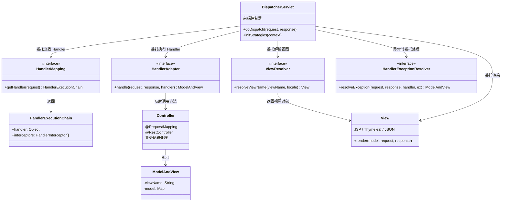
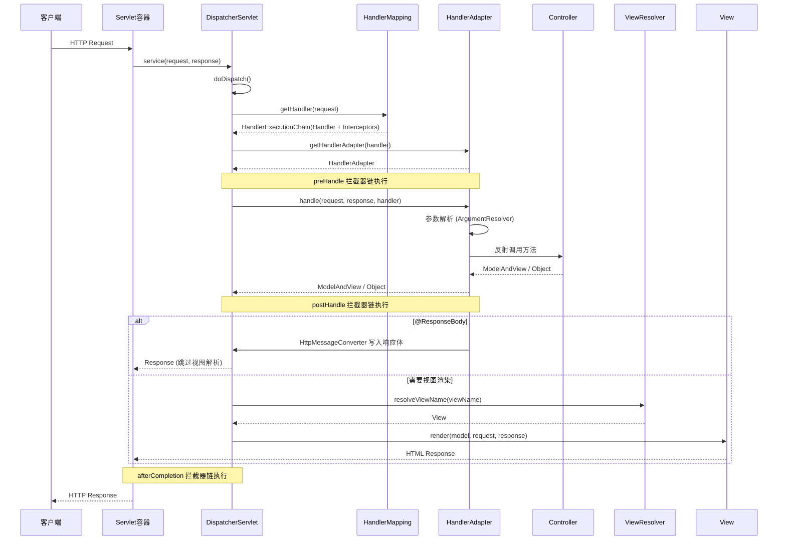

## 引言

一个 HTTP 请求到达 Spring MVC，内部经历了怎样的奇幻漂流？

你以为 `@RequestMapping` 写好了，请求就会自动找到对应方法？背后的故事远比你想象的精彩——`DispatcherServlet` 如何像交通枢纽一样调度请求？`HandlerMapping` 和 `HandlerAdapter` 这对黄金搭档如何协作？`ViewResolver` 的链式查找有什么讲究？

读完本文你将掌握：
- **Spring MVC 核心架构全景图**：不再只是知道几个组件名，而是理解它们如何协作
- **请求处理的完整链路**：从 HTTP 请求进入 Servlet 容器，到响应返回客户端，每一步发生了什么
- **高级定制能力**：知道如何在任意环节插入自定义逻辑

这是面试中区分"会写 Controller"和"理解 Web 框架"的关键分水岭。

## 核心组件概览

在深入请求流程之前，先认识 Spring MVC 架构中的核心"玩家"：

* **`DispatcherServlet`（前端控制器）：** 整个 Spring MVC 请求处理的中心。所有的请求首先由它接收，然后分发到后续组件。
* **`HandlerMapping`（处理器映射器）：** 根据请求信息（URL、HTTP Method 等）查找对应的处理器。
* **`HandlerAdapter`（处理器适配器）：** 执行找到的处理器。适配不同类型的 Handler 调用差异。
* **`HandlerExecutionChain`：** 包含 Handler 本身和一组 `HandlerInterceptor`，是 `HandlerMapping` 的返回结果。
* **`ViewResolver`（视图解析器）：** 将逻辑视图名解析为具体的视图对象。
* **`View`（视图）：** 渲染模型数据到客户端。
* **`ModelAndView`：** Handler 方法返回的容器对象，包含模型数据和逻辑视图名。
* **`HandlerExceptionResolver`（异常解析器）：** 统一处理请求过程中的异常。
* **`HandlerInterceptor`（拦截器）：** 在请求处理前后插入自定义逻辑。

## 请求处理核心流程

以下是请求在 Spring MVC 中流转的完整路径：

1. **请求到达 `DispatcherServlet`**：作为前端控制器，所有请求首先由它接收。
2. **查找 `HandlerMapping`**：委托给注册的 HandlerMapping 实例，找到能处理当前请求的 Handler 和 `HandlerExecutionChain`（包含 Handler + Interceptor 列表）。
3. **查找 `HandlerAdapter`**：根据 Handler 类型找到对应的适配器。
4. **执行 Handler（Controller 方法）**：
   - 先执行 Interceptor 的 `preHandle()`，返回 `false` 则中断。
   - 通过 `HandlerMethodArgumentResolver` 解析方法参数。
   - 反射调用 Controller 方法。
5. **处理返回值**：
   - `@ResponseBody` / `@RestController`：通过 `HttpMessageConverter` 直接写入响应体，**跳过视图解析**。
   - 其他返回值：进入视图解析流程。
6. **查找 `ViewResolver`**：根据逻辑视图名解析为具体 View 对象。
7. **视图渲染**：View 结合 Model 数据生成最终 HTML，写入响应流。
8. **后处理与异常处理**：
   - 成功时执行 `postHandle()`。
   - 无论成功或异常，最终执行 `afterCompletion()`。
   - 异常由 `HandlerExceptionResolver` 处理。

> **💡 核心提示**：`DispatcherServlet` 本身就是 `javax.servlet.http.HttpServlet` 的子类，继承了 `HttpServlet` 的 `service()` 方法。它在初始化时通过 `initStrategies()` 自动装配 Spring 容器中的各种组件。

> **💡 核心提示**：`HandlerAdapter` 是**适配器模式**的经典应用。因为 Handler 可以是不同类型（早期实现 `Controller` 接口、`@Controller` 方法、`HttpRequestHandler` 等），`HandlerAdapter` 统一了调用接口，让 DispatcherServlet 不必关心 Handler 的具体类型。

> **💡 核心提示**：当方法标注 `@ResponseBody` 或 Controller 标注 `@RestController` 时，返回值由 `RequestResponseBodyMethodProcessor` 处理，使用 `HttpMessageConverter` 序列化后直接写入响应体，**完全跳过 ViewResolver 和 View 渲染阶段**。这就是 REST API 和传统 MVC 的分水岭。

## 核心组件详解

### DispatcherServlet

**职责：** 前端控制器，所有请求的入口。负责初始化 Spring MVC 环境，协调整个请求处理流程。

**关键方法：**
- `doDispatch()`：请求处理的核心方法，调度所有后续组件。
- `initStrategies()`：初始化时自动注册 HandlerMapping、HandlerAdapter、ViewResolver 等组件。

### HandlerMapping

**职责：** 将请求映射到 Handler。

| 实现类 | 说明 | 使用场景 |
| :--- | :--- | :--- |
| `RequestMappingHandlerMapping` | 默认实现，处理 `@RequestMapping` 系列注解 | **绝大多数场景使用** |
| `SimpleUrlHandlerMapping` | 基于显式 URL 配置 | 遗留系统迁移 |
| `BeanNameUrlHandlerMapping` | URL 匹配 Bean 名称 | 早期 XML 配置风格 |

### HandlerAdapter

**职责：** 执行 Handler，屏蔽不同 Handler 类型的调用差异。

| 实现类 | 说明 | 使用场景 |
| :--- | :--- | :--- |
| `RequestMappingHandlerAdapter` | 默认实现，调用 `@RequestMapping` 方法 | **绝大多数场景使用** |
| `SimpleControllerHandlerAdapter` | 执行实现 `Controller` 接口的 Handler | 早期代码兼容 |

### ViewResolver

**职责：** 将逻辑视图名解析为具体的 View 对象。

| 实现类 | 说明 | 适用模板 |
| :--- | :--- | :--- |
| `InternalResourceViewResolver` | 前缀+后缀解析 | JSP |
| `ThymeleafViewResolver` | Thymeleaf 模板引擎 | Thymeleaf |
| `FreeMarkerViewResolver` | FreeMarker 模板引擎 | FreeMarker |
| `ContentNegotiatingViewResolver` | 根据 Accept Header 选择 | 多格式响应 |

> **💡 核心提示**：ViewResolver 是**链式查找**的。DispatcherServlet 依次调用每个 ViewResolver 的 `resolveViewName()` 方法，第一个返回非 null 的 ViewResolver 胜出。因此**注册顺序至关重要**。

### HandlerInterceptor

**职责：** 在 Handler 执行前、后、完成后插入自定义逻辑。

| 方法 | 执行时机 | 返回值影响 |
| :--- | :--- | :--- |
| `preHandle()` | Handler 方法执行前 | 返回 `false` 中断请求 |
| `postHandle()` | Handler 方法执行后，视图渲染前 | 无 |
| `afterCompletion()` | 整个请求完成后 | 无，**即使异常也会执行** |

**使用场景：** 登录检查、权限验证、日志记录、性能监控等。

## 生产环境避坑指南

| # | 陷阱 | 症状 | 解决方案 |
| :--- | :--- | :--- | :--- |
| 1 | HandlerMapping 注册顺序错误 | 请求被错误的 Handler 拦截 | 使用 `@Order` 注解或实现 `Ordered` 接口明确排序 |
| 2 | 多个 DispatcherServlet 冲突 | 同一个 URL 被多个 Servlet 处理 | 确保 url-pattern 不重叠，或统一由一个 DispatcherServlet 接管 |
| 3 | 自定义 Handler 缺少对应 HandlerAdapter | 运行时抛出 `No adapter for handler` | 注册匹配的 HandlerAdapter，或让 Handler 实现已知接口 |
| 4 | ViewResolver 链顺序不当 | 视图名被错误的 ViewResolver 解析 | 按优先级排序 ViewResolver，通用的放后面 |
| 5 | `@PathVariable` 类型转换失败 | 请求返回 400 Bad Request | 确认路径变量类型与参数一致，或注册自定义 `ConversionService` |
| 6 | 拦截器 `preHandle` 返回 false 但未设置响应 | 客户端收到空响应 200 OK | 返回 false 前手动设置 `response.setStatus()` 并写入错误信息 |
| 7 | `@EnableWebMvc` 禁用 Boot 自动配置 | Spring Boot 的自动配置失效 | 优先实现 `WebMvcConfigurer`，而非使用 `@EnableWebMvc` |
| 8 | 请求体读取一次后无法再次读取 | 日志拦截器读取后 Controller 拿不到 body | 使用 `ContentCachingRequestWrapper` 包装请求 |

## 对比速查表

| 对比项 | A | B | 核心区别 |
| :--- | :--- | :--- | :--- |
| 入口组件 | `DispatcherServlet` | 传统 `Servlet` | DispatcherServlet 是前端控制器模式，统一调度；Servlet 是单点处理 |
| 控制器类型 | `@Controller` | `@RestController` | `@RestController` = `@Controller` + `@ResponseBody`，返回值自动序列化为 JSON/XML |
| 返回值处理 | `ModelAndView` | `@ResponseBody` | ModelAndView 走视图解析；`@ResponseBody` 直接写入响应体，跳过视图解析 |
| 参数解析 | `@RequestParam` | `@RequestBody` | `@RequestParam` 解析 Query/Form 参数；`@RequestBody` 解析请求体（JSON/XML） |
| 异常处理 | `@ExceptionHandler` | `HandlerExceptionResolver` | `@ExceptionHandler` 是注解方式；HandlerExceptionResolver 是编程方式 |

## 行动清单

1. **画出你项目的请求流转图**：标注 DispatcherServlet、HandlerMapping、HandlerAdapter、ViewResolver 的具体实现类。
2. **检查拦截器配置**：确认每个 Interceptor 的 `afterCompletion()` 做了正确的资源清理，避免内存泄漏。
3. **审查 ViewResolver 顺序**：确保最常用的 ViewResolver 排在前面，减少不必要的链式查找开销。
4. **统一异常处理策略**：使用 `@ControllerAdvice` + `@ExceptionHandler` 构建全局异常处理，避免每个 Controller 重复编写。
5. **验证 HandlerMapping 优先级**：如果你自定义了 HandlerMapping，确保它的 order 不会意外覆盖默认的 `RequestMappingHandlerMapping`。
6. **性能监控**：在 Interceptor 的 `preHandle()` 和 `afterCompletion()` 之间埋点，监控接口响应时间。
7. **熟悉 doDispatch() 源码**：阅读 `DispatcherServlet.doDispatch()` 方法的源码，这是理解 Spring MVC 最核心的一步。

## 总结

Spring MVC 通过 `DispatcherServlet` 作为前端控制器，协调 `HandlerMapping`、`HandlerAdapter`、`ViewResolver` 等核心组件，实现了清晰且可扩展的 MVC 架构。理解请求从进入到响应的完整链路，是排查 Web 层问题和进行高级定制的基础。

**面试高频考点速查：**
- 描述 Spring MVC 请求处理流程（必答）
- `DispatcherServlet` 的作用和初始化过程
- `HandlerMapping`、`HandlerAdapter`、`ViewResolver` 的职责与协作关系
- `@ResponseBody` 如何跳过视图解析（`HttpMessageConverter` 的角色）
- `HandlerInterceptor` 三个方法的执行时机
- Spring Boot 自动配置 Spring MVC 的机制（`WebMvcAutoConfiguration`）
