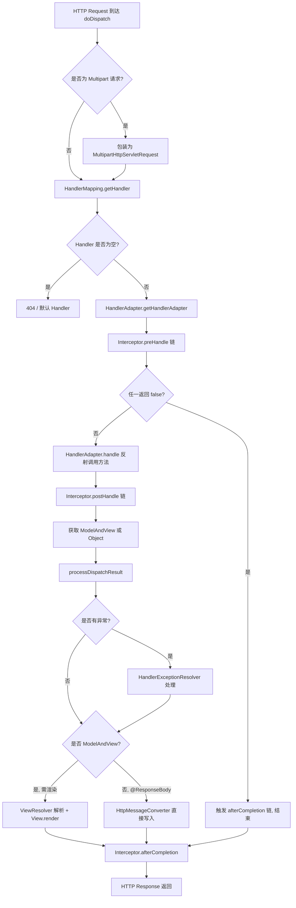
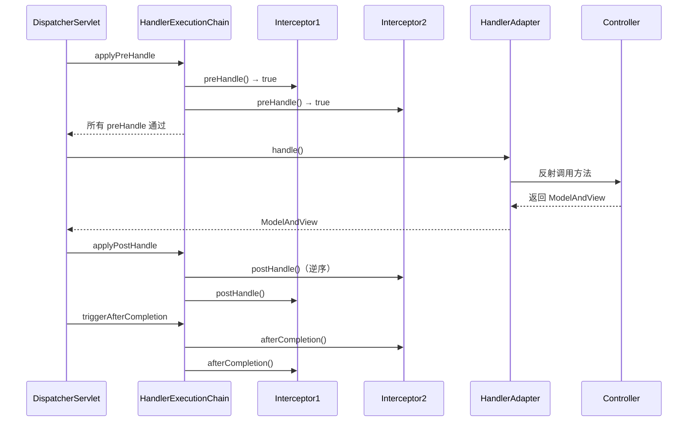
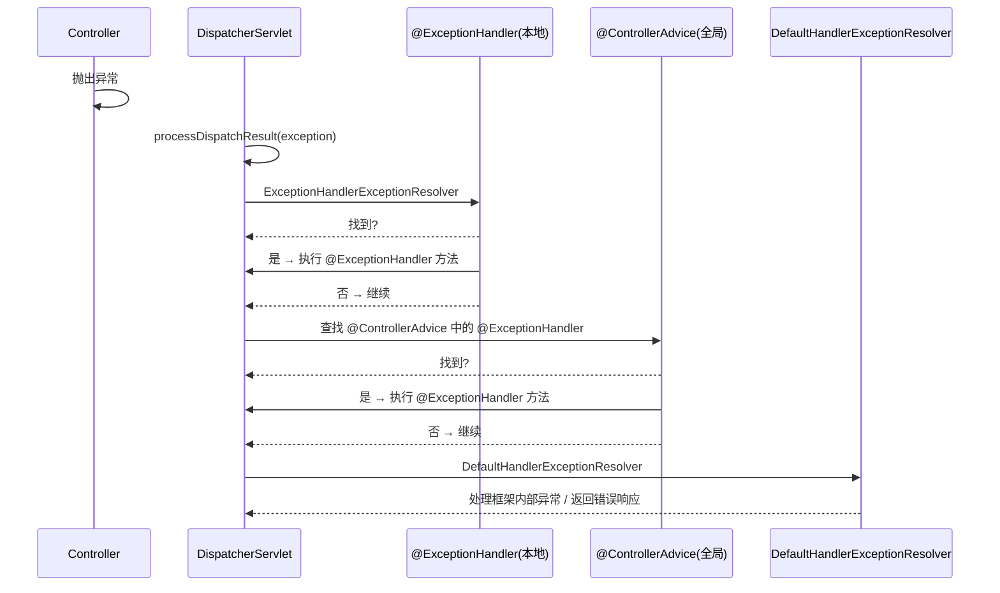

## 引言

从浏览器按下 Enter 到页面渲染，Spring MVC 在服务器端做了什么？

你的 `@GetMapping("/users/{id}")` 方法优雅地返回了一个 User 对象——但在这之前，Spring MVC 经历了一场精密的接力赛：Tomcat 接收请求、DispatcherServlet 分派、HandlerMapping 定位目标方法、HandlerAdapter 反射调用、参数解析、返回值处理、视图渲染或直接序列化 JSON。

读完本文你将掌握：
- **doDispatch() 源码级剖析**：逐行拆解 Spring MVC 请求处理的核心方法
- **返回值处理器全览**：`@ResponseBody`、`ModelAndView`、String、void、ResponseEntity 各自如何被处理
- **异常处理链路**：`@ExceptionHandler`、`@ControllerAdvice` 与 `HandlerExceptionResolver` 的优先级关系
- **拦截器生命周期**：preHandle、postHandle、afterCompletion 的执行时机与陷阱

这是从"会用 Spring MVC"到"能排查 Spring MVC 问题"的关键一跃。

## doDispatch() 核心方法全景图



`DispatcherServlet.doDispatch()` 是 Spring MVC 请求处理的心脏。理解它，就等于拿到了 Spring MVC 的地图。

以下是 doDispatch() 的核心流程拆解：

```java
// DispatcherServlet.doDispatch() 核心逻辑
protected void doDispatch(HttpServletRequest request, HttpServletResponse response) {
    HttpServletRequest processedRequest = request;
    HandlerExecutionChain mappedHandler = null;
    ModelAndView mv = null;
    Exception dispatchException = null;

    try {
        processedRequest = checkMultipart(request); // 1. 检查 multipart

        // 2. 查找 Handler
        mappedHandler = getHandler(processedRequest);
        if (mappedHandler == null) {
            noHandlerFound(processedRequest, response); // 404
            return;
        }

        // 3. 查找 HandlerAdapter
        HandlerAdapter ha = getHandlerAdapter(mappedHandler.getHandler());

        // 4. preHandle 拦截器链
        if (!mappedHandler.applyPreHandle(processedRequest, response)) {
            return; // 返回 false 时直接结束
        }

        // 5. 调用 Handler 方法
        mv = ha.handle(processedRequest, response, mappedHandler.getHandler());

        // 6. postHandle 拦截器链
        mappedHandler.applyPostHandle(processedRequest, response, mv);
    } catch (Exception ex) {
        dispatchException = ex;
    }

    // 7. 处理结果（渲染视图或处理异常）
    processDispatchResult(processedRequest, response, mappedHandler, mv, dispatchException);
}
```

> **💡 核心提示**：`preHandle()` 返回 `false` 时，流程**直接短路**——不会执行 Handler 方法、不会执行 `postHandle()`，但**一定会执行 `afterCompletion()`**。这是拦截器最常见的陷阱之一。

## HandlerExecutionChain：拦截器的载体

`HandlerMapping.getHandler()` 返回的不是单纯的 Handler 对象，而是一个 `HandlerExecutionChain`。它包含了：

- **handler**：实际的处理器（通常是 `HandlerMethod`，即 Controller 中的方法）
- **interceptorList**：一组 `HandlerInterceptor`，按注册顺序排列

拦截器链的执行规律：

```
preHandle:   interceptor1 → interceptor2 → interceptor3
Handler 执行
postHandle: interceptor3 → interceptor2 → interceptor1（逆序）
afterCompletion: interceptor3 → interceptor2 → interceptor1（逆序，即使异常也执行）
```



## HandlerMethod：反射调用引擎

`HandlerMethod` 封装了 Controller 方法的全部元信息：

- 所属 Bean 实例
- Method 对象（Java 反射）
- 方法参数列表（含注解信息）
- 方法返回值类型

`RequestMappingHandlerAdapter` 通过 `HandlerMethod` 实现反射调用，过程中涉及两个关键组件：

### HandlerMethodArgumentResolver（参数解析器）

策略模式的应用。Spring 内置了 30+ 种参数解析器，常见的有：

| 解析器 | 处理的注解 | 数据来源 |
| :--- | :--- | :--- |
| `RequestParamMethodArgumentResolver` | `@RequestParam` | Query 参数 / 表单数据 |
| `PathVariableMethodArgumentResolver` | `@PathVariable` | URL 路径变量 |
| `RequestResponseBodyMethodProcessor` | `@RequestBody` | 请求体（JSON/XML） |
| `ModelAttributeMethodProcessor` | `@ModelAttribute` | 表单参数 / Model |
| `RequestHeaderMethodArgumentResolver` | `@RequestHeader` | HTTP 请求头 |
| `CookieValueMethodArgumentResolver` | `@CookieValue` | Cookie |

### HandlerMethodReturnValueHandler（返回值处理器）

同样使用策略模式，常见的返回值处理器有：

| 处理器 | 处理的返回值 | 行为 |
| :--- | :--- | :--- |
| `RequestResponseBodyMethodProcessor` | `@ResponseBody` | HttpMessageConverter 序列化写入响应体 |
| `ModelAndViewMethodReturnValueHandler` | `ModelAndView` | 交给 ViewResolver 解析 |
| `ViewNameMethodReturnValueHandler` | `String` | 作为逻辑视图名，交给 ViewResolver |
| `HttpEntityMethodProcessor` | `ResponseEntity` | 设置状态码+头，内容序列化写入响应体 |
| `VoidMethodReturnValueHandler` | `void` | 不做处理（方法已直接写响应） |

> **💡 核心提示**：`RequestResponseBodyMethodProcessor` **同时实现了** `HandlerMethodArgumentResolver` 和 `HandlerMethodReturnValueHandler` 两个接口。它既处理 `@RequestBody` 参数（反序列化），又处理 `@ResponseBody` 返回值（序列化），是 REST API 的核心引擎。

## 返回值处理深度解析

### @ResponseBody / @RestController

返回值由 `RequestResponseBodyMethodProcessor` 处理：

1. 根据请求的 `Accept` Header 和方法的 `produces` 属性选择 `HttpMessageConverter`
2. 使用选中的 Converter（如 `MappingJackson2HttpMessageConverter`）将返回值序列化为 JSON/XML
3. 直接写入 `HttpServletResponse` 的输出流
4. **跳过视图解析阶段**

### ModelAndView

返回 `ModelAndView` 对象时：

1. `DispatcherServlet` 获取其中的逻辑视图名和模型数据
2. 通过 ViewResolver 链查找具体的 View 对象
3. 调用 `View.render(model, request, response)` 渲染

### String（视图名）

返回 String 时，`ViewNameMethodReturnValueHandler` 将其视为逻辑视图名，后续走 ViewResolver 流程。

### void

返回 void 时，`VoidMethodReturnValueHandler` 不做任何处理。通常意味着方法已经直接操作了 `HttpServletResponse` 写入了响应。

### ResponseEntity

返回 `ResponseEntity` 时，`HttpEntityMethodProcessor` 会：
1. 设置响应的状态码（如 201 Created）
2. 设置响应头
3. 将 body 序列化写入响应体

## 异常处理机制



Spring MVC 的异常处理遵循**优先级链**：

1. **`@ExceptionHandler`（局部）**：当前 Controller 中的异常处理方法优先匹配
2. **`@ControllerAdvice`（全局）**：全局异常处理方法次之
3. **`HandlerExceptionResolver` 链**：默认处理器最后兜底

> **💡 核心提示**：`afterCompletion()` **无论如何都会执行**，即使请求处理过程中抛出了异常。这是做资源清理（如关闭连接、释放锁）的正确位置，而不能依赖 `postHandle()`（异常时不会执行）。

> **💡 核心提示**：如果响应已经被写入（committed），`@ExceptionHandler` 无法再修改状态码或响应体。此时异常只能记录日志，无法向客户端返回错误信息。

## 生产环境避坑指南

| # | 陷阱 | 症状 | 解决方案 |
| :--- | :--- | :--- | :--- |
| 1 | `preHandle=true` 但忘记 `afterCompletion` 清理 | 内存泄漏、连接未释放 | 在 `afterCompletion()` 中做清理，不要依赖 `postHandle()` |
| 2 | 响应已 committed 后异常 | `@ExceptionHandler` 无法返回错误 JSON | 在 Interceptor 中提前校验，或在 committed 前处理异常 |
| 3 | `@ExceptionHandler` 不捕获序列化错误 | Jackson 序列化异常未进入 @ExceptionHandler | 序列化异常发生在 Handler 方法返回之后，使用全局异常处理或 Filter 层捕获 |
| 4 | 文件上传大小超限 | 抛出 `MaxUploadSizeExceededException`，但未被捕获 | 配置 `spring.servlet.multipart.max-file-size` 并在 @ControllerAdvice 中处理该异常 |
| 5 | 异步请求超时 | `DeferredResult` 超时返回默认 503 | 配置 `DeferredResult` 的超时回调和超时时间 |
| 6 | 拦截器抛异常但不清理 ThreadLocal | ThreadLocal 数据污染下一个请求 | `afterCompletion()` 中务必 `ThreadLocal.remove()` |
| 7 | `doDispatch()` 中 mappedHandler 为 null | 请求 404 但日志不明显 | 检查 HandlerMapping 是否正确注册，url-pattern 是否匹配 |
| 8 | postHandle 中修改 Model 无效 | 修改未被视图渲染使用 | postHandle 修改 Model 可能不生效（视图可能已准备渲染），应在 preHandle 或 Handler 中处理 |

## 对比速查表

| 对比项 | 传统 MVC | 异步 MVC | 核心区别 |
| :--- | :--- | :--- | :--- |
| 处理模型 | 请求-线程一对一 | 请求与线程解耦 | 传统 MVC 线程阻塞等待；异步 MVC 释放线程 |
| 返回值类型 | `ModelAndView` / `String` | `DeferredResult` / `Callable` | 传统立即返回；异步延迟返回 |
| 适用场景 | 快速响应、简单 CRUD | 长耗时操作、第三方调用 | 异步适合 I/O 密集型场景 |
| 线程消耗 | 每个请求占用一个 Servlet 线程 | 长耗时操作释放 Servlet 线程 | 异步可显著提升并发能力 |

| 对比项 | `@ExceptionHandler` | `HandlerExceptionResolver` | 核心区别 |
| :--- | :--- | :--- | :--- |
| 使用方式 | 注解驱动，声明式 | 编程式，实现接口 | 注解更简洁；编程式更灵活 |
| 作用范围 | Controller 级别或全局（@ControllerAdvice） | 全局 | @ExceptionHandler 支持按异常类型精准匹配 |
| 优先级 | 局部优先于全局 | 在 @ExceptionHandler 之后兜底 | 推荐优先使用 @ExceptionHandler |
| 返回值 | 可以返回 ModelAndView 或 @ResponseBody | 返回 ModelAndView | @ExceptionHandler 更灵活 |

## 行动清单

1. **阅读 doDispatch() 源码**：打开 `DispatcherServlet.java`，逐行阅读 `doDispatch()` 方法，结合本文流程图理解。
2. **审查拦截器的 afterCompletion**：确认每个 `preHandle` 做了初始化的拦截器，在 `afterCompletion` 中有对应的清理逻辑。
3. **建立全局异常处理**：使用 `@ControllerAdvice` 集中处理异常，统一返回格式（错误码、消息、时间戳）。
4. **检查 ThreadLocal 清理**：在拦截器中使用 ThreadLocal 时，确保 `afterCompletion()` 中调用了 `remove()`。
5. **配置异步超时策略**：如果使用 `DeferredResult`，设置合理的超时时间和超时回调处理。
6. **理解 HttpMessageConverter 顺序**：通过 `WebMvcConfigurer.configureMessageConverters()` 控制 Converter 优先级，确保 JSON 转换器正确生效。
7. **排查 404 问题**：遇到 404 时，检查 `HandlerMapping` 是否注册、url-pattern 是否匹配、@RequestMapping 路径是否正确。

## 总结

`DispatcherServlet.doDispatch()` 是 Spring MVC 请求处理的核心引擎。它通过 HandlerMapping 定位目标方法、HandlerAdapter 反射调用、返回值处理器处理结果、ViewResolver 渲染视图，形成了一条精密的处理链。

理解这条链的每个环节，你不仅能写出更优雅的 Controller，还能在出现问题时快速定位根因——这才是架构师和初级开发者的分水岭。

**面试高频考点速查：**
- 描述 `doDispatch()` 方法的完整流程
- `HandlerExecutionChain` 的组成与拦截器执行顺序
- `HandlerMethodArgumentResolver` 和 `HandlerMethodReturnValueHandler` 的策略模式
- `@ExceptionHandler` 的优先级：局部 → 全局 → 默认
- `afterCompletion()` 一定会执行，即使发生异常
- 异步 MVC（`DeferredResult` / `Callable`）与传统 MVC 的区别
