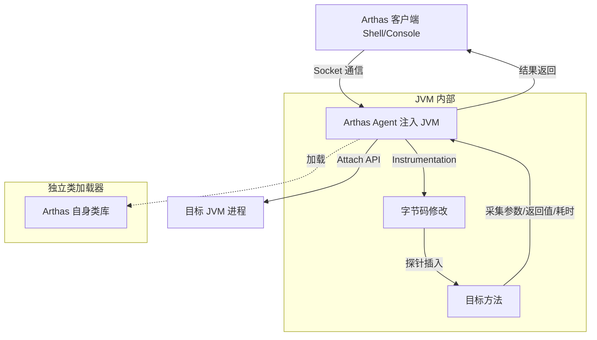
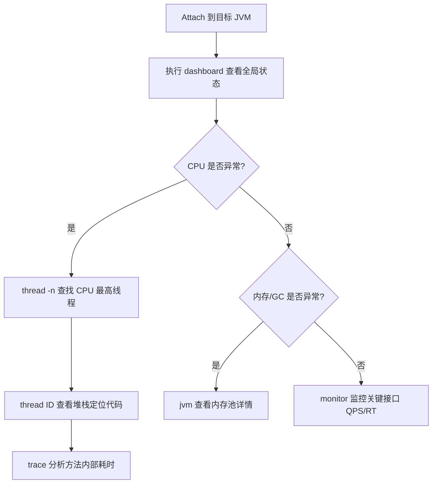

## 引言

线上服务 CPU 突然飙到 100%，没有异常日志、无法复现、不能重启——面对这种"三无"场景，你怎么在 5 分钟内定位到问题代码行？

Arthas 是阿里巴巴开源的 Java 诊断神器，它基于 Java Agent 技术动态 Attach 到目标 JVM，让你在不修改代码、不重启服务的前提下，实时观测方法执行、变量值、线程状态，甚至热更新线上代码。掌握 Arthas 是每一位 Java 工程师从"被动救火"到"主动诊断"的分水岭。

读完本文，你将掌握：Arthas 底层 Instrumentation 字节码增强原理、CPU 飙高/死锁/内存泄漏的实战排查流程、`watch`/`trace`/`tt` 等核心命令的使用技巧，以及生产环境安全使用的避坑指南。

## Arthas 是什么？解决的核心痛点

**定义：** Arthas 是一款基于 Java Agent 技术实现的交互式命令行诊断工具。它可以动态 Attach 到目标 JVM 进程，获取运行时状态，甚至修改运行时行为。

### 传统诊断手段的局限性

| 手段 | 能力 | 局限性 |
| :--- | :--- | :--- |
| **日志** | 查看预埋日志 | 未预埋的代码行为无法观察；日志过多反而淹没关键信息 |
| **远程 Debug** | 断点调试 | 暂停线程，高并发下不可用；需开放端口，有安全风险 |
| **Dump 文件分析** | 静态快照分析 | 无法观测动态行为；对偶发问题帮助有限 |

### Arthas 的核心优势

* **非侵入式：** 无需修改代码，Attach 到运行中的 JVM 即可。
* **动态诊断：** 实时获取 JVM 和应用状态，动态观测方法执行和变量值。
* **实时性：** 秒级实时数据和动态分析能力。
* **丰富的功能集：** 线程、内存、GC、类加载、方法观测、热更新、OGNL 表达式执行。

### Arthas 工作原理架构

## Arthas 工作原理解析

### Attach 机制

* Arthas 启动后，其核心是寻找目标 JVM 进程并与之建立连接。这依赖于 Java 的 `Attach API`（位于 `com.sun.tools.attach` 包，通常在 JDK 的 `lib/tools.jar` 中）。
* Arthas 客户端通过 Attach API 连接到目标 JVM，然后请求目标 JVM 加载 Arthas Agent（一个 jar 包）。
* Agent 加载成功后，就在目标 JVM 进程内运行，并与客户端建立通信通道（通常是基于 Socket）。后续所有命令通过这个通道发送。

### Instrumentation 技术

这是 Arthas 实现动态代码观测和热更新的关键，依赖于 `java.lang.instrument` 包。

* Agent 被加载到目标 JVM 后，会获得一个 `Instrumentation` 实例。这个实例允许 Agent 在运行时对已加载的类进行**字节码修改**。
* Arthas 底层使用 **ByteBuddy** 来操作字节码。
* 例如：
    * `watch` 和 `trace` 命令：在目标方法的入口、出口位置插入探针，记录参数、返回值、异常、执行时间等信息。
    * `monitor` 命令：插入探针，在方法执行时更新计数器、总耗时等统计信息。
    * `redefine` 命令：利用 `Instrumentation` 的 `redefineClasses()` 方法，用新字节码替换旧字节码。

> **💡 核心提示**：Instrumentation 的字节码修改是运行时生效的，不会影响磁盘上的 .class 文件。重启 JVM 后所有修改自动失效，这保证了诊断操作的安全性。

### 类加载器隔离

Arthas Agent 使用了**独立的类加载器**来加载自身及所需的第三方库，避免与目标应用的类库发生冲突。当需要操作目标应用的类时，Arthas 会遍历所有类加载器查找目标类。

### 命令执行与通信

Arthas 采用客户端-服务端模式。客户端是 Shell 或 Web Console，服务端是注入到目标 JVM 中的 Agent。命令通过 Socket 发送，Agent 解析后执行，结果返回客户端展示。

## 核心命令详解与实战场景

### 基础信息查看

* **`dashboard`**：提供实时的 JVM 状态面板，包括线程、内存、GC、运行时信息。
    * **场景：** 刚 Attach 时的首选命令，快速了解应用整体健康状况。
* **`thread`**：查看线程信息。
    * `thread -n <number>`：查看 CPU 占用率最高的线程。**排查 CPU 飙高利器！**
    * `thread -b`：查找潜在死锁线程。**排查死锁利器！**
* **`jvm`**：查看 JVM 进程信息、内存池、GC 统计等。
* **`sysprop` / `sysenv`**：查看 System Properties / Environment Variables。
* **`getstatic`**：查看类的静态字段值。

### 类与类加载器排查

* **`sc` (Search Class)**：搜索已加载的类。
    * `sc -d <类全名>`：显示类的详细信息，包括加载它的 ClassLoader、所属 Jar 包。**排查类冲突必备。**
* **`sm` (Search Method)**：搜索已加载类的方法信息。
* **`jad` (Java Decompiler)**：反编译已加载类的源码。
    * **排查 `ClassNotFoundException` 或 `NoSuchMethodError` 时确认运行时代码是否与预期一致。**
* **`classloader`**：查看类加载器树状结构。排查类加载隔离、父子委托问题。

> **💡 核心提示**：`jad` 反编译的是 JVM 内存中的字节码。如果你用 `redefine` 热更新了代码，再用 `jad` 看到的将是更新后的代码，而非磁盘上的原始代码。

### 方法执行观测

* **`watch`**：观测方法的输入参数、返回值、抛出异常。
    * **语法：** `watch <类全名> <方法名> <观测表达式> [条件表达式]`
    * **与 Debug 区别：** `watch` 非阻塞，不会暂停线程；Debug 会暂停。
* **`trace`**：追踪方法内部调用路径及耗时。
    * **语法：** `trace <类全名> <方法名> [条件表达式] [#cost > <毫秒>]`
    * **场景：** **分析方法性能瓶颈。**
* **`stack`**：输出方法被调用的完整调用栈。
* **`monitor`**：周期性统计方法调用次数、成功率、平均耗时。

### 疑难问题排查

* **`tt` (Time Tunnel)**：方法执行数据的"时空隧道"。
    * **流程：** `tt -t` 开启记录 -> 等待调用 -> `tt -s` 查看列表 -> `tt -i <index>` 查看详情 -> `tt -i <index> -w <表达式>` 观察变量。
    * **场景：** **排查偶发性 Bug 的终极利器！** 记录后回到"案发现场"分析当时的输入和上下文。
* **`profiler`**：生成热点火焰图。
    * **流程：** `profiler start --event cpu` -> 运行压测 -> `profiler stop --format html` 生成火焰图。
    * **场景：** **排查 CPU 性能瓶颈。** 火焰图顶层越宽的函数，消耗 CPU 越多。

### 运行时修改

* **`redefine`**：热更新字节码。**限制：不能增删字段/方法，不能改签名/继承关系，只能改方法体。**
* **`mc` (Memory Compiler)**：内存中编译 `.java` 文件，通常与 `redefine` 配合使用。
* **`ognl`**：执行 OGNL 表达式，可调用任意方法、访问静态字段。
    * **风险：** 几乎可以在目标应用中执行任意代码，线上环境需极其谨慎。

## 核心命令对比表

| 命令 | 用途 | 性能开销 | 适用场景 |
| :--- | :--- | :--- | :--- |
| `dashboard` | 全局状态概览 | 低 | 初步诊断 |
| `thread -n` | CPU 最高线程 | 低 | CPU 飙高排查 |
| `thread -b` | 死锁检测 | 低 | 死锁排查 |
| `jad` | 反编译运行时代码 | 低 | 代码版本确认 |
| `watch` | 方法参数/返回值观测 | 中 | 特定调用排查 |
| `trace` | 方法调用链路及耗时 | 中高 | 性能瓶颈分析 |
| `monitor` | 接口 QPS/RT 统计 | 中 | 接口性能监控 |
| `tt` | 方法执行现场记录 | 高 | 偶发 Bug 排查 |
| `profiler` | 火焰图 | 中 | CPU 热点分析 |
| `redefine` | 热更新字节码 | 低（一次性） | 线上紧急修复 |

## Arthas 与其他诊断工具对比

| 工具 | 是否需要重启 | 动态观测方法执行 | 热更新 | 定位 |
| :--- | :--- | :--- | :--- | :--- |
| **Arthas** | 不需要 | 支持 | 支持 | 线上临时诊断 |
| **JMX/JConsole** | 不需要 | 不支持 | 不支持 | 宏观监控 |
| **JProfiler/YourKit** | 需要（启动时配置） | 支持 | 不支持 | 深度 Profiling |
| **jstack/jmap** | 不需要 | 不支持（静态快照） | 不支持 | 现场快照分析 |

## 使用最佳实践

1. **目标明确，按需执行：** 诊断前先思考清楚要查什么，选择最合适的命令。
2. **理解开销，谨慎操作：** `watch`、`trace`、`tt`、`profiler` 会改变目标方法行为或增加资源消耗。用完及时清理。
3. **组合命令，循序渐进：** CPU 飙高先 `dashboard` -> `thread -n` -> `thread <ID>` -> `trace`/`profiler`。
4. **善用条件表达式：** 用 `params[0].userId == '123'` 等条件精确过滤观测目标，减少数据量。
5. **在预发/测试环境充分演练：** 熟悉命令用法和性能影响，避免在生产环境"摸索"。

## 生产环境避坑指南

1. **`ognl` 命令有极高安全风险：** 恶意用户可以通过 OGNL 执行任意代码。生产环境务必配置 Arthas 的访问控制（`--target-ip`、`--telnet-port` 绑定），禁止外网暴露端口。
2. **字节码增强命令有性能开销：** `watch`、`trace`、`tt` 会插入探针代码，在高并发核心路径上长时间开启会引入明显的性能损耗。用完立即执行 `stop` 或 `reset`。
3. **`redefine` 有严格限制：** 不能增加或删除字段/方法、不能改签名。如果 Bug 涉及新增逻辑或方法签名变更，`redefine` 无能为力，只能重启。
4. **`redefine` 热更新不持久化：** 重启 JVM 后热更新失效。它只是临时止血方案，不能替代正式的发布流程。
5. **Attach 需要相同用户权限：** 只有与目标 JVM 运行在同一用户下或具有 root 权限才能 Attach。在容器化环境中可能需要特殊配置。
6. **Arthas 自身会消耗内存：** Agent 加载会占用一定的堆内存（通常几十 MB），在内存紧张的容器环境中需要预留足够空间。
7. **`profiler` 火焰图需要 `perf_events` 权限：** 某些 Linux 内核版本默认禁用了 `perf_events`，需调整 `kernel.perf_event_paranoid` 参数。

## 行动清单

1. **检查点**：确认生产环境 Arthas 的 telnet/http 端口没有暴露在外网，配置了 IP 白名单。
2. **优化建议**：在 CI/CD 流水线中集成 Arthas boot 脚本，让运维人员可以一键启动诊断。
3. **排查流程**：CPU 飙高标准流程：`dashboard` -> `thread -n 3` -> `printf "%x\n" <TID>` -> `thread <TID>` -> `trace` 分析。
4. **安全建议**：诊断完成后执行 `stop` 命令停止所有观测，避免探针代码持续消耗性能。
5. **扩展阅读**：Arthas 官网 https://arthas.aliyun.com/，推荐学习官方 User Case 教程。
