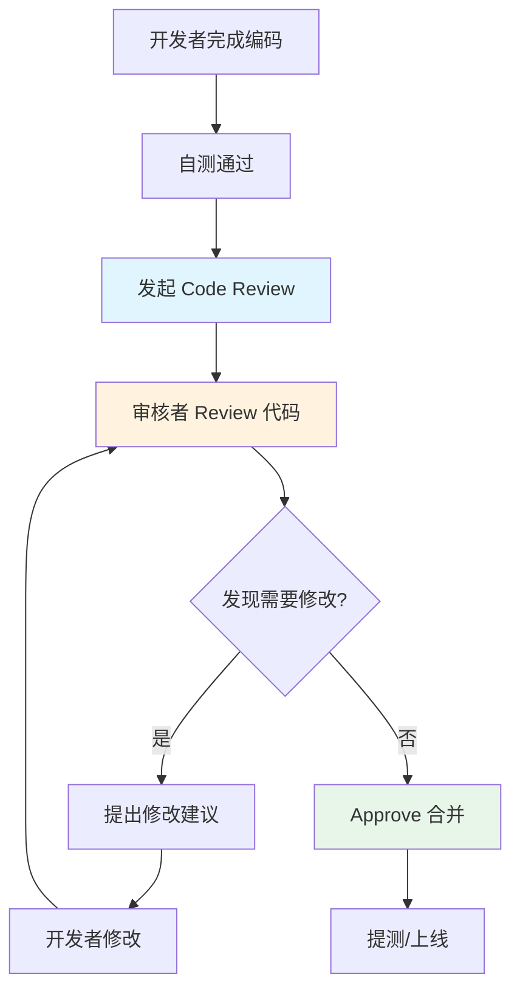
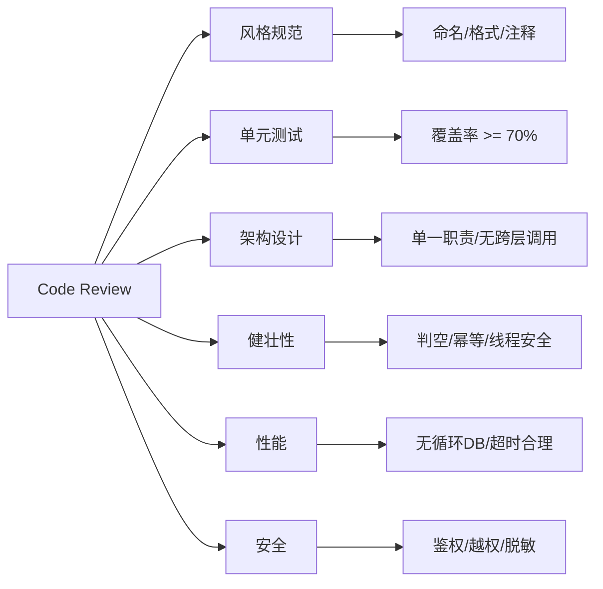

## 引言

一个方法 800 行、接口直接调数据层、循环里查数据库——这些代码一旦上线，是迟早会炸的定时炸弹，还是"能跑就行"？

Code Review 不是走流程、不是互相挑刺，而是团队代码质量的最后一道防线。据 Google 内部数据，Code Review 能拦截 60% 以上的潜在线上 Bug，同时是知识传递和新人成长的最有效途径。但很多团队的 Review 流于形式——要么"走过场"全部 approve，要么"上线前最后一分钟"根本没法改。

读完本文，你将掌握：Code Review 的正确时机和基本流程、审核者从哪些维度切入的完整 checklist、常见反模式识别方法（循环查 DB、线程安全、越权漏洞），以及如何在团队中落地可持续的 Review 文化。

## 为什么需要 Code Review

Code Review（代码评审）是日常开发中必不可少的环节，但很多开发者重视不够，未能体验到它的好处。

### 统一代码风格

团队内代码风格的统一能增加可读性，便于继任者快速上手。

```java
// 不规范的写法
public User getUserById(Long userId)
{
    return userDao.getUserById(userId);
}

// 规范的写法（Google Java Style）
public User getUserById(Long userId) {
    return userDao.getUserById(userId);
}
```

### 提前发现 Bug

每个开发者考虑的维度有限，对业务的理解也不同。其他人可以站在不同角度，帮助发现潜在问题，规避线上故障。

### 提高代码质量

以"完成任务"为目的代码，往往不考虑架构风格——接口层直接调数据层、方法几百行、类几千行。作为程序员，应对代码质量有追求。经典书籍如《重构：改善既有代码的设计》、《代码整洁之道》、《代码大全》都是提升代码质量的利器。

### 促进知识共享

每次 Code Review 都是一次知识分享和交流。梳理自己的实现方案，学习别人的架构风格和业务思路，有助于培养团队技术氛围。

### 增加业务理解

通过 Review 了解新增功能和现有业务的影响，有助于团队成员之间的沟通与协作。

## Code Review 工作流程



## Code Review 基本原则

* **以交流学习为目的：** Review 的目的是互相学习，不是抓住同事的错误不放。保持开放和积极的态度。
* **保持客观和专业：** 评审代码质量和规范符合度，而不是评价提交者本人。指出错误时，在对方可接受的范围内沟通。
* **及时反馈结果：** Review 应及时和持续。审核者收到提交后尽快审查，开发者收到反馈后及时修改，确认修改后及时 approve。

## Code Review 时机

发起 Code Review 的最佳时机是在**需求提测前**，这样 Review 后的代码变更可以被测试覆盖。

> **💡 核心提示**：不要在上线前发起 Code Review。此时谁都不敢提建议——即使发现问题也没有时间修改，Review 失去意义，还增加了团队摩擦。

## Code Review 注意事项

审核者往往不知道从哪下手。可以关注以下几个方面：

### 代码风格

团队内部应遵守相同的代码规范，包括：变量命名、常量定义、枚举值定义、代码格式、日期格式化工具、异常处理、注释规范、传参和响应数据包装、建表规约等。推荐参考《阿里 Java 开发手册》。

### 单元测试要求

新增代码的单测覆盖率至少达到 70%。写好单测可以提高代码质量、减少低级 Bug、减少调试时间。

### 符合架构规范

* 是否符合单一职责原则、开闭原则
* 是否存在跨层调用
* 是否有重复逻辑
* 领域边界划分是否合理

### 代码健壮性

通常只有 20% 的代码实现核心逻辑，80% 的代码保证程序安全。关注以下方面：

| 检查项 | 说明 | 常见反模式 |
| :--- | :--- | :--- |
| 判空校验 | 参数是否为 null | `user.getName()` 未判空导致 NPE |
| 逻辑边界 | 条件分支是否完整 | `if-else` 缺少默认分支 |
| 线程安全 | 共享变量是否并发安全 | 使用 `HashMap` 替代 `ConcurrentHashMap` |
| 幂等性 | 重复调用是否产生副作用 | 支付接口未做幂等导致重复扣款 |
| 资源边界 | 是否有连接/内存泄漏 | 数据库连接未关闭、未关闭流 |
| 数据一致性 | 事务是否覆盖完整逻辑 | 多个数据源操作未在同一事务 |
| 保护机制 | 是否需要限流/熔断/降级 | 对外接口无保护，被恶意请求打满 |

### 接口性能

| 检查项 | 说明 | 优化建议 |
| :--- | :--- | :--- |
| 循环调用 | 循环内调用接口/数据库 | 改为批量查询 |
| 超时设置 | 外部接口超时是否合理 | 设置连接超时和读取超时 |
| 调用量预估 | 是否预估了 QPS 峰值 | 配置限流、熔断、降级 |
| 缓存策略 | 是否需要加缓存 | 本地缓存 + 分布式缓存多级 |
| 日志量 | 打印日志是否过多 | 避免循环内打印，使用 DEBUG 级别 |

### 数据安全

* 接口是否需要登录态校验
* 是否有参数签名校验
* 是否存在水平越权和垂直越权
* 对外暴露的数据是否脱敏处理

## Code Review 检查清单速查



## 生产环境避坑指南

1. **Review 流于形式：** 最常见的坑是所有人都默认 approve，不看代码。解决方案：设置最少 Review 人数要求（至少 1 人），引入 Review 质量考核（如 Review 评论数）。
2. **单次 Review 量过大：** 一次提交几千行代码，审核者根本看不过来。解决方案：限制单次 PR 大小（建议不超过 400 行），小步快跑。
3. **上线前才 Review：** 此时发现问题无法修改。解决方案：在提测前完成 Review，将 Review 作为提测的前置条件。
4. **只关注风格，忽略逻辑：** 过度纠结命名和格式，忽略业务逻辑的正确性。解决方案：风格问题交给 Checkstyle/Spotless 自动检查，Review 聚焦业务逻辑和架构设计。
5. **Review 意见不跟进：** 开发者收到反馈后不修改直接合并。解决方案：要求所有 Review 意见必须 resolve 后才能 merge。
6. **没有新人视角：** 老员工看代码理所当然，但新人完全看不懂。解决方案：代码应该让第一次接触该模块的人也能读懂。

## 行动清单

1. **检查点**：确认团队的 CI 流程集成了自动化代码检查（Checkstyle、PMD、SpotBugs），减少人工 Review 的风格类工作。
2. **优化建议**：将 Code Review 纳入提测流程的硬性前置条件，提测前必须至少 1 人 approve。
3. **工具推荐**：使用 GitHub/GitLab 的 PR/MR 模板，要求开发者填写变更说明、测试情况、影响范围，提升 Review 效率。
4. **团队文化**：定期举办 Code Review 分享会，将优秀的 Review 案例整理成团队最佳实践文档。
5. **扩展阅读**：推荐《Google Engineering Practices Documentation》中的 Code Review 指南和《代码整洁之道》。
