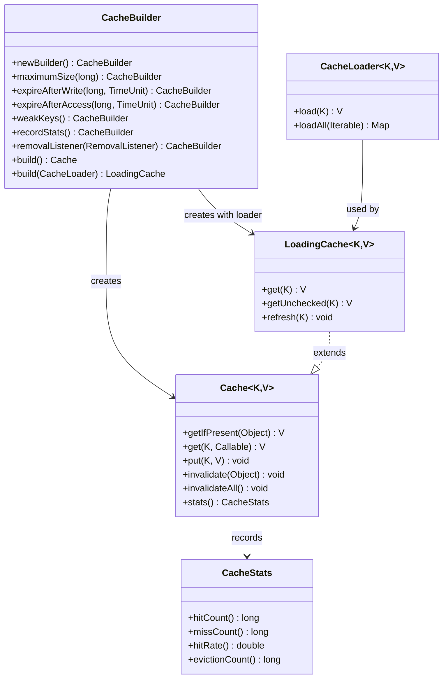
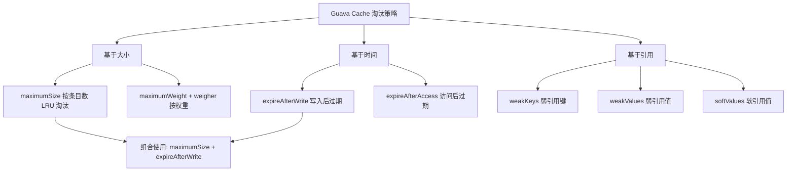

## 引言

每次接口都要查一次数据库，Redis 集群又因为网络抖动偶发超时——你的应用真的只能靠增加数据库连接数来硬扛吗？

本地缓存在微服务架构中被严重低估。一个配置合理的 Guava Cache 可以将热点数据直接从内存返回，延迟从 10ms 降到微秒级，还能在 Redis 宕机时充当最后一道防线。理解 Guava Cache 的淘汰策略、过期机制和并发设计，不仅是性能优化的基本功，也是面试中区分"会用"和"懂原理"的分水岭。

读完本文，你将掌握：Guava Cache 的 LRU 淘汰机制与懒过期原理、三种淘汰策略的组合使用方式、缓存穿透和雪崩的预防方案，以及与 Caffeine 的性能对比与选型建议。

## Guava Cache 概要

Guava Cache 是 Google Guava 库提供的本地缓存组件，是 Java 领域最早被广泛使用的成熟本地缓存实现。它提供了线程安全、功能丰富的缓存能力。

### 核心架构



### 主要特性

* **自动加载：** 通过 `CacheLoader` 定义加载方法，缓存未命中时自动加载数据，无需手动管理加载过程。
* **缓存过期：** 支持基于时间和基于大小的过期策略。
* **缓存回收：** 提供基于弱引用/软引用的回收机制，GC 压力小时不会回收。
* **统计信息收集：** 通过 `recordStats()` 开启，收集命中率、加载时间等指标。
* **显式操作：** 提供 `put`、`get`、`invalidate` 等直观的 API。

## 淘汰策略详解

Guava Cache 提供多种淘汰策略，可按需组合使用。



### 基于大小的淘汰策略

* **`maximumSize(long)`：** 设置最大缓存条目数。达到上限时，按 LRU（最近最少使用）策略淘汰。
* **`maximumWeight(long)` + `weigher(Weigher)`：** 按自定义权重淘汰。适合缓存项大小差异大的场景（如不同大小的字符串或对象）。

### 基于时间的淘汰策略

* **`expireAfterWrite(duration, unit)`：** 写入后多久过期。适合数据有固定有效期的场景（如配置数据）。
* **`expireAfterAccess(duration, unit)`：** 多久未被访问后过期。适合热点数据缓存，冷数据自动淘汰。

> **💡 核心提示**：`expireAfterWrite` 和 `expireAfterAccess` 可以同时使用。例如 `expireAfterWrite(30m).expireAfterAccess(5m)` 表示：数据最长存活 30 分钟，但如果 5 分钟内无人访问也会过期。

### 基于引用的淘汰策略

* **`weakKeys()`：** 键使用弱引用。当键没有其他强引用指向时，可被 GC 回收。
* **`weakValues()`：** 值使用弱引用。
* **`softValues()`：** 值使用软引用。内存不足时 GC 才回收，比弱引用更温和。

## 使用示例

```java
import com.google.common.cache.Cache;
import com.google.common.cache.CacheBuilder;
import com.google.common.cache.CacheLoader;
import com.google.common.cache.LoadingCache;
import java.util.concurrent.TimeUnit;

public class GuavaCacheExample {

    public static void main(String[] args) {
        // 基本缓存
        Cache<String, String> cache = CacheBuilder.newBuilder()
                .maximumSize(100)
                .expireAfterWrite(10, TimeUnit.MINUTES)
                .recordStats()
                .build();

        // 带自动加载的缓存
        LoadingCache<String, String> loadingCache = CacheBuilder.newBuilder()
                .maximumSize(100)
                .expireAfterAccess(10, TimeUnit.MINUTES)
                .build(new CacheLoader<String, String>() {
                    @Override
                    public String load(String key) {
                        return loadFromDatabase(key);
                    }
                });

        // 获取缓存（未命中时自动加载）
        String value = loadingCache.get("key");

        // 统计信息
        System.out.println("Stats: " + cache.stats());
    }

    private static String loadFromDatabase(String key) {
        // 从数据库加载数据的逻辑
        return "value";
    }
}
```

## Guava Cache 的不足

1. **单机缓存：** 只能在单个 JVM 实例中使用，不适用于分布式系统或多实例缓存共享。
2. **内存限制：** 受可用内存限制，缓存过多可能导致 OOM。
3. **加载期间阻塞：** 缓存未命中时自动调用加载方法，多个线程同时请求同一 key 可能导致阻塞（虽有 ConcurrentMap 级别的锁保护，但加载逻辑本身是同步的）。
4. **惰性过期：** 使用惰性删除策略，过期条目在下次访问时才会被清除。这可能导致过期数据在一段时间内仍可被读取。
5. **缺乏持久化：** 不支持将缓存项持久化到磁盘。应用重启后所有缓存丢失。

> **💡 核心提示**：Guava Cache 的惰性过期意味着即使设置了 `expireAfterWrite(1m)`，过期的条目仍然会占据内存，直到下一次访问或达到 `maximumSize` 触发淘汰。如果需要主动清理，可配合 `CacheBuilder.refreshAfterWrite()` 或定时任务调用 `cleanUp()`。

## Guava Cache vs Caffeine 对比

| 特性 | Guava Cache | Caffeine | 说明 |
| :--- | :--- | :--- | :--- |
| **淘汰算法** | LRU 变种 | **W-TinyLfu** | W-TinyLfu 在复杂访问模式下命中率更高 |
| **并发性能** | 分段锁 | 基于 `ConcurrentHashMap` 优化 | Caffeine 高并发下吞吐量更高 |
| **异步缓存** | 不支持 | **原生支持 AsyncCache** | Caffeine 更适合响应式编程 |
| **维护状态** | 维护模式 | **积极开发** | Guava Cache 不再新增功能 |
| **Spring 集成** | 支持 | **Spring Boot 2+ 默认推荐** | 新项目首选 Caffeine |
| **API 相似度** | 极高 | 极高 | 迁移成本低 |
| **适用场景** | 遗留项目/简单缓存 | **新项目/高性能场景** | 选型建议见下方 |

### 选型建议

* **新项目：** 强烈推荐使用 **Caffeine**。性能更好、支持异步、社区活跃。
* **遗留项目：** 如果 Guava Cache 性能满足要求可继续使用，但遇到瓶颈时建议迁移。API 高度相似，迁移成本较低。

## 生产环境避坑指南

1. **本地缓存不适合存大对象：** Guava Cache 存的是 JVM 堆内存中的对象引用。缓存大对象或大量数据会直接导致 OOM。只缓存高频访问的小对象（如配置、字典数据）。
2. **过期时间是惰性的：** 设置了过期时间不代表到点自动删除。过期条目只有在下一次访问或被淘汰时才会真正移除。内存紧张场景建议定期调用 `cache.cleanUp()`。
3. **`maximumSize` 不等于精确上限：** Guava Cache 的 `maximumSize` 是软限制，实际缓存条目数可能短暂超过设定值。这是因为淘汰是异步延迟执行的。
4. **`CacheLoader.load()` 是同步阻塞的：** 多个线程同时 `get` 同一个未缓存的 key，只有一个线程执行加载，其他线程阻塞等待。高并发场景下可能导致请求堆积。
5. **本地缓存与 Redis 的一致性：** 如果同时使用 Guava Cache 和 Redis，需要设计缓存失效通知机制（如 MQ 广播），否则会出现各节点数据不一致。
6. **统计信息要开启：** 生产环境务必调用 `.recordStats()`，并通过监控暴露命中率。命中率低于 50% 说明缓存策略需要调整。

## 行动清单

1. **检查点**：确认所有 Guava Cache 实例都设置了 `maximumSize`，避免无界缓存导致 OOM。
2. **优化建议**：为高频查询的缓存配置 `recordStats()`，定期监控命中率，低于 50% 时分析原因。
3. **缓存策略**：根据数据特性选择合适的过期策略——配置数据用 `expireAfterWrite`，热点查询用 `expireAfterAccess`。
4. **穿透防护**：对不存在的 key 缓存 null 值（设置较短过期时间），避免恶意请求穿透到数据库。
5. **扩展阅读**：如果追求更高性能，建议阅读 Caffeine 的 W-TinyLfu 算法原理，对比 Guava 的 LRU 变种实现差异。
