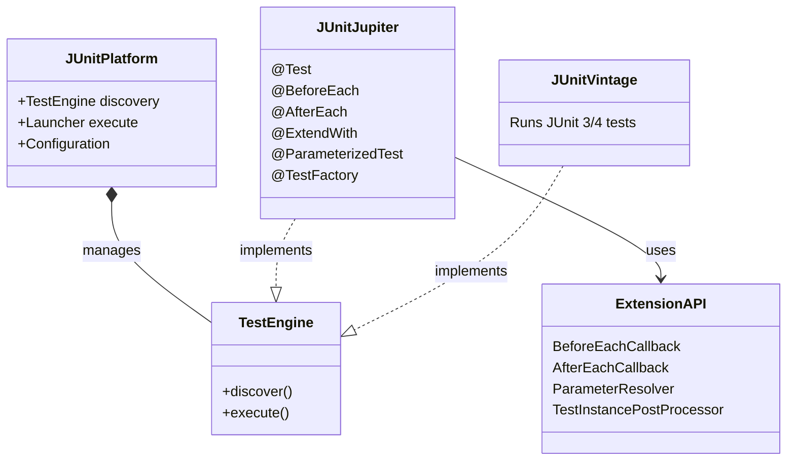
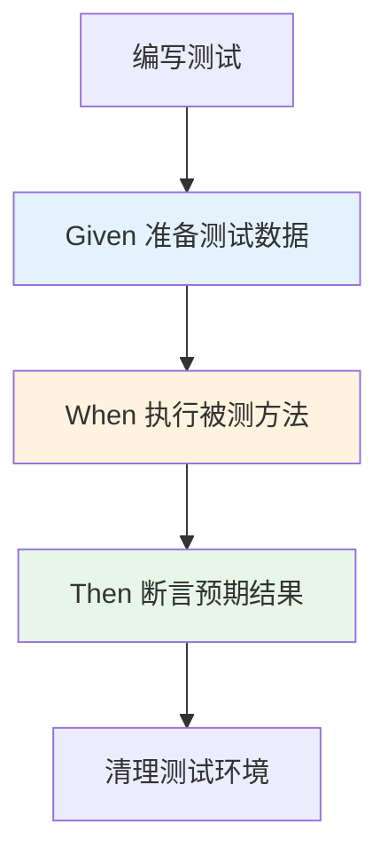

## 引言

你上一次写单元测试是什么时候？如果答案是"上次被 QA 打回之后"——那么你的系统里已经埋了多少颗定时炸弹？

据 IBM 研究，在编码阶段发现并修复 Bug 的成本是生产环境的 1/100。JUnit 作为 Java 单元测试的事实标准，不仅能让你"改代码不心虚"，还是 TDD（测试驱动开发）的基石。但很多开发者对 JUnit 的理解还停留在 `@Test` + `assertEquals`，忽略了 JUnit 5 的参数化测试、动态测试、`@ExtendWith` 扩展模型等现代特性。

读完本文，你将掌握：JUnit 4 到 JUnit 5 的核心差异对比、`@ExtendWith` 扩展模型如何替代 `@RunWith`、参数化测试和动态测试的实战用法，以及 Spring/Mockito 集成的最佳实践。

## 单元测试的重要性与 JUnit 的价值

手动测试是低效且不可持续的。自动化单元测试通过编写可重复运行的测试代码，解决了这些问题。

JUnit 作为 Java 单元测试框架的事实标准，提供了编写、组织和运行自动化测试所需的工具和结构：

* **自动化执行：** 一键运行所有测试，快速反馈代码变更是否引入 Bug。
* **集成构建工具：** 与 Maven、Gradle 无缝集成，在构建流程中自动执行测试。
* **集成 IDE：** Java IDE 都内置 JUnit 支持，方便编写和运行测试。
* **丰富的断言库：** 提供多种断言方法，方便检查代码输出。
* **灵活的测试组织：** 支持测试类、测试方法、测试套件等组织结构。

### JUnit 5 架构概览



JUnit 5 由三个子项目组成：

1. **JUnit Platform：** 平台层。定义启动测试框架的 API，负责发现和启动测试。
2. **JUnit Jupiter：** 编程模型。定义编写测试代码的 API 和扩展模型。
3. **JUnit Vintage：** 兼容层。提供 TestEngine 运行 JUnit 3/4 的测试。

## 单元测试基础原则

* **隔离性：** 测试应与其他部分隔离，不依赖外部环境。对依赖项使用 Mock 对象。
* **自动化：** 测试应能自动运行，无需人工干预。
* **快速：** 单元测试应执行得很快，以便频繁运行。
* **可重复：** 相同环境下多次运行应得到相同结果。
* **独立：** 测试之间互不依赖执行顺序。

## JUnit 核心概念

无论 JUnit 4 还是 JUnit 5，以下概念都是通用的：

* **Test Class (测试类)：** 包含测试方法的 Java 类。通常以 `Test` 结尾命名，放在 `src/test/java` 目录下。
* **Test Method (测试方法)：** 独立的功能验证单元。
* **Assertions (断言)：** 验证测试结果是否符合预期。
* **Fixtures (测试夹具)：** 测试方法执行前后的 Setup/Teardown 代码。

### 常用断言方法 (JUnit 5)

```java
import org.junit.jupiter.api.Assertions;
import org.junit.jupiter.api.Test;

class MyServiceTest {

    @Test
    void additionShouldReturnCorrectSum() {
        int expected = 5;
        int actual = 2 + 3;
        Assertions.assertEquals(expected, actual, "Addition result should be 5");
        Assertions.assertTrue(actual > 0, () -> "Sum should be positive");
    }

    @Test
    void shouldThrowException() {
        Assertions.assertThrows(IllegalArgumentException.class, () -> {
            throw new IllegalArgumentException("Invalid argument");
        });
    }
}
```

## JUnit 4 vs JUnit 5 对比

| 特性 | JUnit 4 | JUnit 5 | 对比说明 |
| :--- | :--- | :--- | :--- |
| **基础架构** | 单一 JAR，核心是 Runner (`@RunWith`) | **模块化平台** (Platform, Jupiter, Vintage) | JUnit 5 架构更灵活，解耦了测试发现和编程模型 |
| **注解包名** | `org.junit` | **`org.junit.jupiter.api`** | 新包避免与 JUnit 4 冲突 |
| **测试方法** | `@Test`（需 `public void`） | `@Test`（只需 `void`，不必 `public`） | JUnit 5 更简洁 |
| **Fixtures** | `@BeforeClass`, `@AfterClass`, `@Before`, `@After` | **`@BeforeAll`, `@AfterAll`, `@BeforeEach`, `@AfterEach`** | 语义更清晰，`@BeforeAll`/`@AfterAll` 必须是静态方法 |
| **异常断言** | `@Test(expected = Exception.class)` | **`Assertions.assertThrows()`** | JUnit 5 支持 Lambda，可获取异常对象进一步判断 |
| **忽略测试** | `@Ignore` | `@Disabled` | 语义更清晰 |
| **测试套件** | `@RunWith(Suite.class)` + `@SuiteClasses` | `@Suite` + `@SelectClasses` | JUnit 5 更灵活的测试分组 |
| **扩展模型** | `@RunWith`（有限，只能选一种 Runner） | **`@ExtendWith`**（Extension API） | **最重要的变化**，支持链式扩展 |
| **参数化测试** | `@RunWith(Parameterized.class)` | **`@ParameterizedTest`** + `@ValueSource`, `@MethodSource` | 语法更简洁，支持多种参数来源 |
| **动态测试** | 不支持 | **`@TestFactory`** | 运行时动态生成测试用例 |

### Fixtures 注解对比

```java
// JUnit 4
@BeforeClass
public static void setupClass() { }  // 所有测试前执行一次
@Before
public void setup() { }             // 每个测试前执行

// JUnit 5
@BeforeAll
static void setupAll() { }          // 所有测试前执行一次（必须静态）
@BeforeEach
void setupEach() { }               // 每个测试前执行
```

### 异常断言对比

```java
// JUnit 4
@Test(expected = ArithmeticException.class)
public void testDivisionByZeroJUnit4() {
    int result = 1 / 0;
}

// JUnit 5
@Test
void testDivisionByZeroJUnit5() {
    ArithmeticException ex = Assertions.assertThrows(ArithmeticException.class, () -> {
        int result = 1 / 0;
    });
    Assertions.assertTrue(ex.getMessage().contains("/ by zero"));
}
```

> **💡 核心提示**：JUnit 5 的 `assertThrows` 返回异常对象，可以对异常消息、cause 等进行进一步断言，而 JUnit 4 的 `@Test(expected)` 只能验证异常类型。

## JUnit 5 关键特性详解

### 扩展模型 (@ExtendWith)

JUnit 5 最重要的改进。通过实现 `Extension` 接口，并使用 `@ExtendWith(YourExtension.class)` 注解标注测试类或方法，可以实现各种定制：

```java
@ExtendWith(SpringExtension.class)   // Spring 集成
@ExtendWith(MockitoExtension.class)  // Mockito 集成
class MyServiceTest { }
```

> **💡 核心提示**：JUnit 5 支持多个 `@ExtendWith` 同时标注，Extension 按顺序链式执行。而 JUnit 4 的 `@RunWith` 只能指定一个 Runner。

### 参数化测试 (@ParameterizedTest)

允许使用不同参数多次运行同一个测试方法。

```java
@ParameterizedTest
@ValueSource(strings = { "racecar", "radar", "level" })
void palindromes(String candidate) {
    Assertions.assertTrue(
        candidate.equalsIgnoreCase(new StringBuilder(candidate).reverse().toString())
    );
}
```

### 动态测试 (@TestFactory)

允许在运行时根据条件或数据源生成测试用例。

```java
@TestFactory
Stream<DynamicTest> dynamicTestsFromCollection() {
    return Stream.of("A", "B", "C")
        .map(input -> dynamicTest("Test input " + input, () -> {
            Assertions.assertEquals(1, input.length());
        }));
}
```

### 嵌套测试 (@Nested)

```java
class UserServiceTest {
    @Nested
    class CreateUser {
        @Test
        void shouldSaveUserToDatabase() { }
    }

    @Nested
    class GetUser {
        @Test
        void withInvalidIdShouldThrowException() { }
    }
}
```

## 编写 JUnit 测试的最佳实践



* **测试隔离性：** 每个测试方法独立，不依赖执行顺序。利用 `@BeforeEach`/`@AfterEach` 保证干净环境。
* **清晰命名：** 测试方法名表达测试内容，如 `createUser_shouldSaveUserToDatabase()`。
* **单一职责：** 一个测试方法验证一个方面的功能。
* **边界值和异常：** 除了正常流程，也测试边界值、无效输入和异常情况。
* **使用 Mock 对象：** 对外部依赖使用 Mock，保证测试的隔离性和快速性。
* **频繁运行测试：** 编写代码、重构、提交前都应运行相关测试。

## 生产环境避坑指南

1. **测试依赖外部资源：** 单元测试不应连接真实数据库或外部服务。使用 H2 内存数据库或 Mockito Mock 替代。依赖外部资源的测试是集成测试，应单独分类。
2. **测试之间有顺序依赖：** 如果测试 B 依赖测试 A 的执行结果，说明测试设计有问题。每个测试应该是完全独立的。JUnit 5 不提供执行顺序保证，依赖顺序的测试可能随机失败。
3. **`@BeforeAll` 方法不是静态的：** JUnit 5 的 `@BeforeAll` 方法必须是 `static` 的（除非使用 `@TestInstance(Lifecycle.PER_CLASS)`）。忽略这一点会导致测试类初始化失败。
4. **测试方法设为 public：** JUnit 5 不要求测试方法为 `public`，使用包级私有方法（默认访问级别）即可。
5. **参数化测试忘记 `@ParameterizedTest`：** 使用 `@ValueSource` 等参数源时，必须同时使用 `@ParameterizedTest`，仅用 `@Test` 不会生效。
6. **断言消息不要使用硬编码字符串：** 使用 `() -> "message"` Lambda 形式，断言通过时不会构造消息字符串，提升性能。
7. **测试覆盖率≠测试质量：** 100% 覆盖率不代表没有 Bug。覆盖率指标关注的是"代码被执行过"，而非"正确性被验证过"。重点应该放在边界条件和异常场景的覆盖上。

## 行动清单

1. **检查点**：确认项目中 JUnit 5 依赖正确引入：`junit-jupiter` 包含 Platform + Jupiter + Vintage 所有组件。
2. **优化建议**：将 JUnit 4 项目迁移到 JUnit 5。JUnit 5 提供了 JUnit Vintage 兼容层，可以逐步迁移，不必一次性全部修改。
3. **Mock 集成**：使用 `@ExtendWith(MockitoExtension.class)` 替代 Mockito 的 `MockitoJUnitRunner`，同时支持 Spring 集成。
4. **测试规范**：采用 Given-When-Then 模式编写测试，每个测试方法验证一个场景，方法名清晰表达意图。
5. **扩展阅读**：推荐阅读《JUnit 5 User Guide》和《Test-Driven Development: By Example》（Kent Beck）。
