今天，我要给大家安利一个能让你文章逻辑瞬间清晰、专业度up up的神器——Mermaid！🚀

你是否也曾为了在一篇文章里展示**流程图、排期图、关系图**而抓狂？是不是在N个绘图软件之间反复横跳，被繁琐的操作和不统一的风格搞得心态爆炸？

别担心，从今天起，你只需要一个工具，就能搞定所有图表需求。它就是我们今天的主角——**Mermaid**，一个名副其实的可视化表达“瑞士军刀”！

## 引言：文章表现力升级！你只需要一个“代码式”绘图工具
“代码式”绘图听起来是不是有点劝退？别急！此“代码”非彼“代码”，Mermaid的语法简单到让你惊呼“So easy!”。它能让你**像写Markdown一样画图**，实现**文本即图表**。

**Mermaid的核心价值，对于我们自媒体人来说，简直是量身定制：**

+ **高效统一**：用一种语法，绘制流程图、时序图、甘特图等十数种专业图表，告别工具切换。
+ **易于维护**：修改图表就像修改文字一样方便，图文同源，管理极简。
+ **高颜值**：矢量渲染，在任何设备、任何主题（亮/暗）下都清晰美观。
+ **完美融入**：无缝嵌入你熟悉的Markdown工作流，沉浸式创作。

这篇文章将是你通往Mermaid全能高手的直通车。我们将从最基础也是最强大的**流程图**开始，深度精解，为你打下坚实基础；然后带你快速游览Mermaid的图表宇宙，解锁更多表达技能。准备好了吗？Let's Go!

**优缺点对比：**

✅ 传统绘图痛点

+ 画图流程繁琐，改动麻烦
+ 图片格式难维护，版本控制不方便
+ 导出的图片模糊、不支持暗黑模式

✅ Mermaid 优势

+ **文本即图**：用类似 Markdown 的语法生成图表
+ **便于维护**：修改图只需改文字
+ **支持版本管理**：直接纳入你的 Git 项目
+ **跨平台兼容**：Typora、Obsidian、VS Code、博客系统都支持！

## 第一部分：万变不离其宗——流程图 (Flowchart) 深度精解
流程图是我们最常用、也是Mermaid功能最完善的图表类型。掌握了它，其他图表将一通百通。本部分将极尽详细，带你从零到一。

### 1.1 基础骨架
万事开头难，但Mermaid的开头异常简单。我们先来看一个流程图最最基本的结构：

+ **声明图表类型与方向**：`graph TD` 是最常用的声明，代表“Graph Top Down”，即从上到下的流程图。你也可以用`flowchart TD`，效果完全一样。
+ **定义节点**：节点就是流程中的一个个框框。语法是 `ID[显示的文字]`。`ID`是节点的唯一标识，方便后续连接，可以随便取，但最好有意义。
+ **连接节点**：用 `-->` 连接两个节点的ID，表示流程从一个节点走向另一个。

**【实操】你的第一个流程图**

下面是展示“创作一篇爆款文章”的简单流程的代码和图表示例：

```markdown
graph TD
    A[构思与选题] --> B[撰写与配图]
    B --> C[发布与推广]
```

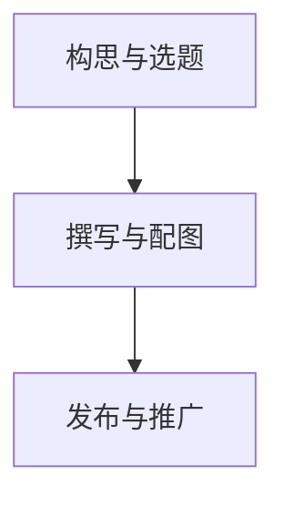

看到了吗？就这么三行简单的文本，一个清晰的流程图就诞生了！

### 1.2 节点形状的“百变星君”
Mermaid提供了多种节点形状，不同的形状在流程图中往往有其约定俗成的含义。用对形状，能让你的流程图更专业，信息传达更精准。

| 形状 | 语法示例 | 含义/常用场景 |
| :--- | :--- | :--- |
| 默认矩形 | `id[文字]` | 普通步骤、操作 |
| 圆角矩形 | `id(文字)` | 开始、结束、步骤 |
| 体育场形 | `id([文字])` | 特定步骤、子流程入口/出口 |
| 子程序形 | `id[[文字]]` | 可复用的子流程、预定义过程 |
| 圆柱形 | `id[(文字)]` | 数据库、数据存储 |
| 圆形 | `id((文字))` | 连接点、特定状态 |
| **菱形** | `id{文字}` | **判断、决策点** |


**【实操】带判断的流程图**

菱形是流程图的灵魂，它代表“决策”。让我们模拟一个“要不要写这篇文章？”的决策流程：

```markdown
graph TD
    Start(开始构思) --> Decision{这个选题我有热情吗?}
    Decision -- 有 --> Write[马上动笔!]
    Decision -- 没有 --> Think_Again(再想想别的选题)
    Write --> End((完成))
    Think_Again --> End
```

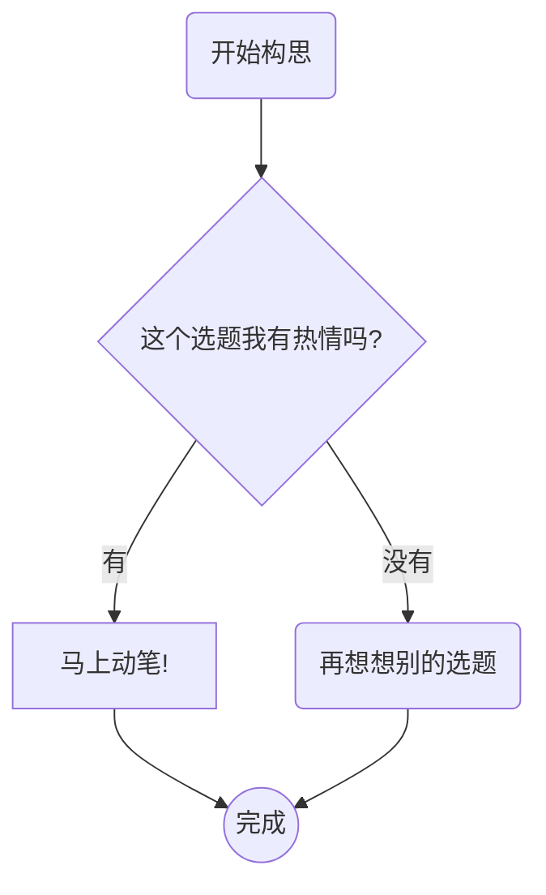

### 1.3 连接线的“千丝万缕”
连接线不仅指明方向，还能承载额外信息，甚至通过样式暗示不同的逻辑关系。

+ **实线箭头**：`-->` (标准)
+ **开放箭头/直线**：`---`
+ **带文字的连接**：`--文字-->` 或 `---|文字|`
+ **虚线箭头**：`-.->` (常用于表示可选或弱依赖)
+ **粗线箭头**：`==>` (常用于强调主流程)

**【实操】展示不同连接线的效果**

```markdown
graph TD
    A[选题] ==> B(撰写)
    B --主要内容--> C[配图]
    B -.可选步骤.-> D[引用参考文献]
    C --- E[完成]
    D --- E
```

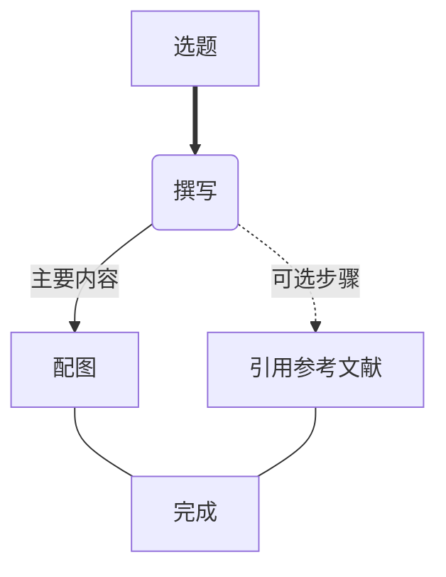

### 1.4 文本内容的“精雕细琢”
如果节点里的文字太长怎么办？很简单，使用HTML的`<br>`标签来强制换行。

```markdown
graph TD
    A[这是一个<br>内容非常长<br>需要换行的节点]
```

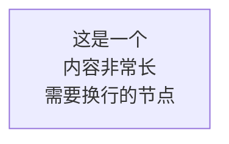

### 1.5 图表方向的“随心所欲”
除了从上到下，你还可以改变流程图的整体方向。

+ `TD` 或 `TB`：从上到下 (Top Down / Top Bottom)
+ `LR`：从左到右 (Left to Right)
+ `RL`：从右到左 (Right to Left)
+ `BT`：从下到上 (Bottom Top)

**【实操】从左到右的时间线式流程**

```markdown
graph LR
    A[周一: 选题] --> B[周二: 写稿] --> C[周三: 配图] --> D[周四: 发布]
```

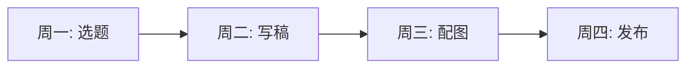

### 1.6 语义化书写与最佳实践
**【深度】**：所谓“语义化”，就是让你的绘图代码本身也变得易于阅读和维护。这是一种专业的编程习惯，同样适用于Mermaid。

+ **使用有意义的ID**：用 `Decision_Login` 代替 `A`，用 `Step1_GetData` 代替 `B`。当流程图变得复杂时，这能帮你快速定位和理解每个节点的功能。
+ **保持简洁**：一个节点只做一件事，避免在一个节点里塞入过多信息。
+ **逻辑清晰**：确保流程有明确的开始和结束，避免出现死循环或断头路。

### 1.7 用“子图 (Subgraphs)”组织复杂流程
当流程非常复杂时，可以用 `subgraph` 将其分解为几个逻辑阶段，就像给文件创建文件夹一样。

**【实操】一个完整的内容创作流程**

```markdown
graph TD
    subgraph "阶段一：策划"
        direction LR
        plan_idea[收集灵感] --> plan_topic[确定主题]
    end

    subgraph "阶段二：制作"
        write_draft[撰写初稿] --> edit_proofread[编辑校对]
    end

    subgraph "阶段三：发布"
        publish_platform[选择平台] --> publish_promote[推广引流]
    end

    plan_topic --> write_draft
    edit_proofread --> publish_platform
```

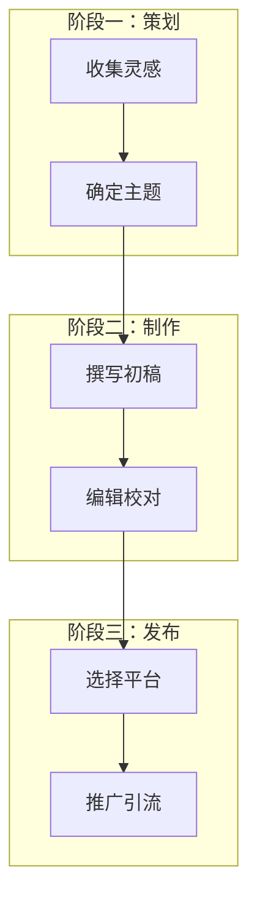

至此，你已经掌握了流程图的绝大部分精髓！接下来，让我们一起探索Mermaid宇宙中其他闪亮的星辰。

## 第二部分：探索 Mermaid 宇宙——核心图表实战速览
从这里开始，每种图表都是一个独立的迷你教程，助你快速解锁新技能。

### 2.1 时序图 (Sequence Diagram)：讲清“谁和谁说了啥”
**场景解读**：当你需要清晰地展示**多个角色之间按时间顺序发生的交互**时，时序图是最佳选择。例如：

+ 用户登录网站的完整过程。
+ 一次客服对话的来龙去脉。
+ 一个故事中不同人物的对话和行为。

**核心语法与示例**：

+ `sequenceDiagram`: 声明时序图。
+ `participant A`: 定义一个参与者A。
+ `A->>B: 消息内容`: A向B发送一条带实心箭头的消息。
+ `B-->>A: 回应内容`: B向A返回一条带虚线箭头的消息。
+ `loop/alt/opt`: 分别表示循环、多选一、可选流程。
+ `autonumber:`自动编号。
+ `Note over A：`添加注释。
+ `alt 某流程 end：`流程分类。

**【实操】用户评论文章的时序**

```markdown
sequenceDiagram
autonumber
    participant User as 用户
    participant Browser as 浏览器
    participant Server as 服务器

		Note over User: 发表评论流程
    User->>Browser: 点击“发表评论”按钮
    Browser->>Server: 发送评论内容
    activate Server
    Server-->>Browser: 评论成功
    deactivate Server
    Browser-->>User: 页面显示“评论成功”
```


### 2.2 甘特图 (Gantt Chart)：内容规划与项目管理
**场景解读**：自媒体人的“内容日历”神器！完美适用于**展示任务的排期、时长和进度**。

+ 规划一个月的内容选题、撰稿、发布时间表。
+ 展示一个线上活动的筹备进度。

**核心语法与示例**：

+ `gantt`: 声明甘特图。
+ `title`: 图表标题。
+ `dateFormat`: 定义日期格式。
+ `section`: 定义一个阶段。
+ `任务名 :done, id, after a, 3d`: 定义一个已完成（done）、ID为id、在任务a之后开始、持续3天的任务。

**【实操】五月内容创作计划**

```markdown
gantt
    title 五月内容创作计划
    dateFormat YYYY-MM-DD
    section 选题与策划
    选题调研 :done, task1, 2025-05-01, 3d
    拟定大纲 :active, task2, after task1, 2d
    section 制作与发布
    文章A撰写 :task3, 2025-05-06, 4d
    文章B视频脚本 :task4, 2025-05-08, 3d
```

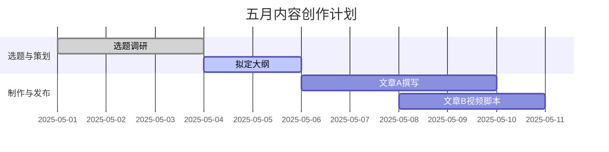

### 2.3 类图 (Class Diagram)：“概念关系”可视化
**场景解读**：**【重点转译】** 别被“类图”这个程序员味十足的名字吓到！对于我们创作者，可以把它理解为**“概念关系图”**或**“事物蓝图”**。它非常适合用来：

+ 梳理一组核心概念及其内在关系（例如，分析“新媒体矩阵”中，公众号、视频号、小红书各自的特点和相互的引流关系）。
+ 描绘一个虚构世界中的种族、角色、技能体系。

**核心语法与示例**：

+ `classDiagram`: 声明类图。
+ `class A`: 定义一个概念（类）A。
+ `A : +String name`: 为A定义一个名为name的属性。
+ `A : +create()`: 为A定义一个名为create的行为（方法）。
+ `A --|> B`: A继承B（A是B的一种）。
+ `A *-- "1" B`: A和B是组合关系。

**【实操】“自媒体账号”概念关系图**

```markdown
classDiagram
    class Account {
        +String name
        +int followers
        +publish()
    }
    class ArticleAccount {
        +String platform
    }
    class VideoAccount {
        +int videoCount
    }

    Account <|-- ArticleAccount
    Account <|-- VideoAccount
```

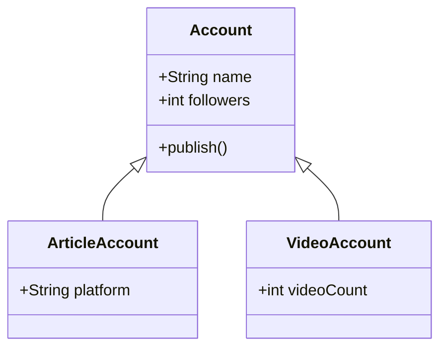

这张图清晰地表达了：“文章号”和“视频号”都是“自媒体账号”的一种。

### 2.4 Git图 (Git Graph)：展现“版本演进”故事
**场景解读**：**【重点转译】** 技术博主解释Git操作必备！但普通创作者也可以用它来**形象地展示一篇文章或一个设计的版本迭代过程**。

+ “我的爆款文章是如何从草稿一步步修改到定稿的”。
+ 展示你和一个协作者是如何共同完成一个策划案的。

**核心语法与示例**：

+ `gitGraph`: 声明Git图。
+ `commit`: 创建一个提交（一个版本）。
+ `branch new_feature`: 创建一个名为new_feature的分支。
+ `checkout new_feature`: 切换到new_feature分支。
+ `merge master`: 将master分支合并到当前分支。

**【实操】文章写作与修改过程**

```markdown
gitGraph
    commit id: "初稿完成"
    branch "v2-大改"
    checkout "v2-大改"
    commit id: "重写引言"
    commit id: "增加案例"
    checkout main
    commit id: "修正错别字"
    merge "v2-大改"
```

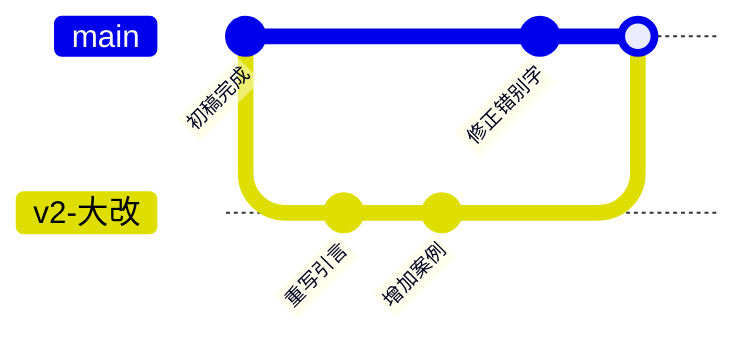

这张图生动地展示了主线（修正错别字）和支线（大改版）是如何并行，并最终合并成一个最终版的。

### 2.5 实体关系图 (ER Diagram)：梳理“信息结构”
**场景解读**：**【重点转译】** 当你需要解释**不同信息实体之间是如何相互关联**的时候，ER图是最好的工具，可以把它看作“信息族谱”。

+ 解释一个在线课程系统中，“学生”、“课程”、“订单”三者之间的关系。
+ 梳理你的个人知识库中，“书籍”、“笔记”、“标签”之间的关系。

**核心语法与示例**：

+ `erDiagram`: 声明ER图。
+ `ENTITY { type name }`: 定义一个实体及其属性。
+ `A ||--o{ B`: A和B是一对多关系（一个A对应多个B）。

**【实操】读者、文章、评论的关系**

```markdown
erDiagram
    READER ||--|{ ARTICLE : "writes"
    ARTICLE ||--|{ COMMENT : "has"
    READER ||--|{ COMMENT : "posts"

    READER {
        int id PK
        string name
    }
    ARTICLE {
        int id PK
        string title
        int reader_id FK
    }
    COMMENT {
        int id PK
        string content
        int article_id FK
        int reader_id FK
    }
```

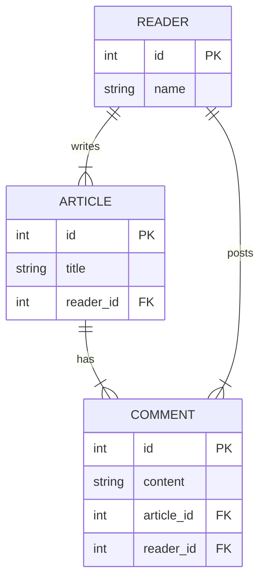

### 2.6 XY图 (XY Chart)：Markdown里的轻量数据图
**场景解读**：当你需要在文章中快速插入一个**简单的、非交互式的数据图表**（如折线图、柱状图），而不想动用Excel或专业图表库时，Mermaid的XY图是一个便捷的选择。

**【注意】**：此功能在Mermaid中相对较新（仍处于beta阶段），部分编辑器或平台可能尚未支持，使用前请先确认你的环境。

**核心语法与示例**：

+ `xychart-beta`: 声明XY图。
+ `title`: 图表标题。
+ `x-axis "月份" [Jan, Feb, Mar]`: 定义X轴。
+ `y-axis "收入" 0 --> 100`: 定义Y轴。
+ `bar [10, 20, 70]`: 绘制柱状图。
+ `line [5, 30, 60]`: 绘制折线图。

**【实操】上半年粉丝增长趋势**

```markdown
xychart-beta
    title "上半年粉丝增长趋势"
    x-axis "月份" [1, 2, 3, 4, 5, 6]
    y-axis "粉丝数 (万)" 0 --> 10
    bar [1.2, 2.5, 3.1, 5.5, 7.0, 9.8]
```

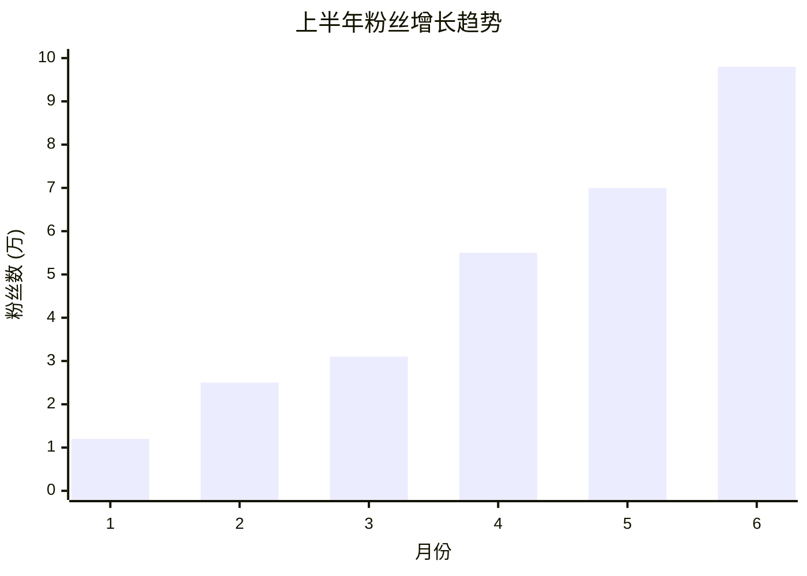

## 第三部分：常见错误 & 调试技巧
+ **常见问题 (FAQ)**：
  - **Q: 图表渲染不出来怎么办？**  
    A: 99%是语法错误。请仔细检查：1）`graph TD`等声明是否正确；2）箭头方向是否写反 (`--<`是错的)；3）节点ID是否重复；4）是否有拼写错误。强烈建议在带实时预览的编辑器中编写。
  - **Q: 我用的平台不支持Mermaid怎么办？**  
    A: 可以在Mermaid官方在线编辑器 (mermaid.live) 中制作，然后导出为SVG或PNG图片再使用。但这会失去文本化编辑的优势。
  - **Q: XY图为什么显示不出来？**  
    A: XY图是较新的功能，请确保你的编辑器或库支持较新版本的Mermaid。
+ **学习资源推荐**：
  - **Mermaid官方文档 (mermaid.js.org)**：最权威、最全面的学习资料。[https://mermaid.js.org/](https://mermaid.js.org/)
  - **Mermaid官方在线编辑器 (mermaid.live)**：无需安装任何软件，直接在线练习和导出。[https://mermaid.live](https://mermaid.live)

## 结语
你已经完成了Mermaid全能绘图指南的全部课程。无论是梳理复杂的逻辑、规划内容排期，还是展示精妙的关系结构，你都能用几行简单的代码，优雅地呈现出来。

Mermaid的真正魅力，在于它将专业图表的绘制能力，无缝地融入了我们自媒体人最熟悉的Markdown工作流中。它不仅提升了我们的创作效率，更重要的是，它武装了我们的**表达力**。

