## 引言

你是否也曾在技术博客中因为画一张架构图，在 Visio、Draw.io、ProcessOn 之间反复切换，最后导出的图片模糊不清、风格不统一，改一个字就要全部重做？

Mermaid 用"文本即图表"的理念彻底解决了这个痛点——像写 Markdown 一样画图，几行文本就能生成专业的流程图、时序图、甘特图。它被 GitHub、GitLab、Notion、Obsidian 等主流平台原生支持，版本管理直接纳入 Git，暗黑模式自动适配。

读完本文，你将掌握：Mermaid 核心图表类型（流程图、时序图、类图）的语法与实战、复杂流程的组织方式（Subgraph）、常见渲染错误的排查方法，以及在技术博客中高效使用 Mermaid 的最佳实践。

## Mermaid 核心价值

"代码式"绘图听起来劝退？Mermaid 的语法简单到让你惊呼"So easy!"。它能让你**像写 Markdown 一样画图**。

### Mermaid vs 传统绘图

| 维度 | 传统绘图工具 | Mermaid |
| :--- | :--- | :--- |
| **创作方式** | 拖拽图形、连线 | 文本描述，自动生成 |
| **修改成本** | 改动大，需手动调整布局 | 改文字即可 |
| **版本管理** | 二进制文件，diff 困难 | 纯文本，Git diff 友好 |
| **格式输出** | 导出 PNG/SVG，可能模糊 | 矢量渲染，始终清晰 |
| **暗色模式** | 不支持或需手动调整 | 自动适配 |
| **平台支持** | 需要安装软件 | GitHub/GitLab/Obsidian 原生支持 |

### Mermaid 支持的图表类型

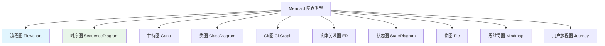
```mermaid
flowchart TD
    A[Mermaid 图表类型] --> B[流程图 Flowchart]
    A --> C[时序图 SequenceDiagram]
    A --> D[甘特图 Gantt]
    A --> E[类图 ClassDiagram]
    A --> F[Git图 GitGraph]
    A --> G[实体关系图 ER]
    A --> H[状态图 StateDiagram]
    A --> I[饼图 Pie]
    A --> J[思维导图 Mindmap]
    A --> K[用户旅程图 Journey]

    style B fill:#e1f5fe
    style C fill:#e8f5e9
```

> **💡 核心提示**：Mermaid 有 `graph` 和 `flowchart` 两种流程图声明方式。`flowchart` 是新版语法，支持更多特性（如子图内独立方向、更丰富的连接线）。推荐使用 `flowchart` 替代 `graph`。

## 流程图 (Flowchart) 深度精解

### 基础骨架

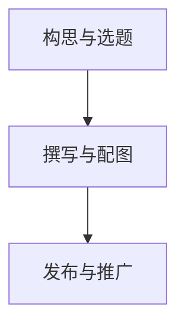
```mermaid
flowchart TD
    A[构思与选题] --> B[撰写与配图]
    B --> C[发布与推广]
```

* **声明图表类型与方向：** `flowchart TD` 表示从上到下的流程图。
* **定义节点：** `ID[显示的文字]`，`ID` 是节点的唯一标识。
* **连接节点：** `-->` 连接两个节点。

### 节点形状

| 形状 | 语法示例 | 含义/常用场景 |
| :--- | :--- | :--- |
| 默认矩形 | `id[文字]` | 普通步骤、操作 |
| 圆角矩形 | `id(文字)` | 开始、结束、步骤 |
| 体育场形 | `id([文字])` | 子流程入口/出口 |
| 子程序形 | `id[[文字]]` | 可复用的子流程 |
| 圆柱形 | `id[(文字)]` | 数据库、数据存储 |
| 菱形 | `id{文字}` | **判断、决策点** |

### 带判断的流程图

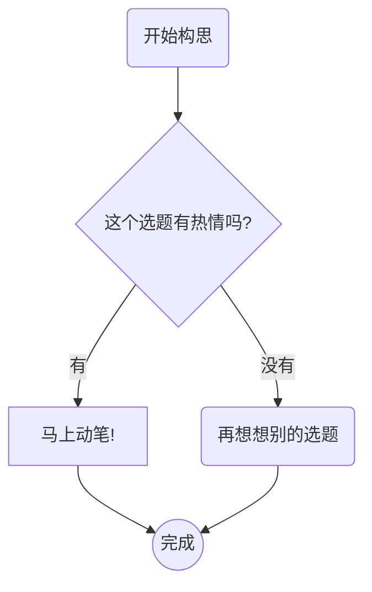
```mermaid
flowchart TD
    Start(开始构思) --> Decision{这个选题有热情吗?}
    Decision -- 有 --> Write[马上动笔!]
    Decision -- 没有 --> Think(再想想别的选题)
    Write --> End((完成))
    Think --> End
```

### 连接线类型

* **实线箭头：** `-->`（标准）
* **开放箭头/直线：** `---`
* **带文字的连接：** `--文字-->` 或 `---|文字|`
* **虚线箭头：** `-.->`（可选或弱依赖）
* **粗线箭头：** `==>`（强调主流程）

### 图表方向

* `TD` 或 `TB`：从上到下
* `LR`：从左到右
* `RL`：从右到左
* `BT`：从下到上

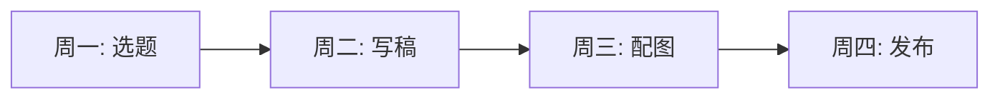
```mermaid
flowchart LR
    A[周一: 选题] --> B[周二: 写稿] --> C[周三: 配图] --> D[周四: 发布]
```

### 用子图 (Subgraph) 组织复杂流程

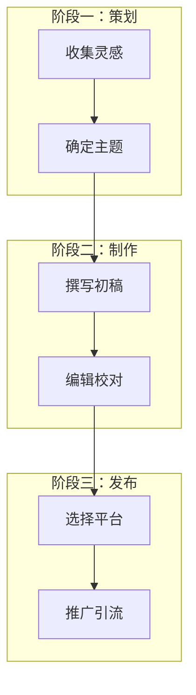
```mermaid
flowchart TD
    subgraph "阶段一：策划"
        direction LR
        plan_idea[收集灵感] --> plan_topic[确定主题]
    end

    subgraph "阶段二：制作"
        write_draft[撰写初稿] --> edit_proofread[编辑校对]
    end

    subgraph "阶段三：发布"
        publish_platform[选择平台] --> publish_promote[推广引流]
    end

    plan_topic --> write_draft
    edit_proofread --> publish_platform
```

### 语义化书写与最佳实践

* **使用有意义的 ID：** 用 `Decision_Login` 代替 `A`，复杂流程中快速定位。
* **保持简洁：** 一个节点只做一件事。
* **逻辑清晰：** 确保流程有明确的开始和结束。

## 时序图 (Sequence Diagram)：讲清"谁和谁说了啥"

**场景解读：** 当你需要清晰地展示**多个角色之间按时间顺序发生的交互**时，时序图是最佳选择。例如用户登录流程、微服务间调用链路。

**核心语法：**

* `sequenceDiagram`：声明时序图。
* `participant A`：定义参与者。
* `A->>B: 消息`：A 向 B 发送消息（实线箭头）。
* `B-->>A: 回应`：B 向 A 返回消息（虚线箭头）。
* `activate/deactivate`：激活/停用参与者生命线。
* `loop/alt/opt`：循环、条件分支、可选流程。
* `autonumber`：自动编号。
* `Note over A：`：添加注释。

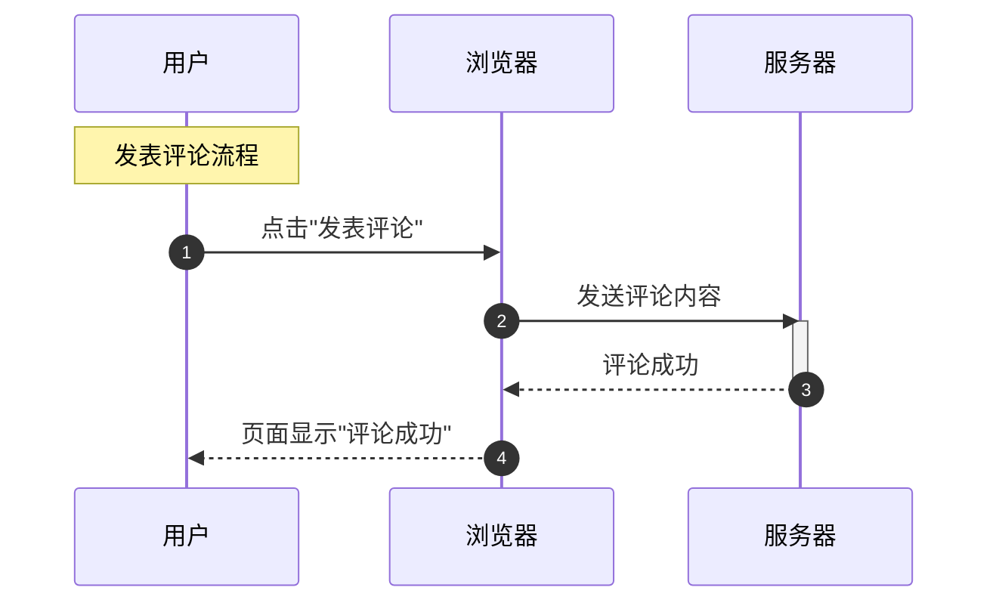
```mermaid
sequenceDiagram
    autonumber
    participant User as 用户
    participant Browser as 浏览器
    participant Server as 服务器

    Note over User: 发表评论流程
    User->>Browser: 点击"发表评论"
    Browser->>Server: 发送评论内容
    activate Server
    Server-->>Browser: 评论成功
    deactivate Server
    Browser-->>User: 页面显示"评论成功"
```

## 甘特图 (Gantt Chart)：内容规划与项目管理

**场景解读：** 展示任务的排期、时长和进度，完美适用于项目管理和内容日历。

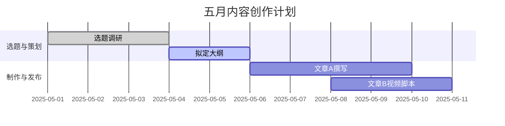
```mermaid
gantt
    title 五月内容创作计划
    dateFormat YYYY-MM-DD
    section 选题与策划
    选题调研 :done, task1, 2025-05-01, 3d
    拟定大纲 :active, task2, after task1, 2d
    section 制作与发布
    文章A撰写 :task3, 2025-05-06, 4d
    文章B视频脚本 :task4, 2025-05-08, 3d
```

## 类图 (Class Diagram)：概念关系可视化

**场景解读：** 梳理一组核心概念及其内在关系。适合展示对象间的继承、组合、依赖关系。

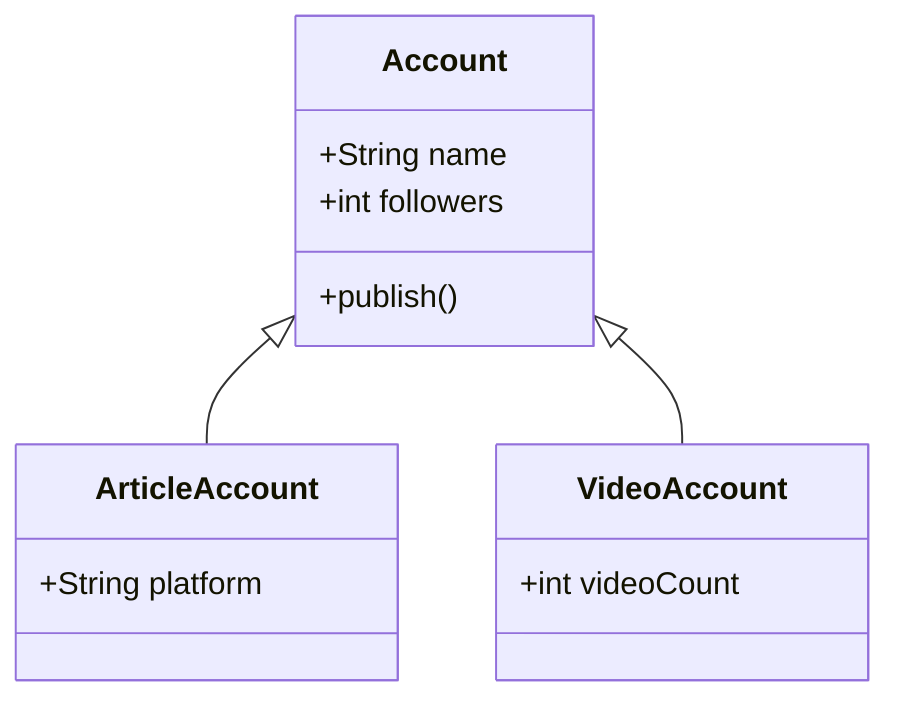
```mermaid
classDiagram
    class Account {
        +String name
        +int followers
        +publish()
    }
    class ArticleAccount {
        +String platform
    }
    class VideoAccount {
        +int videoCount
    }

    Account <|-- ArticleAccount
    Account <|-- VideoAccount
```

## Git图 (Git Graph)：展现版本演进

**场景解读：** 解释 Git 操作或展示版本迭代过程。

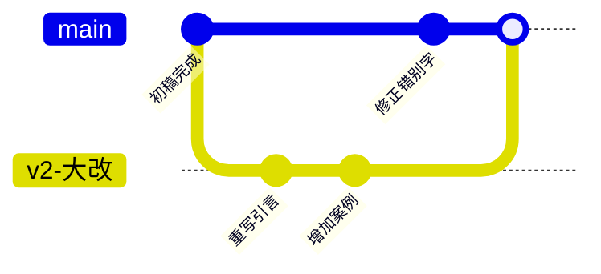
```mermaid
gitGraph
    commit id: "初稿完成"
    branch "v2-大改"
    checkout "v2-大改"
    commit id: "重写引言"
    commit id: "增加案例"
    checkout main
    commit id: "修正错别字"
    merge "v2-大改"
```

## 实体关系图 (ER Diagram)：梳理信息结构

**场景解读：** 解释不同信息实体之间的关联关系。

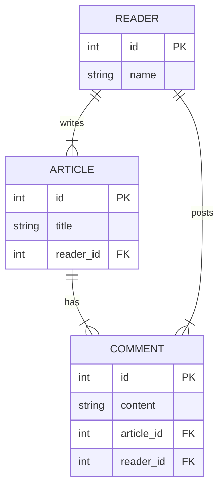
```mermaid
erDiagram
    READER ||--|{ ARTICLE : "writes"
    ARTICLE ||--|{ COMMENT : "has"
    READER ||--|{ COMMENT : "posts"

    READER {
        int id PK
        string name
    }
    ARTICLE {
        int id PK
        string title
        int reader_id FK
    }
    COMMENT {
        int id PK
        string content
        int article_id FK
        int reader_id FK
    }
```

## 常见错误与调试技巧

### 常见问题排查流程

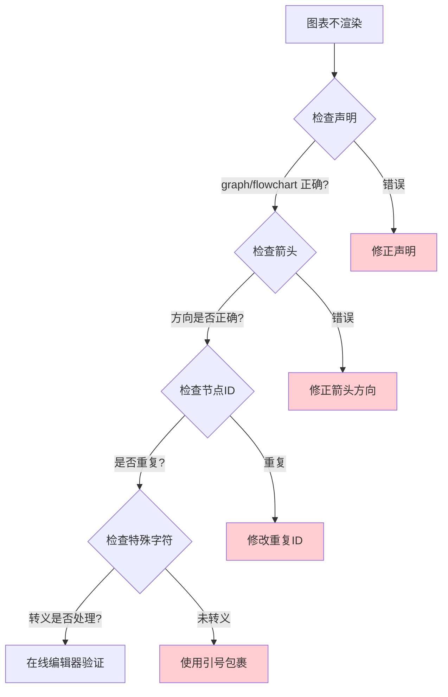
```mermaid
flowchart TD
    A[图表不渲染] --> B{检查声明}
    B -->|graph/flowchart 正确?| C{检查箭头}
    B -->|错误| Fix1[修正声明]
    C -->|方向是否正确?| D{检查节点ID}
    C -->|错误| Fix2[修正箭头方向]
    D -->|是否重复?| E{检查特殊字符}
    D -->|重复| Fix3[修改重复ID]
    E -->|转义是否处理?| F[在线编辑器验证]
    E -->|未转义| Fix4[使用引号包裹]

    style Fix1 fill:#ffcdd2
    style Fix2 fill:#ffcdd2
    style Fix3 fill:#ffcdd2
    style Fix4 fill:#ffcdd2
```

* **图表渲染不出来？** 99% 是语法错误。检查：1）声明是否正确；2）箭头方向是否写反；3）节点 ID 是否重复；4）是否有拼写错误。
* **平台不支持 Mermaid？** 在 Mermaid 官方在线编辑器 (mermaid.live) 中制作，导出为 SVG/PNG。
* **特殊字符需要转义：** 节点文字中包含 `[]{}()` 等特殊字符时，用双引号包裹：`A["包含[括号]的文字"]`。

### 学习资源推荐

* **Mermaid 官方文档：** [https://mermaid.js.org/](https://mermaid.js.org/)
* **Mermaid 在线编辑器：** [https://mermaid.live](https://mermaid.live)

## 核心图表类型对比表

| 图表类型 | 语法声明 | 适用场景 | 复杂度 |
| :--- | :--- | :--- | :--- |
| **流程图** | `flowchart TD/LR` | 业务流程、算法步骤、操作指引 | 低-高 |
| **时序图** | `sequenceDiagram` | 服务间调用、请求响应流程 | 中 |
| **甘特图** | `gantt` | 项目排期、任务进度 | 低 |
| **类图** | `classDiagram` | 概念关系、架构设计 | 中 |
| **Git图** | `gitGraph` | 版本管理、分支策略 | 低 |
| **ER图** | `erDiagram` | 数据模型、实体关系 | 中 |
| **状态图** | `stateDiagram-v2` | 状态机、生命周期 | 中 |
| **饼图** | `pie` | 占比展示、统计分布 | 低 |

## 生产环境避坑指南

1. **`graph` 和 `flowchart` 混用：** `graph` 是旧语法，部分新特性（如子图内独立方向 `direction LR`）仅在 `flowchart` 中支持。统一使用 `flowchart`。
2. **节点 ID 中包含特殊字符：** `[`、`]`、`(`、`)`、`{`、`}` 在 Mermaid 中有特殊含义。ID 中不要包含这些字符，显示文本用引号包裹。
3. **中文节点需要引号：** 虽然大多数情况下中文可以直接使用，但包含空格或标点时需要用引号：`A["用户登录流程"]`。
4. **循环引用导致渲染失败：** 流程图中的循环连接（A -> B -> A）可能导致布局引擎崩溃。使用 `~~~` 创建隐藏连接来引导布局。
5. **大型图表性能问题：** 超过 100 个节点的流程图在某些编辑器中渲染缓慢。复杂流程应拆分为多个子图。
6. **版本兼容性：** Mermaid 不同版本语法可能有差异。在目标平台（如 GitHub）测试确认支持性，或使用在线编辑器导出 SVG 作为降级方案。
7. **Markdown 嵌套缩进问题：** Mermaid 代码块必须从行首开始，不能缩进。缩进会导致部分渲染器无法识别代码块。

## 行动清单

1. **检查点**：确认写作平台（Typora、Obsidian、GitHub 等）支持的 Mermaid 版本，使用兼容的语法。
2. **优化建议**：统一使用 `flowchart` 替代 `graph` 声明流程图，享受更多新特性。
3. **最佳实践**：使用有意义的节点 ID（如 `Step_ProcessOrder` 而非 `A`），复杂流程图使用 Subgraph 分组。
4. **工具推荐**：日常练习使用 [mermaid.live](https://mermaid.live) 在线编辑器，实时预览 + 导出 SVG。
5. **扩展阅读**：Mermaid 官方文档 [https://mermaid.js.org/](https://mermaid.js.org/) 是最权威的学习资料。
