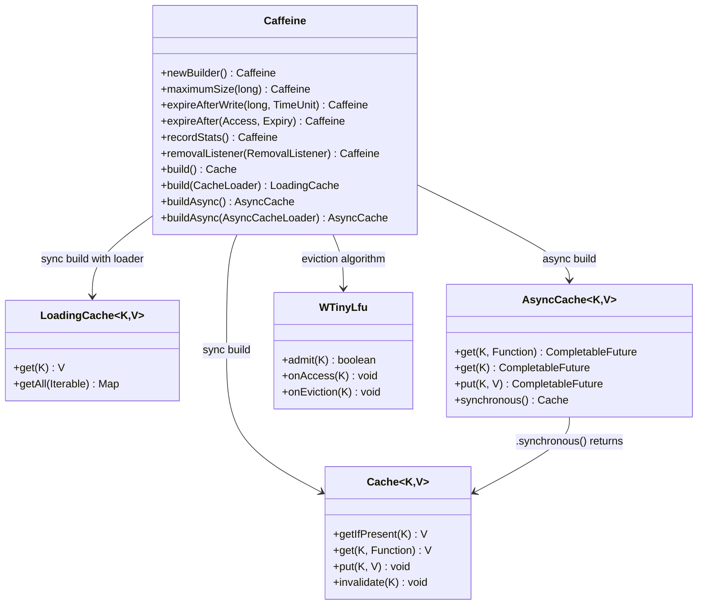
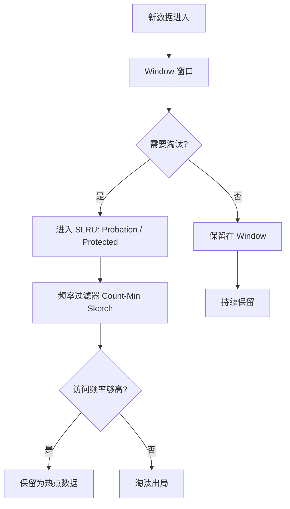
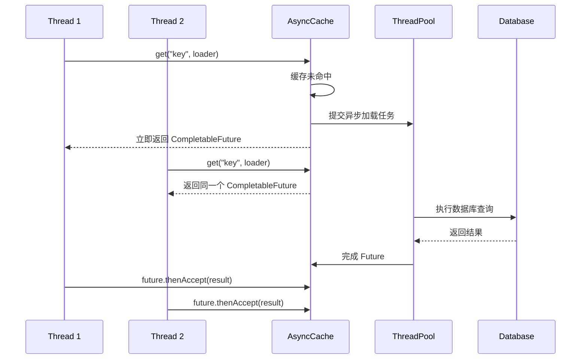

## 引言

当 Redis 网络延迟从 1ms 飙升到 50ms，你的服务响应时间跟着翻 5 倍——有没有一种方式能让热点数据真正"零延迟"返回？

本地缓存是性能优化中最容易落地、效果最立竿见影的手段。Caffeine 作为 Java 本地缓存的新一代王者，凭借 W-TinyLfu 淘汰算法和原生异步支持，性能碾压 Guava Cache，并已成为 Spring Boot 2+ 的默认推荐。理解 Caffeine 的底层设计、异步加载机制和淘汰策略，不仅能让你在性能优化时有据可依，也是面试中区分"普通开发"和"性能优化高手"的关键题。

读完本文，你将掌握：Caffeine 的 W-TinyLfu 淘汰算法原理、同步/异步缓存的正确使用姿势、缓存穿透和雪崩的预防方案，以及与 Guava Cache 的全方位对比与选型建议。

## Caffeine 核心特性

Caffeine 是一个高性能的 Java 缓存库，旨在成为 Guava Cache 的改进版本和替代品。底层实现进行了大量优化，在高并发场景下表现卓越。

### 核心架构



### Builder API

```java
import com.github.benmanes.caffeine.cache.Cache;
import com.github.benmanes.caffeine.cache.Caffeine;
import java.util.concurrent.TimeUnit;

Cache<String, String> cache = Caffeine.newBuilder()
    .maximumSize(1000)
    .expireAfterWrite(10, TimeUnit.MINUTES)
    .recordStats()
    .build();
```

### 常用淘汰策略

* **基于大小：** `maximumSize(long)`（按条目数），`maximumWeight(long)` + `weigher(Weigher)`（按权重）。
* **基于时间：** `expireAfterWrite(long, TimeUnit)`（写入后过期），`expireAfterAccess(long, TimeUnit)`（访问后过期），`expireAfter(Expiry)`（自定义过期策略）。
* **基于引用：** `weakKeys()`、`weakValues()`、`softValues()`（利用 JVM 弱引用/软引用进行回收）。

### W-TinyLfu 算法

**这是 Caffeine 在淘汰算法上的核心创新。** W-TinyLfu（Window TinyLfu）相较于 Guava Cache 使用的 LRU 变种，在缓存命中率方面通常表现更好，特别是在存在扫描访问模式（Scan Resistance）的场景下。



它通过一个小的"窗口"（Window）和 LFU 思想结合，利用 Count-Min Sketch 近似记录访问频率，更好地平衡了访问频率和访问时间。

> **💡 核心提示**：W-TinyLfu 的精髓在于" admission policy"（准入策略）。新数据先进入小窗口，只有被证明是"高频访问"的数据才能进入主缓存区。这使得 Caffeine 天生具备抗扫描能力——一次性大量不相关的数据不会挤掉原有的热点数据。

## 异步缓存 (AsyncCache)

异步缓存是 Caffeine 相较于 Guava Cache 的关键改进。利用 `CompletableFuture`，即使缓存未命中，加载过程也是异步非阻塞的。



### 异步缓存示例

```java
import com.github.benmanes.caffeine.cache.AsyncCache;
import com.github.benmanes.caffeine.cache.Caffeine;
import java.util.concurrent.CompletableFuture;
import java.util.concurrent.TimeUnit;

AsyncCache<String, String> asyncCache = Caffeine.newBuilder()
    .expireAfterWrite(10, TimeUnit.MINUTES)
    .maximumSize(1000)
    .buildAsync();

// 异步获取值
CompletableFuture<String> futureValue = asyncCache.get("myKey", key -> {
    return CompletableFuture.supplyAsync(() -> {
        // 模拟耗时加载操作
        try { TimeUnit.SECONDS.sleep(1); } catch (InterruptedException e) {}
        return key + "_async_value";
    });
});

futureValue.thenAccept(value -> {
    System.out.println("Async value: " + value);
}).exceptionally(e -> {
    System.err.println("Loading failed: " + e.getMessage());
    return null;
});
```

> **💡 核心提示**：异步缓存适合高并发场景。当缓存穿透发生时，同步缓存会导致所有未命中请求堆积在加载方法上；异步缓存则让每个请求立即拿到 `CompletableFuture`，加载完成后自动通知，避免线程阻塞。

## Caffeine 使用方式详解

### 添加依赖

```xml
<dependency>
    <groupId>com.github.benmanes.caffeine</groupId>
    <artifactId>caffeine</artifactId>
    <version>3.1.8</version>
</dependency>
```

### 创建 Cache 实例

```java
// 同步缓存 - 基本使用
Cache<String, String> cache = Caffeine.newBuilder()
    .maximumSize(100)
    .expireAfterWrite(5, TimeUnit.MINUTES)
    .recordStats()
    .build();

// 同步缓存 - 使用 CacheLoader
LoadingCache<String, String> loadingCache = Caffeine.newBuilder()
    .maximumSize(100)
    .expireAfterAccess(10, TimeUnit.MINUTES)
    .build(key -> {
        System.out.println("Loading data for key: " + key);
        return key + "_loaded_value";
    });

// 异步缓存 - 使用 AsyncCacheLoader
AsyncCache<String, String> asyncCacheWithLoader = Caffeine.newBuilder()
    .expireAfterWrite(5, TimeUnit.MINUTES)
    .maximumSize(100)
    .buildAsync(new com.github.benmanes.caffeine.cache.AsyncCacheLoader<String, String>() {
        @Override
        public CompletableFuture<String> asyncLoad(String key, java.util.concurrent.Executor executor) {
            return CompletableFuture.supplyAsync(() -> {
                return key + "_async_loaded_value";
            }, executor);
        }
    });
```

### 存/取值

* **`put(key, value)`：** 存入值。
* **`getIfPresent(key)`：** 存在则返回值，否则返回 null。
* **`get(key, mappingFunction)`：** 存在则返回值，否则执行 mappingFunction 计算并放入缓存。
* **`get(key, loader)` (LoadingCache)：** 存在则返回值，否则调用 CacheLoader.load() 加载。

```java
// 同步缓存存取
cache.put("key1", "value1");
String value1 = cache.getIfPresent("key1");
String value2 = cache.get("key2", k -> "value_from_mapping_" + k);
String value3 = loadingCache.get("key3");

// 异步缓存存取
CompletableFuture<String> futureValue = asyncCacheWithLoader.get("asyncKey2");
futureValue.thenAccept(value -> System.out.println("Got async value: " + value));
```

### 失效 (Invalidate)

* `invalidate(key)`：失效单个 Key。
* `invalidateAll(keys)`：失效多个 Key。
* `invalidateAll()`：失效所有缓存条目。

### 统计 (Statistics)

```java
Cache<String, String> cache = Caffeine.newBuilder()
    .maximumSize(10)
    .recordStats()
    .build();

cache.put("a", "1");
cache.put("b", "2");
cache.getIfPresent("a"); // Hit
cache.getIfPresent("c"); // Miss

System.out.println("Stats: " + cache.stats());
// Output: CacheStats{hitCount=1, missCount=1, loadSuccessCount=0, ...}
```

## Caffeine vs Guava Cache 全方位对比

| 特性 | Guava Cache | Caffeine | 对比说明 |
| :--- | :--- | :--- | :--- |
| **性能** | 良好 | **卓越** | Caffeine 通过 W-TinyLfu 和底层优化减少锁竞争 |
| **淘汰算法** | LRU 变种 | **W-TinyLfu** | W-TinyLfu 在复杂访问模式下命中率更高 |
| **异步缓存** | 不支持 | **原生 AsyncCache** | Caffeine 更适合异步/响应式编程 |
| **加载器** | CacheLoader (同步) | CacheLoader + **AsyncCacheLoader** | Caffeine 支持非阻塞异步加载 |
| **过期策略** | expireAfterWrite/Access | 同上 + **自定义 Expiry** | Caffeine 支持 per-key 自定义过期 |
| **维护状态** | 维护模式 | **积极开发** | Guava Cache 不再积极开发新功能 |
| **Spring 集成** | 支持 | **Spring Boot 2+ 默认推荐** | 新项目 Caffeine 是首选 |
| **API 相似度** | 极高 | 极高 | 从 Guava 迁移到 Caffeine 成本很低 |

### 选型建议

* **新项目：** **强烈推荐使用 Caffeine。** 性能更好、支持异步、社区活跃、官方推荐。
* **遗留项目：** 如果 Guava Cache 性能满足要求可继续使用。遇到性能瓶颈或希望升级技术栈时，迁移到 Caffeine 是不错的选择——API 高度相似，迁移成本低。

## 生产环境避坑指南

1. **`maximumSize` 是必选项：** 不设置 `maximumSize` 等于创建了一个无界缓存，最终会导致 OOM。生产环境必须根据可用内存设置合理上限。
2. **异步缓存的线程池要独立：** `CompletableFuture.supplyAsync()` 默认使用 `ForkJoinPool.commonPool()`，多个缓存共享同一个池可能导致线程饥饿。建议为缓存加载创建独立的 `Executor`。
3. **过期时间是惰性的：** 和 Guava Cache 一样，Caffeine 也是惰性过期。过期条目在下次访问或淘汰时才被清除。定期调用 `cache.cleanUp()` 可主动清理。
4. **`get(key, loader)` 的 loader 异常传播：** 如果加载函数抛出异常，异常会传播给调用方。建议在 loader 内部捕获异常并返回 null 或默认值，避免雪崩。
5. **本地缓存与 Redis 的双写一致性：** 如果同时使用 Caffeine 和 Redis，需要设计缓存失效通知机制（如通过 MQ 广播失效事件），否则各节点本地缓存数据会不一致。
6. **`recordStats()` 的监控要接入：** 开启统计后，需要通过监控平台暴露命中率、淘汰率等指标。命中率低于 50% 说明缓存策略有问题。
7. **W-TinyLfu 需要预热时间：** Caffeine 的 W-TinyLfu 算法在启动初期命中率较低，需要经过一段时间的访问模式学习后才能达到最佳命中率。启动阶段建议配合 Redis 兜底。

## 行动清单

1. **检查点**：确认所有 Caffeine Cache 实例都设置了 `maximumSize`，避免无界缓存导致 OOM。
2. **优化建议**：为新项目统一使用 Caffeine，废弃项目中的 Guava Cache。API 高度相似，迁移通常只需改 import 和 `CacheBuilder` 为 `Caffeine.newBuilder()`。
3. **异步场景**：高并发场景下使用 `AsyncCache` + 独立 `Executor`，避免缓存穿透导致线程堆积。
4. **监控建议**：开启 `recordStats()`，将命中率纳入监控告警体系，低于 50% 时及时分析调整。
5. **扩展阅读**：推荐研究 W-TinyLfu 算法原始论文 "TinyLFU: A Highly Efficient Cache Admission Policy"，深入理解 Count-Min Sketch 在频率统计中的应用。
