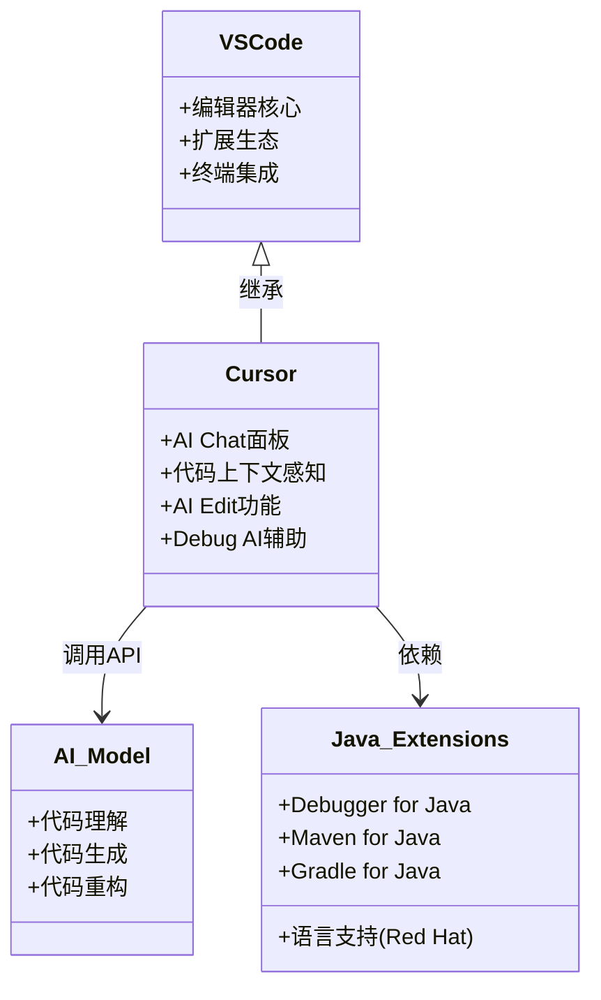
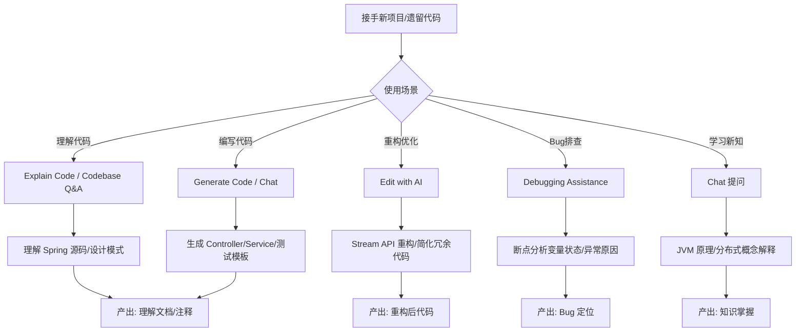

## 引言

你以为 IDE 的未来只是更智能的代码补全吗？当 AI 能直接理解整个项目代码库、一键重构复杂逻辑、甚至在断点时帮你分析 Bug 根因——传统的开发工作流将被彻底颠覆。Cursor 作为首款 AI-first IDE，正在重新定义开发者与代码的交互方式。读完本文，你将掌握 Cursor 的 6 大核心 AI 功能、Java 场景下的高效工作流配置，以及如何用 AI 辅助解决生产环境难题。无论你是想了解 AI 辅助开发的趋势，还是想立即提升日常编码效率，这篇文章都能给你可落地的实操方案。

---

## Cursor IDE 高效使用指南：拥抱 AI，开启 Java 开发新范式

### 开发者工具的演进与 AI 的变革

我们所使用的开发工具在不断进步。从命令行编译、手动管理依赖，到集成编译器、调试器、版本控制的现代化 IDE，再到自动化构建工具和云IDE。每一次演进都极大地提升了开发效率。

如今，AI 正为开发者工具带来一场新的变革。AI 不仅可以提供代码补全或建议，更可以理解代码上下文、解释复杂代码、甚至直接参与代码的生成和修改。Cursor IDE 就是在这种变革背景下诞生的 AI-first IDE。

为什么作为有经验的 Java 开发者值得关注并尝试 Cursor？

* **探索新的工作流：** 体验 AI 原生集成的开发模式，学习如何与 AI 更高效地协同工作。
* **提升开发效率潜力：** 利用 AI 的代码生成、解释、修改能力，减少重复劳动，加快问题解决速度。
* **理解 AI 辅助开发的趋势：** 提前适应未来可能的开发范式。
* **增强解决问题能力：** AI 可以作为强大的辅助工具，帮助我们理解复杂代码、排查问题。
* **展现对新技术的适应性：** 学习并掌握 AI 工具，体现作为技术专家的前瞻性和学习能力，这间接反映在面试中。

### Cursor 是什么？定位与核心理念

Cursor 是一款**基于 VS Code** 开发的 **AI-first IDE**。

* **定位：** 它将 AI 功能**深度集成**到 IDE 的核心交互流程中，而不是仅仅作为插件存在。
* **核心理念：** 让 AI 成为开发者**紧密的副驾驶**，通过对话和指令，AI 可以直接参与代码的理解、编写、修改和调试过程，与开发者形成全新的协作模式。

> **💡 核心提示**：Cursor 与传统 IDE + AI 插件的本质区别在于——AI 不是外挂插件，而是 IDE 的核心交互入口。`Cmd+K` 不是打开一个新窗口，而是直接唤起 AI 对当前上下文的理解和操作能力。

### Cursor 核心 AI 功能深度解析

Cursor 的核心优势在于其内置的 AI 功能，它们与传统的 IDE 操作紧密结合。

#### Chat（Cmd/Ctrl+K）：主要交互入口

* **功能：** 激活 Cursor 的 AI Chat 面板。你可以在这里向 AI 提问、发送指令。
* **使用方式：** 在编辑器中按下 `Cmd + K`（macOS）或 `Ctrl + K`（Windows/Linux）。Chat 面板会出现在编辑器右侧或底部。
* **核心——上下文感知：** AI 不仅知道你在哪个文件，哪些代码被选中，还能理解整个项目的文件结构、依赖关系，甚至之前与你的对话历史。这使得 AI 的回答和建议更加精准。
* **常见用途（Java 场景）：**
    * **提问：** "这段代码的逻辑是什么？""这个类是用来做什么的？""如何在 Spring Boot 中配置一个 Redis 连接池？""解释一下 Java 中的泛型擦除。"
    * **生成代码：** "帮我生成一个用户注册的 Spring Boot Controller。""写一个 JUnit 5 测试用例来测试这个Service。""给我一个使用 CompletableFuture 的异步调用示例。"
    * **重构建议：** "这段代码有点复杂，有没有更好的实现方式？"
    * **Debug 辅助：** 在断点时问："这里的变量 `user` 为什么是 null？""导致这个 NullPointerException 的可能原因有哪些？"

#### Edit with AI（选中代码 + Cmd/Ctrl+K）：直接修改代码

* **功能：** 选中一段代码，然后按下 `Cmd + K`（macOS）或 `Ctrl + K`（Windows/Linux）。AI Chat 面板会打开，AI 会理解你选中的代码块，你可以直接要求 AI 对这段代码进行修改。
* **使用方式：** 选中代码 -> 按 `Cmd/Ctrl + K` -> 在 Chat 面板中输入指令（如 "Refactor this to use Java 8 Streams", "Add null checks", "Change this for loop to while loop"）。
* **示例（Java）：** 选中一段传统的 for 循环，要求 AI 改写为 Stream API。选中一段冗余代码，要求 AI 进行简化。

#### Codebase Q&A（Ask About Codebase）

* **功能：** 允许你向 AI 提问关于**整个项目代码库**的问题。
* **使用方式：** 通常在 Chat 面板中有特定入口或指令。AI 会在整个项目中查找相关信息来回答。
* **示例（Java）：** "这个项目中的用户认证流程是怎样的？""哪些地方调用了这个 Service 的 `updateUser` 方法？""项目中在哪里使用了 Kafka？"

#### Generate Code（输入触发或快捷键）：代码生成

* **功能：** 在编辑器中开始输入代码时，AI 会提供代码补全或直接生成代码块建议。也可以通过特定快捷键触发生成。
* **使用方式：** 直接在编辑器中编写代码。或在空白行按 `Cmd/Ctrl + L`（默认快捷键）触发。
* **示例（Java）：** 输入 `public class OrderService { ... }`，AI 可能建议生成一个 `@Autowired` 字段或一个方法骨架。输入 `testCreateOrder`，AI 可能建议一个 JUnit 测试方法的代码。

#### Explain Code（Cmd/Ctrl + Shift + K 或选中代码 + 右键菜单）：解释代码

* **功能：** 让 AI 解释选中的代码块或整个文件的作用和逻辑。
* **使用方式：** 选中代码 -> 按 `Cmd/Ctrl + Shift + K` 或右键菜单选择 "Cursor: Explain Code"。
* **示例（Java）：** 选中一段复杂的并发代码、一个设计模式的实现、或一个你不太理解的第三方库用法，让 AI 用自然语言解释。

#### Debugging Assistance（在 Debug 模式断点时提问）

* **功能：** 在 Debug 模式下程序暂停在断点时，可以在 Chat 面板中向 AI 提问，AI 可以访问当前的变量状态、调用栈等信息，提供调试建议。
* **使用方式：** 在 Debug 模式下，程序暂停在断点，激活 Chat 面板，AI 会显示当前 Debug 上下文，可以直接提问。
* **示例（Java）：** "当前变量 `order` 的状态是什么？""为什么执行到这里 `user` 对象会是 null？""这个方法调用栈是什么意思？"

### Java 开发场景下的高效工作流

理解 Cursor 的核心 AI 功能后，关键是如何将它们有效地应用于日常 Java 开发任务。

#### 环境配置

1. 安装 JDK 和 Maven/Gradle。
2. 在 Cursor 中安装 Java 相关的扩展（Extension），如 Language Support for Java(TM) by Red Hat、Debugger for Java、Maven for Java、Gradle for Java 等，这些扩展提供了 Java 代码的语法高亮、智能补全、编译、调试、构建工具集成等基础功能。

#### 应用场景示例

* **理解陌生 Java 框架或遗留代码：** 当阅读 Spring 源码、复杂的第三方库实现或公司遗留系统时，遇到难以理解的类、方法、设计模式。使用 **Explain Code** 让 AI 快速解释其作用和原理。在 **Chat** 中提问关于其设计思路或与其他部分的关联。
* **编写 Java Boilerplate 代码：** 利用 **Generate Code** 或 **Chat** 快速生成 POJO 类的 Getter/Setter/Constructors/equals/hashCode、异常类、Service/Controller 的基本结构、Unit Test 的模板代码等。
* **代码重构：** 选中一段需要优化的 Java 代码（例如，复杂的条件判断、嵌套循环），使用 **Edit with AI** 要求 AI 尝试使用 Stream API、设计模式（如策略模式）、或更简洁的语法进行重构。
* **Bug 排查：** 在 Debug 模式下，当程序暂停在异常点附近时，利用 **Debugging Assistance（Chat）** 询问 AI 可能导致当前状态或异常的原因，AI 会结合变量值和堆栈提供建议。这可以拓宽你的排查思路。
* **学习新知识：** 在阅读关于 JVM、分布式系统（如 Kafka、Dubbo）、Spring 框架原理等方面的技术文章或源码时，遇到不懂的概念或代码实现，直接在 Cursor 中圈选代码或复制文本，利用 **Chat** 要求 AI 进行解释、提供示例、或与你已知概念进行类比。
* **面试准备辅助：** 利用 AI 辅助学习复杂的 Java/JVM/框架概念（例如，让 AI 解释 JVM 内存模型、GC 算法原理、Spring Bean 生命周期、分布式事务协议等）。要求 AI 生成特定算法或数据结构的 Java 实现示例代码，作为刷题的参考和学习资源。

> **💡 核心提示**：AI 生成的重构代码必须经过人工审查和测试。AI 对业务上下文的理解有限，直接应用可能引入逻辑错误。始终遵循"AI 建议 -> 人工审查 -> 测试验证 -> 合入代码"的流程。

### Cursor 架构特点

* **基于 VS Code：** 继承了 VS Code 强大的编辑器功能、丰富的扩展生态和用户界面。
* **AI 功能集成方式：** 通过内置的 AI 模型 API 调用（支持 OpenAI、Anthropic 等，需要配置 API Key）和特定的交互逻辑，将 AI 能力深度整合到编辑器操作和代码分析中。

### 配置与个性化设置

* **AI 模型设置：** 在 Cursor 设置中配置你使用的 AI 模型提供商（如 OpenAI、Anthropic）的 API Key。这决定了 AI 功能的可用性和成本。
* **Java Extensions：** 安装和配置必要的 Java 语言支持和构建工具扩展。
* **VS Code 通用设置：** 大部分 VS Code 的个性化设置（主题、字体、快捷键等）在 Cursor 中也适用。

### Cursor 与传统 IDE + AI 插件对比

| 维度 | 传统 IDE + AI 插件 | Cursor（AI-first IDE） |
| :--- | :--- | :--- |
| AI 集成深度 | 插件附加在 IDE 之上 | AI 是核心，深度整合到编辑流程 |
| 交互方式 | 独立聊天窗口或补全提示 | `Cmd+K` 直接唤起 AI 对话/Edit |
| 上下文感知 | 通常限于当前文件或选中代码 | 理解整个项目代码库 |
| 核心工作流 | 以传统手动操作为主，AI 辅助 | 围绕 AI 协同设计工作流 |
| 代码修改 | 手动复制粘贴 AI 建议 | AI 直接编辑代码，Diff 预览 |
| 学习成本 | 低（已有 IDE 经验） | 中（需适应 AI 交互范式） |

### Cursor 使用对开发者的价值

* **拥抱新的工作流：** 体验并适应 AI 辅助开发带来的新模式，提升未来竞争力。
* **提高解决问题效率（AI 辅助）：** 利用 AI 快速理解复杂代码、获取思路、生成原型，提高问题解决效率。
* **提升学习效率：** AI 可以作为强大的学习助手，加速你掌握新概念和新技术。
* **对 AI 辅助开发的适应性：** 了解 AI 的能力边界和使用技巧，为将来更广泛的 AI 集成开发工具做好准备。

### 面试中的间接价值

面试官不会问 Cursor 的具体操作，但可能会通过以下方式间接考察：

* **解决问题场景：** 当你被问到如何快速理解一段你不熟悉的开源框架源码时，你可以提出借助 AI 工具（如 Cursor 的 Explain Code 或 Chat）来辅助理解。
* **排查 Debugging 问题：** 当被问到复杂的 Debug 场景时，你可以提出除了传统手段外，可以利用 AI 辅助分析运行时状态和可能的原因。
* **技术趋势讨论：** 在关于云原生、未来开发趋势的讨论中，AI 辅助开发是一个相关话题，了解 Cursor 等 AI-first IDE 可以让你有话可说。
* **考察学习能力：** 熟悉并尝试使用新的开发者工具本身就是学习能力的体现。

### 面试问题示例（间接）

* "如果让你快速接手一个你不熟悉的遗留项目，你会如何入手？除了看文档和 Debug，你还会借助哪些工具？"（可以提及使用 Cursor 的 Explain Code 或 Codebase Q&A 功能快速理解代码库）
* "当你遇到一个复杂的并发 Bug，Debug 过程很困难，你会如何寻求帮助或借助工具？"（可以提及传统的 Debug 手段，以及使用 AI 辅助分析运行时状态和可能的 Bug 原因）
* "你对 AI 在软件开发中的应用有什么看法？你了解哪些 AI 辅助编程工具？它们对你的工作流有什么影响？"（可以介绍 Cursor 作为 AI-first IDE，说明其与传统工具的区别，以及 AI 如何帮助你提高效率和学习新知识）
* "在学习新的框架或技术栈时，除了看官方文档，你有什么高效的方法吗？"（可以提及使用 AI 工具来辅助理解概念、生成示例代码）

### 总结

Cursor IDE 代表了 AI 辅助开发的一种新方向，它将 AI 能力深度集成到 IDE 的核心工作流中。对于中高级 Java 开发者而言，掌握 Cursor 的核心 AI 功能（Chat、Edit with AI、Explain Code、Debugging Assistance 等），并将其应用于理解复杂代码、编写代码、重构、Debug、以及辅助学习和面试准备等场景，能够带来效率的提升和全新的开发体验。

### 生产环境避坑指南

1. **AI 代码安全审查：** AI 生成的代码可能存在安全漏洞（如 SQL 注入、未校验输入）。生产环境合入前必须经过 Code Review 和安全扫描。
2. **API Key 管理：** Cursor 的 AI 功能依赖 API Key，不要将 Key 硬编码或提交到代码仓库。使用环境变量或密钥管理工具。
3. **AI 幻觉风险：** AI 可能生成看似正确但实际不存在的方法或 API（尤其在冷门库中）。务必在官方文档中验证关键调用。
4. **成本监控：** 频繁使用 AI 功能可能产生较高的 API 调用费用。建议定期查看使用量，设置预算告警。
5. **代码所有权：** 使用 AI 生成的代码需要明确团队内的代码归属和审查责任，避免因 AI 代码质量问题导致追责不清。
6. **离线环境限制：** AI 功能依赖网络连接。在无法访问外网的内网开发环境中，需提前准备替代方案。

### 行动清单

1. **立即行动：** 安装 Cursor IDE，配置 OpenAI 或 Anthropic API Key，安装 Java 相关扩展。
2. **实践练习：** 用 Cursor 的 Chat 功能解释一段你不熟悉的 Java 源码（如 Spring Bean 生命周期相关代码）。
3. **效率提升：** 将日常 Boilerplate 代码（如 Entity 类、Controller 模板）的编写交由 AI 完成，对比耗时变化。
4. **安全检查：** 对 AI 生成的所有代码执行 `mvn test` 并通过 SonarQube 扫描后再合入。
5. **扩展阅读：** 关注 Cursor 官方博客和社区，了解最新的 AI 辅助编程最佳实践；推荐阅读《AI-Powered Software Development》相关章节。
