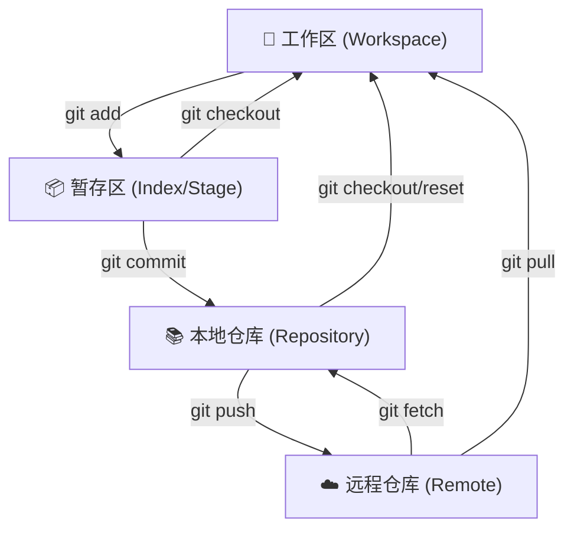
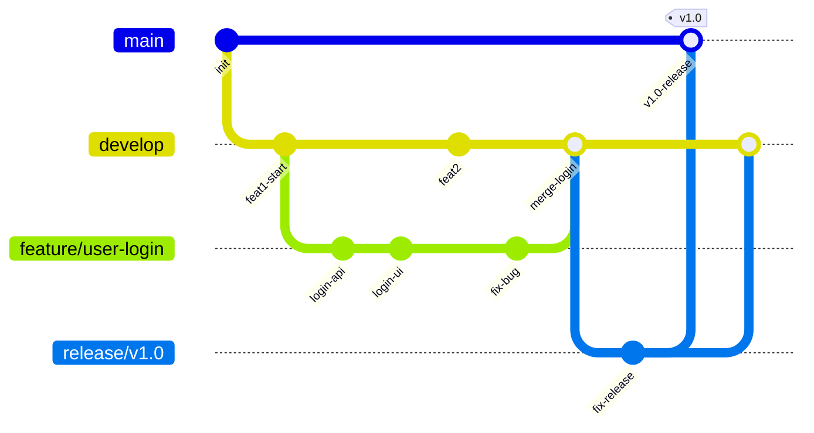
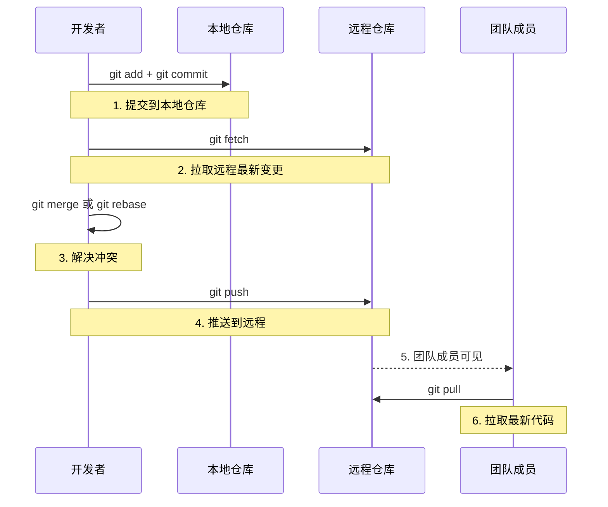

## 引言

一次 `git push --force` 覆盖同事的提交、一个遗漏的 `git stash` 导致半天的代码丢失、一条错误的 `git reset` 让重要功能提交消失——这些都不是理论风险，而是每个开发者迟早会踩的坑。Git 是团队协作的基石，但 80% 的开发者只用了 20% 的功能。读完本文，你将掌握 Git 的完整命令体系、分支管理规范、冲突解决策略，以及生产环境中必须遵守的安全操作清单。无论日常开发还是面试应对，这份指南都能帮你从"会用"进阶到"精通"。

---

## Git 版本控制完全指南

### Git 核心概念回顾

Git 是一套分布式版本控制系统。理解其核心概念是高效使用的前提。

几个专用名词的译名如下：

- **Workspace（工作区）：** 你电脑上实际看到的目录，存放正在编辑的文件。
- **Index / Stage（暂存区）：** 一个临时存放下次要提交的文件快照的区域。
- **Repository（仓库区/本地仓库）：** 存放所有提交历史、分支信息的完整版本库。
- **Remote（远程仓库）：** 托管在服务器上的仓库，用于团队协作。



> **💡 核心提示**：`git pull` 本质是 `git fetch` + `git merge` 的组合操作。先理解这三个命令的区别，是掌握 Git 远程操作的关键。

### Git 分支模型

团队协作中，合理的分支管理策略能避免大量冲突和代码损失。



> **💡 核心提示**：不要在 `main` 分支上直接开发。所有功能分支从 `develop` 或 `main` 创建，通过 Merge Request / Pull Request 合入，确保代码经过审查。

### 常用命令分类速查

#### 新建代码库

```bash
# 在当前目录新建一个 Git 代码库
git init

# 新建一个目录，将其初始化为 Git 代码库
git init [project-name]

# 下载一个项目和它的整个代码历史
git clone [url]
```

#### 配置

Git 的设置文件为 `.gitconfig`，它可以在用户主目录下（全局配置），也可以在项目目录下（项目配置）。

```bash
# 显示当前的 Git 配置
git config --list

# 编辑 Git 配置文件
git config -e [--global]

# 设置提交代码时的用户信息
git config [--global] user.name "[name]"
git config [--global] user.email "[email address]"
```

#### 增加/删除文件

```bash
# 添加指定文件到暂存区
git add [file1] [file2] ...

# 添加指定目录到暂存区，包括子目录
git add [dir]

# 添加当前目录的所有文件到暂存区
git add .

# 添加每个变化前，都会要求确认（分次提交）
git add -p

# 删除工作区文件，并且将这次删除放入暂存区
git rm [file1] [file2] ...

# 停止追踪指定文件，但该文件会保留在工作区
git rm --cached [file]

# 改名文件，并且将这个改名放入暂存区
git mv [file-original] [file-renamed]
```

#### 代码提交

```bash
# 提交暂存区到仓库区
git commit -m [message]

# 提交暂存区的指定文件到仓库区
git commit [file1] [file2] ... -m [message]

# 提交工作区自上次 commit 之后的变化，直接到仓库区
git commit -a

# 提交时显示所有 diff 信息
git commit -v

# 使用一次新的 commit，替代上一次提交（修改上次提交信息）
git commit --amend -m [message]

# 重做上一次 commit，并包括指定文件的新变化
git commit --amend [file1] [file2] ...
```

#### 分支管理

```bash
# 列出所有本地分支
git branch

# 列出所有远程分支
git branch -r

# 列出所有本地分支和远程分支
git branch -a

# 新建一个分支，但依然停留在当前分支
git branch [branch-name]

# 新建一个分支，并切换到该分支
git checkout -b [branch]

# 新建一个分支，指向指定 commit
git branch [branch] [commit]

# 新建一个分支，与指定的远程分支建立追踪关系
git branch --track [branch] [remote-branch]

# 切换到指定分支，并更新工作区
git checkout [branch-name]

# 切换到上一个分支
git checkout -

# 建立追踪关系，在现有分支与指定的远程分支之间
git branch --set-upstream [branch] [remote-branch]

# 合并指定分支到当前分支
git merge [branch]

# 选择一个 commit，合并进当前分支
git cherry-pick [commit]

# 删除分支
git branch -d [branch-name]

# 删除远程分支
git push origin --delete [branch-name]
git branch -dr [remote/branch]
```

#### 标签

```bash
# 列出所有 tag
git tag

# 新建一个 tag 在当前 commit
git tag [tag]

# 新建一个 tag 在指定 commit
git tag [tag] [commit]

# 删除本地 tag
git tag -d [tag]

# 删除远程 tag
git push origin :refs/tags/[tagName]

# 查看 tag 信息
git show [tag]

# 提交指定 tag
git push [remote] [tag]

# 提交所有 tag
git push [remote] --tags

# 新建一个分支，指向某个 tag
git checkout -b [branch] [tag]
```

#### 查看信息

```bash
# 显示有变更的文件
git status

# 显示当前分支的版本历史
git log

# 显示 commit 历史，以及每次 commit 发生变更的文件
git log --stat

# 搜索提交历史，根据关键词
git log -S [keyword]

# 显示某个 commit 之后的所有变动，每个 commit 占据一行
git log [tag] HEAD --pretty=format:%s

# 显示某个 commit 之后的所有变动，其"提交说明"必须符合搜索条件
git log [tag] HEAD --grep feature

# 显示某个文件的版本历史，包括文件改名
git log --follow [file]
git whatchanged [file]

# 显示指定文件相关的每一次 diff
git log -p [file]

# 显示过去 5 次提交
git log -5 --pretty --oneline

# 显示所有提交过的用户，按提交次数排序
git shortlog -sn

# 显示指定文件是什么人在什么时间修改过
git blame [file]

# 显示暂存区和工作区的差异
git diff

# 显示暂存区和上一个 commit 的差异
git diff --cached [file]

# 显示工作区与当前分支最新 commit 之间的差异
git diff HEAD

# 显示两次提交之间的差异
git diff [first-branch]...[second-branch]

# 显示今天你写了多少行代码
git diff --shortstat "@{0 day ago}"

# 显示某次提交的元数据和内容变化
git show [commit]

# 显示某次提交发生变化的文件
git show --name-only [commit]

# 显示某次提交时，某个文件的内容
git show [commit]:[filename]

# 显示当前分支的最近几次提交
git reflog
```

#### 远程同步

```bash
# 下载远程仓库的所有变动
git fetch [remote]

# 显示所有远程仓库
git remote -v

# 显示某个远程仓库的信息
git remote show [remote]

# 增加一个新的远程仓库，并命名
git remote add [shortname] [url]

# 取回远程仓库的变化，并与本地分支合并
git pull [remote] [branch]

# 上传本地指定分支到远程仓库
git push [remote] [branch]

# 强行推送当前分支到远程仓库，即使有冲突
git push [remote] --force

# 推送所有分支到远程仓库
git push [remote] --all
```

#### 撤销操作

```bash
# 恢复暂存区的指定文件到工作区
git checkout [file]

# 恢复某个 commit 的指定文件到暂存区和工作区
git checkout [commit] [file]

# 恢复暂存区的所有文件到工作区
git checkout .

# 重置暂存区的指定文件，与上一次 commit 保持一致，但工作区不变
git reset [file]

# 重置暂存区与工作区，与上一次 commit 保持一致
git reset --hard

# 重置当前分支的指针为指定 commit，同时重置暂存区，但工作区不变
git reset [commit]

# 重置当前分支的 HEAD 为指定 commit，同时重置暂存区和工作区，与指定 commit 一致
git reset --hard [commit]

# 重置当前 HEAD 为指定 commit，但保持暂存区和工作区不变
git reset --keep [commit]

# 新建一个 commit，用来撤销指定 commit（反向操作）
git revert [commit]

# 暂时将未提交的变化移除，稍后再移入
git stash
git stash pop
```

#### 其他

```bash
# 生成一个可供发布的压缩包
git archive
```

### 核心操作对比表

| 操作 | 命令 | 影响范围 | 是否可恢复 | 使用场景 |
| :--- | :--- | :--- | :--- | :--- |
| 撤销工作区修改 | `git checkout <file>` | 工作区 | 否 | 放弃未暂存的修改 |
| 撤销暂存 | `git reset <file>` | 暂存区 | 是 | 从暂存区移出，保留工作区 |
| 软重置 | `git reset --soft <commit>` | 仅 HEAD | 是 | 重新组织 commit |
| 混合重置 | `git reset --mixed <commit>` | HEAD + 暂存区 | 是 | 回退 commit，保留工作区 |
| 硬重置 | `git reset --hard <commit>` | HEAD + 暂存区 + 工作区 | 否 | 彻底回退到指定 commit |
| 反向提交 | `git revert <commit>` | 新增 commit | 是 | 安全撤销已推送的提交 |
| 暂存修改 | `git stash` | 工作区 + 暂存区 | 是 | 切换分支时保存未提交修改 |

> **💡 核心提示**：`git reset` 和 `git revert` 的本质区别是：`reset` 是"回到过去"（修改历史），`revert` 是"承认错误"（新增一次反向提交）。已推送到远程的提交必须用 `revert`，绝不能用 `reset`。

### Git 远程操作流程



### 面试问题示例与深度解析

* "请描述 `git merge` 和 `git rebase` 的区别？"（`merge` 会创建合并节点保留完整历史，`rebase` 会重写提交历史保持线性。公共分支用 `merge`，本地功能分支用 `rebase`）
* "如果误删了一个重要分支，如何恢复？"（使用 `git reflog` 找到分支删除前的 HEAD 指针，再用 `git branch <name> <commit-hash>` 重建分支）
* "如何解决 Git 合并冲突？"（`git status` 查看冲突文件 -> 手动编辑解决冲突标记 -> `git add` 标记已解决 -> `git commit` 完成合并）
* "`git pull --rebase` 和普通的 `git pull` 有什么区别？"（`--rebase` 会将本地未推送的提交重新变基到远程分支上，避免产生多余的 merge commit，保持历史线性）

### 总结

Git 是开发者日常工作中最重要的协作工具。掌握其核心概念（工作区、暂存区、仓库区）、常用命令体系、分支管理规范，以及安全的撤销和恢复策略，是提升团队协作效率、避免代码丢失的必备技能。理解 `reset` 与 `revert` 的区别、`merge` 与 `rebase` 的适用场景，能让你在复杂协作中游刃有余。

### 生产环境避坑指南

1. **禁止 `git push --force` 到共享分支：** 强制推送会覆盖远程历史，可能永久丢失同事的提交。如必须使用，请用 `--force-with-lease`（安全强制推送，仅在远程没有新提交时才允许）。
2. **敏感信息泄露：** 密码、API Key、Token 一旦提交到 Git 历史，即使后续删除，仍可通过 `git log` 恢复。使用 `.gitignore` 和 `git filter-branch` 或 BFG 工具彻底清除。
3. **大文件入库：** 二进制大文件（图片、编译产物）会导致仓库体积暴增。使用 Git LFS（Large File Storage）管理大文件。
4. **忽略文件配置：** 确保 `.gitignore` 包含 IDE 配置文件（`.idea/`、`.vscode/`）、编译产物（`target/`、`build/`）、环境变量文件（`.env`）等。
5. **Commit 消息规范：** 遵循 Conventional Commits 规范（如 `feat:`、`fix:`、`docs:`），便于自动生成 Changelog 和追溯变更。
6. **分支保护：** 在 GitHub/GitLab 上为 `main`、`develop` 分支开启 Branch Protection，禁止直接推送，要求通过 Pull Request 和 Code Review 合入。
7. **定期 `git gc`：** 对本地仓库执行 `git gc --prune=now` 清理无用对象，避免仓库膨胀。

### 行动清单

1. **检查 `.gitignore`：** 确认项目中的 `.gitignore` 已覆盖 IDE 配置、编译产物、敏感文件（`.env`、`*.key`）。
2. **配置全局 alias：** 设置常用别名，如 `git config --global alias.lg "log --oneline --graph --decorate"`。
3. **实践安全推送：** 将习惯从 `git push --force` 改为 `git push --force-with-lease`。
4. **Commit 消息规范：** 在团队内推行 Conventional Commits 规范，确保每次提交都有明确的类型和描述。
5. **扩展阅读：** 推荐阅读 Pro Git 官方文档（https://git-scm.com/book/zh/v2），重点阅读"Git 分支"和"Git 工具"章节。
