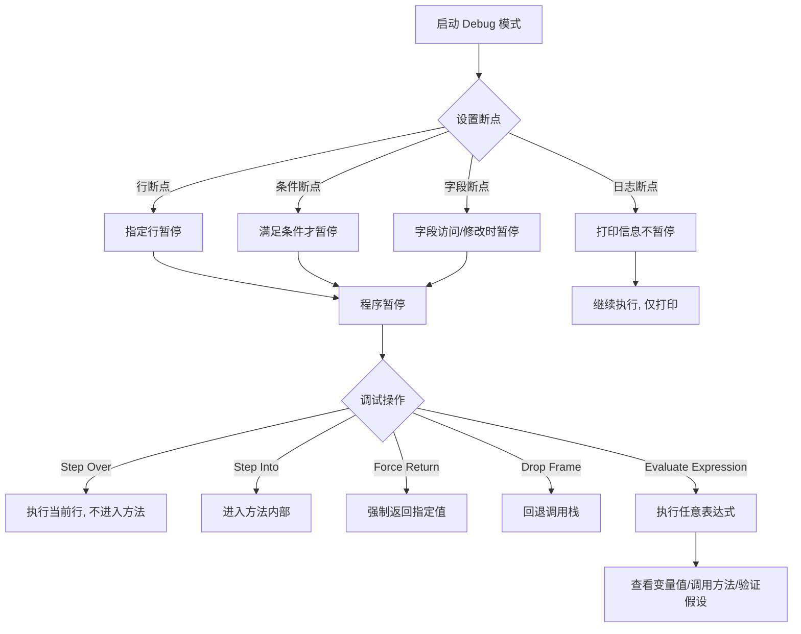

## 引言

你每天在 IDE 中敲击鼠标和键盘的次数可能超过一万次，但有多少操作其实可以通过快捷键或自动化功能在毫秒间完成？从手动查找类名到 `Ctrl+N` 一秒定位，从逐行 Debug 到条件断点精准拦截——IDE 熟练度直接决定了你的编码效率和排查速度。本文将系统梳理 IntelliJ IDEA 的核心高效使用技巧，涵盖代码导航、编辑生成、安全重构、高级调试等模块。读完本文，你将掌握 20+ 个提效快捷键和一套完整的排查工作流，日积月累节省的时间远超你的想象。

---

## IntelliJ IDEA 高效使用指南

### IDE，开发者的"瑞士军刀"

我们每天的工作，很大一部分时间都在 IDE 中度过：编写代码、阅读代码、导航、调试、运行、提交版本。一个高效的 IDE 能够让我们更专注于业务逻辑和问题解决，而不是被工具本身的操作所干扰。

为什么需要提升 IntelliJ IDEA 使用效率？

* **节省宝贵时间：** 熟练使用快捷键和自动化功能，将大量重复性操作（如查找、导航、代码生成）从几秒缩短到毫秒，日积月累，效率提升惊人。
* **提升专注度和"心流"状态：** 顺畅的操作流程减少中断，帮助你更快进入并保持高度专注的"心流"状态。
* **减少重复工作：** 利用代码模板、实时代码生成、自动化重构等功能，将重复性体力劳动交给 IDE。
* **提高代码质量：** 利用强大的代码分析、静态检查和安全重构功能，减少潜在 Bug，改善代码结构。
* **更快定位问题：** 掌握高级导航和调试技巧，能够以更快的速度找到问题代码和 Bug 的根源。

### 代码导航：在代码海洋中快速定位

在大型项目中，快速找到你想看的代码是基础中的基础。

* **万能搜索（Search Everywhere）：** 双击 `Shift`。查找文件、类、符号、甚至 IDE 的动作。这是最常用的导航入口。
* **跳转到类（Go to Class）：** `Ctrl + N`（Windows/Linux）/ `Cmd + O`（macOS）。按类名快速查找并打开类文件，支持模糊匹配。
* **跳转到文件（Go to File）：** `Ctrl + Shift + N`（Windows/Linux）/ `Cmd + Shift + O`（macOS）。查找并打开项目中的任何文件，不仅仅是代码文件。
* **跳转到符号（Go to Symbol）：** `Ctrl + Alt + Shift + N`（Windows/Linux）/ `Cmd + Alt + O`（macOS）。查找代码中的方法、字段、变量等符号。
* **跳转到动作（Find Action）：** `Ctrl + Shift + A`（Windows/Linux）/ `Cmd + Shift + A`（macOS）。查找并执行 IDE 的各种功能或设置项。
* **最近打开的文件（Recent Files）：** `Ctrl + E`（Windows/Linux）/ `Cmd + E`（macOS）。快速在最近打开的文件中切换。
* **最近修改的位置（Recent Locations）：** `Ctrl + Shift + E`（Windows/Linux）/ `Cmd + Shift + E`（macOS）。记录你在代码中阅读或修改过的位置，方便跳回。
* **跳转到定义/用法/实现：**
    * `Ctrl + B` 或鼠标中键点击（Windows/Linux）/ `Cmd + B` 或鼠标中键点击（macOS）：跳转到变量、方法、类的定义。
    * `Alt + F7`：查找某个符号的用法。
    * `Ctrl + Alt + B`（Windows/Linux）/ `Cmd + Alt + B`（macOS）：跳转到接口或抽象方法的实现类。
* **结构视图（Structure）：** `Alt + 7`（Windows/Linux）/ `Cmd + 7`（macOS）。显示当前文件的结构（类、方法、字段），方便在长文件中快速导航。
* **书签（Bookmarks）：** `F11`（切换书签），`Shift + F11`（查看所有书签）。在代码行上设置书签，方便后续快速跳回。

> **💡 核心提示**：双击 `Shift` 的 Search Everywhere 是 IDEA 最强大的入口，一个快捷键覆盖类、文件、符号、动作四大搜索维度。忘记其他快捷键时，用它就对了。

### 代码编辑与生成：提速你的编码过程

编写代码本身的操作也可以通过 IDEA 大幅提速。

* **实时模板（Live Templates）：** 输入缩写后按 `Tab` 键自动生成代码块。例如，`sout` + `Tab` 生成 `System.out.println()`。可以自定义模板。
* **后缀补全（Postfix Completion）：** 在表达式后输入 `.` 然后选择后缀模板。例如，`myObject.notnull` + `Tab` 生成 `if (myObject != null) { ... }`。
* **代码补全：**
    * **基本补全：** 输入代码时自动提示。
    * **智能补全（Smart Completion）：** `Ctrl + Shift + Space`。根据上下文推断出更可能需要的类型和方法。
* **代码生成：** `Alt + Insert`（Windows/Linux）/ `Cmd + N`（macOS）。生成构造器、Getter/Setter、`equals()` 和 `hashCode()`、代理方法等。
* **代码格式化：** `Ctrl + Alt + L`（Windows/Linux）/ `Cmd + Alt + L`（macOS）。按规范格式化当前文件或选中代码。
* **意图操作（Intentions）：** 将光标放在代码上，按 `Alt + Enter`。IDEA 会根据上下文提供可能的快速修复或代码改进建议。
* **多光标与列编辑：** 按住 `Alt` 键并拖动鼠标左键（列编辑）或按住 `Alt + Shift` 并点击鼠标左键（多光标）。同时编辑多行代码。

### 重构利器：安全高效地修改代码结构

重构是改善代码结构、提高可维护性的重要手段。IDEA 提供了强大的自动化重构工具，它们能够在修改代码结构的同时，自动分析并更新所有相关的引用，大大降低引入 Bug 的风险。

* **重命名（Rename）：** `Shift + F6`。重命名变量、方法、类、文件等，IDEA 会自动更新所有引用。
* **提取方法（Extract Method）：** `Ctrl + Alt + M`（Windows/Linux）/ `Cmd + Alt + M`（macOS）。将一段代码块提取为一个新方法，自动处理参数和返回值。
* **提取变量/常量（Extract Variable/Constant）：** `Ctrl + Alt + V`（变量）/ `Ctrl + Alt + C`（常量）。将一个表达式提取为局部变量或常量。
* **修改签名（Change Signature）：** `Ctrl + F6`。修改方法的名称、返回值类型、参数列表（增删改参数）、参数顺序等。IDEA 会自动更新所有调用该方法的地方。
* **内联（Inline）：** `Ctrl + Alt + N`（Windows/Linux）/ `Cmd + Alt + N`（macOS）。将方法、变量、常量的定义直接展开到使用它的地方。

> **💡 核心提示**：自动化重构是 IDEA 最强大的功能之一。它不仅仅是代码的简单替换，而是在理解代码结构和语义的基础上进行的智能修改，能够保证修改的正确性，让你大胆地进行代码优化。

### 代码分析与静态检查：提前发现潜在问题

IDEA 内置了强大的代码分析引擎，可以在编写代码时或手动触发，检查代码是否存在潜在的 Bug、性能问题、安全漏洞、代码风格问题等。

* **代码检查（Inspections）：** IDEA 会在代码中高亮显示各种潜在问题（如未使用的变量、冗余代码、可能的 NullPointerException、不规范的命名等）。可以通过 `File -> Settings -> Editor -> Inspections` 配置检查规则。
* **重复代码检测（Analyze -> Locate Duplicates）：** 查找项目中的重复代码块，提示进行提取方法等重构。
* **依赖分析（Analyze -> Analyze Dependencies）：** 查看模块或类之间的依赖关系图。
* **数据流分析（Analyze -> Analyze Data Flow to/from Here）：** 跟踪变量的值在代码中的流转。

### 强大的调试功能：高效定位 Bug

Debugging 是解决 Bug 的关键阶段。IDEA 提供了超越基本断点的丰富调试功能。

#### 断点类型详解

* **行断点（Line Breakpoint）：** 最基本，在特定代码行暂停执行。
* **条件断点（Conditional Breakpoint）：** 右键点击断点设置条件。只在条件为 true 时暂停。在循环或条件分支中非常有价值。
* **日志断点（Logging Breakpoint / Non-suspending Breakpoint）：** 右键点击断点，取消 "Suspend" 选项，勾选 "Log evaluated expression" 或 "Log message to console"。不暂停执行，只打印信息。无需修改代码加 `System.out`，方便打印变量值或执行流程。
* **方法断点（Method Breakpoint）：** 在方法进入或退出时暂停，开销较大，慎用。
* **字段断点（Field Watchpoint）：** 在字段被访问或修改时暂停。

#### 高级调试技巧

* **表达式求值（Evaluate Expression）：** 在断点暂停时，`Alt + F8`（Windows/Linux）/ `Opt + F8`（macOS）。执行任意代码片段，查看变量值，调用方法。
* **Watches：** 在 Debug 过程中，监控特定变量或表达式的值。
* **改变执行流程（Drop Frame, Force Return, Set Value）：** 甚至可以修改变量值，回退调用栈（Drop Frame），强制方法返回特定值。
* **远程调试（Remote Debugging）：** 配置 JVM 启动参数，IDEA 连接到远程 JVM 进行调试。排查生产或测试环境问题的必备技能。
* **多线程调试：** Debug 窗口显示所有线程状态，可以切换线程，查看每个线程的调用栈和变量。
* **调试异步/反应式流：** IDEA 对异步框架（如 CompletableFuture）和响应式流（如 Reactor, RxJava）有专门的调试支持。

> **💡 核心提示**：日志断点是生产排查的神器。它允许你"无侵入"地打印变量值和执行路径，不需要修改代码、重新编译、重新部署。

### 版本控制集成

IDEA 对 Git 等版本控制工具提供了强大的内置支持，通常无需切换到命令行。

* **常用 Git 操作：** Commit（`Ctrl + K` / `Cmd + K`），Push（`Ctrl + Shift + K` / `Cmd + Shift + K`），Pull（`Ctrl + T` / `Cmd + T`），Merge，Rebase，Cherry-pick 等。
* **冲突解决：** 友好的三方合并工具。
* **历史查看与代码对比：** 查看文件或项目的提交历史，比较不同版本或分支的代码差异。
* **Annotate（Blame）：** 查看每一行代码是谁在哪次提交中添加或修改的。

### 构建工具集成

IDEA 与 Maven、Gradle 等构建工具深度集成，提供了可视化的操作界面。

* **生命周期执行：** 在 Maven/Gradle 视图中双击执行任何生命周期阶段或插件任务。
* **依赖管理：** 查看项目的依赖树，查找冲突，跳转到依赖的源码。
* **运行测试：** 可以直接运行单个测试方法、测试类或整个模块的测试。

### 内置终端与其他工具

* **内置终端：** `Alt + F12`（Windows/Linux）/ `Cmd + F12`（macOS）。在 IDE 内直接使用命令行，无需切换窗口。
* **HTTP Client：** IDEA 支持在 `.http` 文件中编写和执行 HTTP 请求，方便测试接口。
* **Database Tools：** 内置强大的数据库客户端，连接数据库，执行 SQL，查看数据，管理表结构。
* **Docker 集成：** 管理 Docker 镜像和容器。

### 自定义与个性化设置

打造最适合自己的开发环境。

* **快捷键定制（Settings/Preferences -> Keymap）：** 根据个人习惯修改或学习快捷键。建议将最常用的功能绑定到顺手的快捷键。
* **编辑器外观（Settings/Preferences -> Editor -> Appearance/Color Scheme/Font）：** 设置主题、字体、代码颜色等。
* **Live Templates 定制（Settings/Preferences -> Editor -> Live Templates）：** 根据自己的编码习惯创建自定义代码模板。
* **文件模板（Settings/Preferences -> Editor -> File and Code Templates）：** 定义新建文件时自动生成的代码结构。

### 高效使用核心快捷键速查表

| 功能 | Windows/Linux | macOS | 使用频率 |
| :--- | :--- | :--- | :--- |
| 万能搜索 | 双击 Shift | 双击 Shift | ⭐⭐⭐⭐⭐ |
| 跳转类 | Ctrl+N | Cmd+O | ⭐⭐⭐⭐⭐ |
| 跳转文件 | Ctrl+Shift+N | Cmd+Shift+O | ⭐⭐⭐⭐ |
| 跳转动作 | Ctrl+Shift+A | Cmd+Shift+A | ⭐⭐⭐⭐ |
| 查找用法 | Alt+F7 | Opt+F7 | ⭐⭐⭐⭐ |
| 重命名 | Shift+F6 | Shift+F6 | ⭐⭐⭐⭐⭐ |
| 提取方法 | Ctrl+Alt+M | Cmd+Alt+M | ⭐⭐⭐⭐ |
| 代码生成 | Alt+Insert | Cmd+N | ⭐⭐⭐⭐⭐ |
| 代码格式化 | Ctrl+Alt+L | Cmd+Alt+L | ⭐⭐⭐⭐ |
| 意图操作 | Alt+Enter | Opt+Enter | ⭐⭐⭐⭐⭐ |
| 表达式求值 | Alt+F8 | Opt+F8 | ⭐⭐⭐⭐ |
| 最近文件 | Ctrl+E | Cmd+E | ⭐⭐⭐⭐ |
| 内置终端 | Alt+F12 | Opt+F12 | ⭐⭐⭐ |

### 总结

IntelliJ IDEA 是 Java 开发者最亲密的伙伴。投入时间学习和掌握它的高效使用技巧，是你作为一名中高级开发者最值得进行的"投资"之一。从快速导航到自动化重构，从强大的调试功能到深度集成的框架支持，IDEA 能够全方位提升你的开发效率和代码质量。

### 生产环境避坑指南

1. **避免方法断点：** 方法断点（Method Breakpoint）会严重影响 JVM 性能，在生产远程调试时务必在调试完成后立即移除所有方法断点。
2. **远程调试安全：** 远程调试会暴露 JVM 内部状态。生产环境开启远程调试端口时，务必配置防火墙白名单和认证机制，调试完成后立即关闭。
3. **日志断点替代 print：** 排查问题时不要用 `System.out.println`，使用日志断点或 SLF4J 的 Logger。前者无需重新编译，后者可以控制日志级别。
4. **IDE 内存配置：** 大型项目可能导致 IDEA 内存不足（OOM）。在 `Help -> Change Memory Settings` 中适当调整 IDE 的最大堆内存（建议 2GB+）。
5. **索引缓存清理：** 当 IDEA 出现代码提示异常、导航失败等问题时，尝试 `File -> Invalidate Caches / Restart` 清理索引缓存。
6. **版本控制操作安全：** 在 IDEA 中执行 `Rebase`、`Reset --hard` 等破坏性操作前，先用 Git 的 `stash` 或 IDEA 的 `Shelve Changes` 备份未提交的修改。

### 行动清单

1. **快捷键练习：** 每天刻意练习 3 个新快捷键，一周内将鼠标操作减少 50%。
2. **自定义 Live Templates：** 创建 5 个你最常用的代码模板（如单元测试模板、日志打印模板、异常处理模板）。
3. **条件断点实战：** 在下一次排查循环中的 Bug 时，使用条件断点替代普通断点，对比效率差异。
4. **内存优化：** 检查当前 IDEA 的内存配置（`Help -> About`），确保最大堆内存不少于 2GB。
5. **扩展阅读：** 阅读 JetBrains 官方 Tips（在 IDEA 中按 `Ctrl+Shift+A`，搜索 "Tip of the Day"），每天学习一个新技巧。
