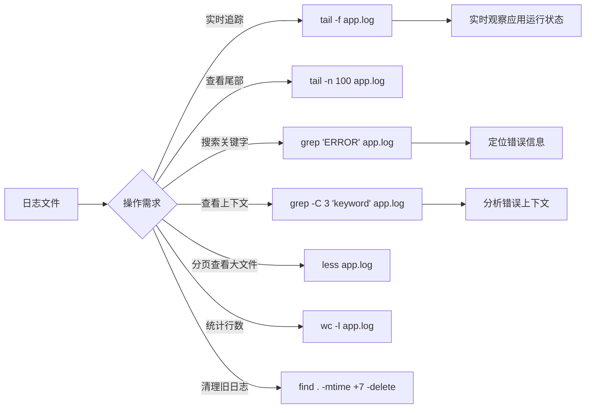

## 引言

应用上线后响应突然变慢、日志文件暴增占满磁盘、Java 进程莫名消失——面对这些生产环境的紧急状况，如果你只会说"找运维看看"，那离成为独立的技术骨干就还差关键一步。实际上，90% 的线上问题都可以通过 Linux 命令快速定位。本文将围绕 Java 应用的生命周期和常见故障场景，系统梳理进程监控、日志分析、网络诊断、资源管理等核心命令。读完本文，你将建立一套完整的 Linux 排查工作流，面试中的场景题也能从容应对。

---

## Linux 常用命令：Java 开发者必备的核心技能

### 为什么 Java 开发者需要掌握 Linux 常用命令？

你可能会说，"我只会写 Java 代码，有专门的运维人员负责服务器"。然而，当你面对以下场景时，你会发现 Linux 命令是多么不可或缺：

* **应用启动失败：** 你需要查看日志文件来确定原因。
* **应用性能缓慢：** 你需要检查服务器的 CPU、内存、磁盘、网络使用情况，找到性能瓶颈。
* **应用内存溢出（OOM）：** 你需要找到 Java 进程 ID，获取线程 Dump 或 Heap Dump 进行分析。
* **应用进程僵死或失控：** 你需要能够查找并终止 Java 进程。
* **部署应用：** 你需要上传、解压、移动、配置应用发布包。
* **检查端口占用：** 你的应用启动失败，提示端口已被占用。
* **解决文件权限问题：** 你的应用没有权限读写某个文件。

掌握 Linux 命令，让你能够：

* **独立排查问题：** 不再依赖运维人员，能够快速初步诊断和解决问题。
* **提升工作效率：** 自动化一些重复性任务，快速查看系统状态和日志。
* **更好地理解部署环境：** 了解你的应用在底层是如何运行的。
* **应对面试挑战：** 面试官通过场景题考察你解决实际问题的能力。

### Linux 命令基础回顾

一个 Linux 命令通常由以下部分组成：

```
command [options] [arguments]
```

* `command`：命令本身，如 `ls`、`cd`、`ps`。
* `options`：选项，用于修改命令的行为，通常以 `-` 或 `--` 开头，如 `ls -l`、`ps aux`。
* `arguments`：参数，命令操作的对象，如文件名、目录名、进程 ID 等，如 `cd /home`、`rm file.txt`、`kill 12345`。

常用操作：

* 查看命令帮助：`man command` 或 `command --help`。
* 切换用户：`su username` 或 `sudo command`。
* 远程登录：`ssh user@hostname`。

### Java 应用排查工作流

```mermaid
flowchart TD
    A[收到告警: 应用异常] --> B{问题类型}

    B -->|服务不可用| C[进程检查]
    B -->|响应慢| D[资源检查]
    B -->|功能异常| E[日志检查]
    B -->|网络异常| F[网络检查]

    C --> C1[ps aux | grep java]
    C1 --> C2[jps -l 确认进程]
    C2 --> C3{进程存在?}
    C3 -->|否| C4[检查启动日志/端口占用]
    C3 -->|是| C5[top 查看资源]

    D --> D1[top / free -h]
    D1 --> D2[jstat -gc 查看GC]
    D2 --> D3{CPU/内存异常?}
    D3 -->|是| D4[top -Hp PID / jstack]
    D3 -->|否| D5[检查磁盘 df -h]

    E --> E1[tail -f app.log]
    E1 --> E2[grep "ERROR" app.log]
    E2 --> E3[定位异常堆栈]

    F --> F1[ping 目标]
    F1 --> F2[nc -vz host port]
    F2 --> F3[ss -tulnp 检查端口]

    C4 --> G[确定根因并修复]
    C5 --> G
    D4 --> G
    D5 --> G
    E3 --> G
    F3 --> G
```

### 进程管理与监控

理解应用的运行状态，查找进程 ID，是排障的第一步。

#### 常用进程命令

| 命令 | 功能 | Java 场景用法 | 关键输出 |
| :--- | :--- | :--- | :--- |
| `ps aux` | 查看所有进程 | `ps aux \| grep java` 查找 Java 进程 | PID, CPU%, MEM% |
| `ps -ef` | 完整格式显示 | `ps -ef \| grep java` 含父进程 PID | PPID, COMMAND |
| `top` | 实时资源监控 | 按 `P` 按 CPU 排序，按 `M` 按内存排序 | Load Average, CPU%, MEM% |
| `top -Hp <pid>` | 查看线程 CPU | 定位高 CPU 线程 | 线程 ID（转 16 进制查 jstack） |
| `jps -l` | 查看 Java 进程 | `jps -l` 快速找到 Java 进程 PID | 完整类名/JAR 路径 |
| `jps -v` | 查看 Java 启动参数 | `jps -v` 查看 JVM 参数 | JVM 启动参数 |

> **💡 核心提示**：排查 CPU 飙高的标准流程：`top` 找到高 CPU 进程 -> `top -Hp <pid>` 找到高 CPU 线程 -> `printf "%x\n" <线程ID>` 转 16 进制 -> `jstack <pid>` 中找到对应线程堆栈 -> 分析代码位置。

#### 线程与 JVM 诊断

* **`jstack`（JVM Stack Trace）：** JDK 自带工具，用于生成 JVM 线程堆栈快照（Thread Dump）。
    * `jstack <pid>`：生成指定 PID 进程的所有线程堆栈信息。
    * `jstack -l <pid>`：生成额外的锁信息。
    * `jstack -F <pid>`：强制生成（如果进程无响应）。
    * **`jstack <pid> > thread_dump.log`：** 将线程 Dump 输出到文件进行离线分析。
    * **排障场景：** 应用无响应（排查死锁或线程长时间阻塞）；CPU 使用率高（结合 `top -Hp <pid>` 找到高 CPU 线程 ID，在 jstack 输出中查找对应的线程，分析其堆栈）。

* **`jstat`（JVM Statistics Monitoring Tool）：** JDK 自带工具，用于监控 JVM 各种运行状态信息。
    * `jstat -gc <pid> 1000 10`：每隔 1 秒（1000ms）打印一次指定 PID 进程的 GC 统计信息，共打印 10 次。
    * **关键指标：** S0C/S1U（Survivor 区使用）、EC/EU（Eden 区使用）、OC/OU（老年代使用）、MC/MU（元空间使用）、YGC/YGT（Young GC 次数/耗时）、FGC/FGT（Full GC 次数/耗时）。
    * **排障场景：** 监控堆内存使用趋势，判断是否即将 OOM；分析 GC 频繁度或 Full GC 耗时。

#### 进程控制

* **`kill`：** 终止指定 PID 的进程。
    * `kill <pid>`：发送 SIGTERM 信号（优雅终止，进程可以捕获信号并清理资源）。
    * `kill -9 <pid>`：发送 SIGKILL 信号（强制终止，进程无法捕获，可能导致数据丢失）。**慎用！**

### 文件系统操作与管理

定位应用部署目录、日志文件是日常操作。

#### 常用文件命令

| 命令 | 功能 | 常用用法 | 排障场景 |
| :--- | :--- | :--- | :--- |
| `ls -lh` | 列出文件详情 | `ls -lh /app/logs/` 查看日志文件大小 | 确认文件是否存在、大小 |
| `cd` | 切换目录 | `cd /app/logs/` 进入日志目录 | 定位到工作目录 |
| `pwd` | 显示当前路径 | 确认当前所在目录 | 避免在错误目录下操作 |
| `find` | 搜索文件 | `find . -name "*.log"` `find . -size +1G` | 定位大型日志文件 |
| `df -h` | 磁盘使用情况 | `df -h` 检查磁盘空间 | 磁盘满导致写入失败 |
| `du -sh` | 目录占用空间 | `du -sh /app/logs/` 汇总日志目录大小 | 定位占用空间的大目录 |
| `mkdir` / `rm` / `cp` / `mv` | 文件操作 | `rm -r dir` `cp file /tmp` | 部署时管理文件 |

### 文本处理与日志查看

查看和分析应用日志是排查问题的核心手段。



#### 常用日志命令

| 命令 | 功能 | Java 场景用法 | 说明 |
| :--- | :--- | :--- | :--- |
| `tail -f` | 实时追踪文件末尾 | `tail -f app.log` | 实时查看日志输出 |
| `tail -n 100` | 查看文件末尾 N 行 | `tail -n 100 app.log` | 查看最新 100 行日志 |
| `grep` | 搜索匹配行 | `grep "ERROR" app.log` | 搜索错误信息 |
| `grep -C 3` | 显示上下文 | `grep -C 3 "关键字" app.log` | 查看匹配行前后各 3 行 |
| `grep -n` | 显示行号 | `grep -n "NullPointerException" app.log` | 定位错误行号 |
| `less` | 分页查看 | `less big_log.log`（按 `/` 搜索） | 大文件分页浏览 |
| `head` | 查看文件头部 | `head -n 20 app.log` | 查看文件开头内容 |

> **💡 核心提示**：组合命令 `tail -f app.log | grep "ERROR"` 可以实时过滤并显示错误日志，是排查生产问题最常用的组合之一。

### 网络诊断

检查应用的网络连通性、端口占用是常见任务。

| 命令 | 功能 | Java 场景用法 | 关键输出 |
| :--- | :--- | :--- | :--- |
| `ping` | 测试连通性 | `ping db-server` 检查数据库连通性 | 延迟、丢包率 |
| `nc -vz` | 测试端口可达 | `nc -vz db-server 3306` | 端口是否开放 |
| `ss -tulnp` | 查看监听端口 | `ss -tulnp \| grep 8080` | 监听端口及对应进程 |
| `ss -ant` | 查看所有 TCP 连接 | `ss -ant` | 连接状态（LISTEN, ESTABLISHED, TIME_WAIT） |
| `curl` | HTTP 请求测试 | `curl http://localhost:8080/api/status` | 接口响应内容 |

* **`netstat` / `ss`：** `ss` 是新一代工具，速度更快。
    * `ss -tulnp`：显示所有监听的 TCP/UDP 端口及其对应的进程 PID 和程序名。用于检查应用监听的端口是否正常，或哪个进程占用了端口。
    * `ss -ant`：显示所有 TCP 连接及其状态（LISTEN, ESTABLISHED, TIME_WAIT 等）。

### 系统信息与资源

了解服务器整体健康状况。

| 命令 | 功能 | 用法 | 关键输出 |
| :--- | :--- | :--- | :--- |
| `free -h` | 内存使用情况 | `free -h` | total, used, available, Swap |
| `uptime` | 系统负载 | `uptime` | Load Average（1/5/15 分钟） |
| `whoami` / `id` | 用户信息 | `whoami` 确认当前用户 | 当前用户名和组 |

> **💡 核心提示**：Load Average 的值与 CPU 核数相关。如果 Load Average 持续大于 CPU 核数，说明 CPU 存在瓶颈。4 核机器 Load Average 超过 4，意味着有进程在排队等待 CPU。

### 权限与用户

解决应用运行时的权限问题。

| 命令 | 功能 | Java 场景用法 |
| :--- | :--- | :--- |
| `whoami` / `id` | 显示用户信息 | 确认当前用户是否有权限操作 |
| `chmod` | 修改文件权限 | `chmod 755 file.sh` `chmod +x script.sh` |
| `chown` | 修改文件所有者 | `chown user:group file.txt` |
| `sudo` | 以其他用户执行 | `sudo systemctl restart your-app` |

### 打包与压缩

应用发布包的常见格式处理。

```bash
# 创建 gzip 压缩包
tar -czvf archive.tar.gz file1 dir1

# 解压 gzip 压缩包
tar -xzvf archive.tar.gz

# 查看压缩包内容（不解压）
tar -tzvf archive.tar.gz
```

### 生产环境常用命令速查

```bash
# 1. 查找 Java 进程
jps -l

# 2. 查看进程资源占用
top -Hp <pid>

# 3. 查看 GC 情况
jstat -gc <pid> 1000 10

# 4. 生成线程 Dump
jstack <pid> > thread_dump.log

# 5. 实时查看错误日志
tail -f app.log | grep "ERROR"

# 6. 检查端口占用
ss -tulnp | grep 8080

# 7. 检查磁盘空间
df -h

# 8. 查找大文件
find /app -size +500M

# 9. 清理 7 天前的日志
find /app/logs -name "*.log" -mtime +7 -delete
```

### 面试问题示例与深度解析

* **"如果你的 Java 服务突然响应很慢，你会怎么排查？"**（首先 `top` 查看系统整体资源占用。如果 CPU 高，用 `top -Hp <pid>` 找到高 CPU 线程 ID，然后用 `jstack <pid>` 生成线程 Dump，将线程 ID 转为 16 进制在 Dump 文件中查找对应线程状态。如果内存高，用 `jstat -gc <pid>` 看 GC 情况。用 `tail -f` 或 `grep` 查看日志是否有异常。）
* **"如何在一个运行的 Linux 服务器上找到你的 Java 应用程序进程，并查看它的启动参数？"**（用 `jps -l` 找到 PID，再用 `jps -v <pid>` 查看完整命令和参数。）
* **"你的 Java 应用日志文件很大，你如何快速查看最新的 100 行日志和搜索包含 'OutOfMemoryError' 的行？"**（最新 100 行用 `tail -n 100 file.log`；搜索用 `grep "OutOfMemoryError" file.log`。）
* **"应用提示端口被占用了，如何找到占用这个端口的进程？"**（用 `ss -tulnp \| grep 端口号`，查看输出中的 PID 和程序名。）
* **"如何检查服务器的磁盘空间是否快满了？"**（用 `df -h` 查看磁盘使用率；用 `du -sh dir_path` 查找大目录。）

### 总结

对于中高级 Java 开发者而言，掌握 Linux 常用命令不再是可选项，而是必备项。它们是你在 Linux 环境下与 Java 应用交互、进行日常管理和高效排查问题的核心技能。

熟练运用 `ps`、`top`、`jps`、`jstack`、`jstat` 进行进程和 JVM 监控；运用 `ls`、`cd`、`find`、`df`、`du` 进行文件系统管理；运用 `tail`、`grep`、`less` 进行日志查看和分析；运用 `ss`、`nc`、`curl` 进行网络诊断；以及运用 `chmod`、`chown`、`sudo` 处理权限问题，将极大地提升你的独立工作能力和问题解决效率。

### 生产环境避坑指南

1. **慎用 `kill -9`：** 强制终止进程可能导致数据不一致、文件未刷盘、连接未正常关闭等问题。优先使用 `kill`（SIGTERM）让 Java 进程优雅关闭，配合 Shutdown Hook 执行清理逻辑。
2. **避免 `rm -rf /` 类误操作：** 使用 `rm` 前务必确认当前目录和目标路径。建议在 `~/.bashrc` 中设置 `alias rm='rm -i'`（交互确认模式）。
3. **日志文件定期清理：** 未清理的日志文件可能占满磁盘空间。使用 `logrotate` 配置日志轮转，或定期执行 `find /app/logs -mtime +7 -delete` 清理旧日志。
4. **大文件查找优化：** 在大目录中使用 `find` 时避免使用 `find / -name xxx`（全磁盘扫描）。缩小搜索范围，如 `find /app/logs -name "*.log"`。
5. **`jstat` 输出解读陷阱：** `jstat` 的 S0/S1 表示 Survivor 区使用率，不是 S0 和 S1 同时使用，而是交替使用。如果两个都为 0，说明 GC 异常。
6. **远程命令安全：** 避免在命令行中明文传递密码或敏感信息。使用密钥认证（SSH Key）替代密码认证。
7. **命令输出管道陷阱：** `tail -f | grep` 管道中如果 grep 进程退出，tail 可能继续运行。使用 `tail -f app.log | grep --line-buffered "ERROR"` 确保实时输出。

### 行动清单

1. **环境自检：** 在生产服务器上执行 `jps -l`、`ss -tulnp`、`df -h`、`free -h` 四个命令，快速掌握应用运行状态。
2. **建立排查 SOP：** 将本文中的排查工作流整理为团队的标准操作手册（SOP），贴在运维文档中。
3. **配置日志轮转：** 检查服务器上的 `logrotate` 配置，确保 Java 日志文件按天轮转并保留不超过 30 天。
4. **掌握 JVM 诊断链：** 练习 `top` -> `top -Hp` -> `printf "%x"` -> `jstack` 的完整排查流程。
5. **扩展阅读：** 推荐阅读《深入理解 Java 虚拟机》中关于 JVM 排查工具的章节；学习 Arthas（阿里巴巴开源的 Java 诊断工具）作为 `jstack`/`jstat` 的增强替代方案。
