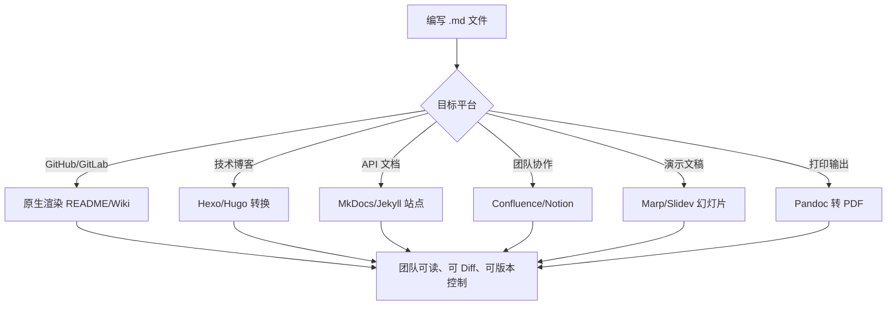

## 引言

你是否曾因一份排版混乱的技术文档而被同事反复追问？或在 GitHub 上看到一个 README 清晰到让人想立刻 Star 的项目？Markdown 就是这两者之间的分水岭。作为技术文档领域的"事实标准"，它以纯文本的简洁性和版本控制的友好性，彻底改变了开发者编写文档的方式。本文将带你从核心语法到工程实践，掌握 Markdown 的高效使用技巧。读完本文，你将能写出结构清晰、代码高亮专业、表格规范的文档，让每一次技术交流都清晰有力。

---

## Markdown 高效指南：技术文档的最佳实践

### Markdown 的本质与技术价值

Markdown 由 John Gruber 创建，其设计哲学是："可读性优先，即便未经渲染，文档也应清晰易读。"它使用简单的符号（如 `#`、`*`、`>`、`` ` ``）来标记文本格式，这些符号本身并不会破坏纯文本的阅读体验。

为什么 Markdown 在技术领域如此流行？

1. **纯文本本质：** 无论何种操作系统或编辑器，都能轻松创建、打开和编辑 Markdown 文件。无需担心格式兼容性问题。
2. **版本控制友好：** Markdown 文件是纯文本文件，天然适合使用 Git 等版本控制工具。文件变更可以清晰地 Diff，分支合并冲突也能容易地解决。
3. **易于转换：** 存在大量工具（如 Pandoc）可以将 Markdown 无损地转换为 HTML、PDF、Word 等多种格式，满足不同的发布需求。
4. **平台广泛支持：** GitHub、GitLab、Stack Overflow、JIRA、Confluence、各类技术博客平台、绝大多数静态文档生成器（如 MkDocs、Jekyll、Hugo）都原生或通过插件支持 Markdown。

### Markdown 对 Java 工程师的具体价值

* **项目基石文档：** `README.md`、`CONTRIBUTING.md`、`CHANGELOG.md` 等是现代开源或内部项目不可或缺的标准文件。
* **代码仓库协作：** 在 GitHub/GitLab 的 Issue 中提问题、描述 Bug，在 Pull Request 中解释代码改动，在 Wiki 中编写项目文档，Markdown 都是首选格式。
* **技术博客与分享：** 许多技术博客平台支持 Markdown 写作，让你专注于内容；一些演示工具也支持将 Markdown 转换为幻灯片。
* **内部文档与知识库：** 许多企业内部的文档系统或 Wiki 支持 Markdown，利用它快速记录会议纪要、设计方案、排错过程等。
* **API/模块文档：** 编写 `API.md` 或特定模块的设计文档，清晰地呈现接口定义、参数说明、使用示例等。



> **💡 核心提示**：Markdown 最大的优势不是排版，而是"一次编写、多端渲染"。同一份 `.md` 文件可以在 GitHub、技术博客、内部 Wiki、PDF 报告中无缝使用。

### 核心语法：技术文档基础

#### 标题

使用 `#` 符号来表示标题层级，一个 `#` 是一级标题，最多到六个 `#`（`######`）。

```markdown
# 这是一级标题
## 这是二级标题
### 这是三级标题
#### 这是四级标题
##### 这是五级标题
###### 这是六级标题
```

合理使用标题能清晰地划分文档结构，许多平台会根据标题自动生成目录。

#### 段落与换行

用一个或多个空行来分隔段落。简单地敲回车通常只会在渲染后表现为一个空格，而非新行。要在段落内强制换行，可以在上一行的末尾添加**两个或更多的空格**，然后敲回车。

```markdown
这是第一段。

这是第二段。

这是一行，
这还在同一段，但强制换行了。
```

#### 强调

使用 `*` 或 `_` 表示斜体，`**` 或 `__` 表示粗体，`***` 或 `___` 表示粗斜体。

```markdown
*斜体文本* 或 _斜体文本_
**粗体文本** 或 __粗体文本__
***粗斜体文本*** 或 ___粗斜体文本___
```

#### 列表

列表是技术文档中常用的结构，用于列举步骤、选项或项目。

* **无序列表：** 使用 `*`、`-`、或 `+` 符号作为列表项标记。
* **有序列表：** 使用数字后跟点（`.`）作为列表项标记，数字本身不重要，渲染时会按顺序自动编号。
* **嵌套列表：** 通过**缩进**（至少两个空格或一个 Tab）来实现多级嵌套。

```markdown
* 项目一
* 项目二
    - 子项目一
    - 子项目二
+ 项目三

1. 第一步
2. 第二步
    1. 第二步的子步骤一
    2. 第二步的子步骤二
```

#### 链接

* **行内式：** 直接在文本行内定义链接。

    ```markdown
    访问 [Mermaid 官网](https://mermaid.js.org/ "Mermaid 是一个绘图工具")。
    ```

* **参考式：** 将链接 URL 定义在文档的其他地方，通过标签引用。在文档中多次引用同一链接或链接路径很长时特别有用。

    ```markdown
    请参考我的 [GitHub 主页][github_page]。

    [github_page]: https://github.com/your_username "GitHub 主页"
    ```

* **自动链接：** 大部分 Markdown 实现会自动将 URL 识别为链接。

    ```markdown
    我的博客地址是 https://your_blog.example.com。
    或者使用显式标记：<https://your_blog.example.com>
    ```

> **💡 核心提示**：在编写大型 README 或 API 文档时，参考式链接可以显著提高文档的可维护性。将 URL 集中定义在文档末尾，修改时只需改一处。

#### 图片

图片语法与链接类似，只是前面多一个 `!`。

```markdown

```

（`Alt` 文本在图片无法显示时显示，也用于辅助功能）

#### 代码块

代码块是技术文档中最重要的元素之一。

* **行内代码：** 使用单反引号 `` ` `` 包裹。

    ```markdown
    在终端输入 `mvn clean install` 命令。
    ```

* **围栏式代码块（Fenced Code Blocks）：** 使用三个或更多反引号包裹，推荐使用反引号。

    ````markdown
    ```java
    public class HelloWorld {
        public static void main(String[] args) {
            System.out.println("Hello, Markdown!");
        }
    }
    ```
    ````

    或者使用波浪线：

    ````markdown
    ~~~yaml
    server:
      port: 8080
    ~~~
    ````

> **💡 核心提示**：在起始的围栏后直接指定语言（如 `java`、`yaml`、`bash`、`json` 等），大多数 Markdown 渲染器会为代码提供语法高亮。这是编写高质量技术文档不可或缺的细节。

#### 引用块

使用 `>` 符号引用其他文本，常用于引用对话、名言或突出特定段落。

```markdown
> 这是一段被引用的文本。
> 可以包含多行。
```

#### 分隔线

使用三个或更多 `---`、`***`、或 `___` 创建一条水平分隔线。

```markdown
---

这是分隔线下面的内容。
```

### 扩展语法：提升表现力

#### 表格

使用 `|`、`-`、`:` 来绘制表格。

```markdown
| 参数名   | 类型     | 是否必须 | 描述       |
| :------ | :------ | :------ | :-------- |
| `userId` | `String` | 是       | 用户 ID    |
| `amount` | `double` | 是       | 订单金额  |
| `remark` | `String` | 否       | 备注信息  |
```

* `|`：分隔列。
* `---`：分隔表头和表格体。
* `:`：控制对齐方式（左对齐 `:---`，居中 `:--:`，右对齐 `---:`）。

> **💡 核心提示**：表格是技术文档中表示结构化数据（如 API 参数、配置项、依赖列表）最清晰的方式。掌握表格语法对于编写 API 文档、配置说明至关重要。

#### 任务列表

在列表项中添加 `[ ]` 或 `[x]`。

```markdown
- [x] 完成用户注册功能
- [ ] 编写用户登录接口
- [ ] 添加单元测试
```

任务列表在 Issue 跟踪、Pull Request checklist 或个人待办事项列表中的应用非常普遍和实用，可以直观地展示工作进度。

#### 删除线

使用 `~~` 包裹文本。

```markdown
~~这段文字已经被删除了~~
```

#### 表情符号

许多平台支持 `:smile:` 这种简码输入表情符号。

#### 锚点链接与目录（TOC）

许多 Markdown 渲染器或工具会根据标题自动生成文档内部的锚点，甚至自动生成文档顶部的目录（TOC）。虽然不是标准的 Markdown 语法，但在实际应用中非常常见和有用。

### Markdown 在 Java 工程师工作流中的应用

1. **项目文件（README, CONTRIBUTING, CHANGELOG）：**
    * `README.md`：项目的"门面"。清晰地介绍项目是什么、做什么、如何安装、如何使用。
    * `CONTRIBUTING.md`：贡献指南。说明如何参与项目、提交 Bug、提交代码、测试等流程。
    * `CHANGELOG.md`：版本变更记录。清晰地记录每个版本的更新内容、新功能、Bug 修复等。
2. **代码仓库平台（GitHub/GitLab Issues & PRs）：**
    * 提交 Issue 时，使用 Markdown 清晰地描述问题背景、重现步骤、期望结果，使用代码块格式化错误日志或代码片段。
    * 提交 Pull Request 时，使用 Markdown 说明本次提交解决了什么问题、做了哪些改动、如何测试，使用任务列表列出需要完成的项。
3. **技术博客与分享：** 将 Markdown 作为你的写作源文件，专注于内容创作，排版和转换交给工具。
4. **文档生成器：** 对于大型项目，可以使用 MkDocs、Jekyll、Hugo 等工具，将一系列 Markdown 文件组织起来，生成带有导航、搜索功能的专业技术文档站点。
5. **内部 Wiki/Confluence：** 利用 Markdown 的便捷性快速记录和分享团队内部知识、会议记录、技术讨论等。

### 工具推荐与最佳实践

#### 编辑器对比

| 编辑器 | 定位 | 核心优势 | 适用场景 |
| :--- | :--- | :--- | :--- |
| VS Code | 通用编辑器 | 插件生态丰富，内置 Markdown 支持 | 日常编写、IDE 集成 |
| Typora | 所见即所得 | 实时预览，编辑体验流畅 | 专注写作 |
| Obsidian | 知识管理 | 双向链接，知识图谱 | 个人知识库 |
| IntelliJ IDEA | IDE | 内置 Markdown 插件 | 项目内文档 |

#### 最佳实践

* **保持简洁：** Markdown 的设计理念是简洁，尽量利用原生语法表达内容。
* **结构清晰：** 合理使用标题层级和列表，让文档逻辑清晰。
* **充分利用代码块和高亮：** 这是技术文档的灵魂，务必用好。
* **团队约定风格：** 在团队内部，约定 Markdown 的使用规范，如缩进、空行、列表标记等，保持文档风格一致。
* **适度使用 HTML：** Markdown 支持内嵌 HTML，但应谨慎使用，以免破坏 Markdown 的易读性。
* **结合其他工具：** 在 Markdown 中嵌入 Mermaid 图表，用 Markdown 连接各种轻量级技术工具。

### 总结

Markdown 以其简洁、易读写、版本控制友好和广泛平台支持的特性，已成为技术文档领域的基石。对于中高级 Java 工程师而言，熟练掌握 Markdown 并将其融入日常工作流，不仅是编写高质量文档的基础，更是提升团队协作效率和个人影响力的有效途径。

### 生产环境避坑指南

1. **标题层级跳跃：** 不要从 `#` 直接跳到 `###`，跳过的层级会导致自动生成 TOC 时结构错乱。始终按 `#` -> `##` -> `###` 的层级编写。
2. **表格列数不一致：** 表格中每行的列数必须相同，否则渲染会出错。建议先在编辑器中预览再提交。
3. **链接失效：** 参考式链接的定义标签必须与引用时完全一致（包括大小写）。提交前检查所有链接是否有效。
4. **代码块嵌套：** 代码块内部如果包含三个反引号，外层需用四个反引号包裹，否则会提前结束代码块。
5. **列表缩进不统一：** 不同 Markdown 渲染器对列表缩进的要求不同（2 空格 vs 4 空格）。建议统一使用 4 空格缩进以保证最大兼容性。
6. **本地图片路径：** 不要在 Markdown 中使用本地绝对路径（如 `C:\Users\xxx\image.png`），应使用相对路径或 CDN 链接，确保文档在他人机器上也能正确渲染。

### 行动清单

1. **模板准备：** 创建一份项目 README.md 模板，包含项目简介、快速开始、配置说明、贡献指南等标准章节。
2. **工具配置：** 在 VS Code 中安装 Markdown All in One 和 markdownlint 插件，实现快捷键生成目录和语法检查。
3. **规范制定：** 在团队内制定 Markdown 文档规范（标题层级、代码块语言标识、表格对齐方式、图片命名规则）。
4. **文档站点搭建：** 尝试使用 MkDocs 或 VitePress 将一组 Markdown 文件转换为带搜索和导航的在线文档站点。
5. **扩展阅读：** 阅读 Markdown 官方语法规范（https://daringfireball.net/projects/markdown/syntax）和 GFM（GitHub Flavored Markdown）规范。
