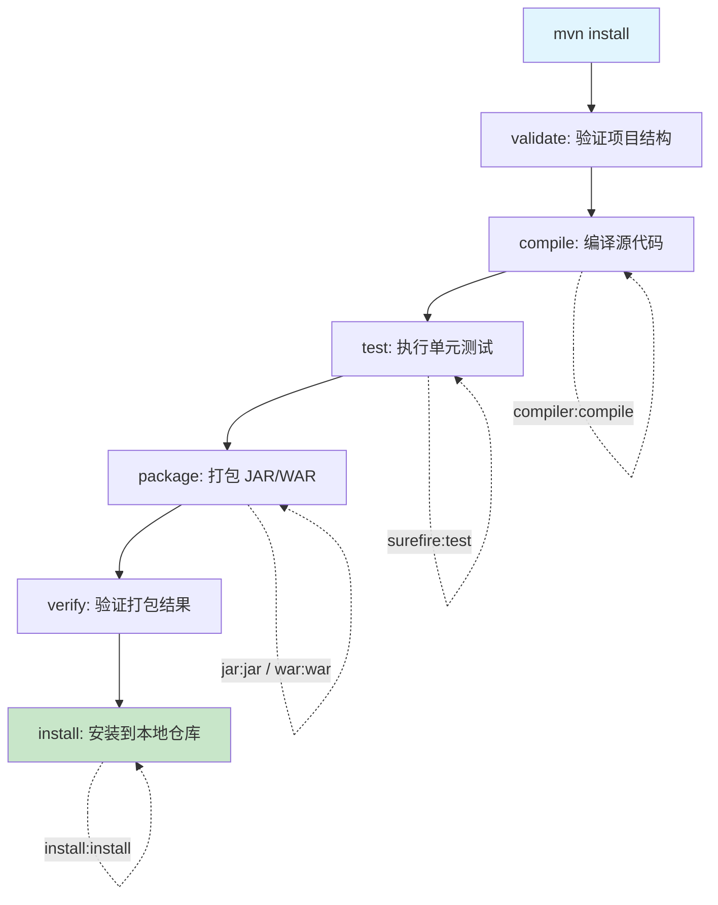
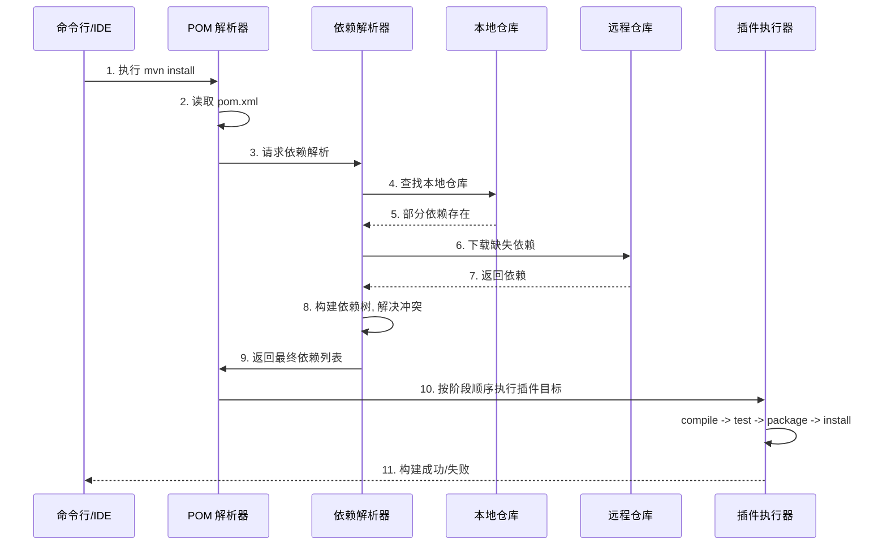

## 引言

你经历过这样的场景吗：`mvn clean install` 突然失败，报错 `NoSuchMethodError`——两个依赖引入了同一个库的不同版本，项目陷入了"依赖地狱"；或者明明写了测试却一个都没跑，才发现 `mvn compile` 根本不会执行测试阶段。Maven 是 Java 项目的事实构建标准，但 80% 的开发者只停留在 `mvn clean install` 层面。本文将深入剖析 Maven 的核心概念（POM、坐标、生命周期、插件、依赖管理）、冲突解决策略和构建定制方案。读完本文，你将彻底理解依赖冲突的定位与解决、生命周期阶段的执行顺序，以及如何用 Profile 实现多环境构建。

---

## Apache Maven 完全指南：Java 项目构建与依赖管理

### Java 项目构建的痛点与 Maven 的出现

在 Maven 出现之前，Java 项目的构建主要依赖于 Ant。Ant 基于 XML 编写脚本来定义构建任务，非常灵活，但也意味着开发者需要手动编写每一个构建步骤，依赖管理也比较原始。这导致：

* **构建流程不统一：** 不同项目、不同团队的构建流程差异很大。
* **依赖管理困难：** 手动下载和管理第三方 JAR 包，难以处理依赖的依赖（传递依赖）和版本冲突。
* **项目结构随意：** 没有强制性的项目结构约定，导致项目可读性和可维护性差。
* **重复性工作多：** 编译、测试、打包等任务需要反复配置。

Maven 的出现正是为了解决这些痛点。它提供了一套标准化的项目结构、构建流程和依赖管理机制。

* **定位：** Maven 是一个基于 **POM（Project Object Model）** 的**构建自动化和项目管理工具**。
* **核心理念：** **"约定优于配置"（Convention over Configuration）**。Maven 提供了合理的默认行为和项目结构约定，开发者只需遵循这些约定，就可以极大地减少配置工作。

### Maven 核心概念详解

#### POM（Project Object Model）

* **定义：** 项目对象模型，Maven 的**核心配置文件**，每个 Maven 项目都有一个 `pom.xml` 文件。
* **作用：** 包含了项目的几乎所有信息，如项目的元数据（坐标、名称、描述）、依赖关系、构建配置、插件信息、仓库信息等。
* **关键标签：** `<modelVersion>`、`<groupId>`、`<artifactId>`、`<version>`、`<packaging>`、`<dependencies>`、`<dependencyManagement>`、`<build>`、`<properties>`、`<parent>`、`<modules>` 等。

#### 坐标（Coordinates）

Maven 世界中唯一标识任何一个项目、依赖或插件的 GAV 坐标：

* `groupId`：组织或公司名称，通常是公司域名倒序。
* `artifactId`：项目或模块的名称。
* `version`：项目的版本号。

`groupId:artifactId:version` 可以唯一确定一个 JAR 包、WAR 包或其他类型的构建产物。

#### 依赖（Dependencies）

* **直接依赖：** 在 POM 的 `<dependencies>` 标签中声明的项目直接使用的外部库。
* **传递依赖（Transitive Dependencies）：** 如果你的项目依赖的库（A）又依赖于其他库（B），那么你的项目也将间接依赖于库 B。Maven 会自动解析和下载这些传递依赖。

#### 依赖管理（`<dependencyManagement>`）

* **定义：** 在**父级 POM** 或**依赖管理 BOM** 中使用的特殊标签。它只声明依赖的坐标（特别是版本），**不实际引入依赖**。
* **作用：** 用于**统一管理**子模块中依赖的**版本**。子模块在 `<dependencies>` 中再次声明该依赖时，只需写 `groupId` 和 `artifactId`，版本号由父级 POM 接管。

> **💡 核心提示**：`<dependencyManagement>` 和 `<dependencies>` 是面试高频考点。前者只定义版本、不引入依赖；后者实际引入依赖。多模块项目中，父 POM 用 `<dependencyManagement>` 统一版本，子模块用 `<dependencies>` 引入（不写版本号）。

#### 仓库（Repositories）

* **本地仓库（Local Repository）：** 在你的本地机器上（`~/.m2/repository`），存放 Maven 下载的所有依赖和插件，以及你本地构建安装的产物。
* **远程仓库（Remote Repositories）：** 位于网络上，包括中央仓库（Maven Central）和私服仓库（如 Nexus、Artifactory）。

Maven 在构建时，会先从本地仓库查找所需的依赖或插件。如果本地仓库没有，就会从远程仓库下载。

#### 生命周期与插件

Maven 定义了一套标准的构建生命周期，每个生命周期包含一系列**阶段（Phase）**。

* **`clean`：** 清理项目。
* **`default`：** 构建项目，包括编译、测试、打包、安装、部署等。
* **`site`：** 生成项目站点文档。

> **💡 核心提示**：阶段（Phase）是生命周期中的构建步骤，目标（Goal）是插件中的具体任务。插件目标绑定到阶段上执行。执行某个阶段会自动依次执行它之前的所有阶段。例如 `mvn test` 会先执行 `validate` -> `compile`，再执行 `test`。

### Maven 构建工作流程

当你在命令行执行 `mvn install` 或在 IDE 中触发 Maven 构建时，Maven 的工作流程如下：

### 依赖冲突解决策略

#### 冲突产生原因

两个不同的依赖引入了同一个库的不同版本。例如：A -> C:1.0，B -> C:2.0。

#### 冲突解决规则

Maven 依赖冲突解决遵循以下原则：

1. **路径最短优先：** 依赖树中路径最短的版本优先。
2. **声明顺序优先：** 如果路径相同，POM 中先声明的依赖优先。
3. **显式声明优先：** 在 `<dependencies>` 中显式声明的版本优先于传递依赖。

#### 解决冲突的方法

| 方法 | 命令/标签 | 适用场景 | 操作 |
| :--- | :--- | :--- | :--- |
| 查看依赖树 | `mvn dependency:tree` | 定位冲突来源 | 找出哪个依赖引入了冲突版本 |
| 排除传递依赖 | `<exclusions>` 标签 | 不需要某个传递依赖 | 在 `<dependency>` 中排除特定 groupId/artifactId |
| 统一版本管理 | `<dependencyManagement>` | 多模块项目版本统一 | 在父 POM 中声明版本，子模块不写版本 |
| 显式声明依赖 | 直接在 `<dependencies>` 中声明 | 覆盖传递依赖版本 | 声明你需要的版本，利用显式优先原则 |
| 强制依赖版本 | `mvn dependency:analyze` | 发现未声明的依赖 | 分析并修正 pom.xml |

> **💡 核心提示**：排查依赖冲突的第一步永远是 `mvn dependency:tree -Dverbose`。加上 `-Dverbose` 参数会显示完整的依赖路径，方便你快速定位是哪个依赖引入了冲突版本。

### Maven 配置与构建定制

* **POM 文件：** 在 `<build>` 块中配置插件及其目标，修改默认行为。
* **Properties：** 在 `<properties>` 中定义属性，供 POM 其他地方引用，实现参数化。
* **Profiles：** 在 `<profiles>` 中定义不同的构建配置集，根据环境变量、JDK 版本等条件激活特定配置，实现多环境构建。
* **`settings.xml` 文件：** 配置 Maven 的全局设置（本地仓库位置、远程仓库镜像、代理设置等）。

### Maven vs Ant vs Gradle 对比

| 维度 | Ant | Maven | Gradle |
| :--- | :--- | :--- | :--- |
| 构建方式 | 基于脚本，手动编写任务 | 声明式，约定优于配置 | 基于 Groovy/Kotlin DSL |
| 依赖管理 | 原始，需手动管理 | 强大，自动解析传递依赖 | 强大，与 Maven 仓库兼容 |
| 灵活性 | 极高 | 较低，但可配置插件 | 高，DSL 表达能力强 |
| 性能 | 一般 | 中等 | 高（增量构建、并行执行） |
| 学习曲线 | 低 | 低 | 中到高 |
| 适用场景 | 简单项目或特殊构建需求 | 标准化 Java 项目，企业级 | 大型多模块项目，Android |

**选择建议：** 新项目通常在 Maven 和 Gradle 中选择。Maven 稳定、资料多、约定明确。Gradle 灵活、性能好、DSL 强大。

### 面试问题示例与深度解析

* **什么是 Maven？它解决了 Java 项目构建的哪些问题？**（定义，解决依赖管理、构建流程不统一、结构随意等问题）
* **`mvn compile` 和 `mvn install` 分别会执行哪些阶段？**（compile 执行 validate、compile；install 执行 validate、compile、test、package、verify、install）
* **请解释阶段（Phase）和插件目标（Goal）的关系。**（阶段是顺序构建步骤，目标是插件具体任务。插件目标绑定到阶段上，执行阶段时会运行所有绑定的目标）
* **什么是传递依赖？它可能带来什么问题？**（依赖的依赖会被引入。问题：可能引入不需要的依赖、版本冲突）
* **如何处理依赖冲突？**（`mvn dependency:tree` 查看依赖树。通过 `<exclusions>` 排除不需要的传递依赖；通过 `<dependencyManagement>` 统一版本）
* **`<dependencies>` 和 `<dependencyManagement>` 有什么区别？**（前者实际引入依赖；后者只声明版本、不实际引入，用于统一子模块版本）

### 总结

Apache Maven 作为 Java 项目构建和依赖管理的事实标准，通过其核心概念 POM、坐标、依赖、仓库、生命周期、插件以及约定优于配置的理念，为开发者提供了高效、标准化的构建体验。掌握 Maven 的核心原理，特别是依赖管理（传递依赖、`<dependencyManagement>`）、生命周期和插件的工作机制，是成为一名合格的 Java 开发者并应对构建相关挑战的必备技能。

### 生产环境避坑指南

1. **依赖冲突排查：** 生产环境出现 `NoSuchMethodError` 或 `ClassNotFoundException` 时，首先用 `mvn dependency:tree -Dverbose` 查看完整依赖树，定位冲突来源。不要盲目猜测。
2. **Snapshot 版本风险：** `SNAPSHOT` 版本的依赖会每次构建时检查更新，导致构建结果不稳定。生产环境发布必须使用正式版本号，禁止使用 `SNAPSHOT`。
3. **仓库镜像配置：** 如果团队使用内网环境，务必在 `settings.xml` 中配置私服镜像（Mirror），避免直接访问外网中央仓库导致构建缓慢或失败。
4. **内存溢出（OOM）：** 大型项目构建时 Maven 可能 OOM。设置环境变量 `MAVEN_OPTS="-Xmx1024m -XX:MaxPermSize=512m"` 增加 Maven 进程内存。
5. **`<dependencyManagement>` 的误解：** 很多人以为在父 POM 的 `<dependencyManagement>` 中声明了依赖，子模块就会自动引入。实际上子模块必须在自己的 `<dependencies>` 中再次声明（不写版本），否则不会引入。
6. **`mvn test` 不会跳过测试的问题：** 如果想跳过测试，使用 `mvn install -DskipTests`（编译测试代码但不执行）或 `mvn install -Dmaven.test.skip=true`（连测试代码都不编译）。
7. **插件版本锁定：** 在 `<build>` 中显式声明插件版本，避免因插件自动升级导致的构建行为变化。推荐使用 `maven-enforcer-plugin` 强制锁定依赖和插件版本。

### 行动清单

1. **依赖树检查：** 在当前项目中执行 `mvn dependency:tree`，检查是否存在不需要的传递依赖或版本冲突。
2. **配置 `<dependencyManagement>`：** 如果是多模块项目，确保所有公共依赖的版本都在父 POM 的 `<dependencyManagement>` 中统一管理。
3. **配置私服镜像：** 在 `~/.m2/settings.xml` 中配置团队私服（Nexus/Artifactory）作为 Maven Central 的镜像，加速依赖下载。
4. **Profile 配置：** 为开发、测试、生产环境分别创建 Maven Profile，通过 `-P` 参数激活对应配置。
5. **扩展阅读：** 推荐阅读 Maven 官方文档的 "Introduction to the POM" 和 "Dependency Mechanism" 章节；了解 Spring Boot 的 `spring-boot-dependencies` BOM 如何统一管理依赖版本。
