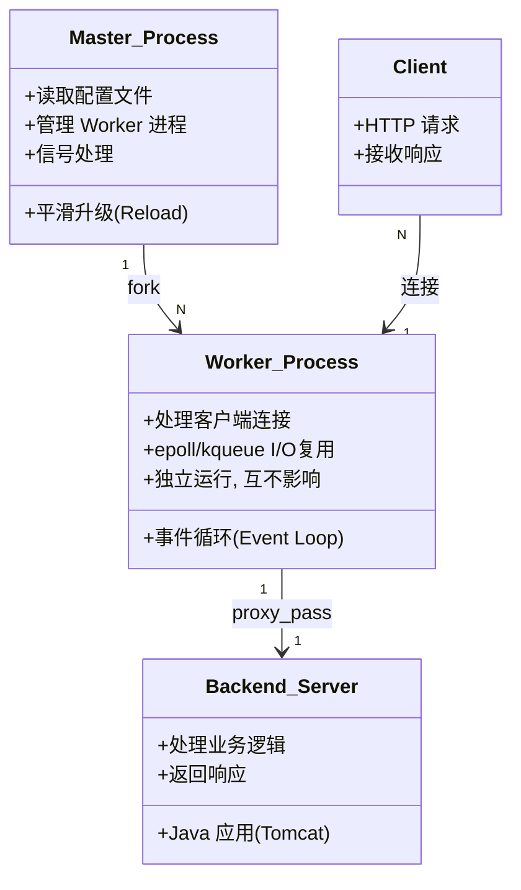
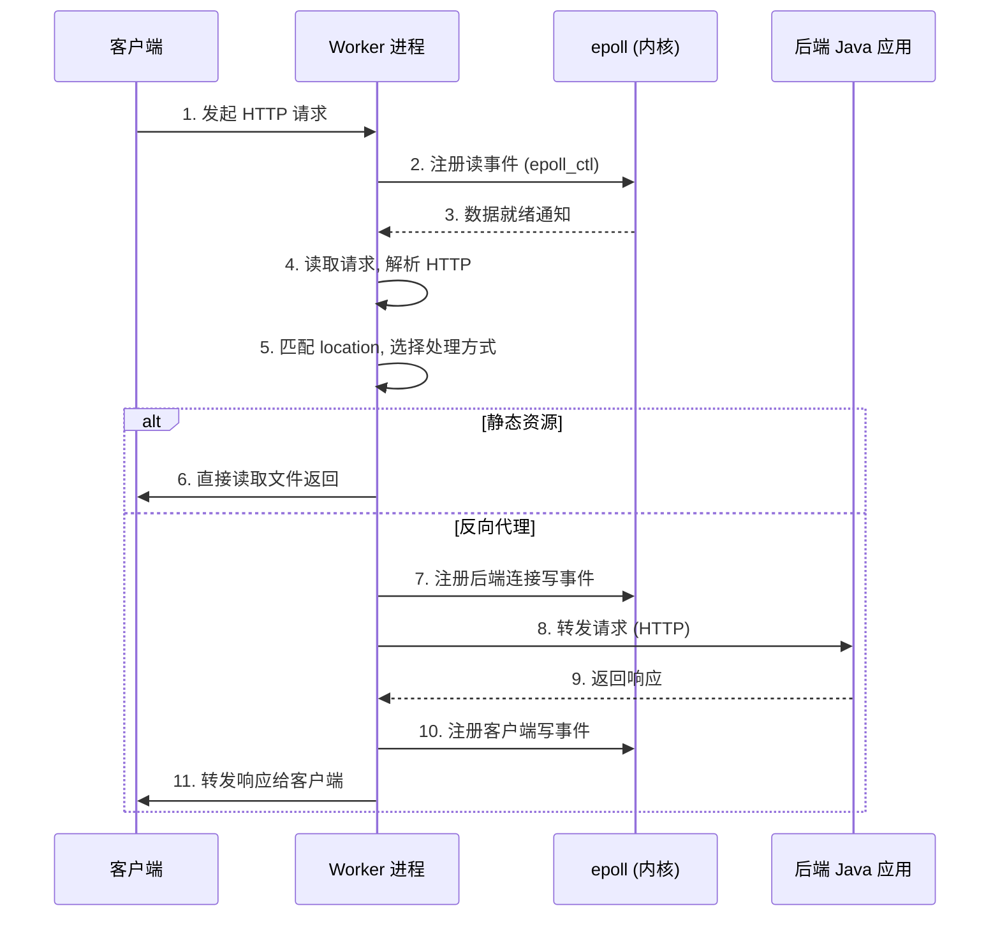

## 引言

当你的 Java 应用面对数万并发连接时，Tomcat 的线程池可能已经耗尽，而 Nginx 依然在从容处理每一个请求——这就是事件驱动架构的威力。作为互联网行业中使用最广泛的 Web 服务器和反向代理，Nginx 几乎是每个 Java 后端开发者必知的组件。本文将深入剖析 Nginx 的高并发架构原理（事件驱动、Master-Worker 模型）、核心功能配置（反向代理、负载均衡、SSL 终止、缓存、Gzip），以及生产环境中的最佳实践。读完本文，你将理解 Nginx 为什么比传统 Web 服务器更擅长高并发，并能独立编写生产级别的 Nginx 配置文件。

---

## Nginx 完全指南：高性能 Web 服务器与反向代理

### Web 服务与反向代理的挑战

构建可伸缩、高可用的 Web 应用，需要强大的服务器软件来处理客户端请求。这主要涉及两个核心功能：

1. **Web 服务器：** 直接处理静态资源（HTML、CSS、JS、图片等）的请求，并执行简单的逻辑（如重定向）。
2. **反向代理：** 位于客户端和后端应用服务器之间，接收客户端请求，并将其转发到后端的多个应用服务器之一，再将应用服务器的响应返回给客户端。

传统的基于每个连接一个线程/进程的 Web 服务器模型（如 Apache httpd 在 Prefork 或 Worker MPM 下的阻塞式 I/O）在高并发场景下会创建大量线程/进程，导致大量的上下文切换开销和资源消耗，难以应对巨量的并发连接。

### Nginx 是什么？定位与核心理念

Nginx 是一个高性能的开源 **HTTP 和反向代理服务器**，也可以作为邮件代理服务器和通用 TCP/UDP 代理服务器。

* **定位：** 它以**高并发处理能力**为目标，常被部署在 Web 应用的前端，直接处理客户端连接，并将请求转发到后端应用服务器。
* **核心理念：** **事件驱动（Event-driven）**、**异步非阻塞（Asynchronous Non-blocking）** 的架构。它不为每个连接分配独立的线程或进程，而是通过少量的线程/进程高效地处理大量的并发连接。

### Nginx 架构设计与工作原理

Nginx 之所以能够处理高并发，得益于其非传统的**事件驱动、异步非阻塞架构**以及简洁的**Master-Worker 进程模型**。



> **💡 核心提示**：Nginx 的 Worker 进程数通常设置为 CPU 核心数（`worker_processes auto`）。因为 Worker 进程是单线程事件循环，多 Worker 进程可以充分利用多核 CPU，而过多的 Worker 进程反而会增加上下文切换开销。

#### 核心基石：事件驱动、异步非阻塞模型

* **与阻塞模型的对比：** 在传统的阻塞模型中，一个请求会阻塞一个线程，直到数据准备好或操作完成。在高并发下，大量线程的阻塞和等待会耗尽资源。
* **Nginx 的方式：** Nginx 的 Worker 进程不会在等待 I/O 时阻塞线程。它将 I/O 请求注册到操作系统的事件监听机制中（如 Linux 的 `epoll`、FreeBSD 的 `kqueue`），然后立即去处理其他连接的事件。
* **实现：** 一个 Worker 进程在一个线程中通过**事件循环（Event Loop）**轮询操作系统通知的就绪事件，然后执行对应的回调函数来处理这些事件。

#### Nginx 请求处理流程



#### 进程模型：Master-Worker

* **Master 进程：** 负责读取配置文件、管理 Worker 进程、平滑升级等。
* **Worker 进程：** 实际处理客户端连接和请求的进程。它们之间相互独立，一个 Worker 崩溃不影响其他 Worker。
* **事件循环（Event Loop）：** 每个 Worker 进程内部运行事件循环，通过 `epoll_wait` 阻塞等待 I/O 事件，唤醒后调用回调函数处理。

### Nginx 核心功能在 Java 应用场景的配置

#### 静态资源服务

Nginx 擅长直接高效地提供静态资源服务。相较于 Java 应用服务器（如 Tomcat、Jetty）处理静态资源，Nginx 通常性能更高，且不占用 Java 应用的线程资源。

```nginx
server {
    listen 80;
    server_name your-app.com;

    location /static/ {
        root /usr/share/nginx/html;
        expires 30d;
        add_header Cache-Control "public, immutable";
    }

    location / {
        proxy_pass http://localhost:8080;
    }
}
```

> **💡 核心提示**：静态资源一定要用 Nginx 处理，不要经过 Java 应用。Tomcat 处理静态资源的效率远低于 Nginx，而且会占用宝贵的线程池资源。

#### 反向代理

将客户端请求转发到后端应用服务器，这是 Nginx 作为 Java 应用前端最核心的功能。

```nginx
location /api/ {
    proxy_pass http://localhost:8080/api/;
    proxy_set_header Host $host;
    proxy_set_header X-Real-IP $remote_addr;
    proxy_set_header X-Forwarded-For $proxy_add_x_forwarded_for;
    proxy_set_header X-Forwarded-Proto $scheme;
    proxy_connect_timeout 5s;
    proxy_read_timeout 30s;
}
```

#### 负载均衡

使用 `upstream` 模块定义后端服务器组，`proxy_pass` 引用这个组进行负载均衡。

```nginx
upstream my_java_backends {
    server localhost:8080 weight=3;
    server localhost:8081 weight=1;
    least_conn;
}

server {
    listen 80;
    location / {
        proxy_pass http://my_java_backends;
    }
}
```

#### SSL/TLS 终止

在 Nginx 层面处理 SSL/TLS 加密连接，将计算密集型的 SSL 处理从后端应用卸载到 Nginx。

```nginx
server {
    listen 443 ssl;
    server_name your-app.com;

    ssl_certificate /etc/nginx/ssl/your-app.com.crt;
    ssl_certificate_key /etc/nginx/ssl/your-app.com.key;
    ssl_protocols TLSv1.2 TLSv1.3;
    ssl_ciphers HIGH:!aNULL:!MD5;

    location / {
        proxy_pass http://localhost:8080;
    }
}
```

#### 缓存

Nginx 可以缓存后端应用的响应，对于重复的请求直接从缓存返回，减少对后端应用的访问。

```nginx
http {
    proxy_cache_path /data/nginx/cache levels=1:2 keys_zone=my_cache:10m inactive=60m max_size=1g;

    server {
        location /api/products/ {
            proxy_cache my_cache;
            proxy_cache_valid 200 302 10m;
            proxy_cache_valid 404 1m;
            proxy_cache_key "$request_uri";
            proxy_pass http://localhost:8080/api/products/;
        }
    }
}
```

#### 压缩（Gzip）

对发送给客户端的响应内容进行 Gzip 压缩，减少传输数据量。

```nginx
http {
    gzip on;
    gzip_types text/plain text/css application/json application/javascript text/xml application/xml;
    gzip_proxied any;
    gzip_min_length 1024;
    gzip_comp_level 6;
}
```

### Nginx 配置结构

Nginx 配置文件通常是 `nginx.conf`，包含多个上下文块：

| 上下文 | 作用 | 常用指令 |
| :--- | :--- | :--- |
| `main` | 全局配置 | `worker_processes`, `error_log`, `pid` |
| `events` | 事件处理模型 | `worker_connections`, `use epoll` |
| `http` | HTTP 服务核心 | `include mime.types`, `gzip`, `upstream` |
| `server` | 虚拟主机 | `listen`, `server_name`, `root` |
| `location` | URI 匹配规则 | `proxy_pass`, `root`, `alias`, `return` |
| `upstream` | 后端服务器组 | `server`, `least_conn`, `ip_hash` |

### Nginx 与传统 Web 服务器对比

| 维度 | Nginx | Apache httpd | Caddy |
| :--- | :--- | :--- | :--- |
| 架构模型 | 事件驱动、异步非阻塞 | 多进程/线程（阻塞/非阻塞可选） | 事件驱动、异步非阻塞 |
| 高并发性能 | 极佳（单实例数万连接） | 中等（受线程/进程数限制） | 极佳 |
| 资源消耗 | 低 | 高 | 低 |
| 静态文件服务 | 极快 | 较快 | 快 |
| 反向代理/LB | 内置、强大 | 需要额外模块（mod_proxy） | 内置、简洁 |
| 动态语言支持 | 需 FastCGI/代理 | 原生支持（如 mod_php） | 需 FastCGI/代理 |
| 配置复杂度 | 简洁 | 较复杂（.htaccess） | 极简（自动 HTTPS） |
| 自动 HTTPS | 不支持 | 不支持 | 内置（Let's Encrypt） |

**选择建议：** 在现代微服务架构中，Nginx 凭借高性能的反向代理和负载均衡能力，是最广泛的选择。如果需要自动 HTTPS 证书管理，Caddy 是新兴的轻量替代方案。

### Nginx 负载均衡策略对比

| 策略 | 指令 | 原理 | 适用场景 |
| :--- | :--- | :--- | :--- |
| 轮询（默认） | 无 | 按顺序分配请求 | 后端服务器性能相近 |
| 加权轮询 | `weight=N` | 按权重分配，权重越高请求越多 | 后端服务器性能有差异 |
| 最少连接 | `least_conn` | 分配给当前连接数最少的服务器 | 请求处理时间差异大的场景 |
| IP Hash | `ip_hash` | 按客户端 IP 哈希分配 | 需要 Session 保持的场景 |
| 随机 | `random` | 随机选择服务器 | 后端服务器数量多且性能接近 |

### 面试问题示例与深度解析

* **Nginx 如何实现高并发？**（事件驱动、异步非阻塞模型。通过 `epoll` 等 I/O 多路复用机制，一个 Worker 进程可以处理大量并发连接，避免了传统多线程模型的线程创建和上下文切换开销）
* **Master 进程和 Worker 进程分别起什么作用？**（Master：管理配置、管理 Worker；Worker：处理实际连接和请求）
* **如何在 Nginx 中配置负载均衡？有哪些常用策略？**（使用 `upstream` 块定义后端服务器组，`proxy_pass` 引用。策略：轮询（默认）、最少连接、IP Hash、加权轮询等）
* **Nginx 和 Apache Httpd 有什么区别？**（Nginx 事件驱动非阻塞 vs Apache 多进程/线程通常阻塞。Nginx 在高并发和静态资源服务上更高效）
* **Nginx 如何实现 SSL/TLS 终止？为什么要在 Nginx 层面进行？**（在 Nginx 配置证书和密钥，Nginx 处理加解密，后端用 HTTP。好处：卸载后端 CPU 负载，简化后端配置）

### 总结

Nginx 凭借其独特的事件驱动、异步非阻塞架构和 Master-Worker 进程模型，在处理高并发连接方面表现卓越，是构建高性能 Web 服务和反向代理的理想选择。它提供了强大的反向代理、负载均衡、SSL 终止、静态资源服务、缓存等功能，是现代 Java 应用部署架构中不可或缺的关键组件。

### 生产环境避坑指南

1. **worker_connections 设置过大：** `worker_connections` 不是越大越好。它的上限受系统文件描述符数量（`ulimit -n`）限制。建议设置为 1024-4096，同时确保 `ulimit -n` 不小于该值。
2. **未配置超时时间：** 默认 `proxy_read_timeout` 为 60 秒。如果后端 Java 应用响应慢，会导致 Nginx 积累大量等待中的连接，最终耗尽连接数。建议根据业务特点设置合理的超时时间（通常 5-30 秒）。
3. **负载均衡未配置健康检查：** Nginx 开源版不支持主动健康检查。如果某个后端实例宕机，Nginx 仍会向其转发请求，直到重试超时。建议配合 `max_fails` 和 `fail_timeout` 参数实现被动健康检查：`server localhost:8081 max_fails=3 fail_timeout=30s;`。
4. **未传递真实客户端 IP：** 如果不配置 `proxy_set_header X-Real-IP $remote_addr` 和 `X-Forwarded-For`，后端 Java 应用获取到的客户端 IP 将是 Nginx 的 IP 而非真实用户 IP，影响日志记录和安全审计。
5. **大文件上传限制：** Nginx 默认 `client_max_body_size` 为 1MB。如果需要上传大文件（如图片、文档），必须显式增大该值，否则会返回 413 Request Entity Too Large 错误。
6. **SSL 协议版本过低：** 不要允许 TLSv1.0 和 TLSv1.1，这些协议存在已知的安全漏洞。生产环境应只允许 `ssl_protocols TLSv1.2 TLSv1.3`。
7. **缓存未设置清理策略：** 开启 Nginx 缓存后，必须定期清理过期缓存或使用 `proxy_cache_path` 的 `max_size` 和 `inactive` 参数自动清理，否则磁盘空间会被占满。
8. **`proxy_pass` 尾部斜杠陷阱：** `proxy_pass http://backend/`（有斜杠）会去掉匹配的 URI 前缀；`proxy_pass http://backend`（无斜杠）会保留完整 URI。两者行为不同，务必确认符合预期。

### 行动清单

1. **配置检查：** 检查当前 Nginx 配置的 `worker_processes` 是否设为 `auto`，`worker_connections` 是否合理（1024-4096）。
2. **健康检查配置：** 在 `upstream` 中为每个后端服务器添加 `max_fails=3 fail_timeout=30s` 参数，实现基本的故障剔除。
3. **真实 IP 传递：** 确认 `proxy_set_header` 配置中包含 `X-Real-IP` 和 `X-Forwarded-For`，确保后端能获取真实客户端 IP。
4. **超时时间优化：** 根据业务特点配置 `proxy_connect_timeout`、`proxy_read_timeout`、`proxy_send_timeout`，避免连接堆积。
5. **扩展阅读：** 推荐阅读 Nginx 官方文档的 "Beginner's Guide" 和 "NGINX Tuning For Best Performance"；了解 OpenResty（基于 Nginx + Lua 的高性能 Web 平台）作为 API 网关的进阶方案。
