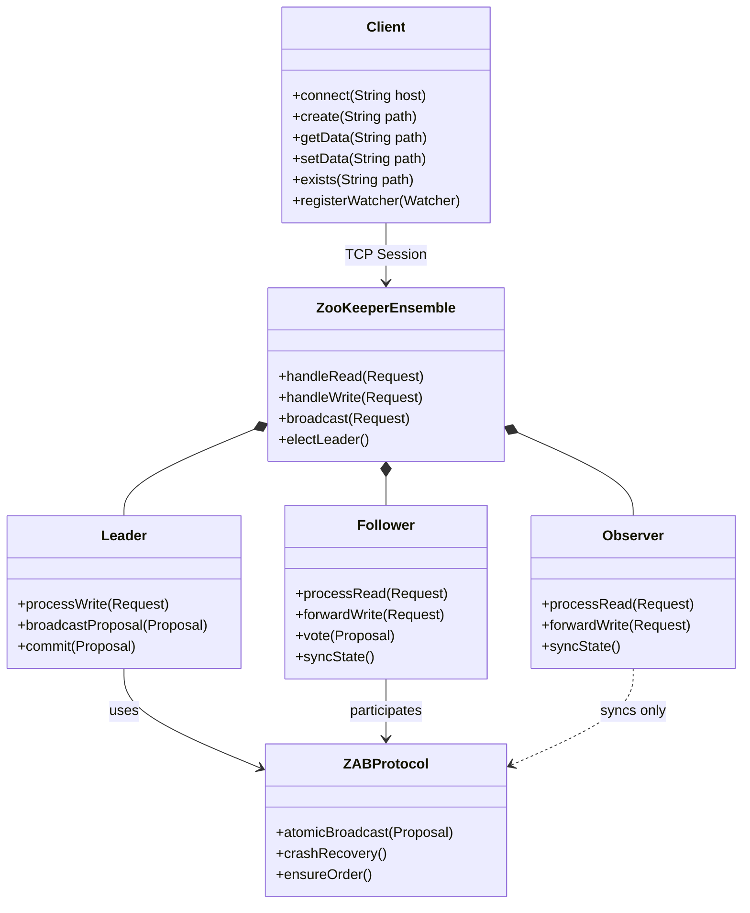
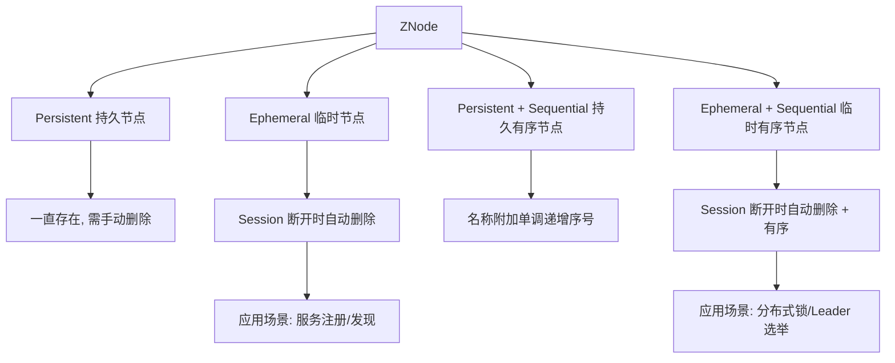
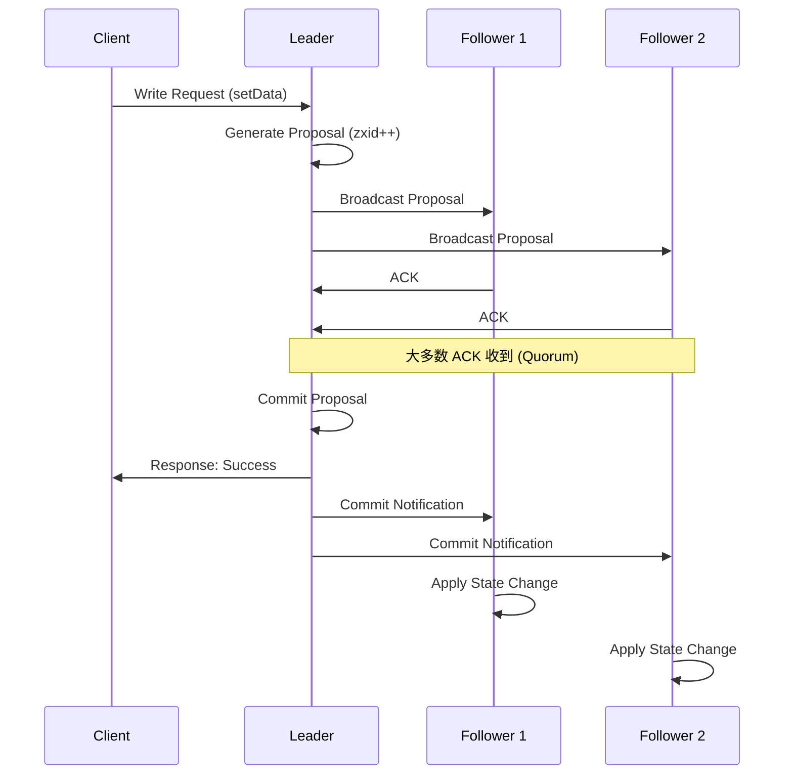
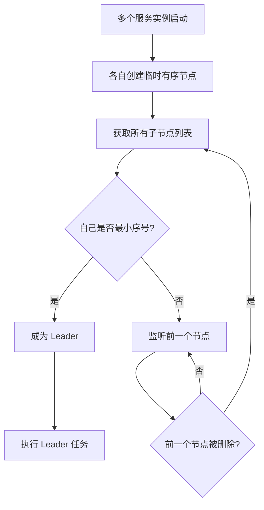

## 引言

如果你的分布式系统在凌晨 2 点发生脑裂，两个节点同时认为自己是 Leader，数据开始冲突——你怎么阻止这场灾难？

ZooKeeper 作为分布式协调领域的基石，用一套简洁的 ZNode 树形结构 + Watch 事件通知机制，优雅地解决了 Leader 选举、分布式锁、配置同步等所有分布式系统的"协调难题"。面试中 80% 的分布式问题都会从 ZooKeeper 切入。

读完本文，你将掌握：ZooKeeper 的 ZAB 一致性协议原理、临时节点在 Leader 选举中的巧妙设计、Watch 一次性通知机制的坑与规避方案，以及生产环境集群部署的避坑指南。

## ZooKeeper 是什么？定位与核心理念

Apache ZooKeeper 是一个**开源的、高性能、高可用、严格有序的分布式协调服务**。

* **定位：** 它是一个为分布式应用提供协调服务的**"小文件系统" + 通知机制**。它通过维护一个类似文件系统的树形结构的数据模型，提供了一系列简单的原子性操作，并支持客户端对节点的监听（Watch）。
* **核心理念：** 提供一个简单、一致的分布式协调原语集合，让开发者能够基于这些原语构建更复杂的分布式协调模式（如 Leader 选举、分布式锁）。它将协调逻辑从业务应用中剥离出来，作为一个独立的协调服务来提供。

### ZooKeeper 架构概览

## 为什么选择 ZooKeeper？优势分析

* **简化分布式协调：** 提供了一套简单易用的 API 和协调原语，开发者无需从头实现复杂的分布式一致性协议。
* **高可用性：** 通过 ZooKeeper 服务器集群（Ensemble）和复制机制实现高可用。
* **强一致性保证：** 对于写操作，通过 ZAB 协议保证集群状态的顺序一致性和最终一致性。
* **性能：** 尤其在读操作上性能很高，适合读多写少的协调类任务。
* **严格有序：** 保证所有更新操作都是严格按照全局顺序执行的。

## ZooKeeper 数据模型与核心概念

理解 ZooKeeper 的关键在于理解其数据模型和几个核心概念：

### ZNode 数据模型

ZooKeeper 维护一个类似标准文件系统的**层次化的命名空间**，由一系列被称为 **ZNode** 的数据节点组成。每个 ZNode 都有一个唯一的路径标识符（类似于文件路径）。

* ZNode 可以存储数据（字节数组），也可以有子节点。
* 每个 ZNode 都有一个状态信息 `Stat`，包含版本号（数据版本 `version`，子节点版本 `cversion`，ACL 版本 `aversion`）、时间戳、数据长度等元数据。版本号用于实现乐观锁，保证更新操作的原子性。

> **💡 核心提示**：ZNode 不适合存储大数据。单个 ZNode 的数据上限为 1MB。它的设计定位是存储协调元数据，而非业务数据。大数据场景应考虑数据库或分布式文件系统。

### ZNode 类型详解

* **持久节点 (Persistent)：** ZNode 创建后会一直存在，直到客户端明确删除它们。
* **临时节点 (Ephemeral)：** ZNode 的生命周期与创建它的客户端**会话 (Session)** 绑定。当创建该临时节点的客户端会话结束或超时失效时，该临时节点会被自动删除。
    * **作用：** 非常重要，常用于服务注册（服务上线时创建临时节点，下线时自动消失）和 Leader 选举（各个节点尝试创建临时节点，创建成功的成为 Leader）。
* **有序节点 (Sequential)：** 当创建 ZNode 时指定有序属性，ZooKeeper 会在该 ZNode 名称后面附加一个单调递增的整数序列号。
    * **作用：** 保证所有创建操作的全局唯一性和顺序性。常用于实现队列、锁等。
* **组合类型：** 可以将持久性/临时性与有序性结合，形成 **持久有序节点** 和 **临时有序节点**。临时有序节点在分布式锁和 Leader 选举中非常有用。

### Watch 监听器机制

* **定义：** 客户端可以在 ZNode 上设置 Watch。当被监听的 ZNode 的状态发生变化（数据变化、子节点变化、节点删除）时，ZooKeeper 会向设置 Watch 的客户端发送一个**一次性**的通知事件。
* **作用：** 客户端不需要轮询来感知节点状态变化，而是通过事件通知的方式被动接收信息，提高了效率和响应性。Watch 事件是异步发送的。
* **一次性特点：** Watch 事件通知只会被触发一次。如果客户端想持续监听，需要在收到事件通知后再次设置 Watch。

> **💡 核心提示**：Watch 是一次性的！这是很多开发者踩坑的地方。如果需要持续监听，必须在收到事件通知后重新注册 Watch，否则后续的状态变化将不会再收到通知。Curator 等高级客户端提供了 Persistent Watch 来自动重注册。

### Session 会话机制

* **定义：** 客户端与 ZooKeeper 服务器之间的 TCP 连接。每个客户端与服务器建立连接后，都会分配一个唯一的 Session ID。
* **作用：** 维护客户端与 ZooKeeper 之间的连接状态。客户端会定期向服务器发送心跳来维持 Session。如果服务器长时间没有收到客户端的心跳，Session 会被判定为超时失效。Session 的生命周期直接影响临时节点的存活和 Watch 的有效性。
* **心跳：** 用于保持 Session 活跃，检测客户端是否存活。

### ACL 访问控制列表

ZooKeeper 提供 ACL 机制来控制对 ZNode 的访问权限，包括读、写、创建、删除、管理等。可以根据不同的授权方式（如 world, auth, ip, digest）进行权限控制。

## ZooKeeper 架构设计与一致性模型

ZooKeeper 的高可用和强一致性依赖于其集群架构和 ZAB 协议。

### 集群 (Ensemble)

* ZooKeeper 通常以集群模式部署，称为 Ensemble。一个 Ensemble 包含一组 ZooKeeper 服务器。
* 为了保证在 Leader 选举过程中避免"脑裂"（Split-brain）问题，推荐 Ensemble 的服务器数量为**奇数**（如 3、5、7个节点）。集群中只要大多数节点可用，整个服务就可用。
* Ensemble 中的服务器之间通过 ZAB 协议进行状态同步。

### 服务器角色

* 在 Ensemble 中，服务器会选举产生一个 **Leader**。其他服务器则处于 **Follower** 或 **Observer** 角色。
* **Leader：** 负责处理**所有**客户端的**写请求**（包括创建、更新、删除 ZNode）。它将写请求通过 ZAB 协议广播给所有 Follower，并在大多数 Follower 成功同步后提交更新。一个集群只有一个 Leader。
* **Follower：** 负责处理客户端的**读请求**。如果收到写请求，会将其转发给 Leader。Follower 参与 Leader 选举过程和 ZAB 协议的**投票**。
* **Observer：** 负责处理客户端的**读请求**。如果收到写请求，会将其转发给 Leader。Observer **不参与** Leader 选举和 ZAB 协议的**投票**，只同步 Leader 的最新状态。用于扩展读性能。

### ZAB 协议 (ZooKeeper Atomic Broadcast)

* **定义：** ZooKeeper 用来保证数据一致性的核心**共识协议**。它借鉴了 Paxos 协议的思想，但更专注于**广播**和**崩溃恢复**。
* **作用：**
    * **原子广播：** 保证所有来自 Leader 的写操作以原子方式发送给所有 Follower，要么全部成功，要么全部失败。
    * **顺序一致性：** 保证所有 ZNode 状态变更的顺序与 Leader 处理这些变更的顺序严格一致。
    * **崩溃恢复：** 在 Leader 宕机时，能够快速选举出新的 Leader，并保证新的 Leader 拥有最新的已提交状态。
* **与 Paxos/Raft 关系简述：** ZAB 可以看作是针对 ZooKeeper 特定需求（强调广播和有序性）而优化的共识协议，它在功能上类似于 Paxos 或 Raft。

### 一致性保证

ZooKeeper 对客户端提供了以下五种一致性保证：

* **顺序一致性 (Sequential Consistency)：** 来自同一个客户端的更新操作会严格按照其发送顺序被应用。
* **原子性 (Atomicity)：** 每个更新操作都是原子性的，要么成功要么失败。
* **单一系统映像 (Single System Image)：** 客户端无论连接到 Ensemble 中的哪个服务器，看到的数据视图都是一致的。
* **可靠性 (Reliability)：** 一旦更新操作被应用并对客户端可见，它就会一直保持生效。
* **及时性 (Timeliness)：** 客户端的视图是比较及时的。**但需要注意：从 Follower 读取数据时，可能存在短暂的延迟。ZooKeeper 提供 `sync()` API 来保证读到最新的数据。**

## ZooKeeper 常见应用场景

利用 ZooKeeper 提供的简单协调原语，可以构建出多种复杂的分布式协调方案：

* **Leader 选举：** 多个节点竞争在指定路径下创建**临时有序节点**。序号最小的成为 Leader。其他节点监听比自己序号小一位的节点。
* **分布式锁：** 多个客户端竞争在指定路径下创建**临时有序节点**，最小序号者获锁，其他监听前一个节点。
* **分布式配置管理：** 将配置信息存储在 ZNode 中，客户端 Watch 配置节点，配置更新时收到通知。
* **服务注册与发现：** 服务提供者创建**临时节点**，消费者获取子节点列表并 Watch，感知服务上下线。
* **分布式队列：** 利用有序节点实现 FIFO 队列。

### Leader 选举流程

## ZooKeeper 客户端基本使用

ZooKeeper 提供了多种语言的客户端库。基本操作包括：

* 连接到 ZooKeeper Ensemble (`ZooKeeper` 类的构造器)。
* 创建 ZNode (`create()`: 指定路径、数据、ACL、模式)。
* 删除 ZNode (`delete()`: 指定路径、版本号)。
* 设置 ZNode 数据 (`setData()`: 指定路径、数据、版本号)。
* 获取 ZNode 数据 (`getData()`: 指定路径，可以设置 Watch)。
* 获取 ZNode 子节点列表 (`getChildren()`: 指定路径，可以设置 Watch)。
* 检查 ZNode 是否存在 (`exists()`: 指定路径，可以设置 Watch)。

## 协调服务对比分析

| 特性 | ZooKeeper | Etcd | Consul |
| :--- | :--- | :--- | :--- |
| **数据模型** | 树形 ZNode 结构 | 扁平 K/V 存储 | K/V 存储 + Service Catalog |
| **一致性协议** | ZAB (类 Paxos) | Raft | Raft (强一致) + WAN Gossip |
| **接口协议** | 自定义 TCP 协议 | HTTP/gRPC | HTTP/gRPC |
| **Watch 机制** | 一次性 Watch | 持续 Watch | 持续 Watch + Blocking Query |
| **CAP 定位** | CP (强一致性) | CP (强一致性) | CP + AP (可选) |
| **健康检查** | 基于 Session 心跳 | 基于 Lease TTL | 内置 HTTP/TCP/脚本健康检查 |
| **多数据中心** | 不支持 | 不支持 | 原生支持 |
| **适用场景** | 分布式协调/配置管理 | K8s 基础设施/服务发现 | 服务网格/多云架构 |
| **推荐指数** | ⭐⭐⭐⭐ | ⭐⭐⭐⭐ | ⭐⭐⭐ |

## 理解 ZooKeeper 架构的价值

* **掌握分布式协调原理：** 深入理解 Leader 选举、分布式锁等是如何基于 ZNode、Watch、Session 实现的。
* **理解一致性协议：** 对 ZAB 协议有概念性认识，理解分布式环境下如何保证数据一致性。
* **排查分布式问题：** 能够根据 ZooKeeper 的工作原理，排查与协调相关的分布式系统问题。
* **读懂源码：** 理解 Dubbo、Kafka、Hadoop YARN 等众多依赖 ZooKeeper 的开源项目是如何与其交互的。

## 生产环境避坑指南

1. **集群节点数必须为奇数：** 3 节点集群允许 1 台宕机，5 节点允许 2 台。不要部署偶数节点集群——4 节点和 3 节点的容错能力相同，反而增加写延迟。
2. **ZNode 不适合存储大数据：** 单节点上限 1MB，存储过大会拖慢整个集群的同步速度。只存协调元数据，业务数据走数据库。
3. **Watch 是一次性的：** 忘记重新注册 Watch 会导致漏掉状态变化。推荐使用 Curator 客户端的 `PathChildrenCache` 或 `NodeCache` 自动管理 Watch 生命周期。
4. **Session 超时时间要合理设置：** 太短（如 3s）容易因网络抖动导致 Session 过期、临时节点误删；太长（如 60s）则故障检测延迟过大。生产环境推荐 10-15s。
5. **临时节点与 Session 绑定：** 如果客户端进程被 Kill -9，Session 超时前临时节点不会消失，可能导致锁未释放。需在业务侧增加超时兜底机制。
6. **Observer 扩展读性能：** 读多写少场景下，通过增加 Observer 节点扩展读能力，不影响写延迟（Observer 不参与投票）。
7. **磁盘 I/O 是性能瓶颈：** ZooKeeper 的写操作需要落盘（WAL），使用 SSD 或 RAID 阵列，避免与其他高 I/O 服务共享磁盘。

## 行动清单

1. **检查点**：确认生产环境 ZooKeeper 集群节点数为奇数（3 或 5），且部署在不同机架/可用区。
2. **优化建议**：将 Session 超时时间设置为 10-15s，平衡故障检测速度与网络抖动容忍度。
3. **工具推荐**：使用 Curator 高级客户端替代原生 ZooKeeper API，它封装了重试、Watch 管理、Leader 选举等常用模式。
4. **监控建议**：监控 ZNode 数量、Watch 数量、连接数、延迟指标，设置合理的告警阈值。
5. **扩展阅读**：推荐阅读《ZooKeeper: Distributed Process Coordination》（O'Reilly）和 ZAB 协议原始论文。
